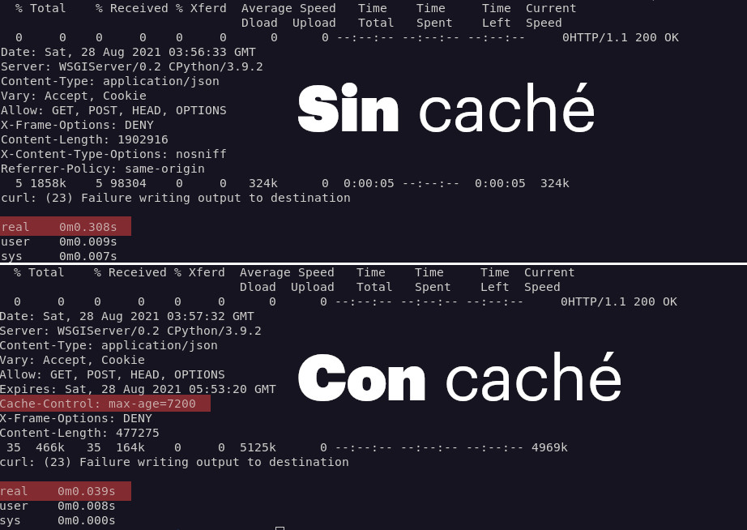
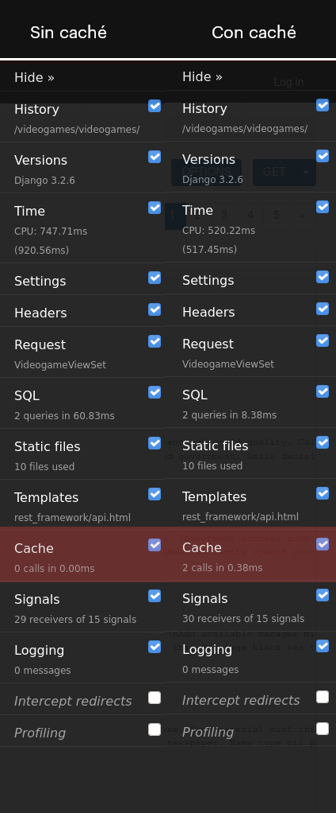

Para usar la caché en django, basta con seguir tres sencillos pasos:

1. Instalar un sistema de almacenamiento de caché, ya sea redis, memcached, etc
2. Configurar la variable CACHES al archivo _settings.py_ del proyecto.
3. Agregar el middleware necesario para que django devuelva la caché antes de procesar la vista.
4. Usar la caché de bajo nivel para cachear vistas o datos específicos (opcional)

Implementar un sistema de caché te permite [mejorar enormemente el rendimiento de una aplicación hecha en Django](https://coffeebytes.dev/como-mejorar-el-rendimiento-de-una-aplicacion-hecha-en-django/).

## ¿Qué tanto mejora la caché el rendimiento?

El efecto que tendrá la caché depende de muchos factores. Sin embargo, solo para que te des una idea, aquí tengo una comparación de una query que obtiene 1000 filas de una base de datos de un modelo sin relaciones con otros modelos.

Como puedes observar la diferencia es de casi 10 veces el tiempo.



## Instalando memcached

La caché en django requiere memcached, redis u otro método de almacenaje cache.

Memcached es el método más rápido y eficiente según los desarrolladores de django, por lo que usaremos este. Memcached, está basado en memoria y se le asigna una cantidad fija de RAM que puede usar, es bastante rápido de implementar y sencillo de usar. Además está incluido en los repositorios de muchas distribuciones de GNU/Linux.

```bash
sudo apt install memcached
```

Verifica que el sistema esté corriendo con el comando systemctl, update-rc, systemE o cualquiera que sea el administrador de procesos de tu sistema.

```bash
sudo systemctl status memcached
● memcached.service - memcached daemon
     Loaded: loaded (/lib/systemd/system/memcached.service; enabled; vendor preset: enabled)
     Active: active (running) since Wed 2021-09-08 10:16:31 CDT; 5h 46min ago
```

Es bastante obvio, pero siento que debo mencionarlo: recuerda que **memcached almacena los datos en memoria, estos se borrarán cuando el sistema se apague o se reinicie**. Por lo anterior debes asegurarte de usar memcached solo como un almacenamiento temporal y guardar ahí contenido que no te importaría perder o que pienses vaciar posteriormente a una base de datos.

## Instalación de pymemcache

Voy a instalar las siguientes dependencias para este tutorial:

- djangorestframework: para la REST api.
- django-debug-toolbar: para comparar el rendimiento antes y después de la caché.
- django-seed: para crear datos, de manera automática, en la base de datos.
- pymemcache: para que python pueda interactuar con memcached.

Algunos tutoriales más antiguos **usan python-memcached para interactuar con memcached, sin embargo el uso de esta librería está** [**desaconsejado** por django desde su version 3.2.](https://docs.djangoproject.com/en/3.2/topics/cache/#memcached)

```bash
pipenv install djangorestframework django-debug-toolbar django django-seed pymemcache
```

Ya que tengamos las aplicaciones instaladas y configuradas vamos a empezar a aplicar caché. Agregamos la siguientes lineas a nuestro archivo de configuración.

Puedes usar django-seed para llenar las tablas de tu base de datos.

```bash
python manage.py seed nombreDeTuApp --number=1000
```

## Configurar la variable CACHES en django

Para configurar el comportamiento de la caché crearemos una variable llamada CACHES, donde especificaremos el backend que queremos usar y su ubicación. En este caso será el localhost, con el puerto 11211; el puerto predeterminado para memcached.

```bash
# settings.py
CACHES = {
    'default': {
    'BACKEND': 'django.core.cache.backends.memcached.PyMemcacheCache',
    'LOCATION': '127.0.0.1:11211',
    }
}
```

CACHES cuenta con más variables de configuración que listaré a continuación:

### Argumentos de la variable de configuración CACHES

CACHES puede recibir una serie de argumentos para modificar su comportamiento:

- TIMEOUT: El tiempo que dura la caché, _None_ para que nunca expire, su valor predeterminado es de 300 segundos
- MAX\_ENTRIES: El número de entradas que guarda la caché, si se excede la caché más vieja se irá eliminando para guardar la caché más nueva, el valor por defecto es de 300.
- CULL\_FREQUENCY: La proporción de entradas que se elimina cuando MAX\_ENTRIES es alcanzada. Si este valor es igual a 2, se eliminarán la mitad de las entradas cuando lleguemos al valor de MAX\_ENTRIES. Si le pones un valor de 0 se eliminará toda la caché cuando lleguemos al valor de MAX\_ENTRIES. Por defecto vale 3.
- KEY\_PREFIX: Un prefijo que se le agrega al nombre de la caché, sirve para identificar nuestra caché. Esto para evitar colisiones con otras aplicaciones que estén usando la caché, o simplemente para identificarla.
- VERSION: La versión con la que queremos nombrar a nuestra caché.
- KEY\_FUNCTION: aquí le podemos pasar una cadena que especifique la dirección a una función que establezca el prefijo, la versión y la clave con la que se guardará la caché. Por ejemplo: 'cacheConfig.generadorDeNombresDeCache'.

```bash
# settings.py
CACHES = {
    'default': {
    'BACKEND': 'django.core.cache.backends.memcached.PyMemcacheCache',
    'LOCATION': '127.0.0.1:11211',
    'TIMEOUT': 60,
    'OPTIONS': {
        'MAX_ENTRIES': 1000
    }
}
```

## Poner en caché todo el sitio web

Para poner en caché todo el sitio web de Django, basta con agregar dos middlewares:

- django.middleware.cache.UpdateCacheMiddleware
- django.middleware.cache.FetchFromCacheMiddleware

Asegúrate de que _django.middleware.cache.UpdateCacheMiddleware_ sea el primer middleware de tu lista y _django.middleware.cache.FetchFromCacheMiddleware_ el último.

De la misma manera tiene que estar activo dja_ngo.middleware.common.CommonMiddleware_.

**Mientras estos middlewares estén activos, Django pondrá en caché cualquier página que reciba métodos GET y HEAD** y que devuelva un estado HTTP de 200.

```python
MIDDLEWARE = [
    'django.middleware.cache.UpdateCacheMiddleware',
    'django.middleware.common.CommonMiddleware',
    'django.middleware.cache.FetchFromCacheMiddleware',
]
```

Si examinas una petición verás que el header o cabecera _Cache-Control_ ya especifica un valor de _max-age=600_, el valor por defecto.

```python
curl -i 127.0.0.1:8000/videogames/videogames/ | less
Cache-Control: max-age=600
```

Si en lugar de usar la terminal entramos al navegador, veremos como la _django\_debug\_toolbar_ ya nos muestra que la caché está siendo usada.



Mira como en la columna caché, ya nos aparecen dos llamadas.

También te mencionó que la caché por sitio de Django no es compatible con la _django-debug-toolbar_, por lo que probablemente no la veas reflejada en la barra.

## Caché por vista de django

¿Pero y si no quieres poner en caché todo el sitio web? La mayoría de los sitios web son mezclas de páginas dinámicas con páginas estáticas. Probablemente solo quieras dejar las páginas estáticas, o que cambian muy poco, en caché y asegurarte de que tu usuario reciba las páginas dinámicas con contenido actualizado. Es decir, solo ciertas vistas deberían estar caché.

Para colocar en caché el resultado de una vista basta con que utilices el decorador _@cache\_page_ que provee django y le pases el tiempo que quieres que django almacene la caché, en segundos, para esa vista.

```python
from django.utils.decorators import method_decorator
from django.views.decorators.cache import cache_page

from rest_framework import serializers
from rest_framework import viewsets

from ..models import Videogame
from .serializers import videogameSerializer


class VideogameViewSet(viewsets.ModelViewSet):
    queryset = Videogame.objects.all().order_by('-created')
    serializer_class = videogameSerializer

    @method_decorator(cache_page(60*60*2)) # 7200 segundos o 2 horas
    def list(self, *args, **kwargs):
        return super().list(*args, **kwargs)
```

Observa como he usado el decorador en el método _list()_ de nuestro _ModelViewSet_ y, para que ejecute su función normal, he llamado al método _super()_ con los mismos argumentos.

También puedes cachear el método _dispatch()_ para una solución que aplique a las clases genéricas más usadas de DRF.

```python
class VideogameViewSet(viewsets.ModelViewSet):
    queryset = Videogame.objects.all().order_by('-created')
    serializer_class = videogameSerializer

    @method_decorator(cache_page(60*60*2))
    def dispatch(self, *args, **kwargs):
        return super(VideogameViewSet, self).dispatch(*args, **kwargs)
```

Si ejecutamos el comando _curl_ sobre la vista a la que le agregamos el decorador, veremos que ya aparece la cabecera cache-control con el tiempo que le pasamos como argumento.

```bash
curl -i http://127.0.0.1:8000/videogames/videogames/
HTTP/1.1 200 OK
Date: Sat, 28 Aug 2021 00:45:57 GMT
Server: WSGIServer/0.2 CPython/3.9.2
Content-Type: application/json
Vary: Accept, Cookie
Allow: GET, POST, HEAD, OPTIONS
Expires: Sat, 28 Aug 2021 02:45:57 GMT
Cache-Control: max-age=7200
X-Frame-Options: DENY
Content-Length: 4991
X-Content-Type-Options: nosniff
Referrer-Policy: same-origin
Server-Timing: TimerPanel_utime;dur=40.300000000000004;desc="User CPU time", TimerPanel_stime;dur=4.150000000000015;desc="System CPU time", TimerPanel_total;dur=44.45000000000002;desc="Total CPU time", TimerPanel_total_time;dur=45.484066009521484;desc="Elapsed time", SQLPanel_sql_time;dur=4.948616027832031;desc="SQL 2 queries", CachePanel_total_time;dur=0.33092498779296875;desc="Cache 1 Calls"
```

Django guarda cada entrada de caché por url, no por vista, por lo que si usas una misma vista para múltiples urls, cada url se pondrá en una entrada de caché diferente.

## Caché por valor

Aquí estamos cacheando el resultado de una url, pero ¿y si solo queremos cachear el resultado de una consulta o renderizado costosa? ¿o quizás algún valor en especifico?

Podemos trabajar directamente con memcached usando django, asociando una llave con un valor y asignándole un tiempo de vida. Una vez transcurrido el tiempo de vida el valor se eliminará y obtendremos _None_ si intentamos acceder a él.

Puedes pensar en la caché como un diccionario de Python con fecha de expiración.

La caché por valor nos permite crear patrones como este:

```python
from rest_framework.response import Response
from yourApp.models import Large
from yourApp.api.serializers import LargeSerializer
from django.core.cache import cache

class LargeViewSet(viewsets.Viewset):

    def list(self, request):
        querysetCostosoEnCache = cache.get('querysetCostoso') # devuelve None si no existe
        if querysetCostosoEnCache:
            return Response(querysetCostosoEnCache)
        querysetCostoso = Large.objects.all()
        serializer = LargeSerializer(querysetCostoso)
        # Una vez calculado lo guardamos en caché para no tener que calcularlo de nuevo
        cache.set('querysetCostoso', serializer.data, 60*180)
        return Response(serializer.data)
```

Si queremos usar valores por defecto si no existe un valor en la caché le pasamos el valor como segundo argumento.

```python
cache.get('valorCostoso', 'valorPorDefecto')
```

También podemos obtener múltiples llaves pasándole una lista de llaves al método _get\_many()_

```python
cache.get_many(['llave1', 'llave2'])
```

Y si queremos deshacernos de algún valor usamos el método _delete()_.

```python
cache.delete('llaveAsociada')
```

## Caché que depende de cookies, headers y no-cache

¿Qué tal si queremos que django ponga en caché diferentes versiones de una respuesta dependiendo de una cookie o un header específico? Por ejemplo, una caché para la ruta _/videogames/_ con la cookie CONFIG=1 y otra para la cookie CONFIG=2. O , o una caché para la ruta _/videogames/_ con el navegador Firefox y otra con el navegador Chromium.

Tenemos decoradores que se encargan de conseguir exactamente esto.

### vary\_on\_headers

vary\_on\_headers pondrá una respuesta diferente de caché para cada header userAgent diferente. Recuerda que las cookies se especifican por medio de headers.

```python
from django.views.decorators.vary import vary_on_headers

@vary_on_headers('User­Agent')
def vistaParaCadaNavegador(request):
# ...

@vary_on_headers('User­Agent', 'Cookie')
def vistaParaCadaNavegador(request):
# ...
```

### vary\_on\_cookie

Este decorador creará una entrada diferente en la caché para cada cookie que reciba nuestra vista.

```python
from django.views.decorators.vary import vary_on_headers

@vary_on_cookie
def vistaParaCadaCookie(request):
# ...
```

Dado que django lleva un registro de cada sesión individual usando cookies, podemos poner en caché las vistas por usuario

```python
from rest_framework.response import Response
from rest_framework.views import APIView
from rest_framework import viewsets

class UserViewSet(viewsets.Viewset):

    # Caché por usuario que dura 30 minutos
    @method_decorator(cache_page(60*30))
    @method_decorator(vary_on_cookie)
    def list(self, request):
        newsfeed = {
            'user_newsfeed': request.user.get_user_newsfeed()
        }
        return Response(newsfeed)
```

### Otros encabezados de caché

Podemos modificar directamente las directivas del header cache-control pasándoselas como argumentos a nuestro decorador del mismo nombre.

```python
from django.views.decorators.cache import cache_control

@cache_control(must_revalidate=True, max_age=3600)
```

Podemos especificar otros encabezados de caché como los siguientes:

- public=True
- private=True
- no\_cache=True
- no\_transform=True
- must\_revalidate=True
- proxy\_revalidate=True
- max\_age=num\_seconds
- s\_maxage=num\_seconds

Para ver la lista completa de directivas y lo que hace cada una visita las [especificaciones de los protocolos](http://www.w3.org/Protocols/rfc2616/rfc2616- sec14.html#sec14.9).

### No cachear

Si queremos evitar que django ponga en caché nuestras vistas las marcamos con el decorador _@never\_cache_

```python
from django.views.decorators.cache import never_cache

@never_cache
def vistaQueNuncaSeCacheara():
    #...
```

## Caché para el proceso de desarrollo

Si estás desarrollando un sitio web con Django y por alguna razón no puedes (o no quieres) instalar redis, memcached o cualquier otro sistema de almacenamiento de caché, puedes usar una caché falsa que provee Django. La caché falsa engañará a tu aplicación y la hará creer que hay un sistema de almacemiento de caché real.

Para activarla usa como backend la caché dummy configurandola como backend en tu archivo de configuraciones.

```python
CACHES = {
    'default': {
        'BACKEND': 'django.core.cache.backends.dummy.DummyCache',
    }
}
```

## Otros tipos de caché

Además de la caché usando memcached, puedes guardar los datos directamente en memoria, usar una base de datos o directamente como información del disco duro. Para ello basta con cambiar la variable de configuración CACHES por otras locaciones.

Por ejemplo, esta configuración guardará la caché en el directorio _/tmp/_ del sistema operativo. La caché será más lenta que memcached, pero menos efímera, incluso puedes especificar otra ubicación fuera del directorio _/tmp/_ si buscas una caché que sobreviva a reinicios, aunque mucho más lenta.

```python
CACHES = {
    'default': {
    'BACKEND': 'django.core.cache.backends.filebased.FileBasedCache',
    'LOCATION': '/var/tmp/django_cache',
    }
}
```

La [documentación de Django sobre caché](https://docs.djangoproject.com/en/3.2/topics/cache/) tiene más detalles para otros casos de uso menos comunes, revísala si necesitas una solución más específica.
