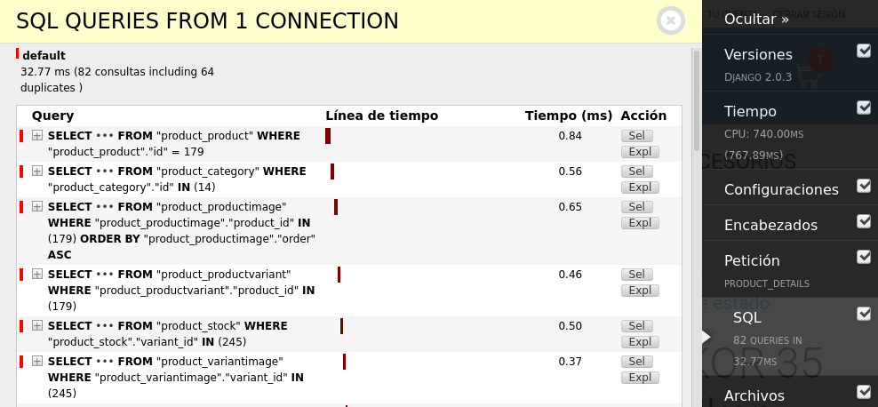

¿Tu aplicación hecha en Django o la de tu compañia anda lenta? Lo anterior puede tener múltiples causas: un servidor con hardware insuficiente, un paquete de hosting que necesite un upgrade para procesar mayor tráfico, un servidor mal configurado (en caso de que sea nginx, visita mi entrada donde explico [como configurar nginx para un mayor rendimiento)](https://coffeebytes.dev/nginx-keepalive-gzip-http2-mejor-rendimiento-en-tu-sitio-web/), o simplemente una aplicación no optimizada para dar el máximo rendimiento en django. En esta entrada te explico algunos cambios que puedes implementar, en una aplicación de Django, para mejorar su rendimiento.

## Reduce las queries lentas en Django

Como ya sabes, el acceso a la base de datos suele ser el cuello de botella de la mayoría de las aplicaciones. **La acción más importante a realizar es reducir el número de queries y el impacto de cada una de estas**. Puedes reducir tus queries en un 90%, no exagero.

Es bastante común escribir código que ocasiones múltiples consultas a la base de datos, así como búsquedas bastante costosas.

Identifica que consultas se están haciendo en tu aplicación usando [django-debug-toolbar](https://github.com/jazzband/django-debug-toolbar) y redúcelas, usa:

- **select\_related()** para [evitar múltiples búsquedas en relaciones tipo llave foránea o uno a uno](https://coffeebytes.dev/diferencias-entre-select_related-y-prefetch_related-en-django/)
- **prefetch\_related()** para prevenir búsquedas excesivas en relaciones muchos a muchos o muchos a uno
- **django\_annotate()** para agregar información a cada objecto de una consulta. [Tengo una entrada donde explico annotate y aggregate](https://coffeebytes.dev/cuando-usar-annotate-y-aggregate-en-django/)
- **django\_aggregate()** para procesar toda la información de una sola consulta en un solo dato (sumatoria, promedios).
- **Objeto Q** para unir consultas por medio de OR o AND directamente desde la base de datos
- **Expresiones F** para realizar operaciones a nivel base de datos en lugar de en código Python



Django debug tool bar mostrando las queries SQL de una petición en Django

```python
# review/views.py
from .models import Review

def list_reviews(request):
    queryset = Review.objects.filter(product__id=product_id).select_related('user') 
    # Ahora no se tocará la base de datos cada que se use review.user
    # ...
```

## Mejora el rendimiento de tus serializers

Si usas DRF y usas sus clases genéricas para crear serializers, puede que no estés obteniendo exactamente el mejor rendimiento. Las clases genéricas para serializers usan validación, que puede ser bastante costosa en tiempo si solo vas a leer datos.

Incluso si recordaste marcar tus campos como read\_only, los serializers de DRF no son los más rápidos, puede que quieras revisar [Serpy](https://serpy.readthedocs.io/en/latest/), [Marshmallow](https://marshmallow.readthedocs.io/en/stable/) El tema es bastante amplio, pero quédate con la idea de que hay un area de mejora en los serializers de Django.

Te dejo este artículo que explica [como unos desarrolladores lograron reducir el coste en tiempo de la serialización en un 99%.](https://hakibenita.com/django-rest-framework-slow)

## Usa paginación en tus vistas

Probablemente suene bastante obvio, aún así siento que debo mencionarlo: no necesitas devolver toda una tabla de una base de datos si a tu usuario solo le interesan los primeros registros.

Usa el objeto _paginator_ que ofrece Django, o limita los resultados de una búsqueda a unos cuantos,

```python
# review/views.py
from django.views.generic import ListView
from .models import Review

class ReviewList(ListView): 
    model = Review 
    paginate_by = 25
    context_object_name = 'review_list'
```

## Usa índices en tus modelos

Entiende tus queries más complejas e intenta crear índices para ellas. El índice hará tus búsquedas en Django más rápidas, pero también ralentizará, ligeramente, las creaciones y actualizaciones de nueva información.

```python
from django.db import models

class Review(models.Model):
    created = models.DateTimeField(
        auto_now_add=True,
        db_index=True,
    )
```

## Remueve middleware que no uses

Cada middleware implica un paso extra en cada petición web, por lo que remover todos aquellos middlewares que no uses supondrá una ligera mejora en la velocidad de respuesta de tu aplicación.

Aquí te dejo algunos middleware comunes que no siempre son usados, el de mensajes, páginas planas y el de localización, no, no me refiero a la ubicación geográfica, sino el de traducir el contenido acorde al contexto local.

```python
MIDDLEWARE = [
    # ...
    'django.contrib.messages.middleware.MessageMiddleware', 
    'django.contrib.flatpages.middleware.FlatpageFallbackMiddleware',
    'django.middleware.locale.LocaleMiddleware'
]
```

## Caché en Django

Cuando el tiempo de respuesta de tu aplicación se vuelve un problema, deberías empezar a colocar todos los resultados costosos en tiempo y recursos en caché.

¿Te gustaría profundizar en el sistema de caché?, tengo una [entrada sobre la caché en django](https://coffeebytes.dev/cache-en-django-rest-framework-con-memcached/) que puedes revisar para profundizar más.

Si tu página tiene demasiados productos, y raramente cambian, no tiene sentido acceder cada vez a la base de datos para solicitarlos con cada nueva petición HTTP. Solo coloca la respuesta de esa solicitud en caché y tu tiempo de respuesta mejorará, de esta manera cada que se pida el mismo contenido, no será necesario realizar una nueva petición o cálculos a la base de datos, sino que el valor se devolverá directamente de memoria.

Entre las opciones disponibles está:

- Memcached
- Redis
- Cache de base de datos
- Cache de sistema de archivos

```python
# settings.py
CACHES = {
    'default': {
        'BACKEND': 'django.core.cache.backends.memcached.MemcachedCache',
        'LOCATION': '127.0.0.1:11211',
    }
}
```

La caché de django es configurable a muchísimos niveles, desde el sitio entero hasta vistas o incluso pequeños trozos de información.

```python
# myapp/views.py
from django.shortcuts import render
from django.views.decorators.cache import cache_page

@cache_page(60*15)
def my_view(request):
    return render(request, 'myapp/template.html', {
        'time_consuming_data': get_time_consuming_data()
    })
```

Toma en cuenta que **la caché basada en memoria (memcached, redis) es un método de almacenamiento efímero**, toda la caché desaparecerá si el sistema se reinicia o apaga.

## Usa Celery para tareas asíncronas

A veces el cuello de botella es responsabilidad de terceros. Cuando envías un email o solicitas información de un tercero, no tienes manera de saber cuanto tiempo demorará tu solicitud, una conexión lenta o un servidor sobresaturado pueden mantenerte esperando por una respuesta. No tiene caso mantener al usuario esperando decenas de segundos por el envío de un correo electrónico, devuélvele una respuesta y transfiere el envío del correo electrónico a una cola para que se procese más tarde. [Celery](https://docs.celeryproject.org/en/stable/) es la opción más popular para hacerlo.

¿No tienes idea de donde empezar?, tengo un [par de entradas donde explico como ejecutar tareas asíncronas con celery y django.](https://coffeebytes.dev/celery-y-django-para-ejecutar-tareas-asincronas/)

```python
# myapp/views.py
from celery import shared_task

@shared_task
def send_order_confirmation(order_pk):
    email_data = generate_data_for_email(order_pk)
    send_customized_mail(**email_data)
```

## Particiona las tablas en tu base de datos

Cuando tus tablas superan los millones de registros, cada búsqueda recorrerá la base de datos completa, demorarando muchísimo tiempo en el proceso. ¿Cómo podríamos solucionarlo? partiendo las tablas en partes para que cada búsqueda se haga sobre una de las partes, por ejemplo, una tabla para los datos de un año atrás (o el periodo que tú prefieras), otra para los datos de dos años atrás y así hasta el primer dato.

Las instrucciones para implementar el particionado dependen de la base de datos que estés usando. Si estás usando postgres esta función está solo disponible para versiones de Postgres superiores a la 10. Puedes usar [django-postgres-extra](https://django-postgres-extra.readthedocs.io/en/master/table_partitioning.html) para implementar esas funcionalidades extras que no se encuentran en el ORM de django.

La implementación es demasiado extensa y requeriría una entrada completa. Hay un excelente artículo, en inglés, que te explica como implementar el [particionado de Postgresql en Django.](https://pganalyze.com/blog/postgresql-partitioning-django)

## Usa un CDN (Content Delivery Network)

Servir imágenes y archivos estáticos puede dificultar la parte importante de tu aplicación; generar contenido dinámico. Puedes delegar la tarea de servir contenido estático a una red de distribución de contenidos (CDN, por sus siglas en inglés). De esta manera tu aplicación podrá centrarse en su tarea principal. Además de beneficiarse de las localizaciones geográficas de los CDN; un servidor en el mismo país (o continente) que tu usuario dará como reusltado una respuesta más rápida.

Existen muchas opciones de CDN disponibles, entre las opciones más populares están AWS, Digital Ocean, Cloud Flare, entre otras.

## Denormalización

A veces hay consultas bastante costosas en tiempo de ejecución que podrían resolverse agregando redundancia, información repetida. Por ejemplo, imagina que quieres devolver la cantidad de productos que tienen la frase "para niños" en tu página principal, realizar una query que busque la palabra y luego ejecute un conteo es bastante sencillo. Pero, ¿y si tienes 10,000 o 100,000 o 1,000,000 de productos?, cada vez que quieras acceder al valor del conteo, tu base de datos recorrerá toda la tabla y contará los datos.

En lugar de realizar un conteo, podrías guardar ese número en la base de datos o en memoria y devolverlo directamente, para mantenerlo actualizado podrías usar un conteo periódico o incrementarlo con cada adición.

Por supuesto esto trae el problema de que ahora tienes más datos que mantener, no acoplados entre sí, por lo que **solo deberías usar esta opción para resolver tus problemas de rendimiento en Django si ya agotaste las demás opciones.**

```python
count = my_model.objects.filter(description__icontains="para niños").count() 
# ... denormalizando
count = my_count.objects.get(description="para niños") # Cada fila del modelo my_count contiene una descripción y el total de resultados
total_count = count.total
```

## Revisa el impacto que tienen los plugins de terceros

A veces nuestro sitio web funciona de manera casi perfecta, pero plugins de terceros, como el caso de las herramientas analíticas de facebook, google, plugins de integraciones con el chat de redes sociales afectan el rendimiento de nuestra aplicación. Aprende a retrasar su carga o modifícalos para reducir su impacto. Si lo anterior es imposible evalúa alternativas o considera eliminarlos.

## Considera usar otro intérprete para mejorar el rendimiento en django

No todo es base de datos, a veces el problema está en el código Python en sí. Además del intérprete normal de Python, el que se ofrece por defecto en la página oficial de Python, existen otros intérpretes que aseguran darte un mayor rendimiento.

Pypy es uno de ellos, se encarga de optimizar el código Python analizando el tipo de objetos que se crean con cada ejecución. Esta opción es ideal para aplicaciones donde Django se encargue de devolver un resultado que fue procesado principalmente usando código Python.

Pero no todo es maravilloso; los intérpretes de terceros, incluido [pypy](https://www.pypy.org/), no suelen ser compatibles al 100% con todo el código Python, pero sí con la mayoría, por lo que, igual que la opción anterior. **Usar un intérprete de terceros también debería de ser de las últimas opciones que consideres para resolver tu problema de rendimiento en Django.**

## Escribe los cuellos de botella en un lenguaje de bajo nivel con Swig

Si has probado todo lo anterior y aún así tienes una aplicación con cuellos de botella, probablemente estás exprimiendo demasiado a Python y necesites de la velocidad de otro lenguaje. Pero no te preocupes, no tienes que rehacer toda tu aplicación en C o C++. [Swig](http://www.swig.org/) te permite crear módulos en C, C++, Java, Go u otros lenguajes de más bajo nivel para importarlos directamente desde Python.

¿Quieres saber que tanta diferencia hay entre Python y un lenguaje compilado como go? en mi entrada [Python vs Go comparo la velocidad de ambos lenguajes.](https://coffeebytes.dev/python-vs-go-cual-es-el-mejor-diferencias-y-similitudes/)

Si tienes un cuello de botella causado por algún cálculo matemático muy costoso, que pone en evidencia la falta de velocidad de Python al ser un lenguaje interpretado, quizás te convenga reescribir el cuello de botella en algún lenguaje de bajo nivel para luego llamarlo usando Python. De esta manera tendrás la facilidad de uso de Python con la velocidad de un lenguaje de bajo nivel.

## Frameworks alternativos

Dependiendo del avance de tu aplicación quizás te convenga migrar a otro framework más veloz que Django. El ORM de Django no es exactamente el más veloz que existe, y, al momento de escribir esta entrada, no es asíncrono. Quizás te convenga evaluar el darle una oportunidad a [sqlalchemy](https://www.sqlalchemy.org/), [ponyorm](https://ponyorm.org/).

O, si tu aplicación no es muy compleja a nivel de base de datos, quizás quieras escribir tus propias consultas sql y combinarlas con algún otro framework.

La tendencia actual es separar frontend de backend, por lo anterior Django está usándose en conjunto con Django Rest Framework para crear APIs, por lo que, si entre tus planes está la creación de una API, quizás te convenga considerar FastAPI, si no lo conoces date una vuelta por mi [entrada donde te explico las maravillas que tiene para ofrecer FastAPI.](https://coffeebytes.dev/python-fastapi-el-mejor-framework-de-python/)

## Bonus: aplicaciones con más de 63 000 modelos

Hay una plática que dieron en la djangocon2019 donde el ponente explica como lograron lidiar con una aplicación con 63000 endpoints, cada uno con diferentes permisos.

<iframe src="https://www.youtube.com/embed/O6-PbTPAFXw" title="YouTube video player" allow="accelerometer; autoplay; clipboard-write; encrypted-media; gyroscope; picture-in-picture" allowfullscreen width="560" height="315" frameborder="0"></iframe>

## Bonus: Blogs técnicos

Pinterest e Instagram son dos páginas gigantescas que partieron eligiendo Django como su backend. Puedes encontrar información sobre optimización y problemas muy concretos en sus blogs técnicos.

El blog de instagram tiene una entrada llamada [Web Service efficiency at Instagram with Python](https://instagram-engineering.com/web-service-efficiency-at-instagram-with-python-4976d078e366), donde explican algunos problemas que se encuentran al manejar 500 millones de usuarios y como solucionarlos.

Te dejo los enlaces a los blogs a continuación:

- [Pinterest engineering](https://medium.com/pinterest-engineering)
- [Instagram engineering](https://instagram-engineering.com/)
