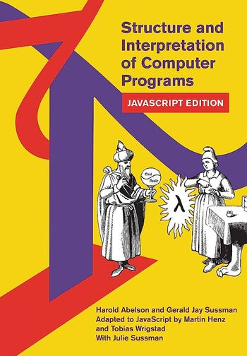

---
aliases:
- /en/pages/libros-que-he-leido-y-resenas/
title: "Books I read"
date: "2020-11-05"
authors:
- Eduardo Zepeda
url: "/en/pages/books-i-read-and-reviews"
---

## Currently reading

I'm currently reading:

- The Rust Programming Language by Steve Klabnik

## Books I read

The list below contains almost all the books I've read about programming and web development. Most of them are written in english, some others in spanish (It's arduous to find good technical books written in spanish). .

I've reviewed some of them, I hope to review most of them in the near future, before they become obsolete.

By the way, the books are not in any particular order.

")

")

