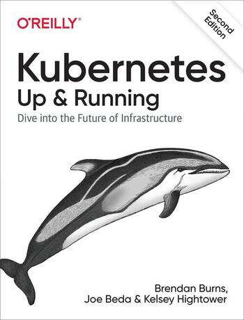
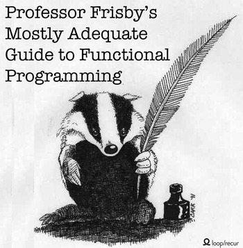
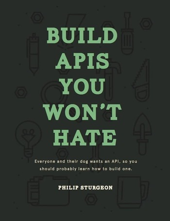
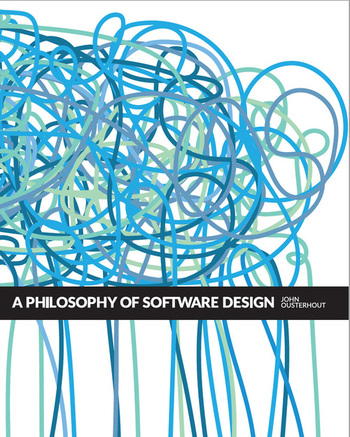
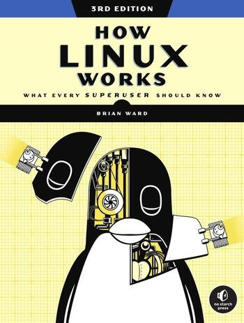
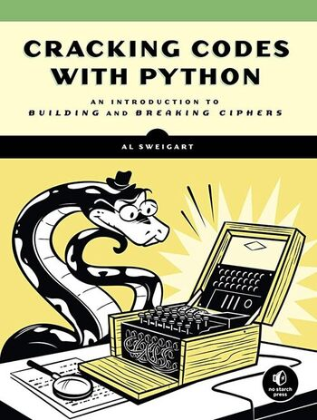
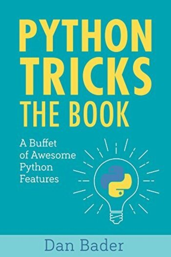
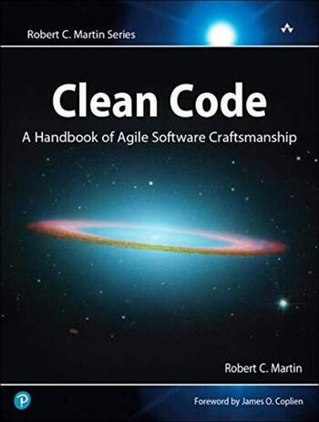
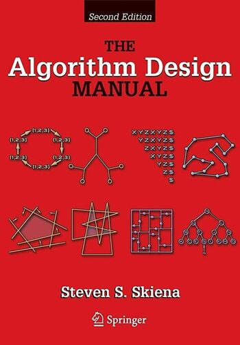
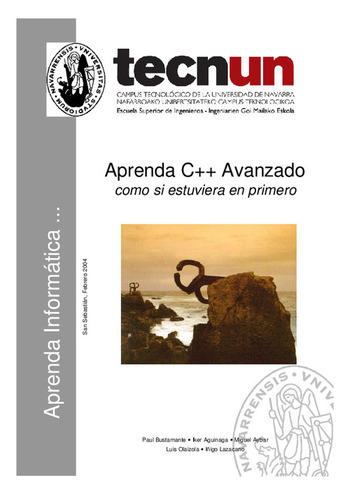

Esta es la lista de libros que he leído para aprender sobre desarrollo web y programación. Tengo reseñas de algunos disponibles y estoy constantemente actualizando esta lista.

## Actualmente estoy leyendo:

- Serious Cryptography: A Practical Introduction to Modern Encryption de JeanPhilippe Aumasson

## Mi lista de libros

Los libros no están en ningún orden en particular

")

")

