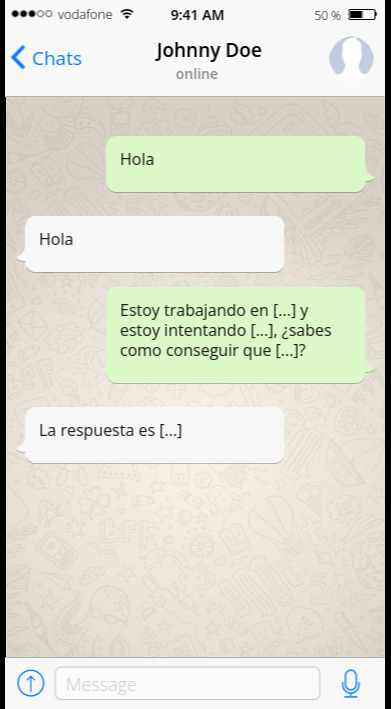
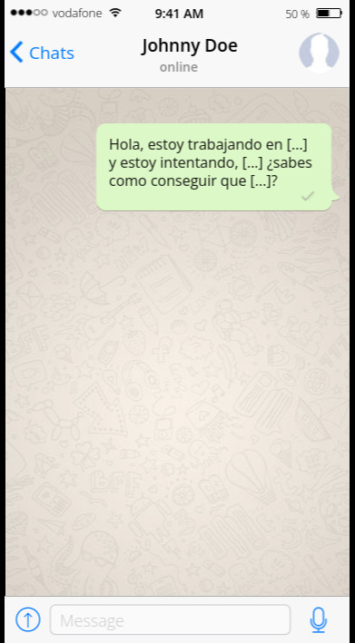
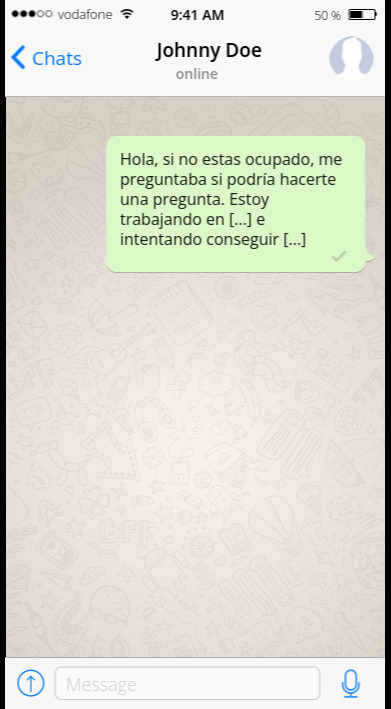

Volvamos nuestras conversaciones más eficaces, rápidas y respetemos el tiempo de las otras personas que intentan ayudarnos.

## Por favor no empieces un chat con un "hola"

¿Has visto este tipo de conversaciones antes?

Es como si llamaras a alguien por teléfono y dijeras: "hola" y luego los pusieras en espera.

Haz esto mejor:

Por favor nota como recibes **una respuesta mucho antes y no los haces esperar**. En lugar de esperar tu réplica, tu colega puede empezar a pensar en la respuesta inmediatamente.

Sé que estás intentando ser educado al no pasar directamente a la petición, tal cual lo harías en persona o en teléfono. Pero **el chat no es ninguna una reunión en persona, tampoco una llamada**. 

En un chat escribes más lento de lo que hablas. En lugar de ser educado, estás logrando que la otra persona espere por tu saludo y tu pregunta, lo cual es solo tiempo perdido para ambas partes.

## Evita cualquier variación de "hola"

Lo mismo aplica para:
* "Hola, ¿estás ahí?" 
* "Hola Bob, una pregunta rápida" 
* "¿Tienes un momento?"
* "¿Te puedo hacer una pregunta?"
 
## Solo haz la pregunta

Si sientes que es muy brusco simplemente decir "Hola" y preguntar, puedes intentar algo como esto:

Además, realizar tu pregunta antes de obtener una respuesta permite asincronía en la comunicación. 

Si la otra parte está lejos, y tú te desconectas antes de que ellos regresen, ellos aún pueden responder tu pregunta, en lugar de encontrar un "hola" y preguntarse que es lo que querías.

## Disclaimer

Este texto está basado en [no hello](https://nohello.com), tiene algunos cambios en el texto con el propósito de volverlo más legible y entendible para el público latino.

