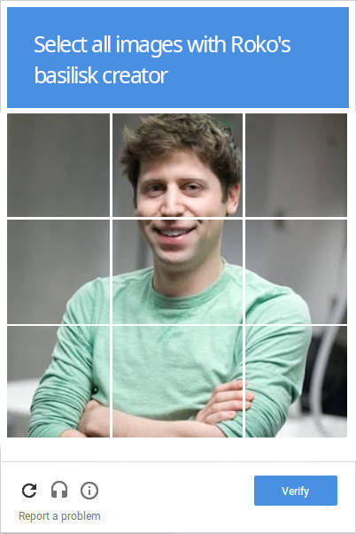
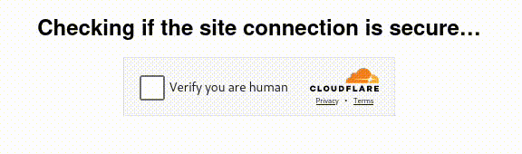
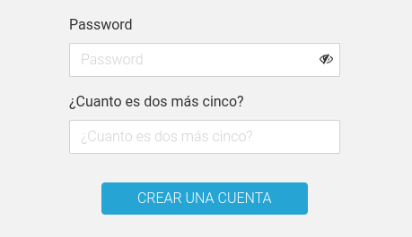
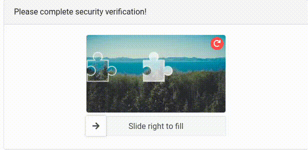
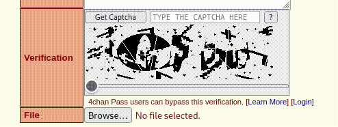

This is my analysis of some of the most popular captcha options out there and my opinion as a user on their advantages and disadvantages, this analysis includes google recaptcha, sliding captchas, simple questions, letter and number recognition and the most bot resistant captcha I know of.

## Google recaptcha and similar

I'm sure you already know this one, as it's the most common, and probably the most popular captcha out there. Google's and Cloudflare's stand out here.

The inner workings of this type of captcha are very complex and are based on recognizing patterns in a user's traffic and probably analyzing them against the large amount of information they have collected over the years to then decide if there is a significant probability that a user is a bot.

For a hypothetical user it is usually enough to click the checkbox and that's it, but if we don't convince the captcha algorithm, it will ask us to ~~train its AI models for free~~ a couple of more tests in which we will have to identify images.

The only disadvantage I see to this type of captcha is that by using it we are feeding google with more information about the users of our website. And you may not mind that google collects more information, if this is the case I can only bring up the Cambridge Analytica scandal.

My veredict:
- Security: 9
- User friendly: 8 wiithout image recognition and 5 with it

## Basic questions captchas

There are more primitive captcha options, but no less effective such as a simple question: *How much is 7 + 2?*. 

To solve it, just read it and enter the correct result.

I find this kind of captchas super practical to deal with most of the bots that blindly roam the internet, and they are also minimally invasive for the user. 

Their disadvantage, it seems to me, is their weakness against a personalized attack, since it will be enough for a human to enter the website, read the question and adapt the code to his convenience.

I also consider that, with the [rise of artificial intelligence](/en/the-rise-and-fall-of-the-ai-bubble/) they will become obsolete, since it is enough to ask the AI to read the label of the input and generate an appropriate response.

My veredict:
- Security: 6
- User friendly: 8

## Character recognition captchas

Another popular alternative to simple questions is to use an image with numbers and letters and ask the user to identify them and place them in the appropriate field, these letters are distorted in some way to make them unrecognizable to bots.

This type of captcha tends to be quite invasive for users and can ruin the web experience. On top of that, I don't consider them particularly useful for dealing with bots, there are even tutorials on [how to solve these captchas almost automatically](https://medium.com/lemontech-engineering/breaking-captchas-from-scracth-almost-753895fade8a#?).

If you don't want to read the whole article I'll summarize it for you, it basically consists of transforming the image with image editing software to highlight the characters and then using [an OCR, like tesseract in combination with one of its bindings, like pytesseract](/en/ocr-with-tesseract-python-and-pytesseract/), to *read* them.

My veredict:
- Security: 7
- User friendly: 6

## Invisible input field captchas

This type of captchas relies on CSS to create invisible input fields to the user, **that a bot will detect** and try to fill, so they can then be identified by the server and be discarded or blocked.

This type of captchas seem to me perfect for the user, as they are completely invisible to the user, however they suffer from custom attacks where a human detects the strategy and simply modifies the bot to not fill those now visible fields.

My veredict:
- Security: 7
- User friendly: 9

## Slider captchas

I've seen these types of captchas on Tik Tok mainly, but you usually don't find them so easily on the web.

I consider slider captchas to be one of the most balanced options out there, they are quick to solve and quite secure, although I doubt they are totally secure against all bots, mainly those that try to simulate users' mouse movements.

I have never broken one of these captchas, but I imagine that using image processing as in the example above and some mouse movement emulation tool, it should not be impossible. Which brings me to the last type of captcha.

My veredict:
- Security: 8
- User friendly: 8

## Captchas that are safe and almost impossible to solve

This is probably the most secure, and also the most invasive captcha I've seen. It is found on the most popular English-speaking image board to date and I have not seen it anywhere else.

I want you to notice how sophisticated this captcha is. It is a simple box where it shows some scribbles in black and white, completely illegible and in the background an image that, when sliding the slider, overlaps with the background image, revealing the captcha before your eyes. 

This gradient formed between the "fake" captchas and the "real" one confuses any character recognition software, making it completely useless.

In addition, this captcha requires interactivity from the user, as it requires the slider to be slid carefully, which rules out all those headless bots.

On the other hand, it has the disadvantage of being invasive for the user, completely interrupting the browsing experience. Furthermore, I would venture to say that this captcha also gives a lot of false positives; I myself am unable to accurately read the characters that appear there and I'm not a bot, am I?

My veredict:
- Security: 10
- User friendly: 2

In defense of this captcha, I will say that it is a necessary evil on a website where it is not necessary to register to post, home of what was (or is) one of the most famous hacker groups: Anonymous and where illegal material was (or is) distributed, pictures and videos so cursed that will make you doubt if humanity deserves to share this planet with the rest of animals.

I definitely do not recommend this type of captcha unless you have a website with similar characteristics, in such case my deepest condolences.

