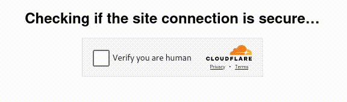
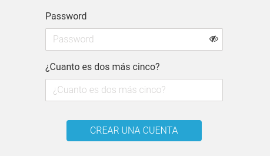
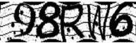
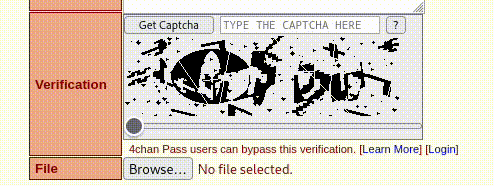

Este es mi análisis de algunas de las opciones más populares de captchas que existen y mi opinión como usuario sobre sus ventajas y desvantajas y su nivel de seguridad. Este análisis incluye google recaptcha, captchas de deslizamiento, preguntas sencillas, reconocimiento de caracteres y el captcha más resistente a bots que conozco.

## Google recaptcha y similares

Estoy seguro de que ya conoces este, pues es el captcha más común, y probablemente el más popular que existe. Destacan aquí el de Google y el de Cloudflare.

El funcionamiento interno de este tipo de captchas es muy complejo y se basa en reconocer patrones en el tráfico de un usuario y probablemente analizarlos contra el gran cantidad de información que han recopilado a lo largo de los años para luego decidir si existe una probabilidad significativa de que un usuario sea un bot.

Para un hipotético usuario generalmente basta con darle un click al checkbox y listo, pero si no convencimos al algoritmo del captcha, este nos pedirá  ~~que entrenemos a sus modelos de AI completamente gratis~~ un par de pruebas más en las que tendremos que identificar imágenes.

La única desventaja que le veo a este tipo de captcha es que al usarlo estamos alimentando a google con más información de los usuarios de nuestro sitio web. Y puede que no te importe que google recopile más información, si es el caso solo me queda sacar a colación el escandalo de Cambridge Analytica.

Mi veredicto:
- Securidad: 9
- Amistoso con el usuario: 8 sin el reconocimiento de imagenes y 5 con el reconocimiento de imágenes

## Preguntas básicas como captchas

Existen opciones de captchas más primitivas, pero no por eso menos efectivas tal como una pregunta simple: *¿Cuánto es 7 + 2?*. 

Para resolverla basta con leerla y colocar el resultado correcto.

Este tipo de captchas me parecen super prácticos para lidiar con la mayoría de los bots que deambulan ciegamente en internet, y además son mínimamente invasivos para el usuario. 

Su desventaja, me parece, es su debilidad contra un ataque personalizado, pues bastará con que un humano entre al sitio web, lea la pregunta y adapte el código a su conveniencia.

Además considero que, con el [auge de la inteligencia artificial](/es/el-auge-y-la-caida-de-la-burbuja-de-ai/) se volverán obsoletos, pues es suficiente pedirle a la AI que lea el label del input y que genere una respuesta adecuada.

Mi veredicto:
- Securidad: 6
- Amistoso con el usuario: 8

## Captchas de identificación de caracteres

Otra alternativa popular a las preguntas sencillas es utilizar una imagen con números y letras y pedirle al usuario que los identifique y coloque en el campo adecuado, estas letras vienen distorsionadas de alguna forma para volverlas irreconocibles a los bots.

Este tipo de captcha suelen ser bastante invasivos para los usuarios y pecan de arruinar la experiencia web. Por si fuera poco, no los considero particularmente útiles para lidiar con los bots, incluso hay tutoriales sobre [como resolver estos captchas de manera casi automática](https://medium.com/lemontech-engineering/breaking-captchas-from-scracth-almost-753895fade8a#?).

Si no quieres leer el artículo completo te lo resumo, básicamente consiste en tratar la imagen con software de edición de imágenes para resaltar los caracteres y posteriormente utilizar [un OCR, como tesseract en combinación con alguno de sus bindings, como pytesseract](/es/ocr-con-tesseract-python-y-pytesseract/), para *leerlos*.

Mi veredicto:
- Securidad: 7
- Amistoso con el usuario: 6

## Captchas de campos invisibles

Este tipo de captchas se basa en el CSS para crear inputs invisibles al usuario, **que un bot sí detectará** e intentará llenar, por lo que luego podrán ser leídos por el servidor y descartados.

Este tipo de captchas me parecen perfectos para el usuario, pues son completamente invisibles a este, sin embargo sufren de ataques personalizados donde un humano detecta la estrategia y simplemente modifica el bot para que no llene esos campos ahora visibles.

Mi veredicto:
- Securidad: 7
- Amistoso con el usuario: 9

## Captchas de arrastre o slider

He visto este tipo de captchas en Tik Tok principalmente, pero generalmente no los encuentras tan fácilmente.

Yo considero los captchas de arrastre como unos de las opciones más balanceadas que existen, son rápidos de resolver y bastante seguros, aunque dudo que sean totalmente seguros contra todos los bots, principalmente contra aquellos que tratan de simular los movimientos de mouse de los usuarios.

Nunca he roto uno de estos captchas, pero me imagino que usando un tratamiento de imagen como en el ejemplo pasado y alguna herramienta de emulación de movimientos de mouse, no debería de ser imposible. Lo que me lleva al último tipo de captcha.

Mi veredicto:
- Securidad: 8
- Amistoso con el usuario: 8

## Captchas seguros y casi imposibles de resolver

Este es probablemente el captcha más seguro, y también el más invasivo que he visto. Se encuentra en el image board angloparlante más popular a la fecha y no lo he visto en ningún otro sitio.

Quiero que notes lo sofisticado que es este captcha. Es una simple caja donde muestra unos garabatos a blanco y negro, completamente ilegibles y en el fondo una imagen que, al deslizar el slider, se superpone con la imagen del fondo, emergiendo el captcha a la vistas. 

Este gradiente que se forma entre los captchas "falsos" y el "verdadero" confunde a cualquier software de reconocimiento de caracteres, volviéndolo completamente inservible.

Aunado a lo anterior, este captcha requiere interactividad por parte del usuario, pues requiere que se deslice el slider con cuidado, lo que descarta a todos aquellos headless bots.

En contraparte, tiene la desventaja de ser invasivo para el usuario, arruinando completamente la experiencia al navegar. Además, yo me atrevería a afirmar que este captcha también da muchos falsos positivos. Yo mismo soy incapaz de leer con precisión los caracteres que ahí aparecen.

Mi veredicto:
- Securidad: 10
- Amistoso con el usuario: 2

En defensa de este captcha, diré que es un mal necesario en un sitio web donde no es necesario registrarse para publicar, hogar del que fue (o es) uno de los más famosos grupos de hackers: Anonymous y en donde se distribuyó (o distribuye) material ilegal con el potencial de hacerte dudar si la humanidad merece compartir este planeta con el resto de animales.

Definitivamente no recomiendo este tipo de captcha a menos de que tengas un sitio web con características similares.

