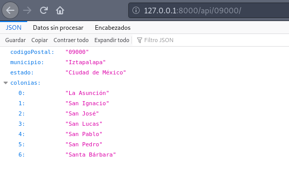

Do you need to get the data associated with a zip code in Mexico for your Django application? I have a small library called **django-postalcodes-mexico** that downloads zip codes from SEPOMEX and creates an API endpoint that allows you to query a zip code in Mexico and receive the colonias that belong to that zip code, as well as their state and municipality.

If you are going to develop a REST API, I have a post with multiple [REST API design recommendations](/basic-features-of-a-api-rest/) that may help you.

For this example I use Python 3.8, Django 3.2.5 and Pipenv version 2020.5.28.

## Installation

To install it we are going to use [Pipenv](/pipenv-the-virtual-environment-manager-you-don't-know/), but you can use Poetry, [pip](/python-virtualenv-tutorial-basic-in-linux/) or any other virtual environment manager.

```bash
pipenv shell
pipenv install django-postalcodes-mexico django
django-admin startproject codigosPostalesMx .
python manage.py migrate
```

Next we install the package by adding it to INSTALLED_APPS in our configuration file.

```bash
INSTALLED_APPS = [
    'django_postalcodes_mexico.apps.DjangoPostalcodesMexicoConfig',
]
```

We execute the migrations. This will create the tables needed to manage the zip codes.

```bash
python manage.py migrate
```

## Obtaining Mexico's postal codes from SEPOMEX

Now that the tables have been created we are going to install the Mexico zip codes directly from the SEPOMEX page with a single Django command.

```bash
python manage.py importpostalcodesmx
Trying to connect to Mexican Postal Service (Correos de Mexico)
Response received
This process can take a few minutes, please be patient
Creating database...
The postal code database has been successfully populated
```

That's all, now we just need to import include and add our urls. I put the path _api/_ but you can use the one you want.

```bash
from django.contrib import admin
from django.urls import path, include

from django_postalcodes_mexico import urls as django_postalcodes_mexico_urls

urlpatterns = [
    # ...
    path('api/', include(django_postalcodes_mexico_urls)),
]
```

## Obtaining information from a zip code

If we now make a request _api/09000/_ or any other 5-digit zip code we will receive a JSON response with the municipality, state and a list of neighborhoods.

```bash
curl localhost:8000/api/09000/
{"codigoPostal": "09000", "municipio": "Iztapalapa", "estado": "Ciudad de M\u00e9xico", "colonias": ["La Asunci\u00f3n", "San Ignacio", "San Jos\u00e9", "San Lucas", "San Pablo", "San Pedro", "Santa B\u00e1rbara"]}
```



A non-existent zip code will return a 404 status.


While an invalid zip code will return a 400 error and an error message


Read the short [official documentation in my github repository](https://github.com/EduardoZepeda/django-postalcodes-mexico) for more information.