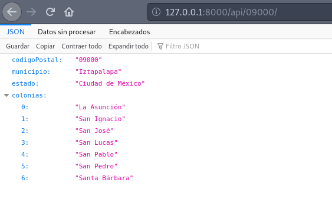
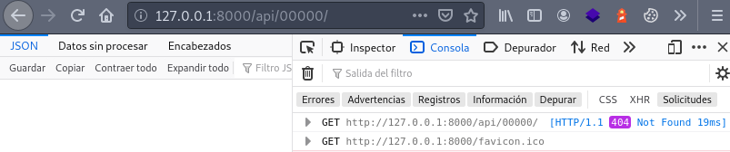
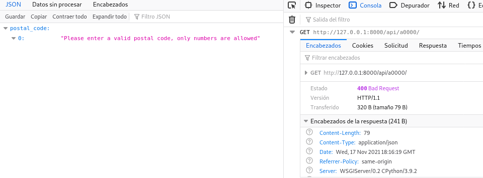

¿Necesitas obtener los datos asociados a un código postal de México para tu aplicación de Django? Tengo una pequeña librería llamada **django-postalcodes-mexico** que descarga los códigos postales de SEPOMEX y crea un API endpoint que te permite consultar un código postal de México y recibir las colonias que pertenecen a ese código postal, así como su estado y municipio.

Para este ejemplo uso Python 3.8, Django 3.2.5 y Pipenv version 2020.5.28

## Instalación

Para instalarla vamos a usar [Pipenv](https://coffeebytes.dev/pipenv-administrador-de-entornos-virtuales/), pero puedes usar Poetry, [pip](https://coffeebytes.dev/python-virtualenv-tutorial-basico/) o cualquier otro gestor de entornos virtuales.

```bash
pipenv shell
pipenv install django-postalcodes-mexico django
django-admin startproject codigosPostalesMx .
python manage.py migrate
```

A continuación instalamos el paquete agregándolo a INSTALLED\_APPS en nuestro archivo de configuración.

```bash
INSTALLED_APPS = [
    'django_postalcodes_mexico.apps.DjangoPostalcodesMexicoConfig',
]
```

Ejecutamos las migraciones. Esto creará las tablas que se necesitan para manejar los códigos postales.

```bash
python manage.py migrate
```

## Obteniendo los códigos postales de México de SEPOMEX

Ya que se crearon las tablas vamos a instalar los códigos postales de México directo de la página de SEPOMEX con un solo comando de Django.

```bash
python manage.py importpostalcodesmx
Trying to connect to Mexican Postal Service (Correos de Mexico)
Response received
This process can take a few minutes, please be patient
Creating database...
The postal code database has been successfully populated
```

Es todo, ahora basta con importar include y agregar nuestras urls. Yo le coloqué la ruta _api/_ pero puedes usar la que tu quieras.

```bash
from django.contrib import admin
from django.urls import path, include

from django_postalcodes_mexico import urls as django_postalcodes_mexico_urls

urlpatterns = [
    # ...
    path('api/', include(django_postalcodes_mexico_urls)),
]
```

## Obteniendo información de un código postal

Si ahora realizamos una petición _api/09000/_ o cualquier otro código postal de 5 dígitos vamos a recibir una respuesta en JSON con el municipio, el estado y una lista de colonias.

```bash
curl localhost:8000/api/09000/
{"codigoPostal": "09000", "municipio": "Iztapalapa", "estado": "Ciudad de M\u00e9xico", "colonias": ["La Asunci\u00f3n", "San Ignacio", "San Jos\u00e9", "San Lucas", "San Pablo", "San Pedro", "Santa B\u00e1rbara"]}
```



Un código postal inexistente nos devolverá un estado 404



Mientras que un código postal inválido nos devolverá un error 400 y un mensaje de error



Lee la corta [documentación oficial en mi repositorio de github](https://github.com/EduardoZepeda/django-postalcodes-mexico) para mayor información.
