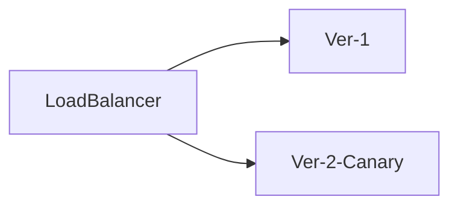
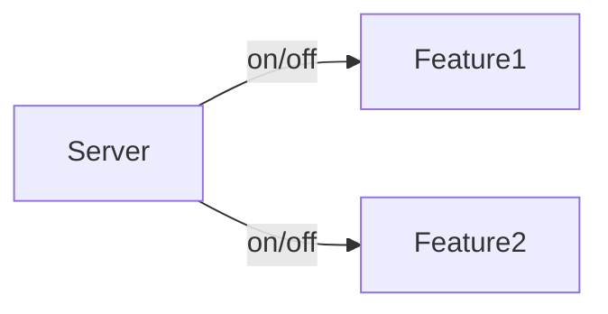
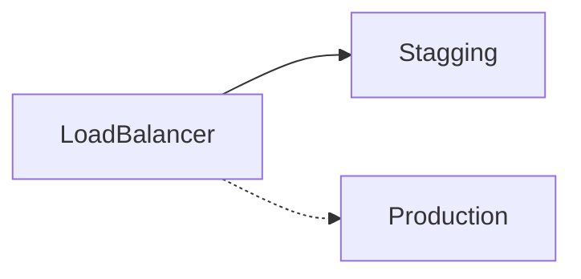
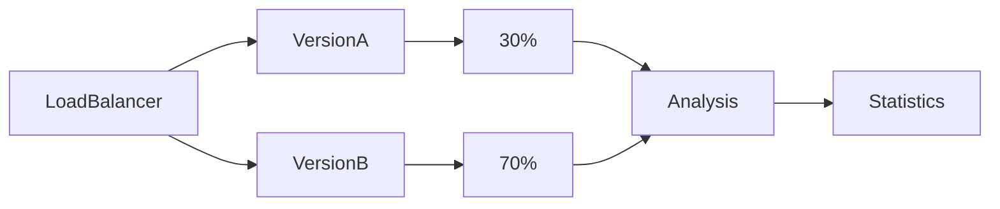
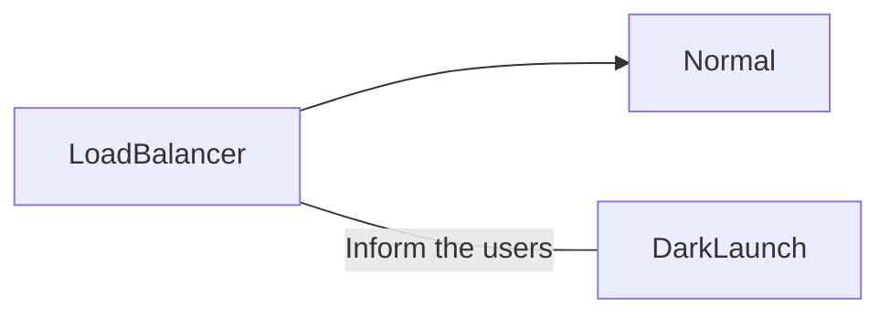

---
aliases:
- /patrones-de-deploy-comunes
- /patrones-de-deployment-o-despliegue-utiles
- /es/patrones-de-deployment-o-despliegue-utiles/
authors:
- Eduardo Zepeda
categories:
- arquitectura de software
coverImage: images/deploy-patterns-to-test-new-functionalities.jpg
coverImageCredits: Image by Tsutomu Nihei --niji 5
date: '2023-08-18'
description: Domina el arte del despliegue con patrones super útiles como canary,
  blue-green, dark launch y A/B testing. Aprenda a desplegar actualizaciones sin problemas,
  minimizar los riesgos y ofrecer experiencias de usuario fluidas y sin downtime para
  tus usuarios.
keywords:
- devops
- patrones de diseño
- arquitectura de software
title: Patrones De Deployment o Despliegue Útiles
---

## ¿Qué es un patrón de deployment o despliegue?

Un patrón de deployment (No confundir con un [patrón de diseño](/es/python/patrones-de-diseno-o-software-design-patterns/)) es un método automático de implementar nuevas características de una aplicación a tus usuarios. Pero no se detiene ahí, es posible obtener información extra a partir de un deploy de una aplicación, pero... ¿cómo? 

Imagínate que quieres probar una característica de tu aplicación web, pero temes que no vaya a ser del agrado de tus usuarios, o quieres ver si esta nueva característica sube o baja el porcentaje de conversiones en tu aplicación, lo cual es invaluable, sobre todo en las etapas tempranas de iteración de una aplicación. 

¿Qué se puede hacer en estos casos? Lo mejor sería probarlo en una muestra representativa de tu público y, dependiendo de como responda, desecharla o implementarla al resto de los usuarios.



## Patrones de despligue comunes

Existen una serie de patrones de despligue bastante usados: 

- Despliegue monolítico
- Despliegue de microservicios
- Containerization
- Serverless Deployment
- Continuous Integration (CI) / Continuous Deployment (CD)
- Canary
- Features toggles
- Blue/Green
- A/B Testing
- Dark launches

Para este post voy a centrarme en los últimos patrones, puesto que son de los que menos he leído información en internet. Considera que **los patrones de deploy o despligue pueden combinarse unos con otros**. Por ejemplo, puedes realizar pruebas A/B sobre tu aplicación monolítica para encontrar la mejor versión. Dicho lo anterior, explicaré los patrones.

### Canary deployment

Este patrón consiste en mostrar las nuevas características a un pequeño grupo de usuarios. Tras analizar y corregir el desempeño de las nuevas características y, si es conveniente, el deploy se extiende a la totalidad de usuarios.

### Features toggles deployment

En lugar de liberar todos los cambios al mismo tiempo, este patrón esconde las características nuevas tras un switch, que se puede encender o apagar  sin modificar el código. Esto permite liberar los cambios de manera gradual o solo a ciertos usuarios, lo que lo vuelve fácil de testear y administrar. Este método tiene la ventaja de que si un problema ocurre, puedes poner el switch en apagado sin necesidad de retornar el código a un estado anterior.

### Blue/green deployments

En el deployment blue/green tenemos dos entornos similares de manera simultanea. Estos entornos se conocerán con el nombre de blue y green. En cualquier momento solo de los dos entornos se encontrará activo, mientras que balanceamos la carga de un entorno a otro. Si encontramos algun error simplemente ajustamos el balance de carga al lado contrario.

### A/B testing deployment

El testeo A/B es el clásico de toda la vida; un conjunto aleatorio de nuestros usuarios recibirá la version A de la aplicación, mientras que el resto recibirá la versión B. Posteriormente se usará estadísticas, específicamente la prueba T para dos muestras, para determinar cual versión (La A o la B) es más efectiva. 

El porcentaje de distribución no necesariamente tiene que ser 50-50.

### Dark launches deployment

Este tipo de patrón de deployment es bastante similar al Canary deployment, sin embargo en este caso los usuarios deben estar concientes de que están recibiendo una versión de prueba y deben conocer la nueva funcionalidad que está siendo puesta a prueba. Con este conocimiento los usuarios serán capaces de brindar feedback de la nueva funcionalidad.

Considera que muchos proyectos no llegan al tamaño necesario para que un patrón de deploy pueda resultar útil, y que si tu aplicación tiene pocos usuarios incluso puede resultar contraproducente. Empero, si no es el caso, puedes echar mano de uno o varios de ellos para extraer información valiosísima para tu aplicación.