---
aliases:
- /en/unleash-your-apis-potential-with-grpc-and-protobuffers/
- /en/fast-and-performant-apis-using-grpc-and-protobuffers/
authors:
- Eduardo Zepeda
categories:
- software architecture
coverImage: images/que-es-grpc-y-protobuffers.jpg
date: '2023-01-19'
description: What is a gRPC API and what are .proto files and protobuffers? What are
  the advantages of protobuffers over JSON and why are they so fast and efficient?
keywords:
- REST
- software architecture
- API
- best practices
title: Fast and performant APIs using gRPC and Protobuffers
---

Protobuffers allow you to create a gRPC API that has the characteristic of being incredibly faster, because it uses binary instead of other less optimized formats (such as JSON), in this post you will learn what this type of API is and why it is so fast.

In my post about [the basic features about a REST API](/en/software architecture/basic-characteristics-of-an-api-rest-api/) I mentioned to you that, besides REST, there were other types of APIS, one of them is gRPC, which is derived from RPC, so let's start the post talking about the latter.

## What is RPC?

RPC stands for Remote Procedure Call, which, in simple words, refers to invoking code execution on one machine from another machine, usually a server, in such a way that, to the programmer, it appears that the execution was performed locally.

### How does RPC work?

The more detailed process is as follows:

1. The client makes the call by sending a message to the network.
2. The call includes a procedure to encode the methods, request types, and response type in the appropriate format.
request and response type in the appropriate format.
([marshalling](https://es.wikipedia.org/wiki/Marshalling)). **This procedure is called the stub**.
3. The server receives the request and uses the stub to decode the data into the appropriate format of the RPC environment and to know what to execute and with what information.
4. The task is executed on the server and a response is generated as a result.
5. The response from the server is encoded using the stub and sent to the client.
6. The client receives the response and decodes it in the appropriate format.


Did you notice I mentioned data encryption? Well, one aspect of RPC to note is that it requires both client and server to use the same programming language, which makes it a disadvantage in environments where multiple programming languages can be mixed.

Now, let's go to gRPC.



## What is gRPC?

Google took into account the shortcomings of RPC and decided to improve it by creating gRPC.

gRPC emulates RPC with the advantage that it **does not need to use the same programming language** to perform machine-to-machine communication.

And what happened to data encryption? Well, Google developed Protocol Buffers (or protobuffers) to use them as the default format for gRPC in the exchange of information between machines and achieve better performance than other formats such as JSON or XML.

## What are protobuffers?

You have probably worked with APIs and have noticed that, when communicating with an API, there is an exchange of information; you send information to the API and it returns a response. This exchange of information can take place in different formats, plain text, XML (if you are old school) or JSON (the most popular today).

For this exchange to occur, the information must be serialized when it is sent and then deserialized.

``` mermaid
graph TD;
    JSON-- serialización -->data;
    data-- deserialización -->JSON;
```



Protocol Buffers (protobuffers from now on) are a completely language and platform agnostic format, which gRPC uses to serialize and deserialize structured data only that, instead of using JSON, XML or another format, it is done directly in binary. This, as you know, makes it much more efficient than using a more human-friendly format like JSON.


### How to convert information with protobuffers?

Simplifying, to create the necessary code to serialize and deserialize in the protobuffers format we start from a file with extension _.proto_, this will be in charge of modeling the information that we will use to communicate, as well as the services that will be available for our API. Basically it is to tell you how our information is structured and what changes we are going to make on this information along with what they will receive as input and return as response.

``` go
message DataResponse {
    int32 id = 1;
    string info = 2;
    string result = 3;
}

message DataRequest {
    int32 id = 1;
    string info = 2;
}

service Publisher {
    rpc ProcessData (DataRequest) returns (DataResponse) {}
}
```

After defining our models and services, these files are compiled, and will generate the necessary code to serialize and deserialize the information in the language we want, both on the client and server side. We do not have to worry about the details in this regard.

Currently the [protobuffers format is available for C#, C++, Go, Objective-C, Java, Python and Ruby.](https://developers.google.com/protocol-buffers) Check the documentation for your particular language.

## REST vs gRPC

But how efficient is gRPC compared to REST? Check out this comparison by [Matthew Leung](https://laptrinhx.com/grpc-vs-rest-performance-comparison-2418648833/).

|                         | gRPC   | REST   |
| ----------------------- | ------ | ------ |
| Peticiones/Segundo      | 48.00  | 4.00   |
| Latencia de la petición | 6.15   | 8.00   |
| CPU ms/s                | 832.00 | 404.00 |
| CPU/petición            | 17.33  | 101.11 |

As you can see _gRPC is much faster than REST plus JSON when processing requests_, performance tests vary from 5 to 10 times.

### Why is gRPC so efficient?

There are several factors that make gRPCs extremely efficient for exchanging information:

* Uses protobuffers as a structure for data exchange.
* The use of HTTP2 and multiplexing.
* Compression of headers.

The binary format of the protobuffers translates into a smaller amount of information to be transported and easier and more efficient handling by computers.

On the other hand, the use of HTTP/2 allows gRPC to send multiple streams of information over a single TCP connection (multiplexing) in a bidirectional and asynchronous manner.

## Types of gRPC and streaming

The HTTP/2 protocol is versatile and allows gRPC to support four types of client-server communications:

* **Unary**. The client and server communicate using a simple request and response, as in REST.
response, as in REST.


**Server-side streaming**. The server sends multiple responses to
a request from the client.


* Client-side streaming. The client sends multiple requests to the server
The client sends multiple requests to the server and the server responds with a single response.


* Two-way streaming**. Both the client and the server send multiple requests and
multiple requests and responses, respectively.


As you can see this is super useful for services that require constant exchanges of large amounts of information, such as microservices.

## Other gRPC capabilities

### Interceptors

gRPC has a mechanism to intercept messages and modify them to your liking, you can think of it as a kind of middleware.

### Load balancing

gRPC provides load balancing capabilities natively.

## Reference resources

* [How RPC works?](https://learn.microsoft.com/en-us/windows/win32/rpc/how-rpc-works)
* [What's RPC an introduction guide](https://www.youtube.com/watch?v=gnchfOojMk4)
* [RPC minimalist guide](https://itnext.io/a-minimalist-guide-to-grpc-e4d556293422)
* [Devopedia](https://devopedia.org/grpc)