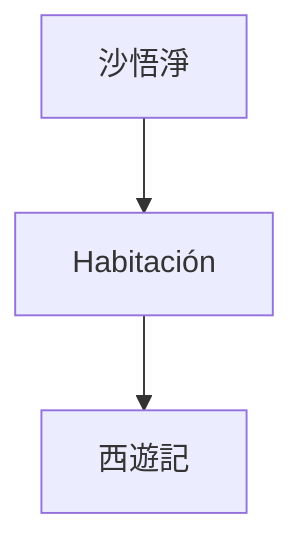
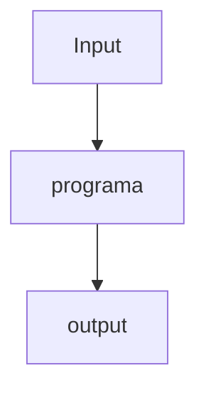

---
aliases:
- /chat-gpt-y-la-habitacion-china-de-searle
- /chat-gpt-la-habitacion-china-de-searle-y-la-consciencia
- /es/chat-gpt-la-habitacion-china-de-searle-y-la-consciencia/
- /es/artificial-intelligence/chat-gpt-la-habitacion-china-de-searle-y-la-conciencia/
authors:
- Eduardo Zepeda
categories:
- artificial intelligence
- opinion
coverImage: images/chat-gpt-y-la-habitacion-china.jpg
date: '2023-04-19'
description: Una breve introducción al tema de consciencia, inteligencia artifcial,
  chatGPT y la habitación china de John Searle
keywords:
- artificial intelligence
- automatas
- ciencias de la computación
- consciencia
slug: /artificial-intelligence/chat-gpt-la-habitacion-china-de-searle-y-la-consciencia/
title: Chat Gpt, La Habitacion China De Searle y la consciencia
---

Chat GPT y la inteligencia artificial están en boca de todos, algunos le tienen miedo, por su [capacidad para resolver problemas de código](/es/artificial-intelligence/pongo-a-prueba-a-chatgpt-con-desafios-de-codigo-de-codewars/) a otros les entusiasma el potencial que tiene para cambiar el mundo laboral y sus numerosas aplicaciones; tales como el [desarrollo de nuevos fármacos](/es/artificial-intelligence/inteligencia-artificial-y-diseno-de-farmacos-y-medicamentos-para-desarrolladores/). 



Hoy dejo de lado las consecuencias económicas de la IA y la pregunta sobre si [estamos en una burbuja de IA o no](), para centrarme en el aspecto filosófico de Chat GPT y reflexionar un poco sobre la pregunta: ¿entiende realmente Chat GPT el lenguaje? O dicho de otra forma: ¿es consciente Chat GPT?

>What a typical “learning machine” does, is finding a mathematical formula, which, when applied to a collection of inputs (called “training data”), produces the desired outputs -The Hundred-Page Machine Learning Book, Adriy Burkov

## La habitación china de John Searle o porque las máquinas dan la ilusión de pensar

John Searle, fue un científico que se preguntó si una computadora puede entender realmente el lenguaje. Y para esto diseñó un experimento mental muy interesante:



Un humano, dentro de una habitación completamente aislada del mundo exterior, con una serie de instrucciones para procesar símbolos en chino y devolver una respuesta. Hay que resaltar que la persona en el interior de la habitación desconoce el idioma chino y se limita a seguir la serie de instrucciones que le fueron otorgadas, es decir, **no comprende el texto que entra, ni el que sale**.

¿Puedes notar las similitudes con una computadora? Son bastante obvias; hay un input o entrada, un output o salida y una caja negra o programa informático, cuyos detalles del funcionamiento escaparían para los que se encuentran afuera de este pequeño sistema simplificado.



De acuerdo a Searle, para las personas que están afuera de la habitación, pareciera que lo que sea que está dentro entiende perfectamente el idioma chino. 

### ¿Es ChatGPT consciente o solo es una ilusión?

Sin embargo, nosotros sabemos que la persona en el interior solo está siguiendo un set de instrucciones, tan complejísimo como nosotros querramos, pero que **no implica una comprensión del lenguaje**, sino un proceso totalmente mecánico. Según Searle, esta situación es análoga al funcionamiento de una computadora.

Extrapolando lo anterior a ChatGPT; aunque un modelo de lenguaje puede producir respuestas que parecen coherentes y relevantes, no hay evidencia de que comprenda realmente el lenguaje o tenga consciencia de su significado. 

De acuerdo con Searle, ChatGPT(o cualquier otro Large Language Model LLM, como Mistral, DeepSeek, etc.) puede estar ejecutando el algoritmo más complejo existente pero, según Searle, no hay más consciencia del proceso ahí que la que encontrariamos en el reloj mecánico más sofisticado. 

¿Pero entonces que marca la diferencia entre una inteligencia real y un proceso mecánico? ¿existe dicha diferencia?



## ¿Están la consciencia y la inteligencia artificial relacionadas?

El máximo representante de la inteligencia en la tierra es el ser humano (o al menos nuestro ego inflado nos dice eso), y también sucede que el ser humano es un ente vivo con consciencia. 

Lo anterior nos lleva a la siguiente interrogante: ¿es necesaria un ser vivo con consciencia para tener inteligencia? ¿o quizás es al revés?

### La postura de que la inteligencia requiere consciencia

Algunos especialistas en AI, como Pinella, argumentan que la consciencia y la inteligencia están relacionados y que incluso tendriamos [un gradiente de consciencia mientras avanzamos en la complejidad e inteligencia de los organismos.](http://writing.rochester.edu/celebrating/2017/NAShonorable.pdf) Dotando del calificativo "consciente" a animales superiores como delfines, orangutanes, cuervos y otros organismos que muestran rasgos de inteligencia.



Otro punto de vista es el de Penrose, él afirma que no sólo la consciencia y la inteligencia están relacionadas sino que [la inteligencia es un rasgo exclusivo de los seres conscientes](https://www.youtube.com/watch?v=e9484gNpFF8). Por lo que, no importa que tan complejo e inteligente se vuelva un sistema, no será consciente y por ende inteligente tampoco, algo parecido a lo que Searle afirmaba.

Otros relacionan inteligencia con consciencia y afirman que un sistema se vuelve más consciente mientras más inteligente se vuelve, quizás como ejemplo podriamos nombrar a [Blake Lemoine, quien aseguraba que el modelo de inteligencia artificial de Google había cobrado consciencia](https://www.bbc.com/mundo/noticias-61787944).

Otro ejemplo es la teoría de la información integrada, de Giulio Tononi, que propone que la consciencia se genera cuando un sistema es capaz de incorporar información e unificarla, y que este nivel de consciencia (llamado Φ) puede calcularse para cualquier sistema, teniendo un gradiente de consciencia que va desde los seres más simples hasta los más complejos.

#### El problema de determinar si algo es consciente o no

Para empeorar la situación, tenemos el problema de que la consciencia solo puede ser experimentada por el ente consciente, no existe un experimento que nos permita decir a ciencia cierta si una entidad es consciente o no. Sin caer en un solipsismo absolutista, **nosotros consideramos que el resto de seres humanos son conscientes solo porque nosotros sabemos que lo somos**, no porque tengamos pruebas irrefutables de ello.

Repito, no estoy hablando de solipsismo, me refiero a que, aunque creas que hay más consciencias a parte de la tuya, solo puedes estar seguro de la existencia de la tuya. No existe ninguna manera, al menos hasta hoy, de que puedas probar la consciencia de otro ente que no seas tú mismo. *Cogito, ergo sum*.

O puesto en palabras por Ludwig Wittgenstein en su libro, Investigaciones Filosóficas:

>  Imagina que al nacer te dan una caja con un escarabajo dentro. Se trata de un objeto muy valioso y extremadamente personal, tanto, que nadie puede ver el interior de la caja salvo uno mismo. De este modo, no existe una forma objetiva de confirmar que todas las cajas contengan lo mismo. En el mejor de los casos podrían contener un escarabajo de verdad, pero nada garantiza al cien por cien que en lugar del escarabajo no haya otros insectos, como una hormiga o una araña, o que incluso no haya nada, eso sí, sea lo que sea, siempre se considerará bajo el término de «escarabajo».



Mientras no entendamos que es la consciencia exactamente, no podremos saber que tenemos que "medir" para saber si otro ente es consciente, o si acaso tiene sentido el término "medir" cuando hablamos de consciencia. 

### La postura que afirma que existe inteligencia sin consciencia

Por el contrario, existen posiciones que defienden que la inteligencia no depende necesariamente de la consciencia, sino que puede existir en sistemas que no tienen experiencia subjetiva. Para ejemplo basta citar a Alpha Go y otros programas informáticos que son capaces de "analizar" y  "responder" a situaciones muy complejas y con muchos matices, sin existir más allá del juego para el que fueron programados, o a los [sonámbulos, que pueden mostrar signos de inteligencia aún no estando conscientes](https://publications.aap.org/pediatrics/article-abstract/111/1/e17/28494/Sleepwalking-and-Sleep-Terrors-in-Prepubertal?redirectedFrom=fulltext).

Sir Roger Penrose refuerza el punto anterior en su libro "[Emperor's new mind](https://amzn.to/3XmesG6#?)", en el que afirma que la consciencia no es computable, por lo que nunca llegaremos a crear una Consciencia Artificial mediante algoritmos ni ésta surgirá de forma natural de la complejidad computacional, por más [fine-tuning de un LLM (Large Language Model)](()) u otro paradigma de modelo que entrenemos.

Pero aunque los seres humanos tengan procesos inconscientes capaces de existir sin la manifestación de la consciencia... debe de existir algo más que una simple acción mecánica, después de todo los animales son mucho más complejos que las máquinas ¿no? 

## Autómatas biológicos, inteligencia y consciencia

A veces creemos que solo las máquinas tienen un comportamiento mecánico y que cualquier ser vivo sería capaz de responder de manera muy diferente a la que haría una máquina, con más versatilidad y adaptándose a los cambios, pero, ¿es siempre así? 

En el libro "Un eterno y grácil bucle" de Douglas R. Hofstader. El autor cita un [experimento en el que una avispa sphex es engañada para acercar un grillo a los límites de una madriguera hasta 40 veces](https://jhjeong.mindconnect.cc/Texts/sphex.html). Tal cual como si fuera un programa de computadora, esta avispa queda atorada en un bucle infinito del que no puede escapar, ¿qué tan diferente es esto de un programa informático que, tras el mismo input, genera el mismo output?

Como bien especula Hofstader, un humano se hubiera "salido" del bucle para detenerse por unos momentos e investigar lo que estaba ocurriendo.



Este experimento me hizo cuestionarme sobre si algunos seres vivos no son otra cosa que autómatas biológicos y también sobre donde está el punto de inflexión en el que un ser vivo deja de ser un autómata y se vuelve consciente, ¿existen gradientes de consciencia? Y, si es así, ¿como se ve siente consciencia más allá de la que experimentamos los humanos? Si la consciencia existe como una manifestación macroscópica, ¿es determinista? ¿o pertenece al mundo cuántico de la indeterminación? No lo sé y creo que la verdad aún no elige un ganador.

## Mi opinión al respecto de la si los LLMs se volverán conscientes

Tras tiempo leyendo sobre el tema e investigando lo que diferentes autores tienen que decir: Dawkins, Penrose, Planck, entre otros. Me he decantado por la idea de que la consciencia no puede ser emulada por métodos matemáticos sin un entendimiento profundo y meticuloso de su naturaleza, lo cual, por el momento, está fuera de nuestro alcance. 

Sí, esto incluye a OpenAI, Anthropic o cualquier otra compañia. No importa El problema duro sigue igual de vigente, pero más relevante que nunca.

Mi segunda razón es más especulativa. Ahora mismo barajo la idea de que la consciencia pueda ser un ente fundamental de la existencia, al mismo nivel o quizás más alto que las leyes físicas. En cuyo caso no importa que tan sofisticado sea el algoritmo y con cuantos datos de entrenamiento dispongamos, jamás podremos crear una AGI consciente, tendremos que contentarnos con un modelo increíblemente bueno en todo, pero mecánico. Pero repito, esto es más especulativo y una convicción mucho más débil.

## Mi opinión sobre si tendremos una AGI próximamente

También creo que la posibilidad de una AGI es remota. Creo que soy partidario de que una AGI requiere algún nivel de consciencia, y por esa razón, hasta que no entendamos lo que implica una consciencia no podremos "programarla" si es que algo así tiene sentido. 

Obviamente habrá intentos, pero serán más parecidos a tratar de integrar una una serie de AIs especializadas en un mismo robot. Algo parecido a tener un montón de servidores con múltiples servidores del [Model Context Protocol](), lo cual no es otra cosa sino un ejemplo más sofisticado de la habitación china de Searle.

## ¿Qué leer o ver para saber más de inteligencia artificial y consciencia?

La consciencia es un tema bastante complejo que no puede abordarse en unas cuentas lineas, no por nada se le conoce como el "problema duro", pero si estas pinceladas te dejaron con ganas de más, te dejo mi lista de recursos favoritos para ahondar este tema tan complejo.

* [Un eterno y grácil bucle de Douglas R. Hofstader](https://amzn.to/4boOnfd#?): el autor profundiza en el tema de la autoreferencia y desarrolla la pregunta: ¿puede un sistema comprenderse así mismo?
* [La nueva mente del emperador de Sir Roger Penrose](https://amzn.to/3XmesG6#?): el autor establece el contexto de las leyes del universo y analiza si la consciencia y la inteligencia están relacionadas y si estas tienen un carácter determinista o no determinista.
* [Brains, Minds, and Machines: Consciousness and Intelligence](https://infinite.mit.edu/video/brains-minds-and-machines-consciousness-and-intelligence): plática del MIT, donde se desarrollan los temas de cerebros, consciencia, inteligencia y máquinas. Radicalmente infravalorada; ¿7000 vistas en youtube nada más? ¿de verdad?
* [¿Puede un programa estar vivo?](https://www.youtube.com/watch?v=mC_KQC1gtWQ) pequeño videoensayo donde uno de mis youtubers favoritos desarrolla el tema de si un programa informático puede estar vivo.
* [The connection between intelligence and conciousness](http://writing.rochester.edu/celebrating/2017/NAShonorable.pdf)
