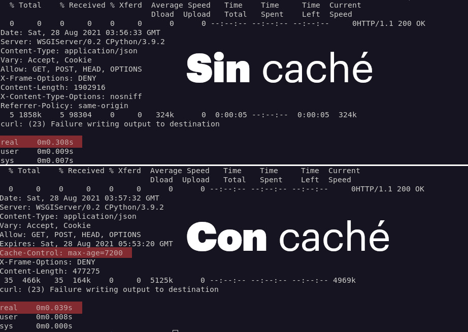
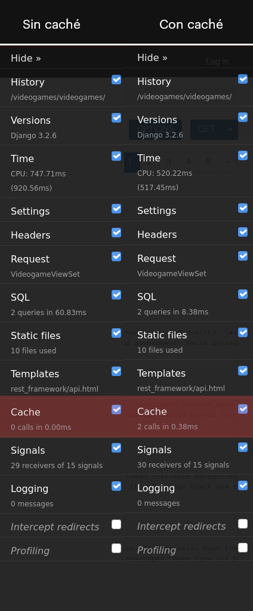

---
aliases:
- /caching-in-django-rest-framework-with-memcached/
title: "Caching in Django REST Framework using memcached"
date: "2021-09-07"
categories:
- "django"
coverImage: "images/CacheConMemcachedYPymemcache.jpg"
coverImageCredits: "Credits https://www.pexels.com/es-es/@airamdphoto/"
description: "Learn how to implement and configure different levels of caching in your Django REST Framework application using memcached as a backend."
keywords:
- python
- django
- cache
- REST
- performance
- API
authors:
- Eduardo Zepeda
---

To use the cache in django, just follow three simple steps:

1. Install a caching system, be it redis, memcached, etc.
2. Set the CACHES variable to the _settings.py_ file of the project.
3. Add the middleware necessary for django to return the cache before processing the view.
4. Use the low-level cache to cache specific views or data (optional).

Implementing a caching system allows you to [greatly improve the performance of an application made in Django](/en/is-your-django-application-slow-maximize-its-performance-with-these-tips/).

## How much does caching improve performance?

The effect the cache will have depends on many factors. However, just to give you an idea, here I have a comparison of a query that fetches 1000 rows from a database of a model with no relationships to other models.

As you can see the difference is almost 10 times the time.



If you're in a situation where [your application's performance is critical](/en/dont-obsess-about-your-web-application-performance/), cache is definitely one of the first steps that you have to make in order to improve your site's speed.

## Installing memcached

Caching in django requires memcached, redis or another caching method.

Memcached is the fastest and most efficient method according to django developers, so we will use this one. Memcached, is memory based and is allocated a fixed amount of RAM that it can use, it is quite fast to implement and simple to use. It is also included in the repositories of many GNU/Linux distributions.

```bash
sudo apt install memcached
```

Verify that the system is running with the systemctl command, update-rc, systemE or whatever your system process manager is.

```bash
sudo systemctl status memcached
● memcached.service - memcached daemon
     Loaded: loaded (/lib/systemd/system/memcached.service; enabled; vendor preset: enabled)
     Active: active (running) since Wed 2021-09-08 10:16:31 CDT; 5h 46min ago
```

It's pretty obvious, but I feel I should mention it: remember that **memcached stores data in memory, it will be deleted when the system is shut down or rebooted**. Therefore you should make sure to use memcached only as a temporary storage and store content there that you wouldn't mind losing or that you plan to dump later to a database.

## pymemcache installation

I will install the following dependencies for this tutorial:

* djangorestframework: for creating [REST APIs](/en/basic-characteristics-of-an-api-rest-api/).
* django-debug-toolbar: to compare performance before and after caching.
* django-seed: to automatically create data in the database.
* pymemcache: to allow python to interact with memcached.

Some older tutorials **use python-memcached to interact with memcached, however the use of this library is** [**discouraged** by django since version 3.2](https://docs.djangoproject.com/en/3.2/topics/cache/#memcached)

```bash
pipenv install djangorestframework django-debug-toolbar django django-seed pymemcache
```

Once we have the applications installed and configured we are going to start applying cache. We add the following lines to our configuration file.

You can use django-seed to populate your database tables.

```bash
python manage.py seed nombreDeTuApp --number=1000
```

## Configuring the CACHES variable in django

To configure the behavior of the cache we will create a variable called CACHES, where we will specify the backend we want to use and its location. In this case it will be localhost, with port 11211; the default port for memcached.

```bash
# settings.py
CACHES = {
    'default': {
    'BACKEND': 'django.core.cache.backends.memcached.PyMemcacheCache',
    'LOCATION': '127.0.0.1:11211',
    }
}
```

CACHES has more configuration variables that I will list below:

### Arguments of configuration variable CACHES

CACHES can receive a number of arguments to modify its behavior:

* TIMEOUT: The time the cache lasts, _None_ so that it never expires, default value is 300 seconds.
* MAX_ENTRIES: The number of entries the cache stores, if the oldest cache is exceeded it will be deleted to store the newest cache, default value is 300.
* CULL_FREQUENCY: The proportion of entries to be deleted when MAX_ENTRIES is reached. If this value is equal to 2, half of the entries will be removed when MAX_ENTRIES is reached. If you set it to a value of 0 the entire cache will be removed when MAX_ENTRIES is reached. Default value is 3.
* KEY_PREFIX: A prefix added to the cache name, it is used to identify our cache. This is to avoid collisions with other applications that are using the cache, or simply to identify it.
* VERSION: The version with which we want to name our cache.
* KEY_FUNCTION: here we can pass a string that specifies the address to a function that sets the prefix, the version and the key with which the cache will be saved. For example: 'cacheConfig.cacheNamegenerator'.

```python
# settings.py
CACHES = {
    'default': {
    'BACKEND': 'django.core.cache.backends.memcached.PyMemcacheCache',
    'LOCATION': '127.0.0.1:11211',
    'TIMEOUT': 60,
    'OPTIONS': {
        'MAX_ENTRIES': 1000
    }
}
}
```

## Put on caching all over the web site

To cache the entire Django website, just add two middlewares:

* django.middleware.cache.UpdateCacheMiddleware
* django.middleware.cache.FetchFromCacheMiddleware

Make sure that _django.middleware.cache.UpdateCacheMiddleware_ is the first middleware in your list and _django.middleware.cache.FetchFromCacheMiddleware_ is the last.

In the same way dja_ngo.middleware.common.CommonMiddleware_ must be active.

**While these middlewares are active, Django will cache any page that receives GET and HEAD methods** and returns an HTTP status of 200.

```python
MIDDLEWARE = [
    'django.middleware.cache.UpdateCacheMiddleware',
    'django.middleware.common.CommonMiddleware',
    'django.middleware.cache.FetchFromCacheMiddleware',
]
```

If you examine a request you will see that the _Cache-Control_ header already specifies a value of _max-age=600_, the default value.

```python
curl -i 127.0.0.1:8000/videogames/videogames/ | less
Cache-Control: max-age=600
```

If instead of using the terminal we enter the browser, we will see how the _django_debug_toolbar_ already shows us that the cache is being used.



Look how in the cache column, we already have two calls.

He also mentioned that Django's per-site cache is not compatible with the _django-debug-toolbar_, so you probably won't see it reflected in the bar.

## Cache per django view

But what if you don't want to cache the entire website? Most websites are a mix of dynamic pages and static pages. You probably only want to leave the static pages, or pages that change rarely, in cache and make sure that your user receives the dynamic pages with updated content. That is, only certain views should be cached.

To cache the result of a view just use the _@cache_page_ decorator provided by django and pass the time you want django to cache, in seconds, for that view.

```python
from django.utils.decorators import method_decorator
from django.views.decorators.cache import cache_page

from rest_framework import serializers
from rest_framework import viewsets

from ..models import Videogame
from .serializers import videogameSerializer

class VideogameViewSet(viewsets.ModelViewSet):
    queryset = Videogame.objects.all().order_by('-created')
    serializer_class = videogameSerializer

    @method_decorator(cache_page(60*60*2)) # 7200 segundos o 2 horas
    def list(self, *args, **kwargs):
        return super().list(*args, **kwargs)
```

Notice how I have used the decorator in the _list()_ method of our _ModelViewSet_ and, to make it execute its normal function, I have called the _super()_ method with the same arguments.

You can also cache the _dispatch()_ method for a solution that applies to the most used generic DRF classes.

```python
class VideogameViewSet(viewsets.ModelViewSet):
    queryset = Videogame.objects.all().order_by('-created')
    serializer_class = videogameSerializer

    @method_decorator(cache_page(60*60*2))
    def dispatch(self, *args, **kwargs):
        return super(VideogameViewSet, self).dispatch(*args, **kwargs)
```

If we execute the _curl_ command on the view to which we added the decorator, we will see that the cache-control header appears with the time we passed as argument.

```bash
curl -i http://127.0.0.1:8000/videogames/videogames/
HTTP/1.1 200 OK
Date: Sat, 28 Aug 2021 00:45:57 GMT
Server: WSGIServer/0.2 CPython/3.9.2
Content-Type: application/json
Vary: Accept, Cookie
Allow: GET, POST, HEAD, OPTIONS
Expires: Sat, 28 Aug 2021 02:45:57 GMT
Cache-Control: max-age=7200
X-Frame-Options: DENY
Content-Length: 4991
X-Content-Type-Options: nosniff
Referrer-Policy: same-origin
Server-Timing: TimerPanel_utime;dur=40.300000000000004;desc="User CPU time", TimerPanel_stime;dur=4.150000000000015;desc="System CPU time", TimerPanel_total;dur=44.45000000000002;desc="Total CPU time", TimerPanel_total_time;dur=45.484066009521484;desc="Elapsed time", SQLPanel_sql_time;dur=4.948616027832031;desc="SQL 2 queries", CachePanel_total_time;dur=0.33092498779296875;desc="Cache 1 Calls"
```

Django stores each cache entry per url, not per view, so if you use the same view for multiple urls, each url will be put in a different cache entry.

## Cache by value

Here we are caching the result of a url, but what if we only want to cache the result of an expensive query or rendering, or perhaps a specific value?

We can work directly with memcached using django, associating a key with a value and assigning it a lifetime. Once the lifetime has elapsed the value will be deleted and we will get _None_ if we try to access it.

You can think of the cache as a Python dictionary with an expiration date.

Caching by value allows us to create patterns like this:

```python
from rest_framework.response import Response
from yourApp.models import Large
from yourApp.api.serializers import LargeSerializer
from django.core.cache import cache

class LargeViewSet(viewsets.Viewset):

    def list(self, request):
        querysetCostosoEnCache = cache.get('querysetCostoso') # devuelve None si no existe
        if querysetCostosoEnCache:
            return Response(querysetCostosoEnCache)
        querysetCostoso = Large.objects.all()
        serializer = LargeSerializer(querysetCostoso)
        # Una vez calculado lo guardamos en caché para no tener que calcularlo de nuevo
        cache.set('querysetCostoso', serializer.data, 60*180)
        return Response(serializer.data)
```

If we want to use default values if there is no value in the cache we pass the value as the second argument.

```python
cache.get('valorCostoso', 'valorPorDefecto')
```

We can also obtain multiple keys by passing a list of keys to the _get_many()_ method.

```python
cache.get_many(['llave1', 'llave2'])
```

And if we want to get rid of some value we use the _delete()_ method.

```python
cache.delete('llaveAsociada')
```

## Cache relying on cookies, headers and no-cache

What if we want django to cache different versions of a response depending on a specific cookie or header? For example, one cache for the path _/videogames/_ with the CONFIG=1 cookie and another for the CONFIG=2 cookie. Or, or one cache for the path _/videogames/_ with the Firefox browser and another with the Chromium browser.

We have decorators who are in charge of achieving exactly this.

### vary_on_headers

vary_on_headers will set a different cache response for each different userAgent header. Remember that cookies are specified by headers.

```python
from django.views.decorators.vary import vary_on_headers

@vary_on_headers('User­Agent')
def vistaParaCadaNavegador(request):
# ...

@vary_on_headers('User­Agent', 'Cookie')
def vistaParaCadaNavegador(request):
# ...
```

### vary_on_cookie

This decorator will create a different cache entry for each cookie that receives our view.

```python
from django.views.decorators.vary import vary_on_headers

@vary_on_cookie
def vistaParaCadaCookie(request):
# ...
```

Since django keeps track of each individual session using cookies, we can cache the views per user

```python
from rest_framework.response import Response
from rest_framework.views import APIView
from rest_framework import viewsets

class UserViewSet(viewsets.Viewset):

    # Caché por usuario que dura 30 minutos
    @method_decorator(cache_page(60*30))
    @method_decorator(vary_on_cookie)
    def list(self, request):
        newsfeed = {
            'user_newsfeed': request.user.get_user_newsfeed()
        }
        return Response(newsfeed)
```

### Other cache headers

We can directly modify the header cache-control directives by passing them as arguments to our decorator of the same name.

```python
from django.views.decorators.cache import cache_control

@cache_control(must_revalidate=True, max_age=3600)
```

We can specify other cache headers such as the following:

* public=True
* private=True
* no_cache=True
* no_transform=True
* must_revalidate=True
* proxy_revalidate=True
* max_age=num_seconds
* s_maxage=num_seconds

For a complete list of directives and what each one does visit [protocol specifications](http://www.w3.org/Protocols/rfc2616/rfc2616-sec14.html#sec14.9).

### Do not frisk

If we want to prevent django from caching our views we mark them with the decorator _@never_cache_.

```python
from django.views.decorators.cache import never_cache

@never_cache
def vistaQueNuncaSeCacheara():
    #...
```

## Cache for the development process

If you are developing a website with Django and for some reason you can't (or don't want to) install redis, memcached or any other caching system, you can use a fake cache provided by Django. The fake cache will trick your application into believing that there is a real caching system.

To activate it use the dummy cache as a backend by configuring it as a backend in your configuration file.

```python
CACHES = {
    'default': {
        'BACKEND': 'django.core.cache.backends.dummy.DummyCache',
    }
}
```

## Other types of cache

In addition to caching using memcached, you can store the data directly in memory, use a database or directly as hard disk data. To do this, simply change the CACHES configuration variable to other locations.

For example, this configuration will store the cache in the _/tmp/_ directory of the operating system. The cache will be slower than memcached, but less ephemeral, you can even specify another location outside the _/tmp/_ directory if you are looking for a cache that survives reboots, although much slower.

```python
CACHES = {
    'default': {
    'BACKEND': 'django.core.cache.backends.filebased.FileBasedCache',
    'LOCATION': '/var/tmp/django_cache',
    }
}
```

The [Django documentation on caching](https://docs.djangoproject.com/en/3.2/topics/cache/) has more details for other less common use cases, check it out if you need a more specific solution.