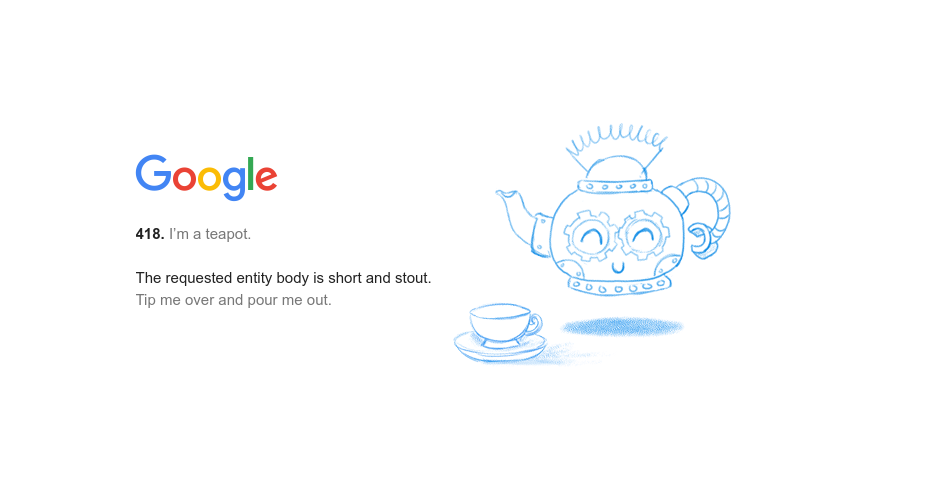
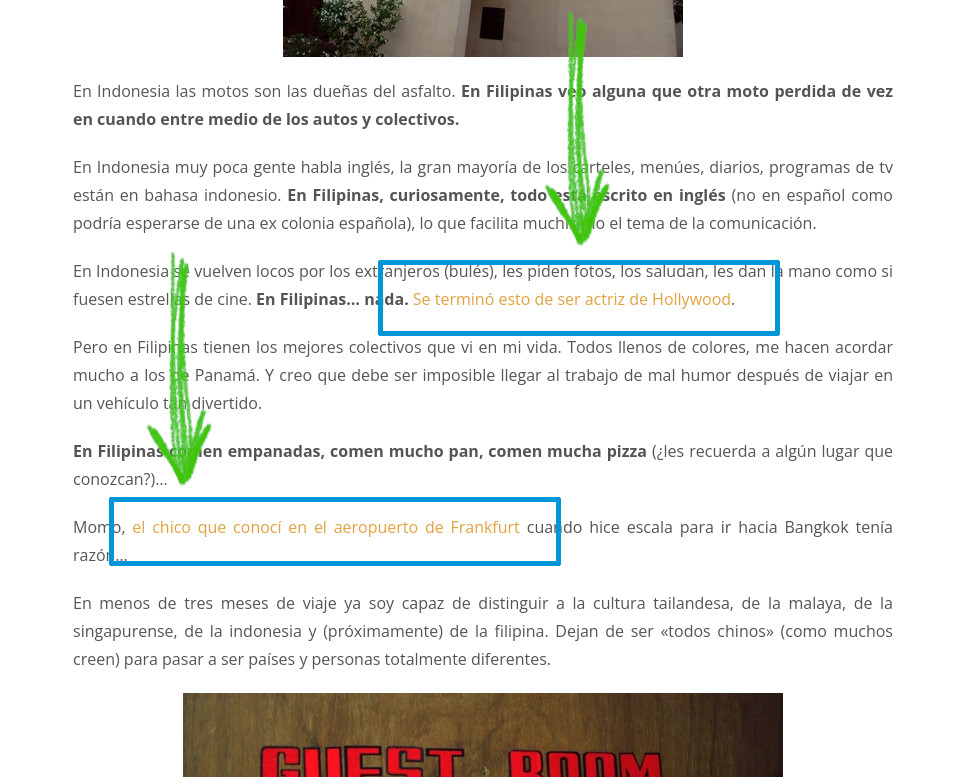

This publication is a very short guide of practical tips on REST API design, I don't go too deep into the theory. On top of that, I may oversimplify many concepts in order to keep the text as short and simple as possible.

In the next post I will talk about some more subjective questions such as: how to return JSON correctly, how much to nest an API, what are the ways to version a REST API, and what are some of the ways to version a REST API.

## What is an API?

The term API stands for application programming interface, and consists of a set of rules that tell us how applications and/or devices can communicate with each other.

### There are different types of APIs

There are many types of APIs and new paradigms are appearing all the time, one of them is REST. REST is special because it has managed to survive the passage of time and position itself above the rest, but no one knows what will happen tomorrow.


## What is a REST API?

A REST API is an API that complies with the REST design standards (forgive the obviousness), but what is REST? REST is a style of architecture, which has to comply with a series of characteristics that I will talk about below.

### What are the features of a REST API?

Not all APIs are REST, numerous developers, at all levels, interchangeably use the term REST API to refer to any server that returns JSON or even action-oriented APIs, such as [RPC or gRPC](/free-the-potential-of-your-api-with-grpc-and-protobuffers/), even companies as large as Twitter and Facebook do not meet all the characteristics of a REST API, despite advertising their APISs as such.

If you already know the brief technical part, skip this section.

If we want to design a REST API we have to comply with a series of characteristics that define this design style. I summarize them briefly below:

* System with client-server architecture.
[...]  [...]
[...]
[...]  [...]  [...]  [...]
[...]  [...]
[...]
[...]

If you want to delve deeper into each of these points, here are some resources that may be quite useful:

In English:

* [Representational state transfer (inglés)](https://www.ics.uci.edu/~fielding/pubs/dissertation/rest_arch_style.htm)
* [Nadie entiende REST](https://steveklabnik.com/writing/nobody-understands-rest-or-http)

In Spanish:

* [Understanding REST. The Architecture Style](https://blog.thedojo.mx/2019/06/15/entendiendo-rest-estilo-de-arquitectura.html)
* [Designing and developing an API from scratch](https://blog.thedojo.mx/2019/05/06/diseno-y-desarrollo-de-una-api-desde-cero.html)
* [Understanding REST stateless server](https://blog.thedojo.mx/2019/08/03/entendiendo-rest-servidor-sin-estado.html)
* [Understanding REST cacheable services](https://blog.thedojo.mx/2019/10/27/entendiendo-rest-servicios-cacheables.html)
* [REST Design Principles](https://www.ibm.com/mx-es/cloud/learn/rest-apis)

Having summarized the basic features, let's move on to practical tips.

## Uses the correct status codes

Do not return a 200 code in all your API responses.

As you know, each HTTP response has a numeric value that defines it, these values can be grouped in ranges from 100 to 600.

Our API must return the correct statuses that tell the client what is happening.

There are probably some states that you will never use, but you should memorize at least the most frequently used ones:

* 200 OK, status ok, the request was successful.
* 201 Created, a resource was created
* 204 No Content, Request completed successfully, but there is no content in the request.
* 400 Bad Request, server received a malformed request
* 401 Unauthorized, you are not authenticated (no user)
* 403 Forbidden, you do not have the proper permissions (the user does not have the permissions)
* 404 Not Found, the requested resource was not found
* 500 Internal Server Error, server error

There are many more [HTTP statuses you probably want to know about](https://developer.mozilla.org/es/docs/Web/HTTP/Status). Be sure to check them out.



### Returns clear messages on errors

When you return an error, make sure you notify your API user, in a clear and explicit way, about the errors and how to fix them.

```json
{ 
  "error": {
    "type": "Validation Error",
    "code": "Error-0123",
    "message": "La contraseña debe tener más de 6 caracteres y contar con al menos un dígito",
    "documentation_url": "http://example.com/docs/errors/E-0123"
  }
}
```

## Use the appropriate HTTP methods

Do not limit yourself to receive only POST and GET requests in your API, there is a method for each action of a CRUD.

The HTTP methods we receive as part of the HTTP request will indicate the instructions to be performed by the server.

* GET: Read a resource
* POST: Create a resource
* PUT: Create a new resource or update it if it already exists.
* PATCH: Edit a part of a resource
* DELETE: Delete a resource
* HEAD: Like GET but without getting the resource.
* OPTIONS: Ask the server for supported methods before making a request to them

For details on each method consider reviewing the [official documentation on HTTP request methods](https://developer.mozilla.org/es/docs/Web/HTTP/Methods).

### Use plural nouns, not verbs for URIs.

A REST API is a representation of resources, so we always refer to objects, plural.

Actions are specified in HTTP methods, so leave them out of your URIs.

```bash
# Maneras incorrectas ❌
/crear-videojuego # Esto no es REST, sino RPC ❌
/videojuego/crear # Esto no es REST, sino RPC ❌
/videojuego/borrar # Esto no es REST, sino RPC ❌
```

For the sake of clarity we will use the plural form of nouns to refer to resources.

```bash
# Incorrecta, está en singular ❌
/videojuego 
# Manera correcta ✅
/videojuegos
```

## Avoid underscores and always use lower case.

In Mark Masse's Rest API Design Rulebook: Designing Consistent Restful Web Service Interfaces, he states as a "rule" the use of lower case in URIs and encourages the avoidance of underscores, because some devices highlight clickable resources with underscores, which can make links difficult to see.

```bash
/VIDEOJUEGOS❌
/videojuegos_populares❌
/videojuegos✅
```

## Diagonal at the end or not?

There are some mixed opinions on this.

In the Rest API Design Rulebook: Designing Consistent Restful Web Service Interfaces, the use of a diagonal at the end of URls is strongly discouraged.

Where does the diagonal at the end come from? Historically the non-diagonal version has been used to refer to files.

```bash
/videojuegos
```

While a diagonal at the end refers to directories.

```bash
/videojuegos/
```

On the other hand, [google is more permissive in its article slash or not to slash](https://developers.google.com/search/blog/2010/04/to-slash-or-not-to-slash). And it is totally indifferent towards the use or absence of the end diagonal, however it emphasizes the importance of remaining uniform in its use, since ** URLs with end diagonal and without end diagonal are considered different URLs by search engines.

Pick one and stick to it. Consider using a redirect (301) from one type of url to another, but always be consistent.

### Diagonal at the end in the root

In the root address it does not matter if a diagonal is placed at the end.

The **root URLs are treated as one by search engines, whether they are diagonal or not**, so make sure they return the same content.

```bash
https://tudominio.com/
https://tudominio.com
```

## Extensions in the url

Do not use the URI to specify the type of resource requested by its extension. Remember that one thing is the resource itself and another is its representation.

```bash
/recurso.txt❌
/recurso.json❌
/recurso.xml❌
```

So how do I request a file type in a REST API?

### The customer requests the type of representation by means of headers.

The representation of the resource to be returned will depend on the _Accept_ header of the client, so we can return different types of representations of the same resource, in the same URI.

```bash
GET /v1/recurso HTTP/1.1
Host: api.example.org
Accept: application/json

*GET /v1/recurso HTTP/1.1
Host: api.example.org
Accept: application/xml
```

## Use HATEOAS to allow navigation between related resources.

HATEOAS stands for **Hypermedia As The Engine Of Applicaton State**.

What is it? When you enter a web page, it has internal links to other pages of the website, usually related to each other, either video, audio, images, so that navigation is more fluid.



HATEOAS tells us that our clients should receive an API response from which they can access other related resources via hyperlinks.

This does not necessarily mean a URL's; it can be a file, an ftp or others. But yes, probably for practical purposes you will be using URL's most of the time.

In other words, **our API must be navigable from a response**.

```bash
{
    "id": 1,
    "nombre": "Eduardo",
    "apellido": "Zepeda",
    "posts": [
        {
            "post": "http://api.example.org/post/1"
        },
        {
            "post": "http://api.example.org/post/2"
        }
    ]
}
```

## Document your API

Every API should be documented. Documentation should be clear and easy to understand. Fortunately, there are already solutions that save a lot of work, allowing you to document the most basic aspects of your API automatically.

* OpenAPI (Formerly Swagger)
* ReDoc
* Aglio

Consider implementing them in your project.

There are even [frameworks such as FastAPI that include the documentation by default in the projects](/python-fastapi-the-best-framework-of-python/)

Open API image capture, automatic documentation for REST API](images/Documentacion_swagger.png "Interface generated by Open API")

## Test your API

Each endpoint of your API should be tested, make sure they return the correct status codes for each combination of HTTP method and user type (authenticated, anonymous, no permissions, etc.). For testing you can always rely on classic solutions such as HTTPie or Curl.

On the other hand, if you want something more visual, more user-friendly, and easier to use, consider using specialized tools, such as Postman, Insomnia or Hoppscotch.

Insomnia GUI, a REST API testing application](images/InsomniaGUI.png "Insomnia GUI, API testing tool")

In order not to extend the post so much, the next post will deal with some more subjective [REST API design and best practices](/good-practices-and-design-of-a-api-rest-api/) questions such as: how to return JSON correctly? How much to nest an API? What are the ways to version an API?

## Reference sources

* [Whitehouse's API standards](https://github.com/WhiteHouse/api-standards)
* [HTTP Methods](https://developer.mozilla.org/es/docs/Web/HTTP/Methods)
* [To slash or not to slash](https://developers.google.com/search/blog/2010/04/to-slash-or-not-to-slash)
* [Sturgeon, P. (2015). _Build Api’s_. Philip J. Sturgeon.](https://www.amazon.com.mx/Build-APIs-You-Wont-Hate/dp/0692232699/ref=sr_1_1?__mk_es_MX=%C3%85M%C3%85%C5%BD%C3%95%C3%91&amp;crid=2W0ZTSCO349YL&amp;keywords=build+apis&amp;qid=1648756000&amp;sprefix=build+apis%2Caps%2C187&amp;sr=8-1)
* [Massé, M. (2012). REST API design rulebook. Sebastopol, CA: O'Reilly.](https://www.amazon.com.mx/Rest-API-Design-Rulebook-Consistent/dp/1449310508)