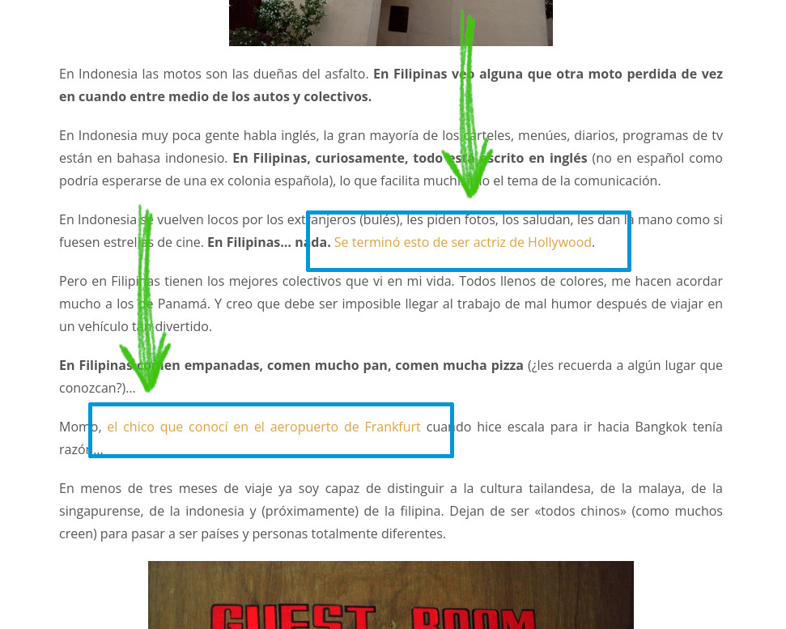

Esta publicación es una guia muy corta de consejos prácticos sobre diseño de APIs REST, no profundizo demasiado en la teoría. Encima, puedo sobre simplificar muchos conceptos en aras de mantener el texto lo más corto y sencillo posible.

En la siguiente entrada posterior hablaré de algunas cuestiones más subjetivas como: ¿cómo devolver el JSON correctamente? ¿Cuánto anidar una API? ¿Qué maneras existen para versionar una API REST?

## ¿Qué es una API?

El término API proviene de interfaz de programación de aplicaciones, y consiste en una seríe de reglas que nos dicen como pueden comunciarse entre sí las aplicaciones y/o los dispositivos.

### ¿Qué es una API REST?

Una API REST es una API que cumple las normas de diseño de REST (Perdónenme la obviedad), un estilo de arquitectura del que te hablo a continuación.

## ¿Cómo debe ser una API REST?

No todas las APIs son REST, numerosos desarrolladores usan indistintamente el término API REST para referirse a cualquier servidor que retorne JSON o incluso a APIs con orientación en acciones (RPC).

Si ya conoces la breve parte técnica, sáltate esta sección.

Si queremos diseñar una API REST tenemos que cumplir una serie de características que definen este estilo de diseño. Te las resumo brevemente a continuación:

- **Sistema con arquitectura cliente-servidor.** Un sistema que consiste en dos partes, una que solicita información y la otra que la proporciona.
- **Sin estado (Stateless):** el resultado de una petición no debe depender de peticiones anteriores. Es decir, el cliente debe proporcionar todo lo necesario para que su procesamiento por el servidor y el servidor no debe almacenar ninguna información de la sesión.
- **Cacheable**: Debe ser posible etiquetar una respuesta como cacheable para reusarla en respuestas similares posteriores .
- **Interfaz uniforme para todos los clientes.** Las URIs deben ([No confundir con URL](https://danielmiessler.com/study/difference-between-uri-url/)) hacer referencia a recursos y cada recurso debe tener una URI única. Por su parte, el servidor envía representaciones de los recursos (XML, JSON. TXT, etc), nunca el recurso original. El cliente debe ser capaz de modificar el recurso original a partir de la representación del recurso que recibe del servidor.
    - **Acceso y modificación de recursos por medio de una URI**: Recuerda que una cosa es el recurso en si mismo y otra su representación. El cliente puede especificar el tipo de recurso (XML, JSON, TXT, etc.) que desea recibir por parte del servidor.
    - **Mensajes autodescriptivos**: Cada mensaje debe tener la información suficiente para entender como procesarlo.
    - **Uso de recursos Hypermedia (HATEOAS):** el uso de hiperenlaces en la respuesta que apuntan hacia los recursos relacionados, de manera que el cliente pueda navegar la API a partir de las respuestas que obtiene del servidor.
- **Sistema en capas:** En las API REST, las solicitudes y las respuestas atraviesan diferentes capas. El cliente y el servidor deben ser agnósticos con respecto a las capas intermedias que existan entre su comunicación.
- **Código bajo demanda (opcional):** el servidor podría enviar código, en forma de scripts o componentes, para ampliar la funcionalidad del cliente.

Si quieres ahondar en cada uno de estos puntos te dejo algunos recursos que pueden serte bastante útiles:

En inglés:

- [Representational state transfer (inglés)](https://www.ics.uci.edu/~fielding/pubs/dissertation/rest_arch_style.htm)
- [Nobody understands REST](https://steveklabnik.com/writing/nobody-understands-rest-or-http)

En español:

- [Entendiendo REST. El estilo de Arquitectura](https://blog.thedojo.mx/2019/06/15/entendiendo-rest-estilo-de-arquitectura.html)
- [Diseño y desarrollo de una API desde cero](https://blog.thedojo.mx/2019/05/06/diseno-y-desarrollo-de-una-api-desde-cero.html)
- [Entendiendo REST servidor sin estado](https://blog.thedojo.mx/2019/08/03/entendiendo-rest-servidor-sin-estado.html)
- [Entendiendo REST servicios cacheables](https://blog.thedojo.mx/2019/10/27/entendiendo-rest-servicios-cacheables.html)
- [Principios de diseño de REST](https://www.ibm.com/mx-es/cloud/learn/rest-apis)

Resumidas las características básicas, vamos a los consejos.

## Usa los códigos de estado correctos

No devuelvas un código 200 en todas las respuestas de tu API.

Como ya sabes, cada respuesta HTTP tiene un valor númerico que la define, estos valores pueden agruparse en rangos del 100 al 600.

Nuestra API debe retornar los estados correctos que le indiquen al cliente lo que está sucediendo.

Probablemente haya algunos estados que no usarás nunca, pero sí deberías memorizar al menos los de uso más frecuente:

- 200 OK, status ok, la petición salió bien
- 201 Created, un recurso fue creado
- 204 No Content, Solicitud completada con éxito, pero no hay contenido en la
- 400 Bad Request, el servidor recibió una petición mal formada
- 401 Unauthorized, no estás autenticado (no existe un usuario)
- 403 Forbidden, no tienes los permisos adecuados (el usuario no tiene los permisos)
- 404 Not Found, no se encontró el recurso solicitado
- 500 Internal Server Error, error de servidor

Hay muchos más [estados HTTP que probablemente quieras conocer](https://developer.mozilla.org/es/docs/Web/HTTP/Status). Asegúrante de revisarlos.


Código 418: Soy una tetera

### Devuelve mensajes claros en los errores

Cuando devuelvas un error, asegúrate que notificarle de una manera clara y explícita los errores, y como solucionarlos, a tus usuarios.

```json
{ 
  "error": {
    "type": "Validation Error",
    "code": "Error-0123",
    "message": "La contraseña debe tener más de 6 caracteres y contar con al menos un dígito",
    "documentation_url": "http://example.com/docs/errors/E-0123"
  }
}
```

## Usa los métodos HTTP adecuados

No te limites a recibir solo peticiones POST en tu API, hay un método para cada acción de un CRUD.

Los métodos HTTP que recibamos como parte de la petición HTTP nos indicarán las instrucciones a realizar por parte del servidor.

- GET: Leer un recurso
- POST: Crear un recurso
- PUT: Crea un nuevo recurso o actualizalo si ya existe
- PATCH: Editar una parte de un recurso
- DELETE: Borrar un recurso
- HEAD: Como GET pero sin obtener el recurso
- OPTIONS: Solicita al servidor los métodos soportados antes de hacerles una petición

Para conocer los detalles de cada método considera revisar la [documentación oficial sobre los métodos de petición HTTP.](https://developer.mozilla.org/es/docs/Web/HTTP/Methods)

### Usa sustantivos en plural, no verbos para las URI

Una API REST es una representación de recursos, por lo que siempre hacemos referencia a objetos.

Las acciones se especifican en los métodos HTTP, por lo que debes dejarlos fuera de tus URIs

```bash
# Maneras incorrectas ❌
/crear-videojuego # Esto no es REST, sino RPC ❌
/videojuego/crear # Esto no es REST, sino RPC ❌
/videojuego/borrar # Esto no es REST, sino RPC ❌
```

Por motivos de claridad usaremos el plural de los sustantivos para referirnos a los recursos.

```bash
# Incorrecta, está en singular ❌
/videojuego 
# Manera correcta ✅
/videojuegos
```

## Evita guiones bajos y usa siempre minúsculas

En el libro Rest API Design Rulebook: Designing Consistent Restful Web Service Interfaces de Mark Masse, establece como una "regla" el uso de minúsculas en las URIs y se motiva a evitar los guiones bajos, debido a que algunos dispositivos resaltan los recursos clickeables con subrayado, lo que puede dificultar la vista de los enlaces.

```bash
/VIDEOJUEGOS❌
/videojuegos_populares❌
/videojuegos✅
```

## ¿Diagonal al final o no?

Hay algunas opiniones encontradas respecto a esto.

En el libro Rest API Design Rulebook: Designing Consistent Restful Web Service Interfaces se desaconseja por completo el uso de una diagonal al final de las URls.

Históricamente la versión sin diagonal se ha usado para referirse a archivos.

```bash
/videojuegos
```

Mientras que una diagonal al final hace referencia a directorios.

```bash
/videojuegos/
```

Por otro lado, [google se muestra más permisivo en su artículo slash or not to slash](https://developers.google.com/search/blog/2010/04/to-slash-or-not-to-slash). Y se muestra totalmente indiferente hacia el uso o la ausencia de la diagonal final, sin embargo enfatiza la importancia de mantenerse uniforme en su uso, ya que **las URLs con diagonal al final y sin diagonal al final se consideran diferentes URLs por los motores de búsqueda.**

Elige una y apégate a ella. Considera usar una redirección (301) de un tipo de url a otro, pero sé consistente siempre.

### Diagonal al final en la raiz

En la dirección raiz no importa si se coloca una diagonal al final.

Las **direcciones URLs raiz son tratadas como una sola por los motores de búsqueda, tengan diagonal o no**, por lo que asegúrate de que devuelvan el mismo contenido.

```bash
https://tudominio.com/
https://tudominio.com
```

## Extensiones en la url

No uses la URI para especificar el tipo de recurso solicitado por medio de su extensión. Recuerda que una cosa es el recurso en si mismo y otra es su representación.

```bash
/recurso.txt❌
/recurso.json❌
/recurso.xml❌
```

### El cliente solicita el tipo de representación por medio de cabeceras

La representación del recurso a retornar dependerá de la cabecera _Accept_ del cliente, de esta manera podremos devolver diferentes tipos de representaciones de un mismo recurso, en una misma URI.

```bash
GET /v1/recurso HTTP/1.1
Host: api.example.org
Accept: application/json

*GET /v1/recurso HTTP/1.1
Host: api.example.org
Accept: application/xml
```

## Usa HATEOAS para permitir la navegación entre recursos relacionados

Las siglas HATEOAS corresponden a **Hypermedia As The Engine Of Applicaton State** (Hypermedia como el motor del estado de la aplicación).

¿Qué es eso? Cuando entras en una página web, esta cuenta con enlaces internos hacia otras páginas del sitio web, generalmente relacionadas entre sí, ya sea video, audio, imágenes, de manera que la navegación sea más fluida.



Ejemplo de enlaces internos en una página web

Pues HATEOAS nos dice que nuestros clientes deberían de recibir una respuesta de la API desde donde puedan acceder a otros recursos relacionados por medio de hipervínculos.

Esto no necesariamente significa una URL's; puede ser un file, un ftp u otros. Pero sí, probablemente para fines prácticos estarás usando URL's la mayor parte del tiempo.

En otras palabras, **nuestra API debe ser navegable a partir de una respuesta.**

```bash
{
    "id": 1,
    "nombre": "Eduardo",
    "apellido": "Zepeda",
    "posts": [
        {
            "post": "http://api.example.org/post/1"
        },
        {
            "post": "http://api.example.org/post/2"
        }
    ]
}
```

## Documenta tu API

Toda API debería de estar documentada. La documentación debería ser ser clara y sencilla de entender. Afortunadamente ya existen soluciones que ahorran bastante trabajo, permitiéndote documentar los aspectos más básicos de tu API de manera automática.

- OpenAPI (Antes Swagger)
- ReDoc
- Aglio

Considera implementarlas en tu proyecto.

Inclusive ya hay [frameworks como FastAPI que incluyen la documentación de manera predeterminada en los proyectos.](https://coffeebytes.dev/python-fastapi-el-mejor-framework-de-python/)


Así luce Open API funcionando

## Testea tu API

Cada endpoint de tu API debería estar sometido a pruebas, asegúrate de que devuelvan los códigos de estado correcto para cada combinación de método HTTP y tipo de usuario (autenticado, anónimo, sin permisos, etc.). Para llevar a cabo las pruebas siempre puedes contar con soluciones clásicas como HTTPie o Curl.

Por otro lado, si quieres algo más visual, más amigable, y con mayor facilidad de uso considera el uso herramientas especializadas, tales como Postman, Insomnia o Hoppscotch.


Insomnia nos permite testear APIs

Para no extender tanto la entrada, la siguiente entrada tratará de algunas cuestiones más subjetivas como: ¿cómo devolver el JSON correctamente? ¿Cuánto anidar una API? ¿Qué maneras existen para versionar una API?

## Fuentes de referencia

- [Estándares API de la casa blanca](https://github.com/WhiteHouse/api-standards)
- [Métodos de petición HTTP](https://developer.mozilla.org/es/docs/Web/HTTP/Methods)
- [To slash or not to slash](https://developers.google.com/search/blog/2010/04/to-slash-or-not-to-slash)
- [Sturgeon, P. (2015). _Build Api’s_. Philip J. Sturgeon.](https://www.amazon.com.mx/Build-APIs-You-Wont-Hate/dp/0692232699/ref=sr_1_1?__mk_es_MX=%C3%85M%C3%85%C5%BD%C3%95%C3%91&crid=2W0ZTSCO349YL&keywords=build+apis&qid=1648756000&sprefix=build+apis%2Caps%2C187&sr=8-1)
- [Massé, M. (2012). REST API design rulebook. Sebastopol, CA: O'Reilly.](https://www.amazon.com.mx/Rest-API-Design-Rulebook-Consistent/dp/1449310508)
