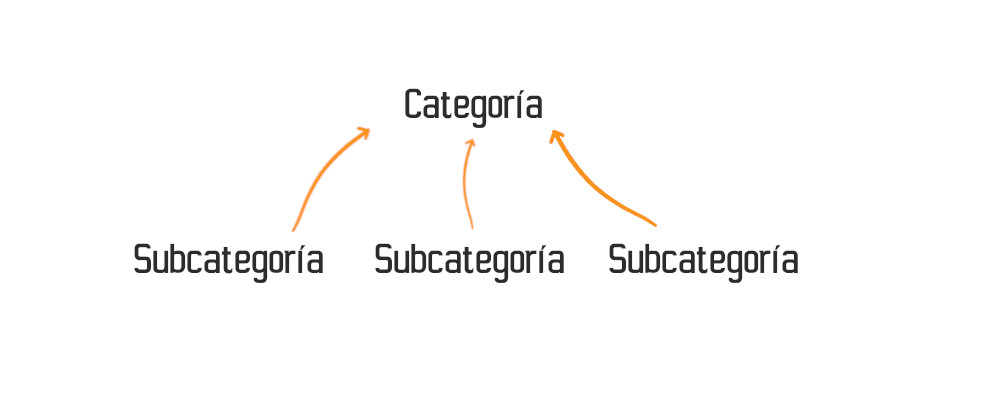
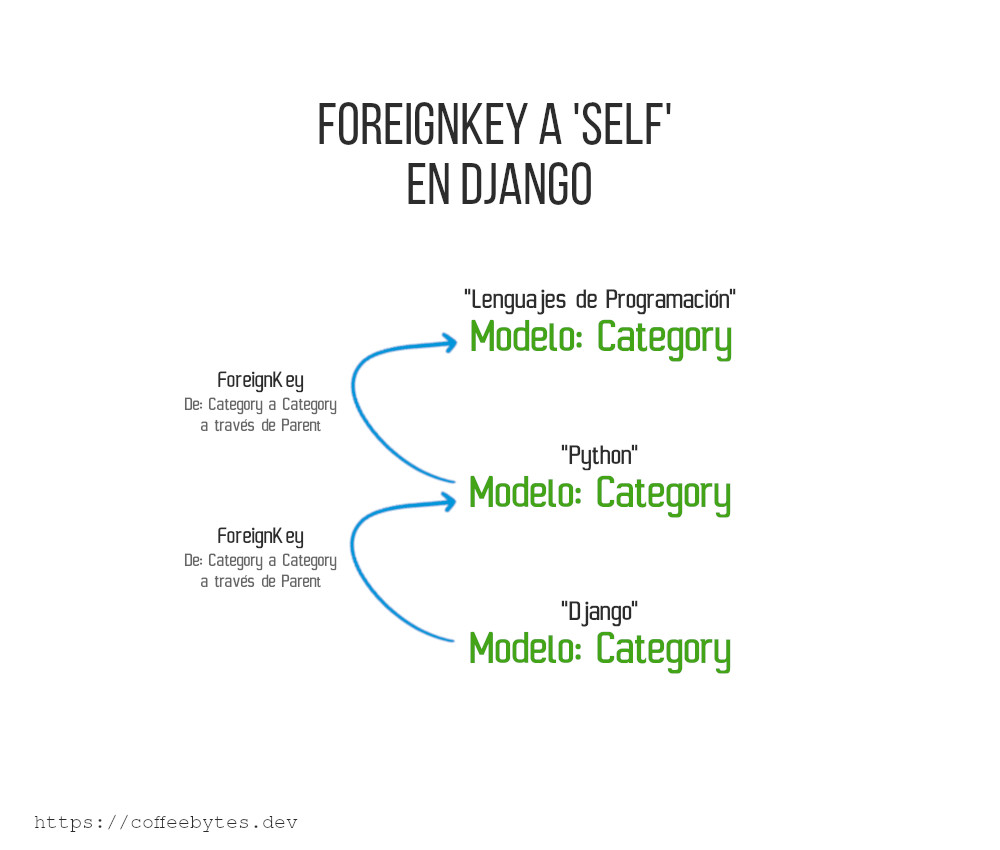

La agrupación por categorías es bastante recurrente en aplicaciones web, desde películas, cursos o cualquier otro recurso que presente una relación jerárquica hacía otro objeto. En Django existen diferentes maneras de modelar estas relaciones. Probablemente, la primera que se te vendrá a la mente será crear un objeto _categoria_, y luego relacionarlo por medio de una _ForeignKey_ con una _subcategoria_.

## Una subcategoría o nivel por modelo

A lo que me refería con una categoría o nivel por modelo es a algo como esto:

```python
# app/models.py
from django.db import models

class Category(models.Model):
    name = models.CharField(max_length=256)
    # otras propiedades

class SubCategory(models.Model):
    name = models.CharField(max_length=256)
    # otras propiedades
    category = models.ForeignKey(Category, related_name="subcategories", blank=True, null=True, on_delete=models.CASCADE)
```

Esta aproximación al problema de las jerarquias en Django luce bien a primera vista. La estructura que resultará será similar a esta:



### El problema de usar un modelo por categoría

Este esquema funcionará en situaciones donde las jerarquias no se aniden muy profundo, pero ¿qué pasa si esas subcategorías tienen a su vez subcategorías?

Imagínate una categoría de películas de terror, con una subcategoría de fantasmas que, a su vez, cuenta con una subcategoría de fantasmas en casa y esta, a su vez, una subcategoría de tipo de final.

Pues, añadimos una clase _SubSubCategoría_ ¿no? Pero... y si esas SubSubCategorías tienen a su vez subcategorías. ¿Ves a donde intento llegar?


Cada vez que necesites crear una subcategoría nueva tendrás que crear un nuevo modelo en el archivo _models.py_ de tu aplicación. Y no solo eso, sino una nueva tabla que probablemente solo cuente con unos cuantos registros. ¿Existe una aproximación mejor al problema? El [versátil ORM de Django](/por-que-deberias-usar-django-framework/) nos ofrece una solución bastante limpia.

## ForeignKey al mismo modelo en Django

Para simplificar el problema de las categorías en Django, creamos **un solo modelo, con una propiedad de tipo _ForeignKey_ o llave foránea que apunte al mismo objeto; es decir, a _self_**.

```python
# app/models.py
from django.db import models


class Category(models.Model):
    name = models.CharField(max_length=256)
    parent = models.ForeignKey(
        "self",
        related_name="subcategories",
        on_delete=models.CASCADE,
        blank=True,
        null=True,
    )
```

De esta manera tendremos una estructura similar a un grafo, donde cada nodo apunta hacía a otro.



Este nuevo acomodo nos permite crear tantas subcategorías como querramos, sin la necesidad de crear nuevos modelos. Para ello, simplemente asignamos la propiedad _parent_ a la instancia de clase _Category_ a la que querramos que pertenezca.

### Accediendo al mismo modelo en Django

Mira como funciona el _ForeignKey_ hacía _self_ en la práctica:

```python
from my_app.models import Category
categoria_padre = Category.objects.create(name="Lenguajes de Programacion")
subcategoria = Category.objects.create(name="Python")
subcategoria.parent = categoria_padre
# Guardamos en la base de datos
subcategoria.save()
```

Te explico lo que sucede. Primero creamos una categoría principal, y una subcategoría. Posteriormente, asignamos la propiedad _parent,_ de esta última, a la categoría principal. Y listo, guardamos.

Para finalizar, creemos una subsubcategoría para nuestra subcategoría

```python
subsubcategoria = Category.objects.create(name="Django")
subsubcategoria.parent = subcategoria
subsubcategoria.save()
```

Observa como hemos creado otra subsubcategoría (llamada Django), que proviene del mismo modelo que usamos en las otras dos. Para asignarla a una categoría, igualamos su propiedad _parent_ a la subcategoria que habiamos creado (llamada Python).

Como ya viste, un solo modelo nos permite agregar tantas subcategorías como querramos.

### Acceder a las subcategorías

Si examinamos la categoría padre, que creamos previamente, observaremos que cuenta con una lista de subcategorías, entre las que ya se encuentra nuestro subcategoría (Llamada Python).

Podemos acceder a ella como haríamos con cualquier otra relación de muchos a uno.

```python
categoria_padre.subcategories.all()
<QuerySet [<Category: Category object (2)>]>
categoria_padre.subcategories.all()[0].name
'Python'
```

### Ir de las subcategorías a las categorías

En cambio, si queremos ir "en reversa" desde la categoría más anidada, hasta la menos anidada, simplemente la vamos recorriendo; accedemos al padre o parent, y luego al padre o parent de la instancia que sigue y así tantas anidaciones como necesitemos.

```python
subsubcategoria.name
'Django'
subsubcategoria.parent.name
'Python'
subsubcategoria.parent.parent.name
'Lenguajes de Programacion'
```

## Otros recursos

- [Documentación oficial sobre el ForeignKey hacia self](https://docs.djangoproject.com/en/4.0/ref/models/fields/)
