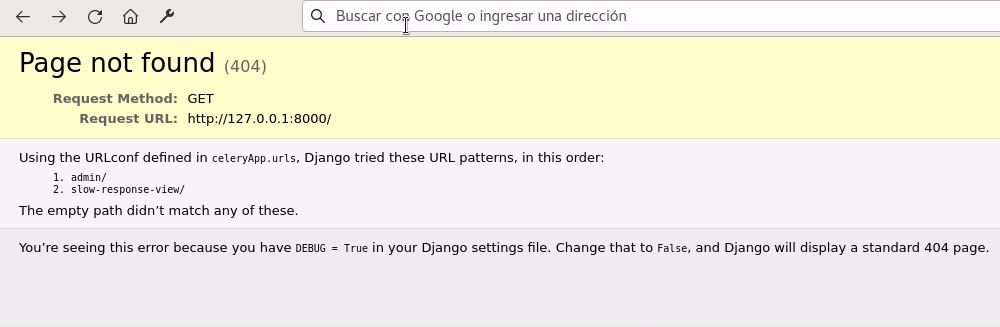
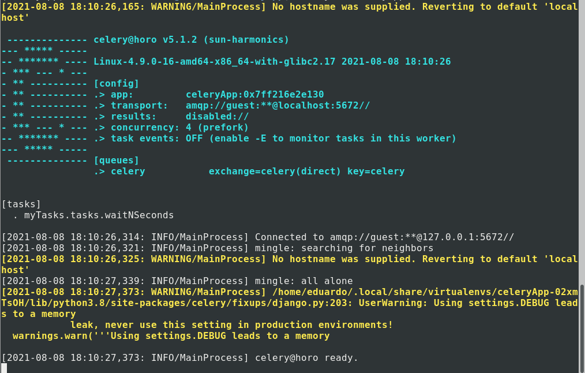
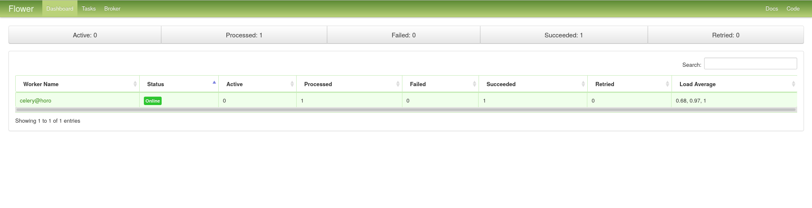

Celery, in combination with Django serve to solve a problem: the lack of asynchrony in our application. Sending an email, processing some file or responding to a third party service will keep our execution waiting for the task to finish and, as a consequence, our user waiting.

Using celery is one of the things you can do to [improve the performance of a Django application](/blog/is-your-django-application-slow-maximize-its-performance-with-these-tips/). And you can also create periodic tasks with celery and django.

Look at this example view:

```bash
from django.shortcuts import render
from django.http import JsonResponse
import time

def slowResponseView(request):
    time.sleep(3)
    return JsonResponse({"response": "ok"})
```

Notice how after accessing the url, **the answer does not appear until after 3 seconds**. During that time our application is busy. That _time.sleep()_ that causes the delay could represent an email sending, the waiting time to an external API, a very computationally expensive calculation or any other task that requires a long time to be performed.



The response to the url takes 3 seconds

Celery solves our problem, it sends those tasks to a queue so that they can be executed later, asynchronously, and the code can continue its execution.

That's right, you're probably thinking that celery has similarities with Javascript or Python's async await. However celery is much more robust and with many more features, such as scheduling periodic tasks (as in [cron and crontab in GNU/Linux](/blog/cron-and-crontab-schedules-recurring-tasks/)) and also monitoring them, but let's go by parts.

## Installation of celery

Let's install celery for this example, version 5.1.2

```bash
pipenv install "celery==5.1.2"
```

## Installing RabbitMQ

We will also need RabbitMQ, which will serve as an intermediary between django and celery sending messages and activating the workers of the latter to execute the tasks.

```bash
sudo apt install rabbitmq-server
```


Basic outline of RabbitMQ operation and cellery

After the above, check that RabbitMQ is running with the command systemctl, update-rc, systemE or whatever your system process manager is.

```bash
sudo systemctl status rabbitmq-server
● rabbitmq-server.service - RabbitMQ Messaging Server
   Loaded: loaded (/lib/systemd/system/rabbitmq-server.service; enabled; vendor preset: enabled)
   Active: active (running) since Sat 2021-08-07 15:45:21 CDT; 1min 47s ago
 Main PID: 27808 (rabbitmq-server)
```

When finished, RabbitMQ will be running in the background and celery will automatically detect it when running.

## Celery configuration

We are going to create a file called _celery.py_ at the same level as our configuration file.

And we will place the following code:

```python
# celeryApp/celery.py
import os
from celery import Celery

os.environ.setdefault('DJANGO_SETTINGS_MODULE', 'celeryApp.settings')
app = Celery('celeryApp')
app.config_from_object('django.conf:settings', namespace='CELERY')
app.autodiscover_tasks()
```

The top part is the imports, while at the bottom we create an environment variable that will store the address of the configuration file of our project. We name the app as _CeleryApp_, to be able to refer to it later, we indicate it to take the configuration of our configuration file and to discover automatically the tasks of each one of the applications that appear in INSTALLED_APPS.

This file that we have just created is an isolated file of our configuration, django will not load it automatically because it does not know it exists. We need it to load it when it runs, so a good place would be the _init__.py_ file in our project.

```python
# celeryApp/__init__.py
from .celery import app as celery_app
__all__ = ('celery_app',)
```

If we now run celery we will see that it runs and connects to RabbitMQ

```bash
celery -A celeryApp worker -l info
```

The _-A_ option, of App, tells celery the name of the application, i.e., the name we just assigned to it in the _celery.py_ file.



Celery running on the terminator. See how the transport option in [config] points to port 5672, characteristic of rabbitmq.

## Tasks in celery

To create a task we need a file called _tasks.py_ in our application, which will contain our functions, decorated with _@app.task_, and call its _delay()_ method in our views to execute them asynchronously.

### Creating a celery task in django

Next we are going to create a _tasks.py_ file in our application (not in the project) this is where we will place our time expensive tasks for celery to take care of them. To emulate a time expensive task I'm going to use Python's time library.

```python
# celeryApp/__init__.py
from celeryApp.celery import app
import time

@app.task
def waitNSeconds(n):
    time.sleep(n)
```

We import celeryApp app, the text we use to name our Celery app in the _celery.py._ file.

**Important**: In previous versions of celery the import was done directly from the celery object, adapt the import to your version of celery.

Following the creation of that file our folder structure will be similar to this.

```python
|-- celeryApp
|   |-- asgi.py
|   |-- celery.py
|   |-- __init__.py
|   |-- __pycache__
|   |   |-- celery.cpython-38.pyc
|   |   `-- __init__.cpython-38.pyc
|   |-- settings.py
|   |-- urls.py
|   `-- wsgi.py
|-- db.sqlite3
|-- manage.py
|-- myTasks
|   |-- admin.py
|   |-- apps.py
|   |-- __init__.py
|   |-- migrations
|   |   `-- __init__.py
|   |-- models.py
|   |-- tasks.py
|   |-- tests.py
|   `-- views.py
|-- Pipfile
`-- Pipfile.lock
```

### Execute tasks in celery

The decorator task that comes with the app will tell Celery to process this task.

With the _tasks.py_ file created, we modify the views file of our application.

```python
# celeryApp/__init__.py
from django.http import JsonResponse
from .tasks import waitNSeconds

def slowResponseView(request):
    waitNSeconds.delay(3)
    return JsonResponse({"response": "ok"})
```

We import the task we have just created and execute its delay method, passing it our argument (the number of seconds to wait). This will tell celery to execute our task asynchronously.

If we now access the view we just created, we will see that it **returns the JSON response immediately, without waiting the 3 seconds**. While in the terminal appear the messages of the task that is being processed by Celery

Celery takes care of our task, so that it does not interrupt the flow of our Django application.


Celery handling the task that is executed with each web request in an asynchronous manner.

For more details on how to connect celery to Django remember that you can check the [celery official documentation](https://docs.celeryproject.org/en/stable/django/first-steps-with-django.html)

## Task monitoring with Flower

Celery has several complementary applications that allow you to increase control over your tasks, for example flower, which is in charge of monitoring celery tasks.

Flower is simple to use, just install it.

```bash
pipenv install flower
```

And, subsequently, pass it to our celery application as if it were an argument.

```bash
celery -A celeryApp flower
```

After executing the Flower command it will be available on port 5555.

Flower will show us the active tasks, processed, with failure and information of each one of them.



Flower main panel available on port 5555

We will also be able to see specific information for each task, such as its identifier, arguments, time and execution time.


Flower shows us the details of each task

See the [flower documentation](https://flower.readthedocs.io/en/latest/) for more details.