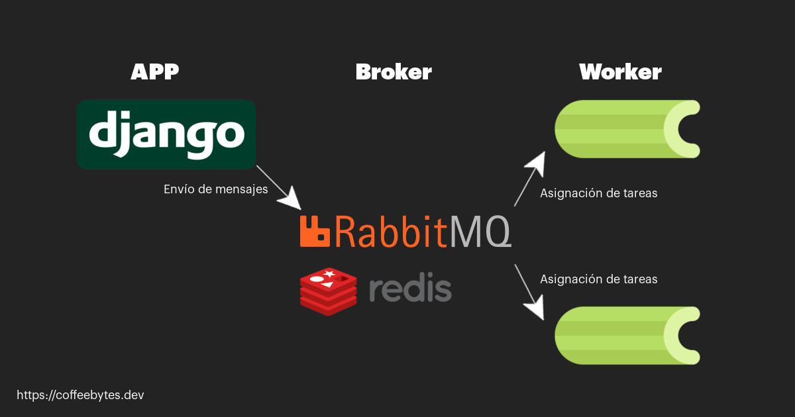
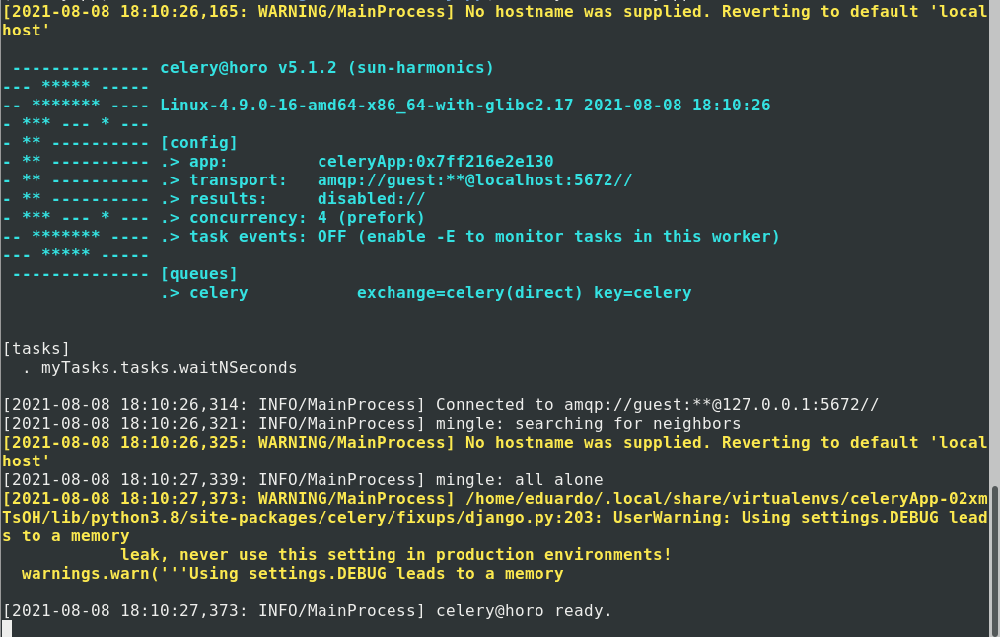
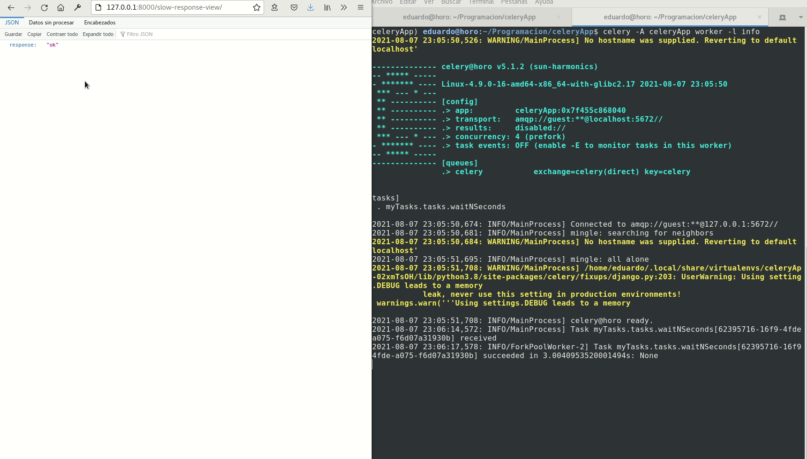
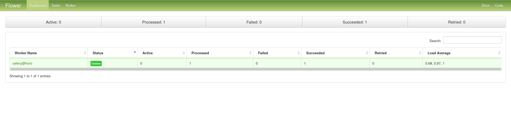
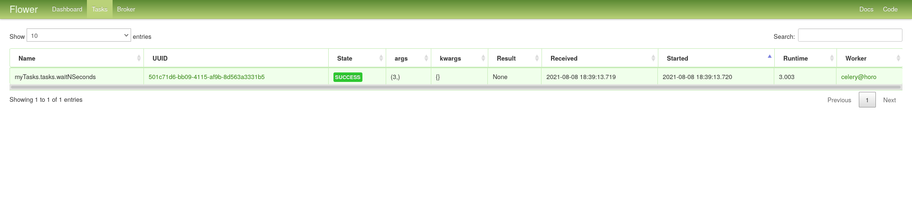

Celery, en combinación con Django sirven para resolver un problema: la falta de asincronía en nuestra aplicación. El envío de un correo electrónico, el procesamiento de algún archivo o la respuesta al servicio de un tercero mantendrán nuestra ejecución en espera de que la tarea se finalice y, como consecuencia, a nuestro usuario esperando.

Usar celery es una de las cosas que puedes hacer para [mejorar el rendimiento de una aplicación en Django](/es/tu-aplicacion-de-django-va-lenta-maximiza-su-rendimiento-con-estos-tips/). Y también puedes crear tareas periódicas con celery y django.

Mira este ejemplo de vista:

```bash
from django.shortcuts import render
from django.http import JsonResponse
import time

def slowResponseView(request):
    time.sleep(3)
    return JsonResponse({"response": "ok"})
```

Observa como tras acceder a la url, **la respuesta no aparece hasta transcurridos los 3 segundos**. Durante ese tiempo nuestra aplicación está ocupada. Ese _time.sleep()_ que causa el retraso podría representar un envío de correo electrónico, el tiempo de espera a una API externa, un cálculo muy costoso a nivel computacional o cualquier otra tarea que requiera mucho tiempo en llevarse a cabo.


La respuesta a la url demora 3 segundos

Celery resuelve nuestro problema, manda esas tareas a una cola para que se ejecuten posteriormente, de manera asíncrona, y el código pueda continuar su ejecución.

Así es, de seguro estás pensando que celery guarda similitudes con el async await de Javascript o Python. Sin embargo celery es mucho más robusto y con muchas más funcionalidades, tales como la programación de tareas periódicas (como en [cron y crontab en GNU/Linux](/es/cron-y-crontab-programa-tareas-periodicas/)) y además el monitoreo de estas, pero vamos por partes.

## Instalación de celery

Vamos a instalar celery para este ejemplo, la versión 5.1.2

```bash
pipenv install "celery==5.1.2"
```

## Instalando RabbitMQ

También necesitaremos RabbitMQ, que se encargará de servir como intermediario entre django y celery enviando mensajes y activando a los workers de este último para ejecutar las tareas.

```bash
sudo apt install rabbitmq-server
```



Esquema básico del funcionamiento de RabbitMQ y celery

Tras lo anterior, comprueba que RabbitMQ se está ejecutando con el comando systemctl, update-rc, systemE o cualquiera que sea el administrador de procesos de tu sistema.

```bash
sudo systemctl status rabbitmq-server
● rabbitmq-server.service - RabbitMQ Messaging Server
   Loaded: loaded (/lib/systemd/system/rabbitmq-server.service; enabled; vendor preset: enabled)
   Active: active (running) since Sat 2021-08-07 15:45:21 CDT; 1min 47s ago
 Main PID: 27808 (rabbitmq-server)
```

Al finalizar, RabbitMQ estará corriendo en el fondo y celery lo detectará automáticamente cuando se ejecute.

## Configuración de celery

Vamos a crear un archivo llamado _celery.py_ en el mismo nivel que nuestro archivo de configuraciones.

Y colocaremos el siguiente código:

```python
# celeryApp/celery.py
import os
from celery import Celery

os.environ.setdefault('DJANGO_SETTINGS_MODULE', 'celeryApp.settings')
app = Celery('celeryApp')
app.config_from_object('django.conf:settings', namespace='CELERY')
app.autodiscover_tasks()
```

La parte de arriba son las importaciones, mientras que en la parte de abajo creamos una variable de entorno que guardará la dirección de el archivo de configuración de nuestro proyecto. Nombramos la app como _CeleryApp_, para poder referirnos a ella más adelante, le indicamos que tome la configuración de nuestro archivo de configuraciones y que descubra automáticamente las tareas de cada una las aplicaciones que aparecen en INSTALLED\_APPS.

Este archivo que acabamos de crear es un archivo aislado de nuestra configuración, django no va a cargarlo automáticamente pues no sabe que existe. Necesitamos que lo cargue cuando se ejecute, por lo que un buen lugar sería el archivo _\_\_init\_\_.py_ de nuestro proyecto.

```python
# celeryApp/__init__.py
from .celery import app as celery_app
__all__ = ('celery_app',)
```

Sí ahora ejecutamos celery veremos que corre y se conecta a RabbitMQ

```bash
celery -A celeryApp worker -l info
```

La opción _\-A_, de App, le indica a celery el nombre de la aplicación, es decir, el nombre que le acabamos de asignar en el archivo _celery.py_



Celery ejecutándose en la termina. Mira como la opción transport en \[config\] apunta al puerto 5672, característico de rabbitmq

## Tasks o tareas en celery

Para crear una tarea necesitamos un archivo llamado _tasks.py_ en nuestra aplicación, que contendrá nuestras funciones, decoradas con _@app.task_, y llamar a su método _delay()_ en nuestras vistas para ejecutarlas asíncronamente.

### Crear una tarea de celery en django

A continuación vamos a crear un archivo _tasks.py_ en nuestra aplicación (no en el proyecto) aquí es donde colocaremos nuestras tareas costosas en tiempo para que celery se encargue de ellas. Para emular una tarea costosa en tiempo voy a usar la librería time de Python.

```python
# celeryApp/__init__.py
from celeryApp.celery import app
import time

@app.task
def waitNSeconds(n):
    time.sleep(n)
```

Importamos app de celeryApp, el texto que usamos para nombrar nuestra app de Celery en el archivo _celery.py._

**Importante**: En versiones anteriores de celery la importación se hacía directo desde el objeto celery, adecua la importación a tu versión de celery.

Tras la creación de ese archivo nuestra estructura de carpetas será similar a esta

```python
|-- celeryApp
|   |-- asgi.py
|   |-- celery.py
|   |-- __init__.py
|   |-- __pycache__
|   |   |-- celery.cpython-38.pyc
|   |   `-- __init__.cpython-38.pyc
|   |-- settings.py
|   |-- urls.py
|   `-- wsgi.py
|-- db.sqlite3
|-- manage.py
|-- myTasks
|   |-- admin.py
|   |-- apps.py
|   |-- __init__.py
|   |-- migrations
|   |   `-- __init__.py
|   |-- models.py
|   |-- tasks.py
|   |-- tests.py
|   `-- views.py
|-- Pipfile
`-- Pipfile.lock
```

### Ejecutar tareas en celery

El decorador task que viene de app se encargará de decirle a Celery que procese esta tarea.

Con el archivo _tasks.py_ creado, modificamos el archivo de vistas de nuestra aplicación.

```python
# celeryApp/__init__.py
from django.http import JsonResponse
from .tasks import waitNSeconds

def slowResponseView(request):
    waitNSeconds.delay(3)
    return JsonResponse({"response": "ok"})
```

Importamos el task que acabamos de crear y ejecutamos su método delay, pasándole nuestro argumento (la cantidad de segundos a esperar). Esto se encargará de decirle a celery que ejecute nuestra tarea de manera asíncrona.

Si ahora accedemos a la vista que acabamos de crear, veremos que nos **devuelve la respuesta en JSON inmediatamente, sin esperar los 3 segundos**. Mientras que en la terminal aparecen los mensajes de la tarea que está siendo procesada por Celery

Celery se encarga de nuestra tarea, de manera que no interrumpa el flujo de nuestra aplicación en Django.



Celery manejando la tarea que se ejecuta con cada petición web de manera asíncrona.

Para más detalles sobre como conectar celery con Django recuerda que puedes revisar la [documentación oficial de celery.](https://docs.celeryproject.org/en/stable/django/first-steps-with-django.html)

## Monitoreo de tareas con Flower

Celery cuenta con varias aplicaciones complementarias que permiten aumentar el control sobre sus tareas, por ejemplo flower, que se encarga de monitorear las tareas de celery.

Flower es muy sencillo de usar, basta con instalarlo

```bash
pipenv install flower
```

Y, posteriormente, pasárselo a nuestra aplicación de celery como si fuera un argumento.

```bash
celery -A celeryApp flower
```

Tras ejecutar el comando Flower estará disponible en el puerto 5555.

Flower nos mostrará las tareas activas, procesadas, con fallo e información de cada una de ellas.



Panel principal de Flower disponible en el puerto 5555

También podremos ver información específica de cada tarea, como su identificador, los argumentos, la hora y el tiempo de ejecución.



Flower nos muestra los detalles de cada tarea

Revisa la [documentación de flower](https://flower.readthedocs.io/en/latest/) para más detalles.
