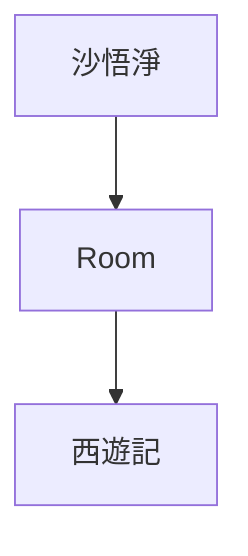
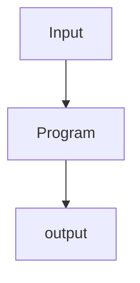

Chat GPT is on everyone's lips, some are afraid of it, because of its [ability to solve code problems](/en/i-test-chatgpt-with-codewars-coding-challenges/) others are excited about its potential to change the world of work. Today I leave aside the economic consequences part to focus on the philosophical aspect of Chat GPT and reflect a bit on the question: does Chat GPT really understand the language, is Chat GPT conscious?

> What a typical “learning machine” does, is finding a mathematical formula, which, when applied to a collection of inputs (called “training data”), produces the desired outputs. Adriy Burkov

## John Searle's The Chinese Room

John Searle, was a scientist who wondered whether a computer can really understand language. And for this he designed a riveting thought experiment:

A human, inside a room completely isolated from the outside world, with a set of instructions to process symbols in Chinese and return a response. It should be noted that the person inside the room does not know the Chinese language and simply follows the set of instructions given to him, i.e., he **does not understand the text coming in, nor the text going out**.

Can you notice the similarities with a computer? They are quite obvious; there is an input, an output and a black box or computer program, the details of which would escape those outside this simplified little system.

According to Searle, to the people outside the room, whatever is inside seems to understand Chinese perfectly. However, we know that the person inside is just following a set of instructions, as complex as we like, but which **does not involve an understanding of language**, but a mechanical process. According to Searle, this situation is analogous to the operation of a computer.

Extrapolating the above to ChatGPT; although a language model may produce responses that appear coherent and relevant, there is no evidence that it actually understands the language or is aware of its meaning. ChatGPT may be following the most complex algorithm in existence but, according to Searle, **there is no more awareness of the process there than we would find in the most sophisticated mechanical clock.**

But then what makes the difference between a real intelligence and a mechanical process? is there such a difference?

## Are consciousness and artificial intelligence related?

The highest representative of intelligence on earth is the human being (or at least our inflated ego tells us that), and it also happens that the human being is a living entity with consciousness. This leads us to the inevitable question: is a living being with consciousness necessary to have intelligence, or perhaps it is the other way around?

### Signs of Intelligence with conscience

Some argue that consciousness and intelligence are related and that we would even have [a gradient of consciousness as we advance in the complexity and intelligence of organisms](http://writing.rochester.edu/celebrating/2017/NAShonorable.pdf). They give the label "conscious" to higher animals such as dolphins, orangutans, crows and other organisms that show traits of intelligence.

While others go further by saying that a system becomes more conscious the more intelligent it becomes, perhaps we could consider the example of [Blake Lemoine, who claimed that Google's artificial intelligence model had become conscious](https://www.bbc.com/mundo/noticias-61787944), or Giulio Tononi's integrated information theory, which proposes that consciousness is generated when a system is able to incorporate information and unify it, and that this level of consciousness (called Φ) can be calculated for any system.

### Signs of Intelligence without conscience

Likewise, there are positions that defend that intelligence does not necessarily depend on consciousness, but that it can exist in systems that do not have subjective experience. For example, it is sufficient to cite Alpha Go and other computer programs that are capable of responding to complex stimuli, without existing beyond the game for which they were programmed, or [sleepwalkers, who can show signs of intelligence even when they are not conscious](https://publications.aap.org/pediatrics/article-abstract/111/1/e17/28494/Sleepwalking-and-Sleep-Terrors-in-Prepubertal?redirectedFrom=fulltext).

But even if human beings have unconscious processes capable of existing without the manifestation of consciousness... there must be something more than simple mechanical action, after all animals are much more complex than machines aren't they?

## Biological automatons

Sometimes we believe that only machines have a mechanical behavior and that any living being would be able to respond in a very different way than a machine would, with more versatility and adapting to changes, but is this always the case?

In the book "An Eternal Graceful Loop" by Douglas R. Hofstader. The author cites an [experiment in which a sphex wasp is tricked into bringing a cricket within the confines of a burrow up to 40 times](https://jhjeong.mindconnect.cc/Texts/sphex.html). Just as if it were a computer program, this wasp gets stuck in an infinite loop from which it cannot escape, how different is this from a computer program that, after the same input, generates the same output?

This experiment made me question whether some living beings are nothing more than biological automatons and also where is the turning point at which a living being ceases to be an automaton and becomes conscious, are there gradients of consciousness? And, if so, what does consciousness look like beyond what we humans experience? If consciousness exists as a macroscopic manifestation, is it deterministic, or does it belong to the quantum world of indeterminacy? I don't know and I don't think the truth has yet to pick a winner.

## What to read or watch to learn more about artificial intelligence and consciousness?

Consciousness is a complex subject that cannot be addressed in a few lines, not for nothing is it known as the "hard problem", but if these brushstrokes left you wanting more, I leave you with my list of favorite resources to delve into this complex subject.

* An eternal and graceful loop by Douglas R. Hofstader: the author delves into the subject of self-reference and develops the question: can a system understand itself?
* The Emperor's New Mind by Sir Roger Penrose: the author sets the context of the laws of the universe and analyzes whether consciousness and intelligence are related and whether they have a deterministic or non-deterministic character.
* [Brains, Minds, and Machines: Consciousness and Intelligence](https://infinite.mit.edu/video/brains-minds-and-machines-consciousness-and-intelligence): MIT talk, where the topics of brains, consciousness, intelligence and machines are developed. Radically underrated; 7000 views on youtube alone? really?
* [Can a program be alive?](https://www.youtube.com/watch?v=mC_KQC1gtWQ) small video essay where one of my favorite youtubers develops the issue of whether a computer program can be alive.
* [The connection between intelligence and conciousness](http://writing.rochester.edu/celebrating/2017/NAShonorable.pdf)