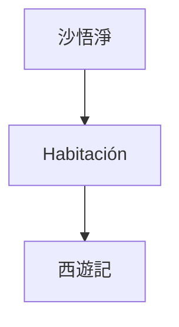
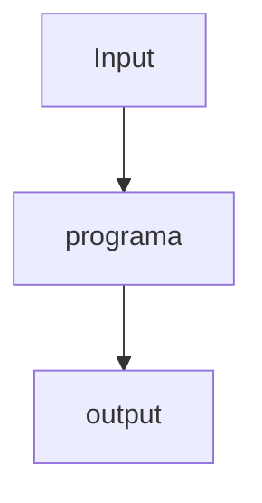
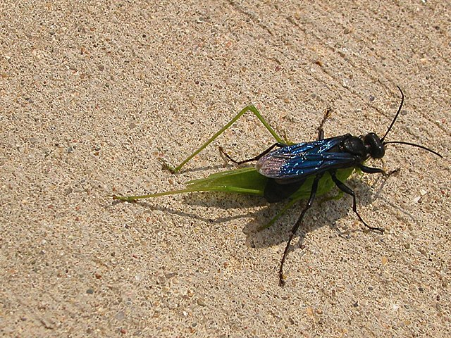

---
aliases:
- /chat-gpt-y-la-habitacion-china-de-searle
- /chat-gpt-la-habitacion-china-de-searle-y-la-conciencia
authors:
- Eduardo Zepeda
categories:
- Inteligencia artificial
- Opiniones
coverImage: images/chat-gpt-y-la-habitacion-china.jpg
date: '2023-04-19'
description: Una breve introducción al tema de conciencia, inteligencia artifcial,
  chatGPT y la habitación china de John Searle
keywords:
- inteligencia artificial
- automatas
- ciencias de la computación
- conciencia
title: Chat Gpt, La Habitacion China De Searle y la conciencia
---

Chat GPT y la inteligencia artificial están en boca de todos, algunos le tienen miedo, por su [capacidad para resolver problemas de código](/es/pongo-a-prueba-a-chatgpt-con-desafios-de-codigo-de-codewars/) a otros les entusiasma el potencial que tiene para cambiar el mundo laboral y sus numerosas aplicaciones; tales como el [desarrollo de nuevos fármacos](/es/inteligencia-artificial-y-diseno-de-farmacos-y-medicamentos-para-desarrolladores/). Hoy dejo de lado las consecuencias económicas de la IA y la pregunta sobre si [estamos en una burbuja de IA o no](/es/el-auge-y-la-caida-de-la-burbuja-de-ai/), para centrarme en el aspecto filosófico de Chat GPT y reflexionar un poco sobre la pregunta: ¿entiende realmente Chat GPT el lenguaje, es consciente Chat GPT?

>What a typical “learning machine” does, is finding a mathematical formula, which, when applied to a collection of inputs (called “training data”), produces the desired outputs -The Hundred-Page Machine Learning Book, Adriy Burkov

## La habitación china de John Searle

John Searle, fue un científico que se preguntó si una computadora puede entender realmente el lenguaje. Y para esto diseñó un experimento mental muy interesante:

Un humano, dentro de una habitación completamente aislada del mundo exterior, con una serie de instrucciones para procesar símbolos en chino y devolver una respuesta. Hay que resaltar que la persona en el interior de la habitación desconoce el idioma chino y se limita a seguir la serie de instrucciones que le fueron otorgadas, es decir, **no comprende el texto que entra, ni el que sale**.

¿Puedes notar las similitudes con una computadora? Son bastante obvias; hay un input o entrada, un output o salida y una caja negra o programa informático, cuyos detalles del funcionamiento escaparían para los que se encuentran afuera de este pequeño sistema simplificado.

De acuerdo a Searle, para las personas que están afuera de la habitación, pareciera que lo que sea que esté dentro entiende perfectamente el idioma chino. Sin embargo, nosotros sabemos que la persona en el interior solo está siguiendo un set de instrucciones, tan complejísimo como nosotros querramos, pero que **no implica una comprensión del lenguaje**, sino un proceso mecánico. Según Searle, esta situación es análoga al funcionamiento de una computadora.

Extrapolando lo anterior a ChatGPT; aunque un modelo de lenguaje puede producir respuestas que parecen coherentes y relevantes, no hay evidencia de que comprenda realmente el lenguaje o tenga conciencia de su significado. ChatGPT puede estar siguiendo el algoritmo más complejo existente pero, según Searle, no hay más conciencia del proceso ahí que la que encontrariamos en el reloj mecánico más sofisticado. 

¿Pero entonces que marca la diferencia entre una inteligencia real y un proceso mecánico? ¿existe dicha diferencia?

## ¿Están la conciencia y la inteligencia artificial relacionadas?

El máximo representante de la inteligencia en la tierra es el ser humano (o al menos nuestro ego inflado nos dice eso), y también sucede que el ser humano es un ente vivo con conciencia. Esto nos dirige a la inevitable pregunta: ¿es necesaria un ser vivo con conciencia para tener inteligencia? ¿o quizás es al revés?

### Inteligencia con conciencia

Algunos argumentan que la conciencia y la inteligencia están relacionados y que incluso tendriamos [un gradiente de conciencia mientras avanzamos en la complejidad e inteligencia de los organismos](http://writing.rochester.edu/celebrating/2017/NAShonorable.pdf). Dotando del calificativo "consciente" a animales superiores como delfines, orangutanes, cuervos y otros organismos que muestran rasgos de inteligencia.

Mientras que otros van más alla al decir que un sistema se vuelve más consciente mientras más inteligente se vuelve, quizás podriamos considerar el ejemplo de [Blake Lemoine, que aseguraba que el modelo de inteligencia artificial de Google había cobrado conciencia](https://www.bbc.com/mundo/noticias-61787944), o la teoría de la información integrada, de Giulio Tononi, que propone que la conciencia se genera cuando un sistema es capaz de incorporar información e unificarla, y que este nivel de conciencia (llamado Φ) puede calcularse para cualquier sistema.

### Inteligencia sin conciencia

Así mismo, existen posiciones que defienden que la inteligencia no depende necesariamente de la conciencia, sino que puede existir en sistemas que no tienen experiencia subjetiva. Para ejemplo basta citar a Alpha Go y otros programas informáticos que son capaces de responder a estímulos muy complejos, sin existir más allá del juego para el que fueron programados, o a los [sonámbulos, que pueden mostrar signos de inteligencia aún no estando conscientes](https://publications.aap.org/pediatrics/article-abstract/111/1/e17/28494/Sleepwalking-and-Sleep-Terrors-in-Prepubertal?redirectedFrom=fulltext).

Pero aunque los seres humanos tengan procesos inconscientes capaces de existir sin la manifestación de la conciencia... debe de existir algo más que una simple acción mecánica, después de todo los animales son mucho más complejos que las máquinas ¿no? 

## Autómatas biológicos

A veces creemos que solo las máquinas tienen un comportamiento mecánico y que cualquier ser vivo sería capaz de responder de manera muy diferente a la que haría una máquina, con más versatilidad y adaptándose a los cambios, pero, ¿es siempre así? 

En el libro "Un eterno y grácil bucle" de Douglas R. Hofstader. El autor cita un [experimento en el que una avispa sphex es engañada para acercar un grillo en a los límites de una madriguera hasta 40 veces](https://jhjeong.mindconnect.cc/Texts/sphex.html). Tal cual como si fuera un programa de computadora, esta avisa queda atorada en un bucle infinito del que no puede escapar, ¿qué tan diferente es esto de un programa informático que, tras el mismo input, genera el mismo output?

Este experimento me hizo cuestionarme sobre si algunos seres vivos no son otra cosa que autómatas biológicos y también sobre donde está el punto de inflexión en el que un ser vivo deja de ser un autómata y se vuelve consciente, ¿existen gradientes de conciencia? Y, si es así, ¿como se ve siente conciencia más allá de la que experimentamos los humanos? Si la conciencia existe como una manifestación macroscópica, ¿es determinista? ¿o pertenece al mundo cuántico de la indeterminación? No lo sé y creo que la verdad aún no elige un ganador.

## ¿Qué leer o ver para saber más de inteligencia artificial y conciencia?

La conciencia es un tema bastante complejo que no puede abordarse en unas cuentas lineas, no por nada se le conoce como el "problema duro", pero si estas pinceladas te dejaron con ganas de más, te dejo mi lista de recursos favoritos para ahondar este tema tan complejo.

* Un eterno y grácil bucle de Douglas R. Hofstader: el autor profundiza en el tema de la autoreferencia y desarrolla la pregunta: ¿puede un sistema comprenderse así mismo?
* La nueva mente del emperador de Sir Roger Penrose: el autor establece el contexto de las leyes del universo y analiza si la conciencia y la inteligencia están relacionadas y si estas tienen un carácter determinista o no determinista.
* [Brains, Minds, and Machines: Consciousness and Intelligence](https://infinite.mit.edu/video/brains-minds-and-machines-consciousness-and-intelligence): plática del MIT, donde se desarrollan los temas de cerebros, conciencia, inteligencia y máquinas. Radicalmente infravalorada; ¿7000 vistas en youtube nada más? ¿de verdad?
* [¿Puede un programa estar vivo?](https://www.youtube.com/watch?v=mC_KQC1gtWQ) pequeño videoensayo donde uno de mis youtubers favoritos desarrolla el tema de si un programa informático puede estar vivo.
* [The connection between intelligence and conciousness](http://writing.rochester.edu/celebrating/2017/NAShonorable.pdf)