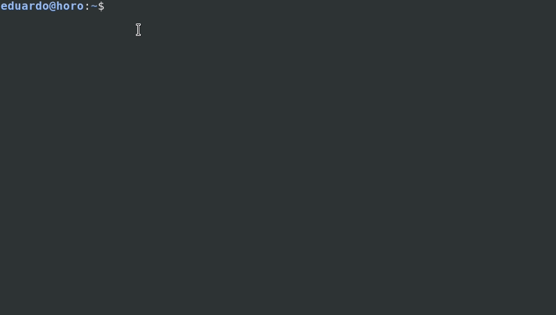

Existen muchos comandos de linux basicos, desde aquellos que te dicen cual es tu usuario, hasta otros que te permiten correr y programar servicios periódicamente. A continuación voy a enunciar los comandos que yo suelo utilizar frecuentemente, así como alguna combinación o característica peculiar de alguno de estos que sea digna de mencionar. Intentaré hacerlo de la manera más simple posible y sin tratar de complicar demasiado el uso de los comandos.

Para estos ejemplos uso [Debian 9](https://www.debian.org/index.es.html), por lo que si algún comando no te aparece toma en cuenta que puede deberse a diferencias con tu distribución de GNU/Linux.

Otra cosa, lo que la mayoría de las personas conocen como Linux, a secas, es en realidad GNU/Linux, sin embargo por motivos de SEO y simplicidad muchas personas usan GNU/Linux o Linux indistintamente, lo cual pretendo hacer yo también. Pero ten en mente esto cuando leas esta u otras entradas.

Entra aquí para la [segunda parte de esta serie de comandos](https://coffeebytes.dev/comandos-de-gnu-linux-que-deberias-conocer-2/) y acá para [la tercera parte de esta serie.](https://coffeebytes.dev/comandos-de-gnu-linux-que-deberias-conocer-tercera-parte/)

## Pequeños tips de la terminal de Linux

### Usa tab para completar comandos

Antes de empezar con los comandos quiero mencionar un par de pequeños tips o funcionalidades. La terminal de GNU/Linux es muy amigable, basta con escribir las primeras letras de un comando, archivo o carpeta que se encuentre en la carpeta actual y luego presionar la tecla TAB para que el sistema complete automáticamente el comando, nombre del archivo o carpeta.

Si hay un conflicto basta con presionar dos veces la tecla TAB y nos mostrará las opciones disponibles. Una función perfecta para los perezosos que no nos gusta teclear innecesariamente.


### Presiona arriba para acceder a comandos anteriormente ejecutados

Mientras nos encontremos en la terminal, si presionamos la tecla arriba de nuestro pad GNU/Linux nos mostrará el último comando que ejecutamos. Una función ideal para esos momentos cuando repetimos el mismo comando una y otra vez, esperando que, mágicamente, cambie el resultado.


### Usa CTRL + C para cancelar interrumpir procesos de la terminal.

Si cometimos alguna tontería como ejecutar un bucle infinito, o simplemente queremos detener algo que ejecutamos, usaremos CTRL + C, sí, como si fueras a hacer un copy paste, pero con la terminal abierta. Esto cancelará la ejecución del comando.



Una vez explicado esto empecemos con los comandos.

## man

El comando man (MANual) es el que yo considero **el más importante de todos los comandos comunes**, por eso lo coloco aquí primero. ¿La razón? pues este comando muestra el manual de uso del comando que le pongas por delante. Con este comando tienes acceso a toda la documentación del comando que elijas. Y, consecuentemente, puedes aprender el uso básico de prácticamente cualquier comando que tenga un manual.

Recuerda que la mayoría de los comandos que enuncio en esta publicación poseen un manual, por lo que puedes ver la totalidad de las opciones que ofrecen utilizando este comando.

Por ahora prueba usándolo sobre si mismo. Sí, haremos un inception del comando man:

```bash
man man
 nos muestra el manual del comando man
man grep
 nos muestra el manual del comando grep
```

## whatis

Nos muestra una pequeña descripción del comando que le pongamos enseguida. Es la versión **super resumida** de man.

```bash
whatis man
man (7)              - macros para formatear páginas del manual
man (1)              - una interfaz de los manuales de referencia electrónicos
```

## grep

El comando grep (_Global Regular Expression Print_) busca expresiones regulares coincidentes en los archivos. Si no sabes que son las expresiones regulares puedes usarlo con texto común y corriente entre comillas, incluso así es bastante útil. Este comando se vuelve especialmente útil cuando queremos encontrar texto en una gran cantidad de archivos, sobre todo usándolo en combinación con el resultado de otros comandos.

```bash
grep "texto a buscar" archivo
 busca un trozo de texto o expresión regular en un archivo 
grep -r "texto a buscar" .
 busca un trozo de texto recursivamente en los archivos del directorio actual y sus subdirectorios
man man | grep "texto a buscar"
 utilizamos el caracter pipe "|", seguido de grep para buscar un trozo de texto en los resultados del comando man
```

## history

History nos muestra los comandos que hemos utilizado, de manera numerada, con los más recientes hasta abajo y los más antiguos hasta arriba. Hay una manera más sencilla de buscar comandos sobre [la que puedes leer aquí.](https://coffeebytes.dev/como-encontrar-un-comando-ejecutado-anteriormente-en-gnu-linux/)

```bash
history
1920 cat archivo.txt
1921 ls -la
```

## clear

¿Qué pasa si queremos darle una pequeña limpieza a nuestra terminal para tener más claridad al escribir el código? Clear borra el contenido de la terminal y nos deja una terminal completamente limpia.

```bash
clear

 limpia todo el contenido anterior de la terminal
```

## pwd

Proveniente de las siglas en inglés "_Print Working Directory_", que significan "imprime el directorio de trabajo", este comando nos imprime el directorio desde donde lo estemos ejecutando.

```bash
pwd
/home/tunombre
```

## ls

Cuando necesitamos mostrar los archivos y directorios en el directorio actual este comando es la solución. Podemos usarlo para ver los permisos, usuarios y grupos a quienes pertenece un archivo.

```bash
ls
 nos lista los directorios y archivos en el directorio de trabajo
ls -l
 lista los permisos, el tamaño, grupo y usuario al que pertenecer los archivos

ls -la
 lo mismo que arriba pero incluye además los archivos ocultos 
```

## file

File nos arroja información del tipo de archivo que le pasemos como argumento. Funciona incluso para archivos con extensión incorrecta.

```bash
file archivo.txt 
archivo.txt: ASCII text
```

## cd

Este comando es uno de los más utilizados. Sirve para cambiar de directorio, puede leerse como "_change directory_", que significa "cambia de directorio" en español.

```bash
cd nombre_de_directorio
 # nos cambia a un directorio existente desde donde ejecutamos el comando
 
cd ..
 # retrocede un nivel de directorios
```

## cat

Este comando sirve para concatenar el contenido de un archivo y mostrarlo en pantalla.

Existe una herramienta que ofrece más funciones que cat, checa mi [entrada donde hablo sobre bat para conocerla.](https://coffeebytes.dev/conoce-bat-el-cat-con-resaltado-de-sintaxis/)

```bash
cat archivo
 # nos mostrará el contenido del archivo
```

## tail

El comando tail, proveniente de "_cola_" en inglés nos imprime las últimas diez lineas de un archivo. Ideal para leer el contenido de logs.

```bash
tail archivo
ultimas diez lineas
```

## head

Similar al anterior, el comando head, proveniente de "_cabeza_" en inglés, nos imprime las primeras diez lineas de un archivo.

```bash
head archivo
primeras diez lineas
```

## touch

Este comando crea un archivo en el directorio donde lo estamos ejecutando.

```bash
touch archivo.py
 # crea un archivo llamado archivo.py
```

## rm

Derivado de la palabra "_ReMove"_ en inglés, este comando elimina uno o varios archivos. Es frecuentemente usado con su opción '-r', que borra de manera recursiva los archivos.

```bash
rm archivo_a_eliminar
 elimina un archivo llamado archivo_a_eliminar
rm -rf *
 borra todos los archivos del directorio de trabajo.
```

A veces queremos tener la seguridad de no borrar un archivo sin querer, podemos agregar la opción -i para que nos pregunte antes de borrar un archivo.

```bash
rm -i archivo_a_eliminar.txt
 rm: ¿borrar el fichero regular vacío 'archivo_a_eliminar.txt'? (s/n) 
```

### Ten cuidado con el comando rm

Otra cosa importante, ¿recuerdas cuando los internautas engañaban a las personas para que borraran sus carpetas system32 en windows, dejando sus sistemas inservibles? Bien pues hay un equivalente en GNU/Linux, es el comando rm, seguido de la opción -rf, usada para borrar recursivamente y sin pedir confirmación y a continuación la diagonal que representa la carpeta root "/". Si lo ejecutas con los permisos suficientes **se borrará tu sistema operativo, dejándolo inservible**.

Te advierto nuevamente: **POR FAVOR NO LO EJECUTES**:

```bash
# NO HAGAS ESTO
rm -rf /
# NO HAGAS ESTO 
```

## mkdir

Este comando sirve para crear directorios. Viene del inglés "_MaKe DIRectory_"

```bash
mkdir directorio 
 # crea un directorio llamado directorio
```

## rmdir

"_ReMove DIRectory_", remueve un directorio, para poder utilizar este comando el directorio que deseemos remover debe estar vacio.

```bash
rmdir directorio_a_remover 
 # elimina un directorio vacio llamado directorio_a_remover
```

## cp

El comando _cp_, proveniente del inglés "copy" se encarga de copiar un archivo a la ubicación que le indiquemos.

```bash
cp nuestro_archivo.html carpeta_donde_lo_queremos_copiar/
```

También podemos copiar directorios con todo el contenido. Si el segundo directorio no existe lo creará.

```bash
cp -r directorio_origen/ directorio_destino/
```

## ssh

El comando _ssh_ nos permite conectarnos a un servidor remoto. Para hacerlo deberemos especificar el usuario con el cual nos conectaremos y la dirección ip, ambos en ese orden y unidos por una arroba.

```bash
ssh usuario_remoto@10.10.0.1
```

Es una práctica común que los servidores cambien el puerto por defecto por razones de seguridad. Podemos especificar un puerto usando la opción _\-p_

```bash
ssh -p 1234 usuario_remoto@10.10.0.1
```

Tras ejecutar el comando, si el nombre de usuario y la dirección son correctos nos pedirá la contraseña del usuario para darnos acceso.

## scp

Este comando también sirve para copiar, pero hará la copia de nuestra computadora hacia otra por medio de _ssh_. Tras escribir el comando nos pedirá una contraseña para poder copiarlo. Para que este comando funcione la máquina destino deberá tener instalado ssh y su puerto 22 abierto.

```bash
scp archivo_a_copiar.txt nombre_usuario_remoto@10.10.0.0:/directorio_remoto/subdirectorio
```

Si quieres pasar múltiples archivos colócalos uno junto al otro

```bash
scp archivo1.txt archivo2.xml archivo3.html nombre_usuario_remoto@10.10.0.0:/directorio_remoto/subdirectorio
```

## ip addr

Este comando nos mostrará las conexiones de nuestra computadora, con sus interfaces de red y sus direcciones IP.

```bash
ip
1: lo: <LOOPBACK,UP,LOWER_UP> mtu 65536 qdisc noqueue state UNKNOWN group default qlen 1
    link/loopback 00:00:00:00:00:00 brd 00:00:00:00:00:00
    inet 127.0.0.1/8 scope host lo
       valid_lft forever preferred_lft forever
    inet6 ::1/128 scope host 
       valid_lft forever preferred_lft forever
2: enp0s31f6: <NO-CARRIER,BROADCAST,MULTICAST,UP> mtu 1500 qdisc pfifo_fast state DOWN group default qlen 1000
    link/ether 1c:1b:0d:64:6b:aa brd ff:ff:ff:ff:ff:ff
```

El comando ip tiene muchas opciones que te sugiero que revises con calma, usa el comando man si quieres ahondar más en las funcionalidades.

Como de seguro ya sabes, han faltado muchos comandos importantes, no los he colocado aquí para no volver la lectura tan tediosa, levántate, estírate un poco, ve por algo de beber y [entra en la siguiente entrada](https://coffeebytes.dev/comandos-de-gnu-linux-que-deberias-conocer-2/) para la segunda parte.
