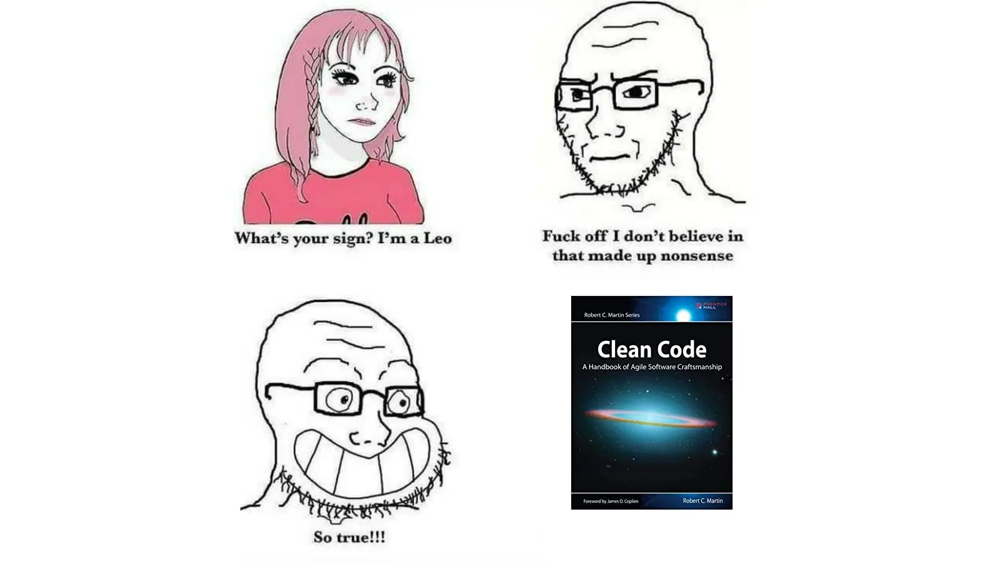
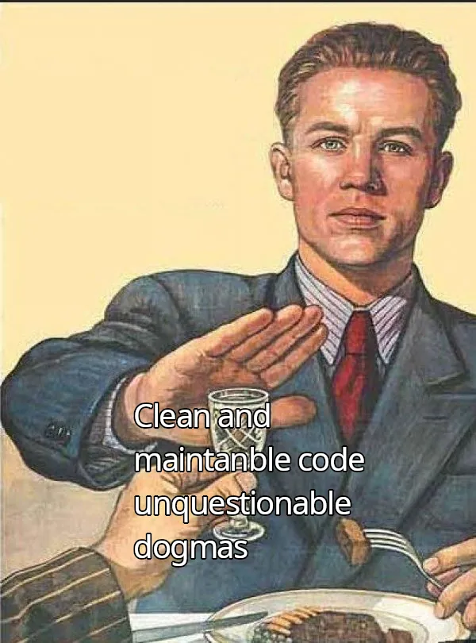

---
aliases:
- /comentar-el-codigo-esta-mal-resena-de-clean-code
- /comentar-el-codigo-esta-mal-resena-de-clean-code/clean_code/
- /es/comentar-el-codigo-esta-mal-resena-de-clean-code/
- /es/el-libro-clean-code-y-los-paradigmas-del-codigo-limpio/
authors:
- Eduardo Zepeda
categories:
- linux y devops
- opiniones
coverImage: images/clean_code.jpg
date: '2020-05-16'
description: Un análisis de Clean Code, el libro de Robert C. Martin que nos explica como escribir código de manera limpia y otras alternativas e ideas de lo que se considera código limpio en el mundo del desarrollo de software
keyword: clean code
keywords:
- libros
- reseñas
- opinion
- buenas practicas
title: El libro Clean Code Uncle Bob y Los Paradigmas Del Código Limpio
---

Hay dos tipos de programadores, los que odian Clean Code y los que lo aman. Este libro desata discusiones acaloradas en internet; unos lo consideran una biblia que profetiza mejores tiempos con código limpio y ordenado, otros lo consideran un manual desactualizado escrito por un autoproclamado dictador pedante sobre como escribir código ¿Y yo? Pues para ser sincero un poco de ambos. Esta entrada es mi humilde opinión del libro Clean Code de Robert C. Martín, el **creador del ampliamente conocido acrónimo SOLID** y también conocido como el *uncle bob*.

## ¿De qué trata Clean Code?

La mayoría de los libros sobre programación que hay disponibles en el mercado se centran en enseñarte la sintaxis de un lenguaje de programación y algunas convenciones populares. Sin embargo la mayoría no profundizan demasiado en como organizar el código, cual es la longitud adecuada de una función, como nombrar las variables, que partes del código deberían tener comentarios y cuales no, en determinar la cantidad correcta de argumentos que debe recibir una función, o el momento en el que se debe dividir un archivo en dos, etc. Clean Code pretende responder a todos esos cuestionamientos o por lo menos ser una guia al respecto.



### ¿Cuál es la importancia de usar código limpio o clean code?

A través de las páginas de Clean Code, *uncle bob* nos adentra en la temática con historias de algunas **empresas que han tenido que cerrar sus puertas por culpa de código mal escrito**, sí, así de graves pueden llegar a ser las consecuencias de código ilegible o difícil de comprender. 

El buen *uncle Bob*, afirma que los programadores pasan más tiempo leyendo código que escribiendo. Esto debería darle una visión completamente nueva a la manera en la que escribimos nuestro código, pues tenemos la certeza de que alguien más lo leerá (incluso nosotros mismos en el futuro), al escribir el código debemos preguntarnos a nosotros mismos: ¿el objetivo que persiguen mis funciones es claro? ¿se entiende porque elegí cierto flujo de código en lugar de otro? ¿es claro el significado de cada variable?


### ¿Cómo nombrar variables, clases y funciones según Clean Code?

Según Clean code el código debe autocomentarse a si mismo a través del nombre de las variables, funciones, clases y demás. De ahí la fama que tiene el libro de aborrecer los comentarios y considerarlos un *mal necesario*.

Este concepto es bastante simple pero aún así es muy común ver código críptico y difícil de entender.

Considera este ejemplo:

```python
# Codigo criptico en Python
import random

i=0
list = [x for x in range(1,57)]

while i<=52:
    a = random.sample(list, 6)
    print(a)
    i+=1
```

¿Sabes que hace el código de arriba? No a nivel matemático, sino lo que representa. ¿Qué tanto tiempo te tomo darte cuenta de que representaba un ejemplo burdo (y con pésima aleatoriedad) de un sorteo tipo lotería? ¿Podrías haber predicho que otro tipo de funciones necesitarías más adelante o que habría que corregir solo al mirar el código?

```python
# Codigo más declarativo en Python
import random

lottoDrawCounter = 0
lottoDrawsPerYear = 52
lottoNumbersToSelect = 6
lottoNumbers = [x for x in range(1,57)]

while lottoDrawCounter <= lottoDrawsPerYear:
    winningNumbers = random.sample(lottoNumbers, lottoNumbersToSelect)
    print(winningNumbers)
    lottoCounter+=1
```

Este ejemplo de código aporta mucha más información al desarrollador, a pesar de ser imperfecto. 

Si leyeras el código de arriba probablemente te vendrían a la cabeza varias ideas sobre que podría salir mal o bien al ejecutar el código, así como ideas para modificarlo y mejorarlo. 

### ¿Comentar el código está mal?

> El uso adecuado de los comentarios es para compensar nuestro fracaso al expresarnos en el código.
> 
> Robert C. Martin

El autor considera a los comentarios como algo que debe evitarse si es posible. Sí, yo sé que **en todos lados te han metido por la cabeza que debemos comentar nuestro código** y quizás te parezca controversial que el polémico *uncle Bob* considere que debes evitar escribir comentarios.

Según él, la razón es que el código debe ser explicativo por si mismo, sí necesitas comentarios es que **fallaste al escribir un código que hable por si mismo**. 

Mira el siguiente fragmento de código:

```python
# Revisa si el usuario es candidato para un descuento
if employee.status_confirmation and employee.days_since_registration()>365 and employee.owns_a_credit_card:
    process_order()
```

Ahora mira este:

```python
if employee.is_eligible_for_discount():
    process_order()
```

El comentario en el primer fragmento de código es totalmente innecesario, el nombre de la función puede reemplazarlo y se entiende perfectamente cual es el objetivo.

¿Hay alguna situación que amerite comentarios según Uncle Bob? Sí, según el autor de Clean Code, hay casos **muy puntuales** en que es mejor tener un comentario que ninguno (como para advertir consecuencias, TODO, declarar intenciones) pero, desde el punto de vista de nuestro mesias del código limpio, son más bien excepciones a la regla.

### ¿Qué opino yo de los comentarios en el código?

Yo no tengo una postura tan rigida al respecto, yo creo que está bien escribir comentarios si pueden reducir el tiempo que otros desarrolladores pasan intentando comprender el código, incluso aunque a veces sea obvio.

Los comentarios deben usarse si le facilitan la vida a los demás, incluso si tú no los necesitas.

Por ejemplo, si se utiliza el algoritmo Fisher-Yates para generar números aleatorios, yo pondría una pequeña anotación para ahorrar una búsqueda en wikipedia al desarrollador que lo lea, sí, aunque sea "conocimiento básico".

También añadiría un "no olvides añadir el id= WHERE" en una cláusula DELETE, si sospecho que puede ocurrir un accidente en esa línea de código.

Pero no te confundas, tampoco haría cosas como esta:

``` python
# PLEASE DONT DONT DO THIS
# Check if the product is available
is_product_available = check_if_product_available()
```

### ¿Cuantos argumentos debe tener una función según Clean Code?

> El número ideal de argumentos para una función es cero. Después uno, seguido de cerca por dos. Tres argumentos deberían evitarse siempre que sea posible. Más de tres requiere una justificación muy especial...
> 
> Robert C. Martin

En el capítulo que habla de las funciones, *uncle bob* enfatiza la necesidad de mantener los argumentos que una función recibe al mínimo, además considera que cualquier función que reciba más de tres argumentos **no debería ser usada**.

Desde el punto de vista de nuestro capataz del código limpio, los argumentos te forzan a requerir más información de una función que su nombre, pues ahora debes entender como interaccionan las variables dentro de la lógica de la función, además son difíciles de incluir en las pruebas puesto que hay que probar diferentes combinaciones de estos para asegurarnos de cubrir cada caso de la función. 

Suena lógico ¿no? Bueno sí, pero si revisas libros, vídeos, repositorios e incluso en la documentación oficial de ciertas tecnologías muy maduras y que se usan en sitios web de talla mundial, uno puede ver numerosas funciones con dos, tres y hasta cuatro argumentos. 

Ejemplo de express JS:

```javascript
const express = require('express')
const auth = require('../middleware/auth')

const router = new express.Router()

router.get('/users/me', auth, async (req, res) => {
    res.send(req.user)
})
```

A mi, sin embargo, no me parece tan grave ni tan difícil de leer este pequeño fragmento de código pero quizás sería razón suficiente para ser excomulgado de la iglesia del Clean Code.



## ¿Qué no me gustó de Clean Code?

Este libro es lo que yo considero un anacronismo, el autor usa Java para desarrollar sus ejemplos. Sí, ya sé que Java era increíblemente popular antes, pero usar pseudocódigo o C hubiera sido una mejor opción.

El código que se usa para los ejemplos me parece bastante rebuscado, utiliza fragmentos de código completos en lugar de un ejemplo mínimo, el autor de Refactoring lo hace mucho mejor en este aspecto.

Sentí el libro innecesariamente largo, los ejemplos están bien detallados, pero no creo que se necesiten tantas páginas para exponer algunos temas tan simples, como el nombrado de variables.

## ¿Qué alternativas hay a Clean Code?

Si no has tenido ninguna aproximación con buenas prácticas de escritura de código te recomiendo darle una leída a este libro, pues puedes adquirir algunos consejos útiles que quizás no habrías considerado, incluso aunque no estés de acuerdo con todo su contenido, el punto es que no te detengas ahí y lo complementes con más material.



Pero, mientras lo lees, considera que **este libro no es un manual que deba ser tomado como un reglamento inquebrantable**, sino la opinión de una persona, pero los tiempos cambian, las reglas se mejoran y la experiencia marca nuevas pautas de lo que es código mantenible. Toma todos los consejos que mejoren tu código y cuestiona todo lo que te parezca mejorable. Todas las religiones tienen sus detractores y Clean Code no es la excepción.

*Uncle Bob* propone SOLID como una filosofía a seguir, pero debes saber que no es la única, te dejo algunas alternativas interesantes que pueden complementar tu visión y para darte una visión más completa de este tópico:

- [CUPID](https://speakerdeck.com/tastapod/cupid-for-joyful-coding?slide=9)
- A Philosophy of Software Design de John Ousterhout.
- The Art of Readable Code
- Refactoring to Patterns de Joshua Kerievsky
- Refactoring

Por cierto, el otro día me compartieron en Twitter un [resumen de los conceptos de Clean Code con ejemplos en Javascript.](https://github.com/ryanmcdermott/clean-code-javascript) con el que puedes echarle un vistazo al contenido del libro antes de decidir entre comprarlo o no comprarlo.
