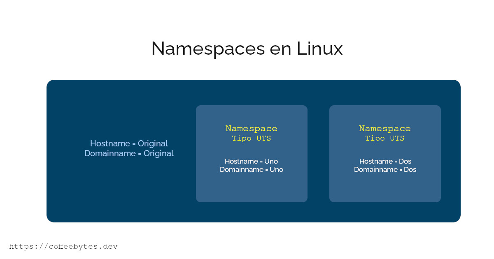
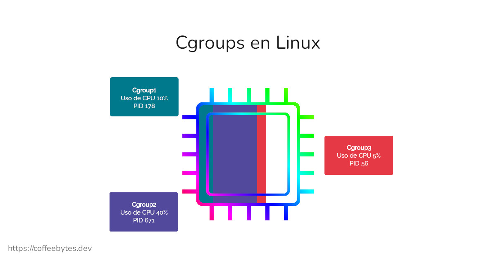

---
aliases:
- /como-funciona-un-container-de-docker-internamente
- /container-de-docker-con-namespaces-y-cgroups
- /contenedor-de-docker-con-espacios-de-nombres-y-grupos/
authors:
- Eduardo Zepeda
categories:
- docker
- linux y devops
- go
coverImage: images/docker-container-desde-cero.jpg
date: '2022-06-18'
keywords:
- docker
- linux
- go
- devops
- cgroups
- namespaces
- chroot
- pid
title: ¿Cómo Funciona un Container de Docker Internamente?
url: /es/container-de-docker-con-namespaces-y-cgroups
description: 'Los containers de Docker funcionan usando: Procesos, namespaces, Cgroups y Chroot'
---

Los containers, especialmente los de Docker, son usados en todos lados, solemos verlos como pequeños sistemas operativos aislados que se encuentran dentro de nuestro sistema. Usando los [comandos básicos de Docker](/es/tutorial-de-comandos-basicos-de-docker/) podemos modificarlos, crearlos, borrrarlos e incluso introducirnos en ellos y correr comandos, pero ¿te has preguntando cómo funcionan internamente?

Sabemos que un container es un proceso de linux con varias características:
* Es un proceso, o grupo de procesos, de linux ejecutado por un usuario.
* Está aislado del sistema operativo que lo aloja (Namespaces).
* Tiene una cantidad de recursos limitada (Cgroups).
* Cuenta con un sistema de archivos independiente al del sistema operativo en el que corre (Chroot).

Para lograr lo anterior los docker, y las demás tecnologías de contenedores, echan mano de algunas características de GNU/Linux (de ahora en adelante solo linux):

* Procesos
* Namespaces
* Cgroups
* Chroot

Voy a explicarlos muy brevemente pero tú puedes profundizarlos por tu cuenta si quieres.

## Los contenedores de Docker usan procesos, namespaces y cgroups en linux

### Proceso

En palabras simples, un proceso es una instancia de un programa en ejecución. Lo importante aquí es que cada proceso en linux cuenta con PID, que es un número que sirve para identificar el proceso. 

Como ya sabes, puedes ver los procesos usando los [comandos ps, top, htop](/es/comandos-basicos-de-linux-printenv-export-lsof-top-ps-kill-curl-systemctl-chown-chroot/#top), etc.

Un container es un proceso, o un grupo de procesos, aislados del resto del sistema operativo, por medio de un namespace.

### Namespace

Un namespace limita lo que podemos ver.

Los namespaces son una capa de abstracción de Linux que aisla los recursos del sistema. Los procesos en el interior de un namespace están al tanto de los otros procesos que se encuentran en ese mismo namespace pero los procesos de un namespace no pueden interaccionar con lo que se encuentre fuera de ese namespace. Cada proceso puede pertenecer a un solo namespace.

Un namespace es lo que hace que un container se sienta como si fuera otro sistema operativo.

En linux, un namespace se desactivará cuando se termine de ejecutar su último proceso.

#### Tipos de namespaces en linux

Existen diferentes tipos de namespaces que controlan los recursos a los que tiene acceso un proceso:

* UTS(Unix Time Sharing) namespace: Aisla hostname y dominio.
* PID namespace: Aisla identificadores de proceso.
* Mounts namespace: Aisla puntos de montaje.
* IPC namespace: Aisla recursos de comunicación entre procesos.
* Network namespace: Aisla recursos de red.
* User namespace: Aisla identificadores de usuario y de grupos.
* cgroups: Aisla la vista de /proc/[pid]/cgroup y /proc/[pid]/mountinfo

Por ejemplo, si usamos un namespace de tipo UTS, los cambios que le hagamos al hostname desde nuestro namespace no afectarán al hostname del sistema operativo principal.



### cgroup

En linux los cgroups limitan lo que podemos usar.

Los cgroups, o grupos de control que nos provee el kernel de linux, nos permite organizar nuestros procesos en grupos, y limitar los recursos de CPU, memoria, entrada, salida, el número de procesos y los paquetes de red que genera cada uno de estos grupos. 

Linux toma esta configuración leyendo una serie de archivos dentro de la ruta */sys/fs/cgroup/*, podemos crear cgroups nuevos, o modificar los que ya existen, creando carpetas y archivos dentro de esta ubicación.

Por ejemplo, usando cgroups podemos decirle a linux: "limita el número de CPUs que puede usar este proceso a uno solo, y que solo pueda usar el 20% de la capacidad de CPU, además asígnale un máximo de 1GB de RAM".





## Crear un container desde cero con Go

Simplificando lo anterior necesitamos: 

* Namespaces: para aislar los procesos de nuestro container del sistema operativo principal
* Chroot: para dotar a nuestro container de un sistema de archivos diferente al del sistema operativo principal
* Cgroups: para limitar los recursos de nuestro sistema a los que nuestro container puede acceder

Ahora vamos a crear la base del container de la misma manera que Docker, usando [el lenguaje de programación Go](/es/go-lenguaje-de-programacion-introduccion-a-variables-y-tipos-de-datos/). 

```go
package main

import (
	"fmt"
	"os"
	"os/exec"
)

// ./container.go run <comando> <argumentos>
func main() {
	switch os.Args[1] {
	case "run":
		run()
	default:
		panic("El comando no existe")
	}
}
func run() {
	fmt.Printf("Código ejecutándose %v con el Process Id (PID): %d \n", os.Args[2:], os.Getpid())
	cmd := exec.Command(os.Args[2], os.Args[3:]...)

	cmd.Stdin = os.Stdin
	cmd.Stdout = os.Stdout
	cmd.Stderr = os.Stderr

	cmd.Run()
}
```

Te explico el código a continuación.

Dentro de la función main, os.Args[1] devuelve el primer argumento del programa, en el caso de que el primer argumento sea run, ejecutará la función run. ¿Fácil no?

```bash
./container run <comando> <argumentos>
```

exec.Command se encargará de ejecutar lo que le pasemos después de run, como un comando a ejecutar, junto con sus argumentos, esto puede ser un *echo*, un *bash*, un *ls*, o lo que tú quieras.

```bash
./container run echo "Hola mundo"
Código ejecutándose [echo Hola mundo] con el Process Id (PID): 292753
Hola mundo
```

Las siguientes lineas con el prefijo cmd se resumen en lo siguiente.

* Redirigimos la entrada estándar del comando a la entrada estándar del sistema operativo.
* Redirigimos la salida estándar del comando a la salida estándar del sistema operativo.
* Redirigimos la salida de errores del comando a la salida de errores del sistema operativo.

¿Y esto que significa? Significa que, en este proceso, todo lo que escribamos en nuestra terminal se irá directo a la entrada estándar del comando que está almacenado en cmd.

Para finalizar:

* cmd.Run, ejecuta el comando que creamos con *exec.Command*

## Containers y namespaces en Linux

Hasta ahora contamos con un programa que crea un proceso a partir de los argumentos que le pasemos. 

Todo bien hasta ahora, pero tenemos un problema; no estamos usando namespaces, por lo que nuestro programa no está aislado del resto del sistema; podemos ver todos los procesos del sistema operativo principal y además estamos usando su sistema de archivos, en lugar de un sistema de archivos propio para el container.

Para asignar un namespace a nuestro programa, vamos a usar el método SysProcAttr, para crear un nuevo namespace de tipo UTS. 

```go
func run() {
	fmt.Printf("Código ejecutándose %v con el Process Id (PID): %d \n", os.Args[2:], os.Getpid())
	cmd := exec.Command(os.Args[2], os.Args[3:]...)

	cmd.Stdin = os.Stdin
	cmd.Stdout = os.Stdout
	cmd.Stderr = os.Stderr

	cmd.SysProcAttr = &syscall.SysProcAttr{
		Cloneflags: syscall.CLONE_NEWUTS,
	}

	cmd.Run()
}
```

Como se lee en la lista de los namespaces, UTS es el namespace para aislar hostname y nombres de dominio.

### Namespace UTS

Tras establecer el *Cloneflags*, cualquier cambio que le hagamos al hostname se realizará solo dentro del namespace. En otras palabras, los cambios dentro de nuestro container no afectarán nada fuera de este.

```bash
# Hostname original
hostname
tuHostNameOriginal

# Cambiando el hostname dentro del container
./container run /bin/bash
hostname otroNombre

# El hostname cambió dentro del container
hostname
otroNombre

# Salimos del container
exit

# El hostname original NO cambió
hostname
tuHostNameOriginal
```

### Aislando procesos con el namespace PID

Ya que vimos como funciona un namespace, vamos a usarlo para la función principal de un contenedor; aislar procesos.

Haremos los siguientes cambios al código principal.

* En la función run, nos aseguraremos de que child sea un argumento siempre y por ende se ejecute la función del mismo nombre.
* exec.Command("/proc/self/exe", args...) se encargará de realizar un fork de nuestro proceso con nuestros comandos.
* CLONE_NEWPID se usará para crear un nuevo namespace para aislar los procesos en nuestro container.
* El método *Sethostname* se encargará de establecer el hostname de manera automática, útil para saber que estamos dentro del container.

El resto del código hace exactamente lo mismo.

```go
package main

import (
	"fmt"
	"os"
	"os/exec"
	"syscall"
)

// go run container.go run <cmd> <args>
func main() {
	switch os.Args[1] {
	case "run":
		run()
	case "child":
		child()
	default:
		panic("El comando no existe")
	}
}

func run() {
	args := append([]string{"child"}, os.Args[2:]...)
	cmd := exec.Command("/proc/self/exe", args...)

	cmd.Stdin = os.Stdin
	cmd.Stdout = os.Stdout
	cmd.Stderr = os.Stderr

	cmd.SysProcAttr = &syscall.SysProcAttr{
		Cloneflags: syscall.CLONE_NEWUTS | syscall.CLONE_NEWPID,
	}

	cmd.Run()
}

func child() {
	fmt.Printf("Código ejecutándose %v con el Process Id (PID): %d \n", os.Args[2:], os.Getpid())

	syscall.Sethostname([]byte("container"))
	cmd := exec.Command(os.Args[2], os.Args[3:]...)

	cmd.Stdin = os.Stdin
	cmd.Stdout = os.Stdout
	cmd.Stderr = os.Stderr

	cmd.Run()
}
```

Ahora, si ejecutamos el código veremos que el PID es 1, el primer proceso, ¡Ya tenemos aislados lor procesos! Sin embargo, como no hemos cambiado el sistema de archivos, veremos los mismos procesos de nuestro sistema operativo principal.

Recuerda que el [comando *ps*](/es/comandos-basicos-de-linux-printenv-export-lsof-top-ps-kill-curl-systemctl-chown-chroot/#ps) obtiene los procesos del directorio */proc* del sistema de archivos que estemos usando. En otras palabras, necesitamos otro sistema de archivos.

## Establecer un nuevo sistema de archivos para el container

Para usar un sistema de archivos único para el container, que no sea el sistema de archivos de nuestro sistema operativo, echaremos de mano del comando [*chroot*](/es/comandos-basicos-de-linux-printenv-export-lsof-top-ps-kill-curl-systemctl-chown-chroot/#chroot) de linux. 

*Chroot* cambia la ubicación predeterminada del root o raiz a un directorio que nosotros le indiquemos.

```bash
ls /otro_sistema_de_archivos
bin dev home lib ... proc
```

Este nuevo sistema de archivos puede tener otras librerías instaladas, configuraciones y estar diseñado a nuestro gusto, puede ser una copia del que estás usando u otro completamente diferente.

Para aislar los procesos de nuestro container vamos a:

1. Cambiar el sistema de archivos al nuevo con Chroot
2. Movernos al directorio raiz
3. Montar la carpeta proc en proc 

```go
func child() {
	fmt.Printf("Código ejecutándose %v con el Process Id (PID): %d \n", os.Args[2:], os.Getpid())

	syscall.Sethostname([]byte("container"))
	cmd := exec.Command(os.Args[2], os.Args[3:]...)

	cmd.Stdin = os.Stdin
	cmd.Stdout = os.Stdout
	cmd.Stderr = os.Stderr

	syscall.Chroot("/otro_sistema_de_archivos")
	os.Chdir("/")
	syscall.Mount("proc", "proc", "proc", 0, "")

	cmd.Run()
}
```

Ahora nuestro container va a leer los procesos de nuestro nuevo sistema de archivos, en lugar del sistema de archivos del sistema operativo principal.

## Limitar recursos del container con cgroups

Por último, vamos a limitar los recursos a los que nuestro container puede acceder usando los cgroups de linux.

Los cgroups se localizan dentro de la ruta */sys/fs/cgroup/* y podemos crear uno nuevo creando una nueva carpeta dentro del tipo de cgroup. 

En este caso limitaremos la memoria, por lo que nuestro cgroup estará dentro de */sys/fs/cgroup/memory/<nombre_del_cgroup>*. ¿Recuerdas que te dije que los cgroups funcionaban leyendo una serie de directorios y archivos?

```go
func child() {
    // ...
	setcgroup()
    // ...
}

func setcgroup() {

	cgPath := filepath.Join("/sys/fs/cgroup/memory", "nuevocgroup")
	os.Mkdir(cgPath, 0755)

	ioutil.WriteFile(filepath.Join(cgPath, "memory.limit_in_bytes"), []byte("100000000"), 0700)
    ioutil.WriteFile(filepath.Join(cgPath, "tasks"), []byte(strconv.Itoa(os.Getpid())), 0700)
}

```

Creamos un directorio para nuestro cgroup con los [permisos de linux 0755](/es/entiende-los-permisos-en-gnu-linux-y-el-comando-chmod/)

Generaremos dos archivos, dentro de nuestro cgroup, para establecer las directrices que queremos implementar

* *memory.limit_in_bytes*, para limitar el máximo de memoria a 100 MB (100000000 bytes).
* *tasks* para indicarle a linux que esta configuración de cgroup es aplicable al número de proceso (PID) de nuestro container, el cual obtenemos con el método Getpid.

Y listo, con eso tenemos un proceso con su propio sistema de archivos, aislado del sistema operativo principal y que puede acceder únicamente a una parte de los recursos.

## ¿Cómo funciona un container de Docker en pocas palabras?

Resumiendo, es posible crear un container usando namespaces, cgroups y chroot, para aislar del exterior, limitar los recursos, y proveer de un sistema de archivos propio, respectivamente.

El código de esta publicación está basado en una [plática de LizRice](https://www.youtube.com/watch?v=Utf-A4rODH8) en el ContainerCamp.

## Otros recursos para profundizar en containers de Docker

* [Namespaces](https://wvi.cz/diyC/namespaces/)
* [Cgroups](https://clibre.io/blog/por-secciones/hardening/item/425-cgroups-grupos-de-control-en-gnu-linux)
* [Chroot](http://www.estrellateyarde.org/virtualizacion/la-jaula-en-linux-chroot)
* [Difference between a process a container and a vm](https://jessicagreben.medium.com/what-is-the-difference-between-a-process-a-container-and-a-vm-f36ba0f8a8f7)