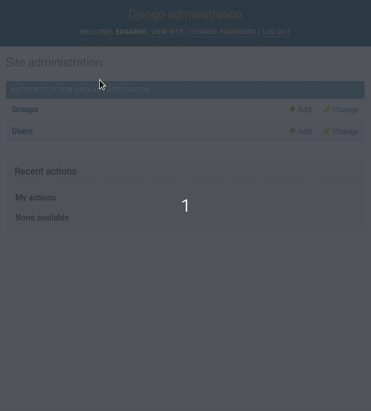

When I first learned that Django had a permissions system, many years ago, it seemed rather esoteric, not very useful and easy to replicate, how wrong I was back then. Then I realized that the built-in permissions system was a marvel and saved a lot of code, and was quite robust and tested by some of the largest companies in the world.

If you have not yet decided to use Django and are investigating its features check out my post on the [advantages and disadvantages of the Django web development framework](/en/why-should-you-use-django-framework/).

On the other hand, if you already have some practice with Django, you may want to deepen what you know with this free book, called [la guía definitiva de Django](/en/the-definitive-guide-to-django/).

## How to create permissions in Django?

Every time you create a model and run migrations **4 permissions (add, edit, delete and view)** are automatically created in _django.contrib.auth_ for that object.

On the other hand, the user model has a _ManyToMany_ relationship with the _Permissions_ model (which stores the above permissions) and the _Groups_ model. So we already have a relationship between users, groups and permissions that we can take advantage of.

The permissions that Django creates come in the form of <app>.<action>_<model> or app.action_model.

```python
app.add_modelo # Para añadir modelos
app.edit_modelo # Para editar modelos
app.delete_modelo # Para borrar modelos
app.view_modelo # Para ver modelos
# por ejemplo: 
# streaming.add_pelicula
# tienda.edit_articulo
# encuestas.delete_encuesta
# vapor.view_videojuego
```

## Add or remove permissions to a user

To add or remove permissions to a user we will make use of the methods provided by Django

To add permissions one by one we pass them to the _add()_ method.

```python
user.permissions.add(permiso1, permiso2, ...)
```

To remove permissions we pass the permission we want to remove to the _remove()_ method.

```python
user.permissions.remove(permiso1, permiso2, ...)
```

If we want to set a list of permissions we simply match the _permissions_ attribute to the list we want it to have.

```python
user.permissions = [lista_de_permisos]
```

To remove all permissions for a user we use the _clear()_ method.

```python
user.permissions.clear()
```

## Checking permissions for a user

Once we have assigned permissions, we can limit the behavior of a user to the permissions he/she has. For example, Patreon only shows its content to users who periodically donate to a content creator and even within a single account there are different permissions depending on the amount of money you donate.

### Check what permissions a user has

The _get_all_permissions()_ method returns a list of all the permissions a user has.

```python
user.get_all_permissions()
```

### Check the permissions of the groups a user belongs to

This will return the permissions that a user obtains by the groups to which he/she belongs.

```python
user.user.get_group_permissions()
```

### Check if a user has a permission

We can check if a user has a unique permission with the _has_perm()_ method. It will return _True_ if the user has the permission. If the user has the permissions but its user instance has the active property equal to _False_, it will return _False_.

```python
user.has_perm("app.accion_modelo")
```

### Check if a user has a set of permissions

_has_perms_ is quite useful if we want to check if a user has a set of permissions. It will return _True_, only if it has all the permissions. Like the previous one, **will return _False_ if the user is not active, even if he has the permissions **.

```python
user.has_perms(["app.edit_modelo", "app.delete_modelo"]) # por ejemplo videogame_store.edit_videogame, videogame_store.delete_videogame
```

### Check if a user has any permissions

Maybe we just want to check the existence of any permissions, that's what _has_module_perms()_ is for. It returns _True_ if the user has any permissions for the application tag we pass it. In the same way, it returns _False_ for inactive users.

```python
user.has_module_perms('etiqueta_de_la_app') # por ejemplo videogame.view_videogame

# models.py
class tuModelo(models.Model):
    class Meta:
        app_label = 'etiqueta_de_la_app'
```

## Applying permissions to limit actions

We can apply permissions to protect our views by wrapping them in a decorator.

### Checking with user_passes_test

This function requires an object as argument and this object must accept the _user_ object as its argument. Leaving that aside, this test can contain anything you want, from checking a user field, permissions, corroborating a deadline, etc.

There is a second optional parameter, the url to redirect to for unauthenticated users, which takes the value of _settings.LOGIN_URL_ (yes, the one you specify in your configuration file) if none is specified.

```python
def can_delete_and_edit(user):
return user.has_perm("app.edit_modelo") and user.has_perm("app.delete_modelo")

@user_passes_test(can_delete_and_edit, login_url="/login/")
def manage_videogame(request):
    pass
```

### Checking with permissions_required

Similarly, it has a second optional parameter, the url to redirect to for unauthenticated users, which takes the value of _settings.LOGIN_URL_ if none is specified.

```python
from django.contrib.auth.decorators import permission_required

@permission_required('app.edit_videogame', login_url="/login/")
def edit_videogame(request):
# ...
```

### Applying permissions in templates

Django templates are no longer as popular as they used to be, due to the rise of microservices and frontend frameworks such as React, Vue, Angular, etc. Still, if you want to use them in templates you can access permissions as follows:

Update: [Htmx](/en/django-and-htmx-modern-web-apps-without-writing-js/) can bring permissions back to life in the Django template system.

```django

Para comprobar si el usuario tiene un permiso en específico


Para comprobar si el usuario tiene algún permiso para esa app

```

## Permission groups in Django

As you know, using groups is a very convenient way to assign a set of permissions. Maybe you have a paid application and you want all users with the basic plan to have a set of permissions, while premium users have extra permissions. **To organize the permissions and assign them in a simpler way we can use groups**. You can access these groups and assign permissions from the administration panel or from the Python terminal.

### Create permission groups



We can also create them directly from the Python terminal

```python
from django.contrib.auth.models import Group
Group.objects.create(name="Premium")
premium = Group.objects.get(name="Premium")
```

### Assign permissions to a group

If we already have a group and we want to assign permissions to it **we use practically the same set of methods that we use for a user**.

To set up a permission list

```python
premium.permissions.set([lista_de_permisos])
```

To add permissions, either a list or one by one.

```python
premium.permissions.add(permiso1, permiso2, ...)
```

To remove permissions, either a list or one by one

```python
premium.permissions.remove(permiso1, permiso2, ...)
```

To remove all permissions from a group

```python
premium.permissions.clear()
```

## Adding or removing users from a group

To add a permission group we use the same methods as in the previous examples: add, remove, clear, etc.

```python
# agregar a un usuario a varios grupos
user.groups = group_list
# Agregar un usuario a uno o varios grupos
user.groups.add(grupo1, grupo2,...)
# Removemos un usuario de uno o varios grupos
user.groups.remove(grupo1, grupo2,...)
# Eliminamos a un usuario de todos los grupos
user.groups.clear()
```

## Create custom permissions in Django

We can add custom permissions to a model, we will use the sub _class Meta_ of our model and assign the property _permissions_ to a tuple of tuples, where each tuple has the name of the permission and its description.

```python
permissions = (('permiso1', 'descripción 1'), ('permiso 2', 'descripción 2'))
```

We can name these permissions as we wish, then give that permission to certain users and then check if a user has any of our permissions using the methods seen previously.

```python
class usuarioPersonalizado(AbstractUser):
    # ...

    class Meta:
        permissions = (
            ('puede_ver_contenido_premium', 'Puede ver contenido para usuarios premium'),
            ('puede_ver_contenido_básico', 'Puede ver contenido para usuarios básico'))
```

If we now run the migrations, we will notice that we can now add the permissions we created from the administration panel and from the Python terminal.

```python
python manage.py makemigrations
python manage.py migrate
```

Remember to check [Django's documentation on permissions](https://docs.djangoproject.com/en/3.2/topics/auth/default/) for a more in-depth post.