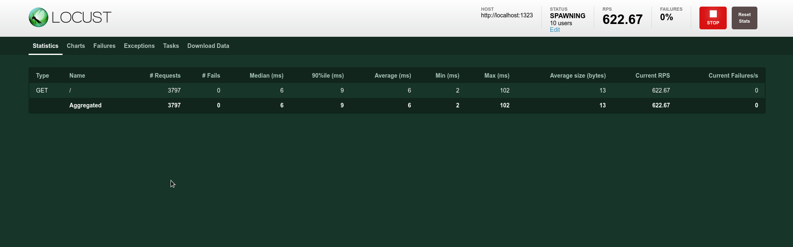
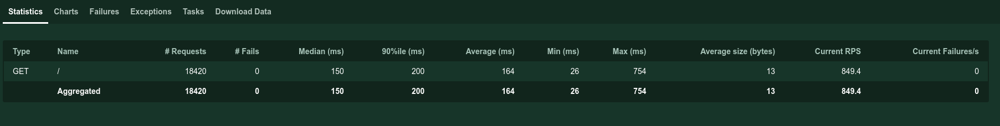
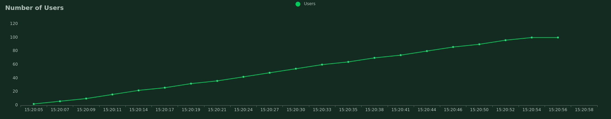

There are quite simple to use tools that allow us to audit the number of requests per second (rps) that a website supports, locust is one of them, it is made in Python and with a minimal configuration allows us to process information and obtain graphs instantly, and in real time, of the behavior of our website.

## Install locust

The first step is to install it using pip or any virtual environment manager.

```bash
pip install locust==2.2.3

```

## Locust configuration

Once installed we are going to create a file obligatorily named _locustfile.py_ in our application and we are going to place the following code in it.

```python
from locust import HttpUser, task

class HelloWorldUser(HttpUser):
    @task
    def test_home(self):
        self.client.get("/")
```

We create a class that imports from _Httpuser_ and assign it a method with the *task* decorator. Below we use the get method of client and pass it the path to which the request will be made.

Now we execute the locust command from the terminal.

```bash
locust
```

After executing it we will have a server running at _http://localhost:8089/_. If we enter we will see a screen like this:


Here we place, in order: 
1. The number of total users, 
2. The speed at which locust will create users per second 
3. The host to test. 

We fill in the data, I will use 200 users, 2 users created per second and http://localhost:1323, which directs to a local web server.

Press the "start swarming" button and locust will take care of the rest, gradually increasing the number of users.

Watch real-time monitoring. To stop it press the stop button in the upper right corner.



## Metrics in locust

The statistics tab gives us the following information.



* Type of request
* Name of the route
* Number of requests
* Number of failures
* Average response time
* The response time for the 90th percentile,
* Their average, minimum and maximum values
* Response size
* Requests per second
* Current failures

## Graphics in locust

When we stop the test, we will have downloadable charts in the charts tab.

The first with the number of requests per second on the Y-axis.


The second with the response time on the y-axis.


Finally, the third one, with the number of users on the Y-axis.



## Add more requests per user

We can create custom behavior for our users by adding more user actions by making more get requests via the _client_ object.

```python
from locust import HttpUser, task

class HelloWorldUser(HttpUser):

    @task
    def test_home(self):
        self.client.get("/")
        self.client.get("/about")
```

This tells locust that each user will make a request to the root path and then a request to the _/about_ path. And so we can add as many requests per user as we want.

## Adding users with different behaviors in Locust

As you know, we can't expect every user to go first to home and then to the _about_ (or any other) section, real users don't behave like that. Each function decorated with @task represents a different behavior, so if we add more decorated functions we will have more behaviors available.

When a user is created, Locust will assign it to the behavior of a single role decorated with @task. How does it decide which one? Randomly, with the same weight for each role; if there are two roles decorated with @task half of the users generated by locust will go to one task and the other half to the other.

```python
from locust import HttpUser, task, between

class HelloWorldUser(HttpUser):

    @task
    def test_home(self):
        self.client.get("/")
        self.client,get("/about")

    @task
    def test_about(self):
        self.client.get("/feed")
```

When a fake user is created it will have a 50% chance of being assigned to one of these two behaviors:

* Visit home (/) and then visit the about section.
* Visit the feed section

### Assigning different weights

But what if we know that three times as much of our traffic goes to feed instead of home?

If we pass a number as an argument to the @task decorator, it will use it as a weighting to load traffic in proportion to the value we specify.

```python
from locust import HttpUser, task, between

class HelloWorldUser(HttpUser):

    @task
    def test_home(self):
        self.client.get("/")
        self.client,get("/about")

    @task(3)
    def test_about(self):
        self.client.get("/feed")
```

Now the users created will also be redirected to _/feed_, and not only that, but each user generated is three times more likely to go to _/feed_, so that route will receive more traffic.

## POST requests in locust

What about POST requests? Well, locust also allows you to make POST requests, just use the _client_ post method instead of get

```python
from locust import HttpUser, task, between

class HelloWorldUser(HttpUser):

    wait_time = between(1, 5)

    @task
    def test_home(self):
        self.client.get("/")

    @task(3)
    def test_about(self):
        self.client.get("/feed")

    @task(2)
    def test_login(self):
        self.client.post("/login", {"username":"testuser", "password":"secret"})
```

But what if the request fails, what if we want to evaluate the effect that a certain POST request has on a route? For that we can use the response object.

## The response object in Locust

Each request we make will return a _response_ object, which contains information about the result of our request.

We can wrap our request in a Python _with_ block and assign it to a _response_ object. This object will have multiple properties, just to name a few:

* cookies
* apparent_encoding
* status_code
* success
* text
* url
* content
* connection
* elapsed
* history
* request
* request_meta

### Analysing errors

Knowing the above we can obtain the different data related to the request and customize our monitoring flow. Observe:

```python
from locust import HttpUser, task, between

class HelloWorldUser(HttpUser):

    wait_time = between(1, 5)
    # ...

    @task
    def non_existing_url(self):
        with self.client.get("/non-existing-url", catch_response=True) as response:
            if response.text != "Success":
                response.failure("Wrong request, this shouldn't exist")
            elif response.status_code < 400:
                response.failure("This url's response should be less than 400 because it doesn't exists")
            elif response.elapsed.total_seconds() > 0.5:
                response.failure("Slow response")
```

In the previous example, when trying to access a path that does not exist, the first conditional will be executed and will create a failure with the text "Wrong answer", which we will be able to see in the failure section of the interface.


In addition to testing the text in the response it is possible to test the other properties of the response object, such as the response code or the time it takes to return a response.

### Success management

We can also call the _success_ method of the response object to indicate a successful response according to any behavior we want.

```python
from locust import HttpUser, task, between

class HelloWorldUser(HttpUser):

    wait_time = between(1, 5)
    # ...

    @task
    def non_existing_url(self):
        with self.client.get("/non-existing-url", catch_response=True) as response:
            if response.status_code == 404:
                response.success()
```

## Group multiple urls in one category

Locust shows us the results per route, but what if we want multiple routes to be evaluated in batch, as if they were the same? Either because those routes are handled by the same server or come from the same function or any other reason.

```python
@task
def test_no_posts(self):
    for post in ["post-1", "post-2", "post-3"]:
        self.client.get("/post/{}".format(post), name="/post/[slug]")
```

This function will traverse the array and make a request to each item in the list and group them all under the name _/post/[slug]_.

## Emulate the behavior of users with between

As you know, user traffic is not regular, sometimes there are many requests and sometimes few. A system has to be able to handle both cases.

To simulate user behavior we can set a random timeout for each request by assigning the _wait_time_ property and using _between_ each user will wait from 1 to 5 seconds before their next request.

```python
from locust import HttpUser, task, between

class HelloWorldUser(HttpUser):

    wait_time = between(1, 5)

    @task
    def hello_world(self):
        self.client.get("/")
```

## Customized user behavior curves

Sometimes we need more realistic curves, so we need to customize the number of active users and the speed at which they are generated, in order to modify it according to what we would expect in a real situation for our website.

Locust will detect any class that inherits from _LoadTestShape_ in _locusfile.py_ automatically and will use its _tick_ method to return a tuple with the number of users and their generation rate, or None to stop the test. The _run_time_ method, which returns the time that has elapsed, will be available for us to use as we wish.

tick will be called every second to get the users, so you can play with the time to generate the number of users and the speed of generation to create the user curve you want.

```python
from locust import HttpUser, task, between, LoadTestShape
import random

class RandomUsers(LoadTestShape):
    time_limit = 20 # Tiempo de duración de la prueba
    spawn_rate = 20 

    def tick(self):
        run_time = self.get_run_time()

        if run_time < self.time_limit:
            users = random.randint(5,50)
            spawn = random.randint(5,50)
            return (users, spawns)

        return None
```

I have let the return data be generated randomly, but you can use a more complex behavior.

## Export locust data to csv

In the web interface we can export our results in the "Download data" tab but we can also generate them in the project folder directly from the command line.

We select the _headless_ option so that it does not load the web interface, _csv_ will be the prefix of the csv files and _host_ for the address of the server to test.

```python
locust --csv=prefijo_archivos_csv --headless --host=http://127.0.0.1:1323
ls
locustfile.py Pipfile Pipfile.lock prefijo_archivos_csv_exceptions.csv prefijo_archivos_csv_failures.csv prefijo_archivos_csv_stats.csv prefijo_archivos_csv_stats_history.csv
```

## Deepen Locust

In addition to what I have told you here, locust has hooks for events, as well as a faster client for your requests, visit the [Locust documentation](https://docs.locust.io/en/stable/) for more information.