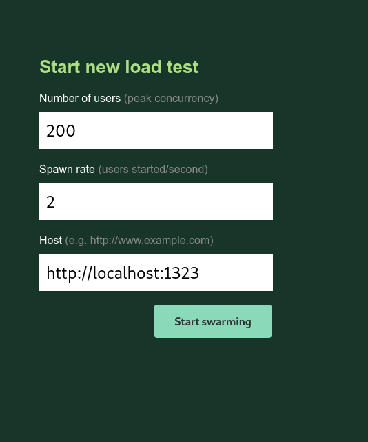
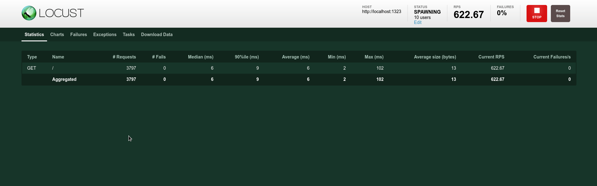
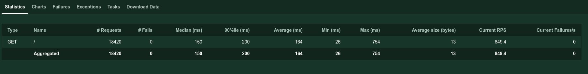
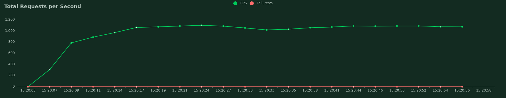
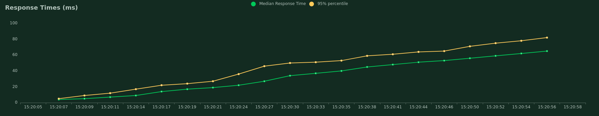
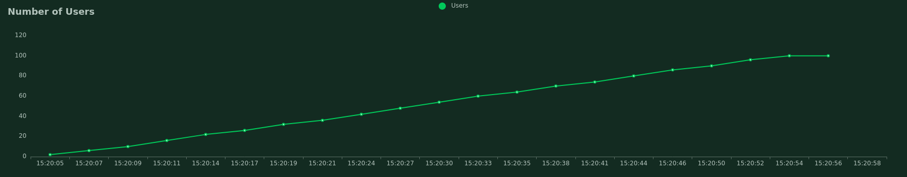
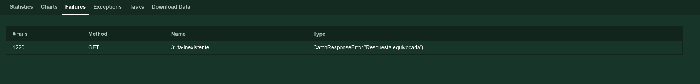

---
aliases:
- /como-medir-las-peticiones-por-segundo-con-locust-en-python
authors:
- Eduardo Zepeda
categories:
- python
coverImage: images/MideCargaUsuariosLocust.jpg
coverImageCredits: Créditos a https://www.pexels.com/@minan1398/
date: '2021-10-12'
description: Aprende a realizar y personalizar auditorias de tráfico de usuarios y
  peticiones por segundo (rps) realidad usando locust en Python.
keywords:
- python
- rendimiento
title: ¿Cómo medir las peticiones por segundo con locust en python?
---

Existen herramientas bastante sencillas de utilizar que permiten auditar el número de peticiones por segundo que soporta un sitio web (rps), locust es una de ellas, está hecha en Python y con una mínima configuración nos permite procesar información y obtener gráficos al instante, y en tiempo real, del comportamiento de nuestro sitio web.

## Instalar locust

El primer paso es instalarlo usando pip o cualquier manejador de entornos virtuales, yo usaré el administrador de entornos virtuales pipenv.

```bash
pipenv install locust==2.2.3
pipenv shell
```

## Configuración de locust

Una vez instalado vamos a crear un archivo llamado, de manera obligatoria, _locustfile.py_ en nuestra aplicación y vamos a colocarle el siguiente código.

```python
from locust import HttpUser, task

class HelloWorldUser(HttpUser):
    @task
    def test_home(self):
        self.client.get("/")
```

Creamos una clase que importe de _Httpuser_ y le asignamos un método con el decorador task. Más abajo usamos el método get de client y le pasamos la ruta a la que se realizará la petición.

Ahora ejecutamos el comando locust desde la terminal.

```bash
locust
```

Tras ejecutarlo tendremos un servidor corriendo en _http://localhost:8089/_. Si entramos veremos una pantalla como esta:



Aquí colocamos, en orden, el número de usuarios totales, la velocidad a la que locust creará usuarios por segundo, y el host a testear. Llenamos los datos, yo usaré 200 usuarios, 2 usuarios creados por segundos y http://localhost:1323, que dirige a un servidor web local.

Presionamos el botón "start swarming" y locust se encargará del resto, incrementando el número de usuarios paulatinamente.

Observa el monitoreo en tiempo real. Para detenerlo presiona el botón stop de la esquina superior derecha.



## Métricas en locust

La pestaña de estadísticas nos nuestra información la siguiente información.



- Tipo de petición
- Nombre de la ruta
- Número de peticiones
- Número de fallos
- El tiempo de respuesta medio
- El tiempo de respuesta para el percentil 90,
- Sus valores promedio, mínimo y el máximo
- Tamaño de respuesta
- Las peticiones por segundo
- Fallos actuales

## Gráficos en locust

Cuando detengamos el test, tendremos gráficos descargables en la pestaña charts.

El primero con el número de peticiones por segundo en el eje de las Y.



El segundo con el tiempo de respuesta en el eje de las Y.



Por último, el tercero, con el número de usuarios en el eje de las Y.



## Añadir más peticiones por usuario

Podemos crear un comportamiento personalizado para nuestros usuarios agregando más acciones del usuario haciendo más peticiones get por medio del objeto _client_.

```python
from locust import HttpUser, task

class HelloWorldUser(HttpUser):

    @task
    def test_home(self):
        self.client.get("/")
        self.client.get("/about")
```

Esto le indica a locust que cada usuario realizará una petición a la ruta raiz y, posteriormente, una petición a la ruta _/about_. Y así podemos agregar tantas peticiones por usuario como querramos.

## Agregando usuarios con comportamientos diferentes

Como ya sabes, no podemos esperar que cada usuario vaya primero a home y luego a la sección _about_ (o cualquier otra), los usuarios reales no se comportan así. Cada función decorada con @task representa un comportamiento diferente, por lo que si agregamos más funciones decoradas tendremos más comportamientos disponibles.

Al momento de crear un usuario, Locust lo asignará al comportamiento de una única función decorada con @task. ¿Cómo decide a a cual? Al azar, con el mismo peso para cada función; si hay dos funciones decoradas con @task la mitad de los usuarios generador por locust se irán a una tarea y la otra mitad a la otra.

```python
from locust import HttpUser, task, between

class HelloWorldUser(HttpUser):
 
    @task
    def test_home(self):
        self.client.get("/")
        self.client,get("/about")

    @task
    def test_about(self):
        self.client.get("/feed")
```

Cuando se crea un usuario tendrá 50% de probabilidades de ser asignado a uno de estos dos comportamientos:

- Visita home (/) y posteriormente visita la sección about
- Visita la sección feed

### Asignando diferentes pesos

¿Pero y si sabemos que el triple de nuestro tráfico va a feed en lugar de a home?

Si le pasamos un número como argumento al decorador @task, lo usará como una ponderación para cargar el tráfico en proporción al valor que le indiquemos.

```python
from locust import HttpUser, task, between

class HelloWorldUser(HttpUser):
 
    @task
    def test_home(self):
        self.client.get("/")
        self.client,get("/about")

    @task(3)
    def test_about(self):
        self.client.get("/feed")
```

Ahora los usuarios creados también se redirigirán a _/feed_, y no solo eso, sino que cada usuario que se genere tiene el triple de probabilidades de irse a _/feed_, por lo que esa ruta recibirá más tráfico.

## Peticiones post en locust

¿Y las peticiones POST? Pues locust también permite realizar peticiones POST, basta con usar el método post de _client_ en lugar de get

```python
from locust import HttpUser, task, between

class HelloWorldUser(HttpUser):

    wait_time = between(1, 5)
    
    @task
    def test_home(self):
        self.client.get("/")

    @task(3)
    def test_about(self):
        self.client.get("/feed")

    @task(2)
    def test_login(self):
        self.client.post("/login", {"username":"testuser", "password":"secret"})
```

Pero, ¿y si la petición falla? ¿Qué tal si queremos evaluar el efecto que cierta petición POST tenga en una ruta? Para eso podemos usar el objeto response.

## El objeto response

Cada petición que hagamos retornará un objeto _response_, que cuenta con información del resultado de nuestra petición.

Podemos envolver nuestra petición en un bloque _with_ de Python y asignarlo a un objeto _response_. Este objeto tendrá múltiples propiedades, solo por nombrar algunas:

- cookies
- apparent\_encoding
- status\_code
- success
- text
- url
- content
- connection
- elapsed
- history
- request
- request\_meta

### Monitoreo de errores

Sabiendo lo anterior podemos obtener los diferentes datos relacionados con la petición y personalizar nuestro flujo de monitoreo. Observa:

```python
from locust import HttpUser, task, between

class HelloWorldUser(HttpUser):

    wait_time = between(1, 5)
    # ...

    @task
    def test_no_existe(self):
        with self.client.get("/ruta-inexistente", catch_response=True) as response:
            if response.text != "Success":
                response.failure("Respuesta equivocada")
            elif response.status_code < 400:
                response.failure("Esta ruta no debería devolver un status menor a 400 porque no existe")
            elif response.elapsed.total_seconds() > 0.5:
                response.failure("Respuesta demorada más de 0.5 segundos")
```

En el ejemplo anterior al intentar acceder a una ruta que no existe, la primera condicional se ejecutará y creará un fallo con el texto "Respuesta equivocada", el cual podremos ver en la sección de fallos de la interfaz.



Además de probar el texto en la respuesta es posible probar las otras propiedades del objeto response, tales como el código de respuesta o el tiempo que demora en devolver una respuesta.

### Manejo de éxitos

También podemos llamar al método _success_ del objeto response para indicar una respuesta exitosa de acuerdo a cualquier comportamiento que nosotros querramos.

```python
from locust import HttpUser, task, between

class HelloWorldUser(HttpUser):

    wait_time = between(1, 5)
    # ...

    @task
    def test_ruta_no_existe(self):
        with self.client.get("/ruta-inexistente", catch_response=True) as response:
            if response.status_code == 404:
                response.success()
```

## Agrupar múltiples urls en una categoría

Locust nos muestra los resultados por ruta pero, ¿qué tal si queremos que múltiples rutas se evalúen en lote, como si fueran la misma? Ya sea porque esas rutas las maneje un mismo servidor o provengan de una misma función o cualquier otra razón.

```python
@task
def test_no_posts(self):
    for post in ["post-1", "post-2", "post-3"]:
        self.client.get("/post/{}".format(post), name="/post/[slug]")
```

Esta función va a recorrer el array y hacer una petición a cada elemento de la lista y agrupará todas bajo el nombre _/post/\[slug\]_.

## Emular el comportamiento de los usuarios con between

Como ya sabes, el tráfico de los usuarios no es regular, a veces hay muchas solicitudes y a veces pocas. Un sistema tiene que ser capaz de manejar ambos casos.

Para simular el comportamiento de los usuarios podemos establecer un tiempo de espera aleatorio a cada petición asignando la propiedad _wait\_time_ y usando _between_ cada usuario esperará de 1 a 5 segundos antes de su siguiente petición.

```python
from locust import HttpUser, task, between

class HelloWorldUser(HttpUser):

    wait_time = between(1, 5)
    
    @task
    def hello_world(self):
        self.client.get("/")
```

## Curvas de comportamiento de usuario personalizadas

A veces necesitamos curvas más reales, por lo que necesitamos personalizar la cantidad de usuarios activos y la velocidad a la que estos se generan, para poder modificarla de acuerdo a lo que esperaríamos en una situación real para nuestro sitio web.

Locust detectará cualquier clase que herede de _LoadTestShape_ en _locusfile.py_ automáticamente y usará su método _tick_ para retornar una tupla con la cantidad de usuarios y la velocidad de generación de estos, o None para detener la prueba. El método _run\_time_, que devuelve el tiempo que ha pasado, estará disponible para que lo usemos como querramos.

tick se llamará cada segundo para obtener los usuarios, por lo que puedes jugar con el tiempo para generar el numero de usuarios y la velocidad de generación para crear la curva de usuarios que desees.

```python
from locust import HttpUser, task, between, LoadTestShape
import random

class UsuariosAlAzar(LoadTestShape):
    time_limit = 20 # Tiempo de duración de la prueba
    spawn_rate = 20 

    def tick(self):
        run_time = self.get_run_time()

        if run_time < self.time_limit:
            users = random.randint(5,50)
            spawn = random.randint(5,50)
            return (users, spawns)

        return None
```

Yo he dejado que los datos de retorno se generan al azar, pero tú puedes usar un comportamiento más complejo.

## Exportar los datos de locust en csv

En la interfaz web podemos exportar nuestros resultados en la pestaña "Download data" pero también podemos generarlos en la carpeta del proyecto directo desde la linea de comandos.

Seleccionamos la opción _headless_ para que no cargue la interfaz web, _csv_ será el prefijo de los archivos csv y _host_ para la dirección del servidor a probar.

```python
locust --csv=prefijo_archivos_csv --headless --host=http://127.0.0.1:1323
ls
locustfile.py  Pipfile  Pipfile.lock  prefijo_archivos_csv_exceptions.csv  prefijo_archivos_csv_failures.csv  prefijo_archivos_csv_stats.csv  prefijo_archivos_csv_stats_history.csv
```

## Profundiza Locust

Además de lo que te he platicado aquí, locust tiene hooks para eventos, así como un cliente más veloz para tus peticiones, visita la [documentación de Locust](https://docs.locust.io/en/stable/) para profundizar más en el tema.