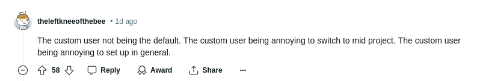

El 21 de Junio del 2024 inicié un hilo en reddit con la siguiente pregunta: "What would you improve about Django framework?" (¿Qué mejorarías de Django Framework?). La respuesta de la comunidad fue inmediata y la conversación se lleno rápidamente de sugerencias parar mejorar Django framework que van desde las modestas hasta algunas bastante radicales. Te resumo los resultados a continuación.


## ¿Mejorar Django Framework con type hints?

Este fue el comentario que recibió más apoyo de la comunidad. A pesar de que Python ya cuenta con Type Hints opcionales desde su versión 3.5, parece que su implementación con el propósito de modernizar Django Framework no parece ser una prioridad. 


La popularidad de los type hints es tal, que algunos usuarios que los consideran una mejora significativa al framework han desarrollado [una librería externa, llamada django-stubs](https://github.com/typeddjango/django-stubs#?), que se propone renovar a Django Framework con type hints.

### Los type hints ya fueron evualuados y rechazados

Sin embargo, según los usuarios de reddit, no hay mucho interés por parte de los encargados del código para incorporar estos cambios como parte del código. Incluso ha hanido [propuestas para incorporar los type hints en el repositorio oficial de Django](https://github.com/django/deps/pull/65#?), pero estos cambios han sido desestimados, probablemente debido a que consideran el tipado como una contradicción a la naturaleza de Python como un lenguaje dinámico. 



## Usar un User model personalizado en lugar del User model normal

El segundo comentario que recibió más apoyo afirma que personalizar el modelo User de Django es bastante complicado, sobre todo si se hace a mediados de un proyecto, específicamente cambiar el tipo de login por defecto de Django, de usuario a correo electrónico.



A pesar de que hay múltiples maneras de [personalizar el modelo User en Django](/es/como-personalizar-el-modelo-user-en-django/), tales como usar un modelo proxy, o heredar de *AbstractUser*, algunos usuarios consideran que esa solución se siente "hackish" (podríamos traducirlo como *forzada* o *chapucera*).



## Soporte para REST en Django sin librerías de terceros

A pesar de que Django cuenta con una de las mejores librerías para crear una aplicación que cumpla las [características de una API REST](/es/caracteristicas-basicas-de-una-api-rest/); DRF (Django Rest Framework). Los usuarios de reddit consideran que Django debería brindar soporte para las API REST "out of the box", como parte nativa del framework.

La anterior me parece una propuesta interesante pero también entiendo que, a pesar de la madurez de REST, darle preferencia sobre el resto de APIs, como por ejemplo el [moderno gRPC de Google](/es/libera-el-potencial-de-tu-api-con-grpc-y-protobuffers/), SOAP, o alguna API que aún no ha emergido, puede ser considerado como un paso bastante arriesgado por el comité de Django. Sí, inclusive aunque existan librerías completas basadas en REST, como [FastAPI](/es/python-fastapi-el-mejor-framework-de-python/)

## Leer las variables entorno en Django sin librerías de terceros

Django puede leer las variables de entorno utilizando directamente la librería *os* de Python, pero otras librerías, como [django-environ](https://django-environ.readthedocs.io/en/latest/#?), han sido desarrolladas para proveer una solución más robusta, en donde sea lea directamente desde un archivo *.env* y en donde la ausencia de una variable de entorno haga fallar la aplicación, garantizando que una aplicación de Django no pueda iniciar si falta tan solo una variable de entorno, que es lo que me imagino que los desarrolladores de este popular foro desean.

``` python
import os

os.environ["VARIABLE"]
```

### Otros frameworks que sí leen variables de entorno

Contrario a Django, Frameworks como Nextjs cargan las variables de entorno de manera predeterminada e inclusive te permiten volver públicas algunas de ellas mediante el prefijo *NEXT_PUBLIC_* pero en el caso de Django es necesario cargar las variables que se requieran de manera manual o utilizar una librería de terceros.

## Integración nativa de Django con el frontend

No es ningún secreto que el frontend ha recibido un impulso gigantesco en los últimos años, librerías como React, Vue, Svelte y otras han tomado un protagonismo remarcable en los últimos años, cambiando por completo el paradigma del desarrollo en el lado del cliente. Django se ha mostrado agnóstico respecto a la separación entre Backend y Frontend, probablemente porque [Django es un framework monolítico](/es/por-que-deberias-usar-django-framework/) (y lo digo de forma no peyorativa).

Supongo que algunos usuarios consideran que Django no debería quedarse atrás y debería proveer opciones de integración con algunas librerías frontend para favorecer la reactividad de las aplicaciones, tal como Nextjs hace desde algún tiempo, pues te permite seleccionar la librería frontend con la cual trabajar e inclusive se encarga de la minificación y el tree-shaking del código a través de Webpack o su compilador experimental escrito en Rust.

### Mejorar Django con HTMX

A mi me parece que Django ya hace un excelente trabajo con su sistema de plantillas y que combina perfectamente con [librerías como HTMX](/es/django-y-htmx-web-apps-modernas-sin-escribir-js/), para poder aprovechar todo el poder del hipertexto sin la necesidad de incorporar Javascript al proyecto.


Sin más que agregar te dejo el enlace a la discusión por si quieres ver el resto de [sugerencias sobre como mejorar Django Framework.](https://www.reddit.com/r/django/comments/1dlj5n6/what_would_you_improve_about_django_framework/#?)

## Otras sugerencias sobre cómo mejorar Django framework

Entre las demás sugerencias me gustaría destacar las siguientes, pues se recibieron un apoyo menor o se repitieron a lo largo del hilo:

- Mejor manejo de formularios
- Mejor manejo de contenido estático con énfasis en los frameworks frontend más populares
- Soporte "out of the box" para colas
- Recarga en caliente del navegador
- Generador básico de CRUD boilerplate
- Precarga automática de modelos relacionados.


### Sugerencias que terminaron siendo librerías de terceros

- [Tipos estáticos e inferencia de tipos para el framework Django](https://github.com/typeddjango/django-stubs/#?)
- [Manejo de formularios para Django con esteroides](https://docs.iommi.rocks/en/latest/#?)
- [CRUD para Django al instante](https://noumenal.es/neapolitan/#?)
