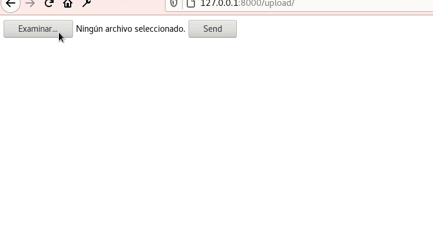

Seguramente ya sabes como subir una imagen usando un modelo de Django pero, ¿y si no queremos subir una sino múltiples imágenes?

## Generando un entorno virtual

Creemos primero un entorno virtual y entrémos en él.

Si no conoces Pipenv o no sabes como usarlo, revisa mi entrada sobre el [administrador de entornos virutales Pipenv.](https://coffeebytes.dev/pipenv-el-administrador-de-entornos-virtuales-que-no-conoces/)

```bash
pipenv shell
```

## Instalación de Django

Primero instalamos Django usando pipenv. Además instalaremos Pillow dado que trataremos con imágenes.

```bash
pipenv install django Pillow
```

A continuación vamos a crear un nuevo proyecto y entraremos en la carpeta recién creada.

Si no conoces los comandos de GNU/Linux tengo una serie de entradas [con los comandos más usados de GNU Linux](https://coffeebytes.dev/comandos-de-gnu-linux-basicos-que-deberias-conocer/)

```bash
django-admin startproject yourproject
cd yourproject/
```

Acto seguido, creemos una aplicación, y nombrémosle gallery.

```bash
django-admin startapp gallery
```

Recordemos instalar la nueva aplicación que creamos en el archivo _settings.py_

```python
# settings.py
INSTALLED_APPS = [
    # ...,
    'gallery'
]
```

## Creación de un modelo

Dentro de nuestra aplicación llamada _gallery_, vamos a crear un modelo con un campo de Imagen.

```python
from django.db import models

class gallery(models.Model):
    image = models.ImageField()
```

Corramos las migraciones para que los cambios en nuestra aplicación se vean reflejados en la base de datos.

```bash
python manage.py migrate
```

## Agregando plantillas

A continuación, creemos una carpeta llamada _templates_ para que aloje nuestra plantilla con el formulario.

```bash
mkdir templates
cd templates
touch index.html
```

Agreguemos la ubicación _templates_ a la configuración TEMPLATES de nuestro archivo de configuración; _settings.py_.

```python
# settings.py
TEMPLATES = [
    {
        'BACKEND': 'django.template.backends.django.DjangoTemplates',
        'DIRS': ['templates'],
        'APP_DIRS': True,
        'OPTIONS': {
            'context_processors': [
                'django.template.context_processors.debug',
                'django.template.context_processors.request',
                'django.contrib.auth.context_processors.auth',
                'django.contrib.messages.context_processors.messages',
            ],
        },
    },
]
```

## Un formulario para subir múltiples imágenes en Django

Para que nuestro input acepte múltiples imágenes agregamos el atributo _multiple_ a nuestro campo _input_.

Recuerda agregar el método POST y la etiqueta **__** para que tu formulario esté protegido.

```python
<!DOCTYPE html>
<html lang="en">
<head>
    <meta charset="UTF-8">
    <meta name="viewport" content="width=device-width, initial-scale=1.0">
    <title>Document</title>
</head>
<body>
  <form method="POST" enctype="multipart/form-data">
    
  <input type="file" name="images" multiple>
  <button type="submit">Send</button>
</form>    
</body>
</html>
```

## Creación de una vista subir múltiples imágenes en Django

Ahora en nuestra aplicación gallery, modifiquemos el archivo views para crear la vista que manejará nuestra subida de imágenes.

```python
from django.http import JsonResponse
from django.shortcuts import render
from .models import gallery

def handleMultipleImagesUpload(request):
    if request.method == "POST":
        images = request.FILES.getlist('images')

        for image in images:
            gallery.objects.create(image = image)

        uploaded_images = gallery.objects.all()
        return JsonResponse({"images": [{"url": image.image.url} for image in uploaded_images]})
    return render(request, "index.html")
```

Si hacemos una petición POST a esta vista obtendremos la lista de imágenes que subimos, luego crearemos un objeto nuevo por cada imágen que subimos y retornaremos la lista de imágenes con sus respectivas url como una respuesta JSON. De otra manera renderizaremos el formulario y lo retornaremos.

Con la vista ya creada, basta agregar la url a nuestro archivo _urls.py_ en la carpeta de nuestro proyecto.

## Agregando la url

Para facilitar el proceso vamos a importar la vista directamente y la asignaremos a la url _upload/_

```python
# urls.py
from django.contrib import admin
from django.urls import path
from gallery.views import handleMultipleImagesUpload

urlpatterns = [
    path('upload/', handleMultipleImagesUpload, name="home"),
    path('admin/', admin.site.urls),
]
```

Sí ahora accedemos a la dirección _upload/_ veremos nuestro botón para subir archivos y podremos subir múltiples imágenes.



Si la subida fue exitosa obtendremos como respuesta un JSON con las direcciones de las imágenes que acabamos que subir.

Aquí usamos Django para renderizar el formulario. Sin embargo, como ya sabrás, en lugar de renderizar un formulario, puedes limitar la función para que actué como una API. Y posteriormente consumirla realizando una petición POST con javascript.

Finalmente, si quieres profundizar en las funcionalidades de los campos _ImageField_ de Django, revisa [la documentación oficial.](https://docs.djangoproject.com/en/3.1/ref/models/fields/)
