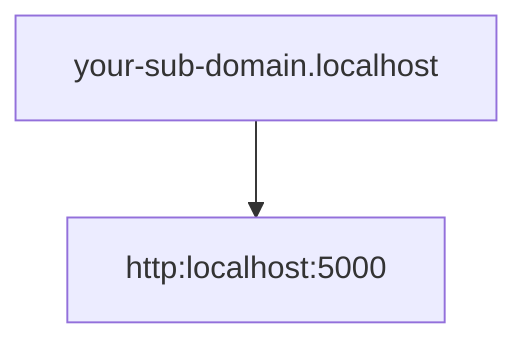

How to use Localhost using https instead of http?

## Why use https instead of http on localhost?

It is quite common to perform Oauth testing while performing integrations or some kind of integration with a third party application, the problem is that some third party providers are quite restrictive in this regard, they do not accept integrations or callbacks to URLs that do not use https. 

For example in the creation of apps on the X (formerly Twitter) or Facebook developer platforms. ~~Zuckerberg!~~

[Facebook developer portal callback needs https](https://res.cloudinary.com/dwrscezd2/image/upload/v1739482326/facebook-developer-app-https-callback_hmhesu.png "Facebook developer portal callback needs https")

There are several ways of dealing with this, one of them is to sign our own certificates manually, but let's skip that and do it the quick and easy way.



## Https localhost server with Caddy

[Caddy](https://github.com/caddyserver/caddy#?) is a server written in [Go programming language](/en/go-programming-language-introduction-to-variables-and-data-types/), known to be easy peasy to configure (Unlike [configuring Nginx](/en/nginx-keepalive-gzip-http2-best-performance-on-your-web-site/)), and it also includes *https* by default.


It is so simple to set up that it only requires a simple file called Caddyfile, with no extension. You can think of the latter as the equivalent of a [Dockerfile in Docker](/en/how-to-write-a-caddyfile-file-from-zero/).

Install it following the instructions according to your OS and create the *Caddyfile*.

``` bash
your-sub-domain.localhost {
    reverse_proxy http://localhost:5000
}

```

The sub-domain part is just to be able to isolate your app from the rest of the applications serving on localhost. 

The above configuration will create a reverse proxy that will redirect traffic on *your-sub-domain.localhost* to port 5000 of your localhost. Remember to replace the port with the port of your choice.



Finally just run *caddy run*, or *caddy start* if you want a detached run, in the directory where the *Caddyfile* is located and caddy will create a *reverse proxy* to your localhost on the port you specified.

### Solution 1 to error: Caddy “listen tcp :<port_number>: bind: permission denied”.

If you get a permission denied error while trying to run caddy, it is because Linux prevents non-root processes from listening on major ports such as 443 or 80.

To allow caddy to listen on those ports and allow [linux to assign the required permissions](/en/understand-permissions-on-gnu-linux-and-command-chmod/), run the following command.


``` bash
sudo setcap CAP_NET_BIND_SERVICE=+eip $(which caddy)
```

### Solution 2 to error: Caddy “listen tcp :<port_number>: bind: permission denied”.

Another posibility is that caddy was already running, to which you have to stop it and run it again

``` bash
caddy stop
caddy start
```

Afterwards you should be able to access your-sub-domain.localhost or your-sub-domain.localhost:443 via *https* in your browser, [the curl command](/en/basic-commands-linux-printenv-export-lsof-top-ps-kill-curl-systemctl-chown-chroot/) or whatever tool you prefer to use.