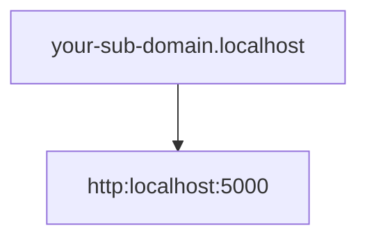

¿Cómo usar Localhost usando https en lugar de http?

## ¿Por qué usar https en lugar de http en localhost?

Es bastante común realizar integraciones donde probamos Oauth o algún tipo de integración con alguna aplicación de terceros, y muchas son bastante restrictivas al respecto, por lo que no aceptan integraciones o enviar callbacks a direcciones que no usen https. 

Por ejemplo en la creación de apps en las plataformas de desarrollador de X (antes Twitter) o Facebook. ~~Te odiamos zucaritas.~~


Existen múltiples soluciones para esto, una de ellas es firmar nuestros propios certificados de manera manual, pero vamos a hacer esto de la manera rápida y fácil.



## Servidor localhost con https usando Caddy

[Caddy](https://github.com/caddyserver/caddy#?) es un servidor escrito en el [lenguaje de programación Go](/es/go-lenguaje-de-programacion-introduccion-a-variables-y-tipos-de-datos/), conocido por ser muy sencillo de configurar (pan comido en comparación con [una configuración de Nginx](/es/nginx-keepalive-gzip-http2-mejor-rendimiento-en-tu-sitio-web/)), y que además incluye *https* por defecto.


Es tan sencillo de configurar que solo requiere un simple archivo llamado Caddyfile, sin extensión. Puedes pensar en el archivo anterior como el equivalente de un [Dockerfile en Docker.](/es/como-escribir-un-archivo-de-dockerfile-desde-cero/)

Instálalo de acuerdo a las instrucciones de tu SO y crea el *Caddyfile*.

``` bash
your-sub-domain.localhost {
    reverse_proxy http://localhost:5000
}

```

El subdominio es solo para poder aislarla del resto de aplicaciones que sirven en localhost. 

La configuración anterior creará un reverse proxy o proxy inverso que redigirá el tráfico en *your-sub-domain.localhost* hacia el puerto 5000 de localhost. Recuerda reemplazar el puerto por el que prefieras.



Finalmente solo basta correr *caddy run*, o *caddy start* si quieres una ejecución detached, en el directorio donde se localiza el *Caddyfile* y caddy creará un *proxy inverso* hacia tu localhost en el puerto que especificaste.

### Solución al error: Caddy "listen tcp :<port_number>: bind: permission denied"

Si al intentar correr caddy obtienes un error de permiso denegado, se debe a que Linux impide que procesos no-root escuchen los puertos principales como el 443 o el 80.

Para permitir que [linux asigne el permiso](/es/entiende-los-permisos-en-gnu-linux-y-el-comando-chmod/) de escuchar en esos puertos a caddy, corre el siguiente comando.


``` bash
sudo setcap CAP_NET_BIND_SERVICE=+eip $(which caddy)
```

Tras esto deberías poder acceder a your-sub-domain.localhost o a your-sub-domain.localhost:443 a través de *https* en tu navegador, [el comando curl](/es/comandos-basicos-de-linux-printenv-export-lsof-top-ps-kill-curl-systemctl-chown-chroot/) o la herramienta que prefieras usar.

