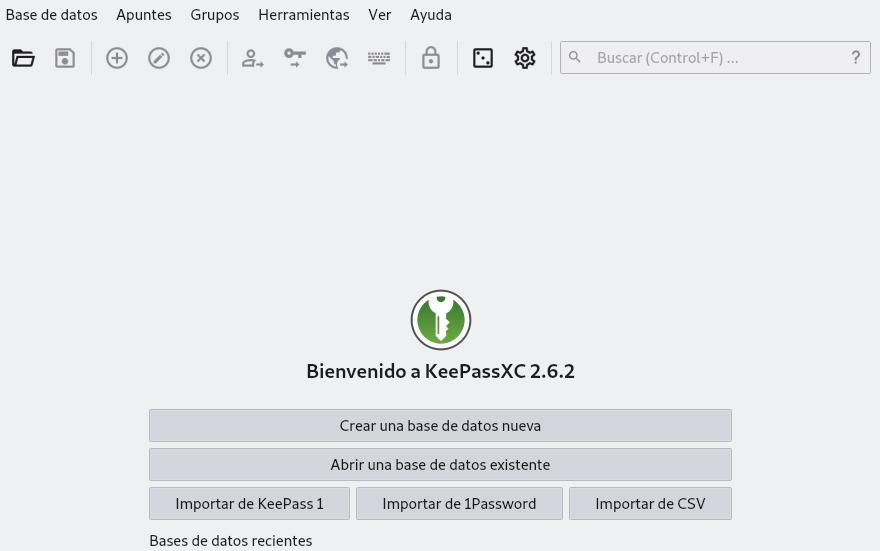
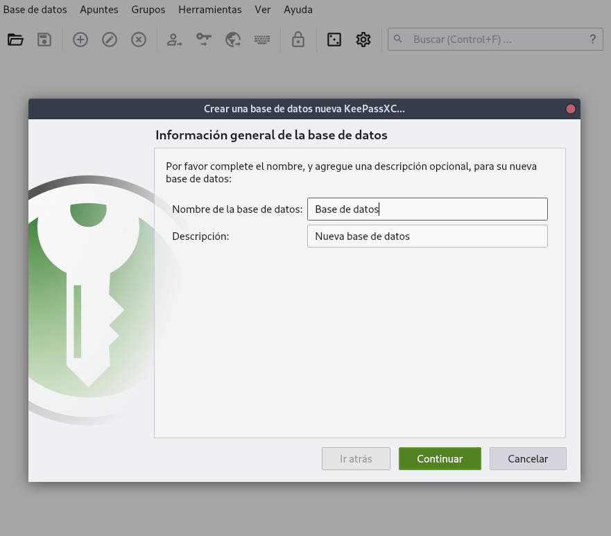
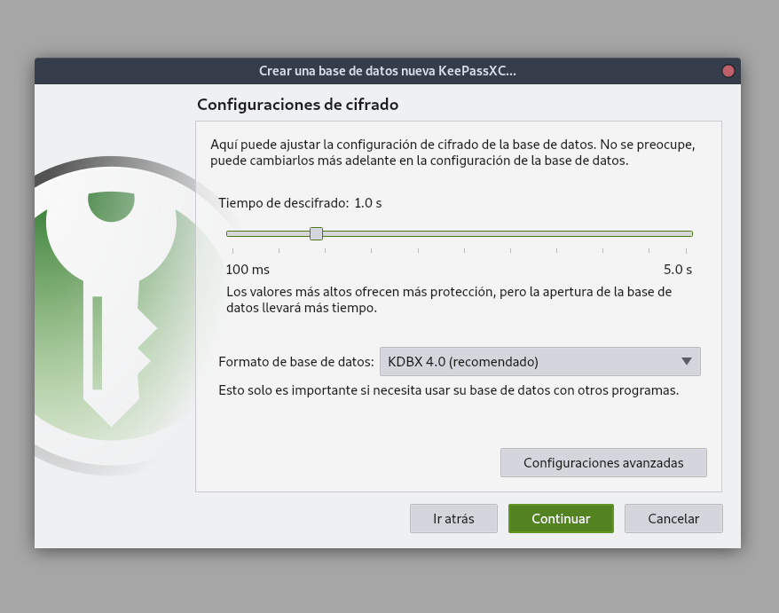
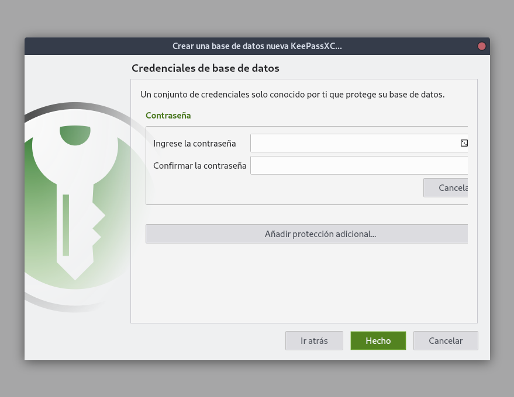
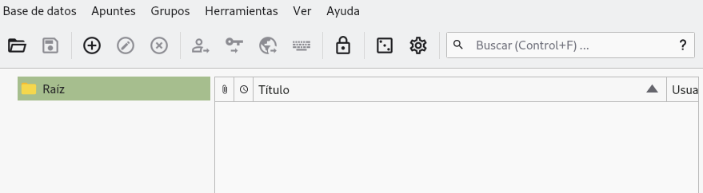
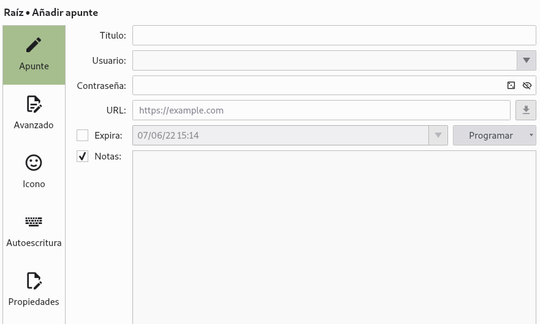
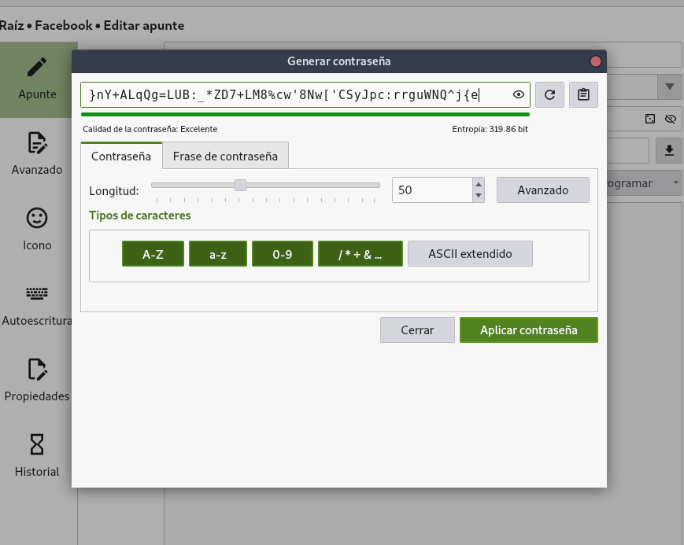
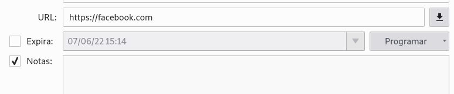
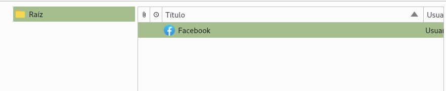

In the previous post I talked about some [good practices using passwords](/blog/how-to-create-a-secure-password/). One of the recommendations was to use a different password for each website. However, remembering many passwords is complicated and saving passwords in plain text is unthinkable if we value our computer security at all. There are quite a few password managers available, this post is a tutorial of keepassxc, a **free, open source and super secure** password manager.

## Why not use the firefox or chrome password manager?

I am one of those who believe that **the less sensitive information a third party has the better**. Websites or browsers that offer password management services are quite an attractive booty for people with bad intentions, and many times we don't know if the person behind the servers is capable enough to maintain a secure system.

Who hasn't heard of massive leaks of user data at even the largest companies? For this reason I prefer to keep my passwords inside my computer and using a program whose source code is visible to anyone who wants to examine it.

## keepassxc

keepassxc is the program I prefer to manage passwords. The code can be found at [the keepassxc page](https://keepassxc.org/) you can download it or compile it directly from their repositories.

## Installing keepassxc

To install keepassxc we can do it from the command line as long as it is in the repositories of your GNU/Linux distribution

```bash
sudo apt install keepassxc
```

If the installation was successful we will be able to run it from its icon or from the terminal.

```bash
keepassxc
```

When we open the program it will show us the "Welcome" legend. Once in this point we will create a new database, to do it we click on the Database menu.



Decide on a name and description for the database.



Then it will ask for the decryption time. If you do not know what this is for, leave it as it is.



Now the program will ask us to enter a master password and confirm it. **This is the only password you will need to remember** and it is also the one you will need to access the rest of the passwords. For this reason you should **make sure that the password is strong enough and also that you are able to remember it**, otherwise the rest of your passwords will be inaccessible to you.



Once we have done that, a folder will be created on the left side. We can create other folders to organize our passwords.

## Generate a password in keepassxc

To create a new password click on the icon with the plus sign.



This will bring up a form where we can specify the title, username, password, website url, an optional expiration date and a note, also optional.

Click on the dice to have keepassxc generate a new password.



We can choose whether to create a password ourselves or ask the program to generate it automatically. And we can choose two modes:

* Password: Based on random characters
* Passphrase: Based on random words



In both cases we can choose the length of the password, whether we want to use uppercase, lowercase or special characters, as well as make sure that the password includes characters from all groups.

## Download icon with keepassxc

We can also ask keepassxc to download the website's favicon, just to make it look nice in the password list.



Once the options have been set, click on Accept. If we press the icon with the image of the eye it will show us the password created.



The program will save the records and display them in its right pane. If we right click on the entry we have just created we can copy the username or password to the clipboard to use it as we wish. **For security reasons the program makes sure that the password we pass to the clipboard is only available for a short period of time **.

## How does Keepassxc store passwords?

Keepassxc stores all our encrypted passwords in a file with extension _.kdbx_. You can try to read the contents of the file using the _cat_ command and you will notice that **the passwords are not stored in plain text**, but encrypted, so you will only see meaningless characters.

```bash
cat archivo.kdbx

�.�ٞ��;��5 E����x���]w?l[K��6�d���KУ��)R�NR(4C����ݠ���
                              V�P����4+����ׁ˪q��^��H�ljAhR�Yc��Bߒ_Z���<���C�[��W�]ސ�o�ӎ �*쑜�����i9.�e���}`�9	uܼJ+��v�~RLf����y�8�I(~E}�M��bÄ�h@'2��|#$�8�D%|�;~j:
��0�x��K�UϥÈ	�mL~`i5���p�k�᭾Ԉ��c��.�׏�k���oE'i�"o�����v5�⚂��v�p8"�n��[so�.�gȣև�H��V&�(g.���0���_w:�s�@�
3�"�o���|���7&_f=#W��ۡK=I<]}��j@]$��hMX�oʭr���f�׹��	�Z���O,�}�
��+�Q{�hs�����?�$�ҥUZ)���w!���v�:ݜ9A�ò����уQ�x
```

The file containing your passwords can be backed up on a usb or even uploaded to the web. **If someone wants to see your passwords they will need the master password you created** as well as the file with extension _kdbx_, both.

It is important to remind you again that this file will store your passwords, so **if you lose it, delete it or forget the master password you will have lost access to all your accounts**. It is paramount to always have a backup in a safe place.

Now you can have any number of passwords stored and, if you chose to create them randomly, each one of them will be different from the rest and will be completely secure against brute force attacks, while you will only need to keep a single password memorized.