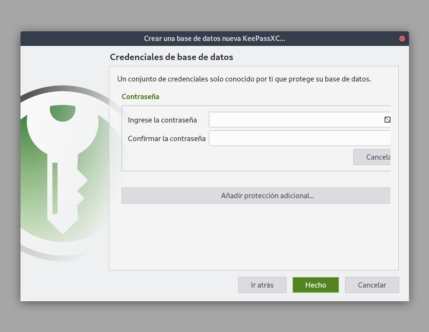
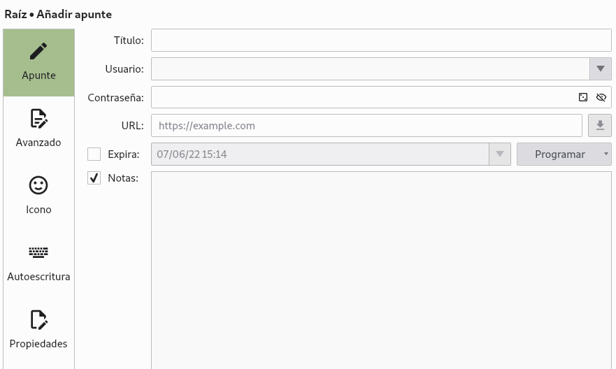

En la entrada anterior hablé acerca de algunas [buenas practicas usando contraseñas](/es/como-crear-una-contrasena-segura/). Uno de las recomendaciones era usar una contraseña diferente para cada sitio web. Sin embargo recordar muchas contraseñas es complicado y guardar las contraseñas en texto plano es algo impensable si valoramos un poco nuestra seguridad informática. Hay bastante gestores de contraseñas disponibles, esta entrada es un tutorial de keepassxc, un gestor de contraseñas **gratuito, open source y súper seguro.**

## ¿Por qué no usar el gestor de contraseñas de firefox o chrome?

Yo soy de los que creen que **mientras menos información sensible tenga un tercero mucho mejor**. Las páginas o navegadores que que ofrecen servicios de administración de contraseñas son un botín bastante atractivo para personas con malas intenciones, y muchas veces no sabemos si la persona que está detrás de los servidores es lo suficientemente capaz de mantener un sistema seguro. 

¿Quién no ha oído de filtraciones masivas de datos de usuarios incluso en las empresas más grandes? Por esta razón yo prefiero mantener mis contraseñas dentro de mi computadora y usando un programa cuyo código fuente esté a la vista de cualquiera que quiera examinarlo.

## keepassxc

keepassxc es el programa que yo prefiero para gestionar contraseñas. El código se encuentra en [la página de keepassxc](https://keepassxc.org/) puedes descargarlo o compilarlo directo desde sus repositorios.

## Instalando keepassxc

Para instalar keepassxc podemos hacerlo desde la linea de comandos siempre y cuando se encuentre en los repositorios de tu distribución de GNU/Linux

```bash
sudo apt install keepassxc
```

Si la instalación se llevó a cabo exitosamente podremos ejecutarlo desde su icono o desde la terminal.

```bash
keepassxc
```

Al abrir el programa nos mostrará la leyenda de "Bienvenido". Una vez en este punto crearemos una nueva base de datos, para hacerlo hacemos click en el menú Base de datos.


Decide un nombre y una descripción para la base de datos.


A continuación nos pedirá el tiempo de descifrado. Si no sabes para que sirve esto déjalo como esta.


Ahora el programa nos pedirá ingresar una contraseña maestra y confirmarla. **Esta es la única contraseña que necesitarás recordar** y también es la que necesitarás para acceder al resto de las contraseñas. Por esta razón debes **asegurarte de que la contraseña sea lo suficientemente fuerte y también que seas capaz de recordarla**, de otra forma el resto de tus contraseñas serán inaccesibles para ti.



Una vez que hayamos hecho eso se nos creará una carpeta del lado izquierdo. Podemos crear otras carpetas para organizar nuestras contraseñas.

## Generar una contraseña en keepassxc

Para crear una contraseña nueva hacemos click en el icono que contiene el símbolo de suma.


Esto nos arrojará un formulario donde podemos especificar el título, el nombre de usuario, la contraseña, la url del sitio web, una fecha de caducidad opcional y una nota, también opcional.

Presiona el dado para que keepassxc genere una nueva contraseña.



Podemos elegir si crear una contraseña nosotros mismos o pedirle al programa que la genere automáticamennte. Y podemos elegir dos modalidades:

* Contraseña: Basada en caracteres aleatorios
* Frase de contraseña: Basada en palabras aleatorias


En ambos casos podremos elegir la longitud de la contraseña, si queremos que use mayúsculas, minúsculas o caracteres especiales, así como asegurarnos de que la contraseña incluya caracteres de todos los grupos. 

## Descargar ícono con keepassxc

También podemos pedirle a keepassxc que descargue el favicon del sitio web, solo para que se vea bonito en la lista de contraseñas.


Una vez puestas las opciones le daremos click a Aceptar. Si presionamos el icono con la imagen del ojo nos mostrará la contraseña creada.


El programa guardará los registros y los mostrará en su panel derecho. Si le damos click derecho en la entrada que acabamos de crear podemos copiar el nombre de usuario o la contraseña al portapapeles para usarlo a nuestro gusto. **Por razones de seguridad el programa se encarga de que la contraseña que pasemos al portapapeles solamente esté disponible por un corto periodo de tiempo.**

## ¿Cómo guarda Keepassxc las contraseñas?

Keepassxc guarda todas nuestras contraseñas cifradas en un archivo con extension _.kdbx_. Puedes intentar leer el contenido del archivo usando el comando _cat_ y te darás cuenta de que **las contraseñas no están almacenadas en texto plano**, sino cifradas, por lo que solo verás caracteres sin sentido alguno.

```bash
cat archivo.kdbx

�.�ٞ��;��5 E����x���]w?l[K��6�d���KУ��)R�NR(4C����ݠ���
                              V�P����4+����ׁ˪q��^��H�ljAhR�Yc��Bߒ_Z���<���C�[��W�]ސ�o�ӎ �*쑜�����i9.�e���}`�9	uܼJ+��v�~RLf����y�8�I(~E}�M��bÄ�h@'2��|#$�8�D%|�;~j:
��0�x��K�UϥÈ	�mL~`i5���p�k�᭾Ԉ��c��.�׏�k���oE'i�"o�����v5�⚂��v�p8"�n��[so�.�gȣև�H��V&�(g.���0���_w:�s�@�
3�"�o���|���7&_f=#W��ۡK=I<]}��j@]$��hMX�oʭr���f�׹��	�Z���O,�}�
��+�Q{�hs�����?�$�ҥUZ)���w!���v�:ݜ9A�ò����уQ�x
```

El archivo que contiene tus contraseñas puedes respaldarlo en una usb o incluso subirlo a la web. **Si alguien quiere ver tus contraseñas necesitará la contraseña maestra que creaste** para así como el archivo con extensión _kdbx_, ambos. 

Es importante recordarte de nuevo que este archivo almacenará tus contraseñas, por lo que **si lo pierdes, borras u olvidas la contraseña maestra habrás perdido el acceso a todas tus cuentas.** Es muy importante tener siempre un respaldo en un lugar seguro.

Ahora podrás tener cualquier cantidad de contraseñas almacenadas y, si elegiste crearlas aleatoriamente, cada una de ellas será distinta del resto y además serán completamente seguras ante ataques de fuerza bruta, mientras tanto tú solo necesitarás mantener memorizada una sola contraseña.
