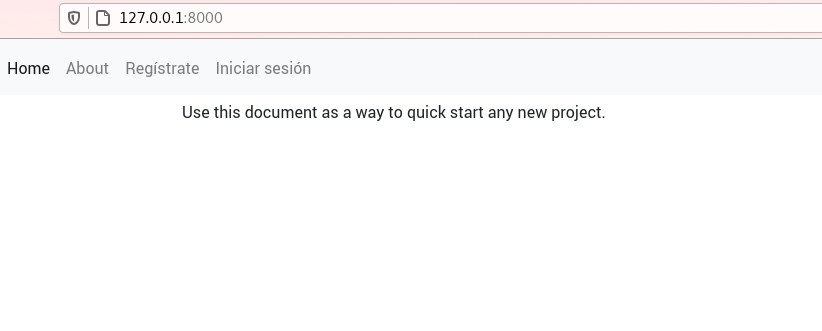
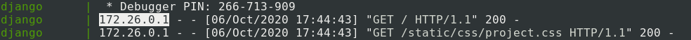

---
aliases:
- /cookiecutter-django-for-configuring-and-deploying-in-django/
title: "Cookiecutter-django for configuring and deploying in Django"
date: "2020-10-20"
categories:
- "django"
- "docker"

coverImage: "images/tutorial-cookiecutter-django-docker-compose.jpg"
coverImageCredits: "credits https://www.pexels.com/es-es/@alex-andrews-271121/"
description: "Don't know how to use or what a cookiecutter is for in Django? Come in and learn for free how to use this tool that will make your life easier."
keywords:
- docker
- django
- python
- docker compose
- celery
- drf
- aws
- deploy

authors:
- Eduardo Zepeda
---

I wrote the previous entries as an introduction for this week's topic. In this post I'm going to explain about a cool tool for Django called cookiecutter-django. This tool for django allows you to generate projects that integrate docker, celery, mailhog, aws, gcp, and many other tools, in an automatic way, just by answering a series of questions.

This tool uses docker to simplify the process of developing and deploying a Django application. It was also created by one of the writers of the great book Two scoops of Django, of which I have a [review of Twoo scoops of django](/en/the-best-django-book-two-scoops-of-django-review/)

Don't know what Docker is? Visit my post where I talk about [containers and Docker](/en/basic-commands-basic-docker-tutorial/) in case you don't know how to use it. If you already know how to use Docker, and want to take a look at [docker compose](/en/get-to-know-the-basic-docker-compose-commands/).

If you doubt about whether you should use Django visit my post where I explain some [advantages and disadvantages of this web development framework](/en/why-should-you-use-django-framework/)

## What is Cookiecutter Django for?

You've probably ever used a cookie cutter, it's a small mold that you press against the dough to shape a cookie. Using a cookie cutter guarantees that all your cookies will come out nice and uniform. Well, a cookiecutter is exactly that, it's a template that you use to create a project and shape it.

There are cookiecutters for many technologies and many people end up programming their own, according to their needs. The one we are going to talk about today is the most popular cookiecutter for Django. This tool provides us with the following:

* A uniform folder arrangement
* An authentication system
* CRUD of user accounts
* Password recovery
* Hosting configuration for your static files
* Use of Django Rest Framework
* Configuration for email services
* Docker compose files for both development and production ready to be used
* Integration with Heroku
* And many other options

Django's cookiecutter gives us a customizable template ready to go, with the most popular libraries saving us the hassle of having to set up a project from scratch.

## Install cookiecutter

Cookiecutter should be available in the repositories of our GNU/Linux system. So we can install it as if it were any other package.

```bash
sudo apt install cookiecutter
```

Or it can also be installed using pip

```bash
pip install cookiecutter
```

Once we have it available we will pass as the only argument the [address of the official cookiecutter-django github repository](https://github.com/pydanny/cookiecutter-django)

```bash
cookiecutter https://github.com/pydanny/cookiecutter-django
```

### Project configuration

Next, a script will ask us a series of questions to configure the project almost automatically. Each question has a default value that is inside square brackets, if we do not specify any, it will use that value.

In the code snippets I place the answers I chose for this example or an empty space for the default value.

### Project data

```bash
project_name [My Awesome Project]: DjangoProject
description [Behold My Awesome Project!]: this is a test project
author_name [Daniel Roy Greenfeld]: Eduardo Zepeda
domain_name [example.com]: mydomain.com
email [eduardo-zepeda@example.com]: 
version [0.1.0]:
```

This first set of questions is fairly self-explanatory. The name of our project, its slug, its description, the author's name, the domain that will redirect to our project, our email and the version of our code.

**It is necessary to have a domain name for the project to work correctly**. In case you don't have a domain you can still run the script, but there will be problems when using it in production.

### Project license

```bash
Select open_source_license:
1 - MIT
2 - BSD
3 - GPLv3
4 - Apache Software License 2.0
5 - Not open source
Choose from 1, 2, 3, 4, 5 [1]:
```

Your project license. The world of licensing is a topic of its own. If you know absolutely nothing about licensing [use TLDRlegal](https://tldrlegal.com/) for guidance.

### Timezone, Windows and Pycharm

```bash
timezone [UTC]: 
windows [n]: 
use_pycharm [n]:
```

Timezone for our project, is the value that will take the TIMEZONE variable in our Django configuration file. It also asks us if the project should be configured to be used with windows and [Pycharm](https://www.jetbrains.com/es-es/pycharm/).

### Database

```bash
Select postgresql_version:
1 - 12.3
2 - 11.8
3 - 10.8
4 - 9.6
5 - 9.5
Choose from 1, 2, 3, 4, 5 [1]:
```

Subsequently the installer asks us the version of Postgresql that we want to use. Postgresql is an open source database engine, **I recommend that you choose the newest version**, unless of course you have a specific reason to choose an older version.

At the moment cookiecutter-django does not offer another database version, although it should be quite easy to change it in the django configuration and adapting the Docker files.

### Gulp

```bash
Select js_task_runner:
1 - None
2 - Gulp
Choose from 1, 2 [1]:
```

Now it asks us if we want to use Gulp or nothing as our task preprocessor. If you don't know what Gulp is, Gulp allows us to automate tasks like minimizing code, detecting errors, optimizing images in the frontend code, it's something quite similar to webpack but that people have been leaving behind in favor of the latter.

### Cloud storage

```bash
Select cloud_provider:
1 - AWS
2 - GCP
3 - None
Choose from 1, 2, 3 [1]: 3
```

Where do we want to host our static and media files? The options are Amazon Web Services, Google Cloud Platform or none.

### Mail server

```bash
Select mail_service:
1 - Mailgun
2 - Amazon SES
3 - Mailjet
4 - Mandrill
5 - Postmark
6 - Sendgrid
7 - SendinBlue
8 - SparkPost
9 - Other SMTP
Choose from 1, 2, 3, 4, 5, 6, 7, 8, 9 [1]:
```

Our email configuration is still missing and this question takes care of that, it shows us the available options for [Django-Anymail](https://github.com/anymail/django-anymail).

### Asynchronism

```bash
use_async [n]:
```

If the project will use websockets with Uvicorn + Gunicorn

### Django Rest Framework

```bash
use_drf [n]: y
```

Configure our project to use the Django Rest Framework

### Django compressor

```bash
use_compressor [n]:
```

Django compressor is a tool that takes the javascript and css files from our HTML files and minifies and concatenates them, with the option of placing their content inline; directly as part of the HTML file.

### Compiling boostrap

```bash
custom_bootstrap_compilation [n]:
```

An option to allow bootstrap recompilation using the task preprocessor specified above.

### Celery

```bash
use_celery [n]:
```

Celery is a task queue manager, it is ideal [for asynchronous processes such as time-consuming tasks](/en/celery-and-django-to-run-asynchronous-tasks/); sending e-mails, database queries, time-consuming mathematical calculations, etc.

### Test mail server

```bash
use_mailhog [n]:
```

Mailhog is a tool that intercepts email output from our application, allowing us to test the sending of emails.

### Error monitoring

```bash
use_sentry [n]:
```

Sentry is a real-time error and bottleneck monitoring tool.

### Whitenoise

```bash
use_whitenoise [n]: y
```

Whitenoise allows us to serve static files directly from Django. As you may know, it is not the most suitable option but this application **offers a solution for those cases where it is impossible to modify the configuration of a web server**.

In the project configuration it is necessary to choose whitenoise or one of the file hosting options (AWS or GCP). If we do not choose any of them cookiecutter will give us an error.

### Heroku

```bash
use_heroku [n]:
```

By now you must know the **PaaS** Heroku, they are tools that facilitate the deployment of an application. If we choose the option "y" cookiecutter will configure the project to take it to Heroku.

### Continuous integration

```bash
Select ci_tool:
1 - None
2 - Travis
3 - Gitlab
4 - Github
Choose from 1, 2, 3, 4 [1]: 1
```

Cookiecutter-django also allows us to choose a continuous integration (CI) tool or leave it blank. The options are Travis, Gitlab, Github or none.

### Environment variables in version control

```bash
keep_local_envs_in_vcs [y]:
```

It asks us if we want to manage [the local environment variables](/en/linux-basic-commands-lsof-top-ps-kill-systemctl-chown-chroot/) within the version control system.

### Debug, for django-cookiecutter development

```bash
debug [n]:
```

Finally there is debug, which is only relevant if you are contributing to the development of cookiecutter-django.

## Django project structure in cookiecutter

Once we have answered all the questions, the resulting project structure for this example will be as follows:

```bash
.
├── compose
│   ├── local
│   └── production
├── config
│   ├── api_router.py
│   ├── __init__.py
│   ├── settings
│   ├── urls.py
│   └── wsgi.py
├── CONTRIBUTORS.txt
├── docs
│   ├── conf.py
│   ├── __init__.py
│   ├── make.bat
│   ├── Makefile
│   └── _source
├── LICENSE
├── locale
│   └── README.rst
├── local.yml
├── manage.py
├── merge_production_dotenvs_in_dotenv.py
├── production.yml
├── proyecto_de_django
│   ├── conftest.py
│   ├── contrib
│   ├── __init__.py
│   ├── static
│   ├── templates
│   ├── users
│   └── utils
├── pytest.ini
├── README.rst
├── requirements
│   ├── base.txt
│   ├── local.txt
│   └── production.txt
└── setup.cfg
```

### The Django Dockerfiles in cookiecutter

The compose folder contains both development (local) and production (production) Dockerfiles. The development version has a single Dockerfile, while the production version contains one for Django, one for Postgres and one for Traefik.

```bash
.
.
├── local
│   ├── django
│   └── docs
└── production
    ├── django
    ├── postgres
    └── traefik
```

### About Traefik

Traefik is a load balancer and reverse proxy server (just like Nginx)m written primarily in the go programming language. With the configuration that Cookiecutter includes, Traefik will handle the traffic and also manage the SSL certificates for our website automatically, so you can forget about configuring a web server and leave the customizations for later.

### Configuration files

Config contains the urls.py file of our project and the configuration files of the Django project, we have separate files for production and development, as well as a base file with the configuration in common.

```bash
.
├── api_router.py
├── __init__.py
├── settings
│   ├── base.py
│   ├── __init__.py
│   ├── local.py
│   ├── production.py
│   └── test.py
├── urls.py
└── wsgi.py
```

### Translations

Locale will be populated with the translation files of our Django project if we run the _python manage.py makemessages_ command.

```bash
.
└── README.rst
```

### Our project

The folder with the name that we indicate for our project will have the static files, applications and templates on which we will work.

```bash
.
├── conftest.py
├── contrib
├── __init__.py
├── static
├── templates
├── users
└── utils
```

### Requirements in Python

Requirements includes the files with the dependencies of our project. They are also separated according to their function, in base, local or production.

```bash
.
├── base.txt
├── local.txt
└── production.txt
```

### Environment variables

There is also a secret folder named _.envs_, which contains the environment variables to be used in the configuration files, both production and development.

```bash
.
├── .local
│   ├── .django
│   └── .postgres
└── .production
    ├── .django
    └── .postgres
```

It is necessary to change the .envs/.production/.django file to add our Mailgun configuration, and modify our admin address if we want to.

```bash
DJANGO_SECRET_KEY=aqui_va_tu_secret_key
DJANGO_ADMIN_URL=tu_propia_url/
DJANGO_ALLOWED_HOSTS=.midominio.com

DJANGO_SERVER_EMAIL=

MAILGUN_API_KEY=
MAILGUN_DOMAIN=
```

## Development with docker compose

To start developing, we just need to pull up our docker-compose local.yml file.

```bash
docker-compose -f local.yml
```

If everything went well we will have a server running on our port 8000.



Remember to run the migrations and create a super user.

```bash
docker-compose -f local.yml run --rm django python manage.py migrate
docker-compose -f local.yml run --rm django python manage.py createsuperuser
```

Once you have done this you may want to start modifying your project folder.

### Enabling django-debug-toolbar in cookiecutter django

To activate the django-debug-toolbar let's first enter our application by entering [localhost](http://127.0.0.1:8000), now in our terminal we will see an IP address



This address will be placed in the INTERNAL_IPS variable in our configuration file _local.py_.

```python
# config/settings/local.py
# https://django-debug-toolbar.readthedocs.io/en/latest/installation.html#internal-ips
INTERNAL_IPS = ["127.0.0.1", "10.0.2.2", "172.26.0.1"]
```

Done, now we have an active django-debug-toolbar

### Check processes and logs in the services

Remember that, as in any docker container, we can access to its logs with _docker logs._

```python
docker logs servicio
docker top servicio
```

In the same way your processes are available with the command _docker top_.

```python
docker logs servicio
docker top servicio
```

### Fill in the settings values

Remember that for this example we do not use celery, flower, mailhog or aws, to keep the configuration simple. However, if you choose to use them when creating your project, each service would have its own ip to access; localhost:5555, for flower; localhost:8025, for mailhog.

In addition, each service you have chosen will have environment or configuration variables (not included in this example) that will need to be specified for them to work properly.

## Deploy Django in production with docker compose and cookiecutter

To make a deploy the most complicated thing to understand is the structure of the project, which I explained above, once we have understood the function of each folder the deploy is quite simple.

To start running our services in production mode just run the docker-compose command, specifying our file with the _-f_ option and the command, in this case _build_, to compile the image.

```bash
docker-compose -f production.yml build
```

Now let's lift the services and run them in detach mode, with the _-d_ option

```bash
docker-compose -f production.yml up -d
```

If you need to make a migration remember that we use the run command with the name of our service and the command to execute.

```bash
docker-compose -f production.yml run --rm django python manage.py migrate
```

Keep in mind that you must create a super user as well.

```bash
docker-compose -f production.yml run --rm django python manage.py createsuperuser
```

If something went wrong you can view the logs of all services using the command logs

```bash
docker-compose -f production.yml logs
```

If you have no errors you will be able to access your website through your domain.

The next step is to add our service to some process controller, so that it is immune to reboots, you can use runit, sysinit, supervisord or the hated systemd, each system is different and there are many preferences, so I will not delve into it here.

Theoretically you can perform this procedure in any PAAS, such as [Digital Ocean](/en/digital-ocean-analysis-and-my-experience-as-a-user/), Linode, etc. I have done the procedure using a Docker Droplet on Digital Ocean and it went fine. The author has instructions for other platforms that you can check at [the official cookiecutter-django documentation](https://cookiecutter-django.readthedocs.io/en/latest/index.html).

Visit my next post, where I talk [about one of the newest Python frameworks for creating APIs](/en/fastapi-tutorial-the-best-python-framework/).