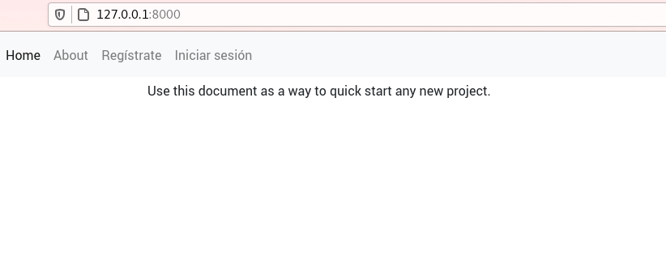
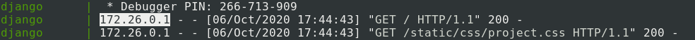

Escribí las entradas anteriores como una introducción para el tema de esta semana. En esta entrada voy a explicar sobre una herramienta genial para Django llamada cookiecutter-django, que traducido significa "cortador de galletas django". Esta herramienta para django permite generar proyectos que integren docker, celery, mailhog, aws, gcp, y muchas otras herramientas, de una manera automática, con solo contestar una serie de preguntas.

Esta herramienta usa docker para hacer más sencillo el proceso de desarrollo y deploy de una aplicación de Django. Además fue creada por uno de los escritores del genial libro Two scoops of Django, del cual tengo una [reseña de Twoo scoops of django](https://coffeebytes.dev/el-mejor-libro-de-django-resena-de-two-scoops-of-django/)

¿No sabes que es Docker? Visita mi entrada donde hablo de [los contenedores y Docker](https://coffeebytes.dev/aprende-docker-curso-practico-con-ejemplos-en-gnu-linux/) en caso de que no sepas usarlo. Si ya sabes usar Docker, y quieres darle una revisa a compose, entra en mi tutorial de Docker Compose.

Si dudas sobre si deberías usar Django visita mi entrada donde te explico algunas [ventajas y desventajas de este framework de desarrollo web.](https://coffeebytes.dev/por-que-deberias-usar-django-framework/)

## ¿Para que sirve Cookiecutter Django?

Probablemente has usado alguna vez un cortador de galletas, es un pequeño molde que presionas contra la masa para darle forma a una galleta. Usar un cortador de galletas garantiza que todas tus galletas saldrán bien y serán uniformes. Bien, pues un cookiecutter es exactamente eso, es una plantilla que se usa para crear un proyecto y que le da forma.

Hay cookiecutters para muchas tecnologías y muchas personas terminan programando los suyos, acorde a sus necesidades. Del que vamos a hablar hoy es el cookiecutter para Django más popular. Esta herramienta nos provee de lo siguiente:

- Un acomodo de carpetas uniforme
- Un sistema de autenticación
- CRUD de cuentas de usuario
- Recuperación de contraseñas
- Configuración de hosting para tus archivos estáticos
- Uso de Django Rest Framework
- Configuración para servicios de correo electrónico
- Archivos de docker compose tanto para desarrollo como para producción listos para usarse
- Integración con Heroku
- Y muchos otras opciones

El cookiecutter de Django nos da una plantilla personalizable lista para empezar, con las librerías más populares evitándonos la molestia de tener que configurar un proyecto desde cero.

## Instalar cookiecutter

Cookiecutter debería estar disponible en los repositorios de nuestro sistema GNU/Linux. Por lo que podemos instalarlo como si fuera cualquier otro paquete.

```bash
sudo apt install cookiecutter
```

O también se puede instalar usando pip

```bash
pip install cookiecutter
```

Una vez que lo tengamos disponible le pasaremos como único argumento la [dirección del repositorio de github oficial de cookiecutter-django.](https://github.com/pydanny/cookiecutter-django)

```bash
cookiecutter https://github.com/pydanny/cookiecutter-django
```

### Configuración del proyecto

A continuación, un script nos hará una serie de preguntas para configurar el proyecto de manera casi automática. Cada pregunta tiene un valor por defecto que se encuentra dentro de corchetes, si no especificamos ninguno usará ese valor.

En los fragmentos de código coloco las respuestas que elegí para este ejemplo o un espacio vacío para el valor por defecto.

### Datos del proyecto

```bash
project_name [My Awesome Project]: proyecto de django        
project_slug [proyecto_de_django]: 
description [Behold My Awesome Project!]: Este es un proyecto de prueba usando Django y Docker
author_name [Daniel Roy Greenfeld]: Eduardo Zepeda
domain_name [example.com]: midominio.com
email [eduardo-zepeda@example.com]: 
version [0.1.0]:
```

Esta primera serie de preguntas son bastante explicativas por si mismas. El nombre de nuestro proyecto, su slug, su descripción, el nombre del autor, el dominio que redirigirá a nuestro proyecto, nuestro email y la versión de nuestro código.

**Es necesario tener un nombre de dominio para que el proyecto funcione correctamente**. En caso de que no tengas un dominio aún así puedes correr el script, pero habrá problemas a la hora de usarlo en producción.

### Licencia del proyecto

```bash
Select open_source_license:
1 - MIT
2 - BSD
3 - GPLv3
4 - Apache Software License 2.0
5 - Not open source
Choose from 1, 2, 3, 4, 5 [1]: 
```

La licencia de tu proyecto. El mundo de las licencias ya es un tema por si mismo. Si no sabes absolutamente nada de licencias [usa TLDRlegal](https://tldrlegal.com/) para orientarte.

### Timezone, Windows y Pycharm

```bash
timezone [UTC]: 
windows [n]: 
use_pycharm [n]: 
```

Timezone para nuestro proyecto, es el valor que tomará la variable TIMEZONE en nuestro archivo de configuración de Django. Nos pregunta además si el proyecto debe configurarse para usarse con windows y [Pycharm](https://www.jetbrains.com/es-es/pycharm/).

### Base de datos

```bash
Select postgresql_version:
1 - 12.3
2 - 11.8
3 - 10.8
4 - 9.6
5 - 9.5
Choose from 1, 2, 3, 4, 5 [1]: 
```

Posteriormente el instalador nos pregunta la versión de Postgresql que queremos usar. Postgresql es un motor de base de datos open source, **yo te recomiendo que elijas la versión más nueva**, a menos claro que tengas una razón específica para elegir una versión antigua.

Por el momento cookiecutter-django no ofrece otra versión de base de datos, aunque debería ser bastante sencillo cambiarla en la configuración de django y adaptando los archivos de Docker.

### Gulp

```bash
Select js_task_runner:
1 - None
2 - Gulp
Choose from 1, 2 [1]: 
```

Ahora nos pregunta si queremos usar Gulp o nada como nuestro preprocesador de tareas. Si no sabes que es Gulp, Gulp nos permite automatizar tareas como minimizar código, detectar errores, optimizar imágenes en el código frontend, es algo bastante parecido a webpack pero que la gente ha ido dejando atrás en favor de este último.

### Almacenamiento en la nube

```bash
Select cloud_provider:
1 - AWS
2 - GCP
3 - None
Choose from 1, 2, 3 [1]: 3
```

¿Donde queremos alojar nuestros archivos estáticos y de media? Las opciones corresponden a Amazon Web Services, Google Cloud Platform o ninguno.

### Servidor de correo

```bash
Select mail_service:
1 - Mailgun
2 - Amazon SES
3 - Mailjet
4 - Mandrill
5 - Postmark
6 - Sendgrid
7 - SendinBlue
8 - SparkPost
9 - Other SMTP
Choose from 1, 2, 3, 4, 5, 6, 7, 8, 9 [1]: 
```

Aún falta nuestra configuración de correo electrónico y de eso se encarga esta pregunta, nos muestra las opciones disponibles para [Django-Anymail.](https://github.com/anymail/django-anymail)

### Asincronismo

```bash
use_async [n]:
```

Si el proyecto usará websockets con Uvicorn + Gunicorn

### Django Rest Framework

```bash
use_drf [n]: y
```

Configura nuestro proyecto para usar Django Rest Framework

### Django compressor

```bash
use_compressor [n]: 
```

Django compresor es una herramienta que se encarga de tomar los archivos de javascript y css de nuestros archivos HTML y los minifica y concatena, con opción de colocar su contenido inline; directamente como parte del archivo HTML

### Compilación de boostrap

```bash
custom_bootstrap_compilation [n]: 
```

Una opción para permitir la recompilación de bootstrap usando el preprocesador de tareas que especificamos más arriba.

### Celery

```bash
use_celery [n]: 
```

Celery es un gestor de colas de tareas, es ideal para procesos asíncronos como tareas muy costosas en tiempo; envíos de correos electrónicos, consultas en base de datos, cálculos matemáticos muy tardados, etc.

### Servidor de correo de pruebas

```bash
use_mailhog [n]:
```

Mailhog es una herramienta que intercepta la salida de correo electrónico por parte de nuestra aplicación, por lo que nos permite hacer pruebas con el envío de correos.

### Monitoreo de errores

```bash
use_sentry [n]: 
```

Sentry es una herramienta de monitoreo de errores y cuellos de botella en tiempo real.

### Whitenoise

```bash
use_whitenoise [n]: y
```

Whitenoise nos permite servir archivos estáticos directo desde Django. Como ya sabrás, no es la opción más adecuada pero esta aplicación **ofrece una solución para aquellos casos donde es imposible modificar la configuración de un servidor web**.

En la configuración del proyecto es necesario elegir whitenoise o alguna de las opciones para alojamiento de archivos (AWS o GCP). Si no elegimos ninguno cookiecutter nos dará un error.

### Heroku

```bash
use_heroku [n]: 
```

Ya a estas alturas debes conocer la **PaaS** Heroku, son herramientas que facilitan el deploy de una aplicación. Si elegimos la opción "y" cookiecutter configurará el proyecto para que lo llevemos a Heroku.

### Integración continua

```bash
Select ci_tool:
1 - None
2 - Travis
3 - Gitlab
4 - Github
Choose from 1, 2, 3, 4 [1]: 1
```

Cookiecutter-django también nos permite elegir una herramienta de integración continua (CI) o dejarla en blanco. Las opciones son Travis, Gitlab, Github o ninguna.

### Variables de entorno en control de versiones

```bash
keep_local_envs_in_vcs [y]: 
```

Nos pregunta si queremos manejar las variables de entorno local dentro del sistema de control de versiones.

### Debug, para desarrollo de django-cookiecutter

```bash
debug [n]: 
```

Por último está debug, que es solo relevante si estás contribuyendo al desarrollo de cookiecutter-django.

## Estructura del proyecto de Django en cookiecutter

Una vez que hayamos contestado todas las preguntas, la estructura del proyecto resultante para este ejemplo será la siguiente:

```bash
.
├── compose
│   ├── local
│   └── production
├── config
│   ├── api_router.py
│   ├── __init__.py
│   ├── settings
│   ├── urls.py
│   └── wsgi.py
├── CONTRIBUTORS.txt
├── docs
│   ├── conf.py
│   ├── __init__.py
│   ├── make.bat
│   ├── Makefile
│   └── _source
├── LICENSE
├── locale
│   └── README.rst
├── local.yml
├── manage.py
├── merge_production_dotenvs_in_dotenv.py
├── production.yml
├── proyecto_de_django
│   ├── conftest.py
│   ├── contrib
│   ├── __init__.py
│   ├── static
│   ├── templates
│   ├── users
│   └── utils
├── pytest.ini
├── README.rst
├── requirements
│   ├── base.txt
│   ├── local.txt
│   └── production.txt
└── setup.cfg
```

### Los Dockerfiles de Django en cookiecutter

La carpeta compose contiene los Dockerfiles tanto de desarrollo (local) como de producción (production). La versión de desarrollo tiene un único Dockerfile, mientras que la de producción contiene uno para Django, otro para Postgres y otro para Traefik

```bash
.
.
├── local
│   ├── django
│   └── docs
└── production
    ├── django
    ├── postgres
    └── traefik
```

### Sobre Traefik

Traefik es un balanceador de carga y un servidor proxy inverso (justo como Nginx)m escrito principalmente en el lenguaje de programación go. Con la configuración que incluye Cookiecutter, Traefik se encargará de manejar el tráfico y además de gestionar los certificados SSL para nuestro sitio web de manera automática, por lo que puedes olvidarte de la configuración de un servidor web y dejar las personalizaciones para después.

### Archivos de configuración

Config contiene el archivo urls.py de nuestro proyecto y los archivos de configuración del proyecto de Django, tenemos archivos separados para producción y desarrollo, así como un archivo base con la configuración en común.

```bash
.
├── api_router.py
├── __init__.py
├── settings
│   ├── base.py
│   ├── __init__.py
│   ├── local.py
│   ├── production.py
│   └── test.py
├── urls.py
└── wsgi.py
```

### Traducciones

Locale se llenará con los archivos de traducciones de nuestro proyecto de Django si ejecutamos el comando _python manage.py makemessages_.

```bash
.
└── README.rst
```

### Nuestro proyecto

La carpeta con el nombre que indicamos para nuestro proyecto tendrá los archivos estáticos, aplicaciones y plantillas sobre las que trabajaremos.

```bash
.
├── conftest.py
├── contrib
├── __init__.py
├── static
├── templates
├── users
└── utils
```

### Requirements en Python

Requirements incluye los archivos con las dependencias de nuestro proyecto. Así mismo están separados de acuerdo a su función, en base, local o producción.

```bash
.
├── base.txt
├── local.txt
└── production.txt
```

### Variables de entorno

También existe una carpeta secreta con el nombre de _.envs_, la cual contiene las variables de entorno que se usarán en los archivos de configuración, tanto de producción como de desarrollo.

```bash
.
├── .local
│   ├── .django
│   └── .postgres
└── .production
    ├── .django
    └── .postgres
```

Es necesario cambiar el archivo .envs/.production/.django para agregarle nuestra configuración de Mailgun, y modificar nuestra dirección de admin si así lo queremos.

```bash
DJANGO_SECRET_KEY=aqui_va_tu_secret_key
DJANGO_ADMIN_URL=tu_propia_url/
DJANGO_ALLOWED_HOSTS=.midominio.com

DJANGO_SERVER_EMAIL=

MAILGUN_API_KEY=
MAILGUN_DOMAIN=
```

## Desarrollo con docker compose

Para empezar a desarrollar basta con levantar nuestro archivo de docker-compose local.yml.

```bash
docker-compose -f local.yml
```

Si todo salió bien tendremos un servidor corriendo en nuestro puerto 8000



Recuerda correr las migraciones y crear un super usuario.

```bash
docker-compose -f local.yml run --rm django python manage.py migrate
docker-compose -f local.yml run --rm django python manage.py createsuperuser
```

Una vez hecho esto quizás querrás empezar a modificar la carpeta de tu proyecto.

### Activar django-debug-toolbar en cookiecutter django

Para activar la django-debug-toolbar vamos a entrar primero a nuestra aplicación entrando a [localhost](http://127.0.0.1:8000), ahora en nuestra terminal veremos una dirección IP



Esta dirección la colocaremos en la variable INTERNAL\_IPS de nuestro archivo de configuración _local.py_

```python
 # config/settings/local.py
# https://django-debug-toolbar.readthedocs.io/en/latest/installation.html#internal-ips
INTERNAL_IPS = ["127.0.0.1", "10.0.2.2", "172.26.0.1"]
```

Listo, ahora ya tenemos una django-debug-toolbar activa

### Revisar procesos y logs en los servicios

Recuerda que, como en cualquier contenedor de docker, podemos acceder a sus logs con _docker logs._

```python
docker logs servicio
docker top servicio
```

De la misma manera sus procesos están disponibles con el comando _docker top_

```python
docker logs servicio
docker top servicio
```

### Llena los valores de configuraciones

Recuerda que para este ejemplo no utilizamos celery, ni flower, ni mailhog, ni aws, para mantener la configuración simple. Sin embargo, si eliges usarlos al momento de crear tu proyecto, cada servicio tendría sus propias ip para acceder; localhost:5555, para flower; localhost:8025, para mailhog.

Además, cada servicio que hayas elegido tendrá variables de entorno o de configuración (que no incluyo en este ejemplo) que será necesario especificar para que funcionen adecuadamente.

## Deploy de Django en producción con docker compose y cookiecutter

Para hacer un deploy lo más complicado de entender es la estructura del proyecto, la cual ya expliqué arriba, una vez que hayamos comprendido la función de cada carpeta el deploy es bastante sencillo.

Para empezar a correr nuestros servicios en modo de producción basta con ejecutar el comando docker-compose, especificando nuestro archivo con la opción _\-f_ y el comando, en este _build_, para compilar la imágen.

```bash
docker-compose -f production.yml build
```

Ahora levantemos los servicios y corramoslos en modo detach, con la opción _\-d_

```bash
docker-compose -f production.yml up -d
```

Si requieres hacer una migración recuerda que usamos el comando run con el nombre de nuestro servicio y el comando a ejecutar.

```bash
docker-compose -f production.yml run --rm django python manage.py migrate
```

Ten presente que debes crear un super usuario también.

```bash
docker-compose -f production.yml run --rm django python manage.py createsuperuser
```

Si algo salió mal puedes ver los registros de todos los servicios usando el comando logs

```bash
docker-compose -f production.yml logs
```

Si no tienes errores ya podrás acceder a tu sitio web a través de tu dominio.

El siguiente paso es agregar nuestro servicio a algún controlador de procesos, para que se inmune a reinicios, puedes usar runit, sysinit, supervisord o el odiado systemd, cada sistema es diferente y preferencias hay muchas, por lo que no ahondaré en ello aquí.

Teóricamente puedes realizar este procedimiento en cualquier PAAS, tal como [Digital Ocean](https://coffeebytes.dev/digital-ocean-analisis-y-mi-experiencia/), Linode, etc. Yo he hecho el procedimiento usando un Droplet de Docker en Digital Ocean y ha salido bien. El autor tiene instrucciones para otras plataformas que puedes consultar en [la documentación oficial de cookiecutter-django](https://cookiecutter-django.readthedocs.io/en/latest/index.html).

Visita mi siguiente entrada, donde hablo [de uno de los frameworks más nuevos de Python para crear APIs](https://coffeebytes.dev/python-fastapi-el-mejor-framework-de-python/).
