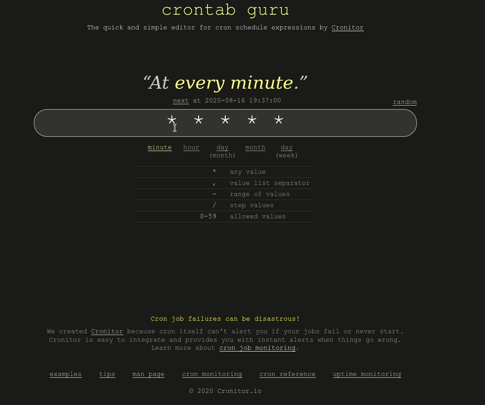

---
aliases:
- /cron-y-crontab-programa-tareas-periodicas
- /cron-y-crontab-programa-tareas-periodicas/feed/
- /cron-y-crontab-programa-tareas-periodicas/programa_tareas_periodicas_con_cron/
- /programa-tus-tareas-periodicas-con-cron-y-crontab-en-gnulinux/
- /es/cron-y-crontab-programa-tareas-periodicas/
authors:
- Eduardo Zepeda
categories:
- linux y devops
coverImage: images/programa_tareas_periodicas_con_cron.jpg
date: '2020-02-01'
description: Aprender a usar crontab para programar tareas repetitivas como respaldos
  de base de datos, envío de emails, de manera periódica en GNU/Linux usando Cron
  y Crontab.
keywords:
- linux
- crontab
title: Programa tareas periódicas fácil en Linux con Cron y Crontab
---

Muchas veces queremos ejecutar un script o un comando cada cierto tiempo, por ejemplo cuando queremos realizar backups periódicos de una base de datos, enviar a tus suscriptores un correo electrónico de recordatorio, o quizás eliminar archivos de cache cada cierta cantidad de tiempo. Cron, en conjunción con Crontab te permiten correr una tarea cada cierto tiempo.

Una manera bastante ingenua sería crear un script y utilizar el método _time.sleep()_ de Python, o su equivalente en otro lenguaje, para retrasar su ejecución por el tiempo deseado. Sin embargo no necesitamos reinventar la rueda; alguien ya se encargó de esta tarea en GNU/Linux.

## El daemon cron y comandos básicos

Cron es un daemon, disponible en muchas distribuciones de GNU/Linux, que lee un archivo localizado en la ruta _/var/spool/cron/crontabs/tu\_usuario_ y ejecuta las tareas que estén especificadas ahí, siempre y cuando su horario especificado de ejecución sea el adecuado.

Para revisar el contenido del archivo que será revisado por el daemon Cron usaremos el comando _crontab_ con la opción _\-l_ a continuación

```bash
crontab -l
```

Este archivo **no debe editarse directamente**, la manera correcta de modificarlo es ejecutando el comando _crontab_, seguido de la opción -e

```bash
crontab -e
```

Esto nos abrirá nuestro editor de texto de terminal predeterminado. Al revisar el contenido veremos que la mayoría del texto está comentado. Justo al final del archivo podremos encontrar estas lineas, las cuales nos especifican el formato que usaremos para programar nuestras tareas.

```bash
# m h  dom mon dow   command
```

El significado de cada elemento de esa linea es el siguiente:

- \# Sirve para mantener la linea comentada, no lo remuevas.
- m significa minutos (minutes)
- h significa horas (hours)
- dom significa día del mes (day of month)
- mon significa mes (month)
- dow significa día de la semana (day of week)
- command significa comando

Para decirle a cron como ejecutar una tarea llenaremos lineas en el archivo crontab siguiendo el patrón anterior. Por ejemplo:

```bash
# m h  dom mon dow   command
* * * * * script.py
```

Esta configuración ejecutaría el archivo _script.py_ cada minuto, de cada hora, de cada día del mes, de cada mes, de cada día de la semana.

```bash
# m h  dom mon dow   command
0 6 * * * script.py
```

Por otro lado, la configuración anterior ejecutaría _script.py_ cada día a las 6:00 a.m.

```bash
# m h  dom mon dow   command
0 6 * * 1 script.py
```

Esta de aquí ejecutará _script.py_ cada lunes a las 6:00 a.m. Nota que crontab cuenta el domingo como el día 0 y también es el día 7, así mismo puedes usar las primeras tres letras en inglés de cada día, es decir, podemos reemplazar el 1 por 'mon', sin las comillas.

```bash
# m h  dom mon dow   command
0 6 30 * * script.py
```

Esta configuración ejecutará nuestro script el día 30 de cada mes a las 6:00 a.m.

```bash
# m h  dom mon dow   command
0 6 30 12 * script.py
```

Y por último esta configuración ejecutaría el comando el día 30 de diciembre a las 6:00 a.m.

¿Confundido? Es normal, yo creo que toma un poco de tiempo. De cualquier manera al final de esta entrada te comparto una herramienta genial para facilitarte el crear y entender estas configuraciones.



## Algunos ejemplos más complejos

Quizás queremos algo más complejo que los ejemplos anteriores, ¿qué tal si tenemos un script que se encarga de pagarle a los empleados y queremos que se ejecute todos los días 1 y 15 de cada mes? **En crontab podemos separar tantos valores como deseemos usando comas**.

```bash
# m h  dom mon dow   command
0 9 1,15 * *  script.py
```

Y si queremos que un script que se ejecute cada hora, pero solo durante la madrugada de los sábados y domingos, desde las 12:00 a.m. hasta las 6:00 a.m. **Crontab permite especificar rangos de valores usando guiones**

```bash
# m h  dom mon dow   command
0 0-6 * * 6,7  script.py
```

¿Qué tal si nos gustaría cambiar de wallpaper cada 6 horas? No hay problema, **podemos usar una diagonal en crontab para establecer periodos de tiempo.**

```bash
# m h  dom mon dow   command
0 */6 * * *  script.py
```

## El entorno de ejecución de Crontab

El entorno de ejecución de crontab es un entorno mínimo, donde la mayoría de los programas, configuraciones y otras personalizaciones que tenemos configuradas estarán ausentes, por lo que es importante que no des por hecho que ciertos comandos estarán ahí. 

Por ejemplo el simple hecho de cambiar la terminal de */bin/sh* a */bin/bash* ya nos priva de usar herramientas como *source*. Probablemente si estás usando entornos virtuales en Python u otro tipo de personalización tendrás que especificarlo directamente.

## Crontab y las variables de entorno

**Hay algo muy importante que debemos recordar cada vez que utilicemos Crontab; las variables de entorno.** Normalmente en un sistema GNU/Linux tenemos una serie de variables de entorno, las cuales podremos visualizar usando el comando _printenv_ en terminal. Intenta ejecutar el comando en tu terminal para que veas la gran cantidad de variables de entorno que tiene tu sistema. Las variables de entorno pueden variar enormemente de acuerdo al usuario, pero lo importante es apreciar que son bastantes.

```bash
printenv
...
USER=usuario
DESKTOP_SESSION=default
QT_QPA_PLATFORMTHEME=qgnomeplatform
...
```

Por otro lado si tu obtienes las variables de entorno que están activas cuando usas Crontab podrás notar que son muchas menos. **Los procesos que Cron ejecute desde Crontab no tiene acceso a todas las variables de entorno.**

```bash
PATH=/usr/bin:/bin
LANG=es_MX.UTF-8
HOME=/home/usuario
LANGUAGE=es_MX:es
DBUS_SESSION_BUS_ADDRESS=unix:path=/run/user/1000/bus
SHELL=/bin/sh
LOGNAME=usuario
PWD=/home/usuario
```

Observa como el shell por defecto es */bin/sh* en lugar de */bin/bash*

¿Y esto porque es importante? Porque a veces programamos tareas que requieren de variables de entorno para poder ejecutarse correctamente y, si Crontab no puede acceder a ellas, pues fallará al ejecutarlas. Una vez más, **recuerda que crontab no tiene acceso a todas las variables de entorno de manera predeterminada.**

### ¿Cómo establecer variables de entorno en crontab?

Para usar variables de entorno es necesario cargarlas de manera manual, concatenando el comando que las cargas con el comando que queremos que se ejecute.

``` bash
* * * * * . ./.env; script.py
```

Dos cosas importantes a recordar aquí:
- Cron ejecuta los comandos desde root, así que asegúrate de incluir la ruta completa.
- No tienes comandos disponibles en bash, porque cron usa /bin/sh, así que para cargar variables de entorno usa un punto "." en lugar de *source*.

## Cómo emular el entorno de ejecución de cron

A veces queremos depurar y encontrar el porqué cierto script no se ejecuta como queremos. Para hacerlo, encontré la [siguiente solución en stackoverflow](https://stackoverflow.com/questions/2135478/how-to-simulate-the-environment-cron-executes-a-script-with#?)

``` bash
* * * * env > ~/cronenv
```

Espere sólo un segundo para que se ejecute, y luego empieza a experimentar en este nuevo shell.

``` bash
env - `cat ~/cronenv` /bin/sh
```

## Crontab guru Una herramienta bastante útil

Como ya te has dado cuenta a veces la configuración puede complicarse demasiado y si no lo hacemos bien puede haber consecuencias; sencillas, como que nuestro script cambie de wallpaper cada minuto en lugar de cada hora; o graves, como que nuestro respaldo no se efectúe con la periodicidad deseada. Imagínate que, sin desearlo, programaste el respaldo de la base de datos una vez cada año en lugar de una vez cada veinticuatro horas, vas a pasar un mal rato si la base de datos llega a fallar.

Para evitarnos disgustos existe una herramienta bastante útil llamada [crontab.guru](https://crontab.guru#?). Esta herramienta se encargará de traducir tu configuración a simple y sencillo inglés, fácil de entender. Si tienes dudas sobre si la configuración que acabas de escribir es realmente la correcta, puedes teclearla en la página web y te mostrará el resultado en inglés.



Si quieres aplicar cron y crontab, tengo una entrada donde los uso para [cambiar de wallpaper automáticamente usando Python.](/es/como-programar-un-cambiador-de-wallpaper-automatico-en-python/)