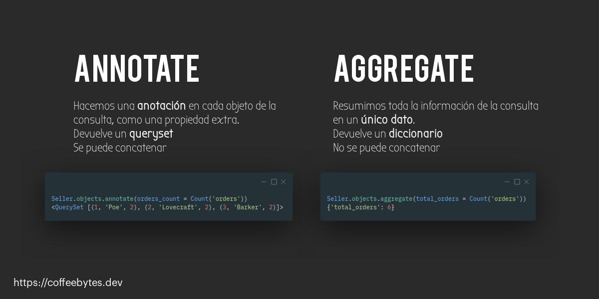

La pantalla del ordenador iluminó mi rostro lleno de desesperación, me froté la cabeza con desesperación, mientras buscaba en google: "Django annotate"; una de las funciones del ORM que no lograba comprender. ¿Te ha pasado también?, apuesto que sí. Ya había leído la documentación pero no me pareció lo suficientemente clara y, para colmo, la confundía frecuentemente con su gemela malvada: aggregate. Tras haber visitado varias preguntas de stackoverflow y múltiples blogs en inglés pude entenderlas a ambas. Estas notas son el resultado de esa búsqueda, es la explicación sobre annotate y aggregate de Django que a mi me hubiera gustado leer hace años.

Este tutorial da por hecho que conoces lo básico sobre el ORM de Django, en caso de que no, tengo un enlace a un libro gratuito en mi entrada sobre la [guia definitiva de Django.](https://coffeebytes.dev/la-guia-definitiva-de-django/)

Annotate y aggregate son útiles para [mejorar el rendimiento de aplicaciones lentas en Django](https://coffeebytes.dev/como-mejorar-el-rendimiento-de-una-aplicacion-hecha-en-django/)



## Preparación

Para este ejemplo vamos a crear un par de modelos ficticios que usaremos para los ejemplos:

Para este ejemplo se usó Django 3.0 y Python 3.8.6

```python
# app/models.py
from django.db import models

class Seller(models.Model):
    name = models.CharField(max_length=150)

class Order(models.Model):
    seller = models.ForeignKey(Seller, related_name="orders", on_delete=models.PROTECT)
    total = models.DecimalField(max_digits=18, decimal_places=9)
```

Tras aplicar las migraciones, el código anterior creará dos modelos: vendedor (Seller) y pedido (Order). Un vendedor puede tener muchos pedidos. Un pedido corresponde a un único vendedor y tiene un total, expresado en números decimales.

A continuación voy a crear unos cuantos datos a manera de ejemplo. Tú puedes hacerlo en el admin de Django o directo en la base de datos.

### Tabla para vendedor

| Id | Name  
 |     |
 | --- | --------- |
 | 1   | Poe       |
 | 2   | Lovecraft |
 | 3   | Barker    |

### Tabla para pedido

| Id  | Total | seller\_id |
| --- | ----- | ---------- |
| 1   | 100   | 1          |
| 2   | 200   | 1          |
| 3   | 300   |
| 2   |
|     |
| 4   | 400   | 2          |
| 5   |
| 500 | 3     |
| 6   | 600   | 3          |

Antes de hablar sobre annotate y aggregate hay que asegurarnos de saber como obtener la consulta SQL que hará Django.

## ¿Cómo convertir un queryset a SQL?

Probablemente ya conozcas el ORM de django y lo hayas usado para hacer búsquedas en la base de datos. Pero existe algo que muchas personas ignoran: **es posible obtener la consulta, antes de que Django la procese y ejecute, imprimiendo la propiedad query de nuestros querysets.**

Esa consulta debe tener asociada una consulta, en lenguaje SQL, a la cual podemos acceder imprimiendo la propiedad query.

```python
print(Seller.objects.all().query)
SELECT "app_seller"."id", "app_seller"."name" FROM "app_seller"
```

Conocer la consulta que realizará Django nos ayuda a entender que está sucediendo tras el ORM. Esto será de utilidad para profundizar en _annotate_.

## Annotate

### ¿Por qué usar annotate?

Usamos _annotate_ **cuando queremos hacer una anotación en cada objeto que nos devuelva de un queryset**, como si quisiéramos agregar una propiedad extra a cada objeto de tu queryset, pero directo desde la base de datos.

Annotate es muy útil para realizar [búsquedas avanzadas de texto usando Postgres](https://coffeebytes.dev/trigramas-y-busquedas-avanzadas-con-django-y-postgres/).

Imagínate que queremos mostrar en una plantilla de Django cada vendedor, seguido de la suma del total de todos sus pedidos.

La aproximación burda sería algo parecido a esto

```python
# app/models.py
# NO HAGAS ESTO, ES INEFICIENTE

class Seller(models.Model):
    name = models.CharField(max_length=150)

    def get_order_sum(self):
        total_sum = 0
        for order in self.orders.all():
            print(self.orders.all().query)
            # Puedes verlo en la terminal
            total_sum += order.total
        return total_sum
```

Para mostrarlo en código HTML, usando el sistema de plantillas, llamaríamos al método una vez por cada elemento de nuestra lista de vendedores.

```html

  {{ seller.get_order_sum }}

```

Sin usar _annotate_ en Django necesitaríamos un query para la lista de vendedores y uno extra por cada vendedor, cuando son 3 vendedores, como aquí, no hay problema, pero ¿y si fueran 100 o 200 o más? Cada petición va ser muy costosa en tiempo y recursos.

Si examinas las queries verás una query diferente para cada vendedor.

```bash
SELECT ••• FROM "app_seller"
# La consulta anterior es para obtener todos los vendedores
SELECT ••• FROM "app_order" WHERE "app_order"."seller_id" = '1'
SELECT ••• FROM "app_order" WHERE "app_order"."seller_id" = '2'
SELECT ••• FROM "app_order" WHERE "app_order"."seller_id" = '3'
```

Annotate puede reducir el número de consultas a la base de datos y con ello mejorar el tiempo que tarda nuestro servidor en devolver una respuesta.

### ¿Cómo usar annotate en django?

En Django, annotate **crea una anotación para cada uno de los elementos de nuestro queryset y devuelve el resultado como un queryset.**

```python
from app.models import Seller
from django.db.models import Sum

sellers_with_orders_total = Seller.objects.annotate(orders_total = Sum('orders__total'))
print(sellers_with_orders_total.query)
SELECT "app_seller"."id", "app_seller"."name", CAST(SUM("app_order"."total") AS NUMERIC) AS "orders_total" FROM "app_seller" LEFT OUTER JOIN "app_order" ON ("app_seller"."id" = "app_order"."seller_id") GROUP BY "app_seller"."id", "app_seller"."name"
```

Mira la consulta, nos devolverá cada linea de la base de datos (vendedor) con una anotación extra llamada _orders\_total_, o el nombre que le hayamos asignado, que corresponde a la suma de los totales de sus respectivos pedidos.

El mismo resultado que antes... ¡pero en un solo query!

```python
sellers_with_orders_total[0].orders_total
Decimal('300')
# Los pedidos asociados a Poe suman 300
```

También podríamos contarlos, en lugar de sumarlos.

```python
from app.models import Seller
from django.db.models import Sum, Count

sellers_with_orders_count = Seller.objects.annotate(orders_count = Count('orders'))
print(sellers_with_orders_count.query)
SELECT "app_seller"."id", "app_seller"."name", COUNT("app_order"."id") AS "orders_count" FROM "app_seller" LEFT OUTER JOIN "app_order" ON ("app_seller"."id" = "app_order"."seller_id") GROUP BY "app_seller"."id", "app_seller"."name"
```

Ahora, cada elemento del queryset poseerá una propiedad llamada _orders\_count_, que será igual al conteo de los pedidos que tiene, en este caso cada uno de los vendedores cuenta con dos pedidos.

```python
sellers_with_orders_count[0].orders_count
2
```

### Concatenar con annotate

Como mencioné al principio; _annotate_ devuelve un _queryset_, **por lo que podemos concatenar múltiples annotate para una sola consulta a la base de datos.**

```python
from app.models import Seller
from django.db.models import Sum, Count

combined_querysets = Seller.objects.annotate(orders_count = Count('orders')).annotate(orders_total = Sum('orders__total'))
print(combined_querysets.query)
SELECT "app_seller"."id", "app_seller"."name", COUNT("app_order"."id") AS "orders_count", CAST(SUM("app_order"."total") AS NUMERIC) AS "orders_total" FROM "app_seller" LEFT OUTER JOIN "app_order" ON ("app_seller"."id" = "app_order"."seller_id") GROUP BY "app_seller"."id", "app_seller"."name"
```

Observa como usamos el doble guión bajo para acceder a la propiedad "total" del objeto Order desde Sellers, como harías en cualquier queryset de Django.

Ahora cada elemento contiene tanto el conteo de sus pedidos, como el total de estos, todo en **una sola consulta a la base de datos.**

```python
combined_querysets[0].orders_total 
Decimal('300')
# El total de los pedidos de Poe suman 300
combined_querysets[0].orders_count 
2
# Poe tiene dos pedidos
```

### El error Cannot resolve keyword al usar annotate

Si combinas dos querysets y en uno de ellos has usado annotate, puedes no obtener los resultados que esperas. Lo anterior ocurre porque estás intentando unir dos querysets con campos desiguales.

```python
queryset_1 = Seller.objects.annotate(orders_count = Count('orders')).filter(name__startswith="Poe")
queryset_2 = Seller.objects.filter(name__startswith="Lovecraft")
# ERROR
results = queryset_2 & queryset_1
# django.core.exceptions.FieldError: Cannot resolve keyword 'orders_count' into field
```

Para solucionar el problema debes igualar los querysets, para que ambos posean con el campo que agregaste con annotate.

```python
queryset_1 = Seller.objects.annotate(orders_count = Count('orders')).filter(name__startswith="Poe")
queryset_2 = Seller.objects.annotate(orders_count = Count('orders')).filter(name__startswith="Lovecraft")
# CORRECTO
results = queryset_1 & queryset_2
```

Otra forma de solucionarlo sería realizar la unión con el queryset con annotate primero

```python
queryset_1 = Seller.objects.annotate(orders_count = Count('orders')).filter(name__startswith="Poe")
queryset_2 = Seller.objects.filter(name__startswith="Lovecraft")
# CORRECTO
results = queryset_1 & queryset_2
```

## Aggregate

### ¿Para qué usar aggregate?

Usamos aggregate **cuando queremos reducir el total de un query a un solo dato**, este dato puede ser un promedio, una sumatoria, un valor mínimo, máximo, etc. Aggregate nos permite procesarlo directo desde la base de datos, sin que tengamos que procesar los datos con Python nosotros mismos.

Imagina que queremos saber el total de absolutamente todos los pedidos, para procesarlo o renderizarlo en una plantilla posteriormente.

Una aproximación bastante ingenua sería incluir el siguiente código dentro de una función o método.

```python
from app.models import Seller

# NO HAGAS ESTO, ES INEFICIENTE
all_orders_total = 0
for seller in Seller.objects.all()
    for order in seller.orders.all()
        all_orders_total += order.total
        # ...
print(all_orders_total)
Decimal('2100.000000000')
```

El pedazo de código anterior es ineficiente, nuevamente estamos consultando múltiples veces la base de datos y procesando información con Python, lo cual no es malo, pero generalmente una base de datos es mucho más eficiente.

```bash
SELECT ••• FROM "app_seller"
SELECT ••• FROM "app_order" WHERE "app_order"."seller_id" = '1'
SELECT ••• FROM "app_order" WHERE "app_order"."seller_id" = '2'
SELECT ••• FROM "app_order" WHERE "app_order"."seller_id" = '3'
```

En lugar de usar Python para calcular el total de los pedidos, podríamos darle instrucciones a la base de datos para que lo calcule usando _aggregate_.

### ¿Cómo usar aggregate?

De acuerdo al o anterior, sería conveniente reemplazar el código anterior con el siguiente queryset. Podemos especificar el nombre que se usará de llave en nuestro diccionario o dejar que django lo genere de manera automática. Sin embargo, para este ejemplo lo nombraremos _sum\_of\_all\_orders_.

```python
Seller.objects.aggregate(sum_of_all_orders = Sum('orders__total'))
{'sum_of_all_orders': Decimal('2100')}
# El total sumado de todos los pedidos es 2100
```

Así mismo, en lugar de pedirle que nos sume, podríamos pedirle un promedio, o un conteo también, o incluir un _filter_ previo al _aggregate_.

```python
total_orders = Seller.objects.aggregate(total_orders = Count('orders'))
total_orders 
{'total_orders': 6}
# Entre todos los vendedores tienen 6 pedidos 
```

Si intentamos obtener la query de _aggregate_ el intérprete de Python nos devolverá un error porque, **a diferencia de _annotate_, _aggregate_ devuelve un diccionario**, no un queryset.

```python
total_orders.query
Traceback (most recent call last):
  File "<console>", line 1, in <module>
AttributeError: 'dict' object has no attribute 'query'
```

### Concatenar aggregate al final del queryset

De la misma manera podemos concatenar un _annotate_ con un _aggregate_, **siempre y cuando el aggregate esté al final de la concatenación**, esto debido a que **aggregate no devuelve un query.**

Además, _aggregate_ tiene acceso a las anotaciones que agreguemos a cada elemento usando _annotate_.

```python
from django.db.models import Avg

Seller.objects.annotate(orders_total = Sum('orders__total')).aggregate(Avg('orders_total'))
{'orders_total__avg': Decimal('700')}
# Poe 100+200=300
# Lovecraft 300+400=700
# Barker 500+600=1100
# (300+700+1100)/3 = 700
```

Observa como _annotate_ agrega _orders\_total_ a cada elemento del queryset y, posteriormente, _aggregate_ usa esa anotación para calcular el promedio usando _Avg_.

Si sabes usar correctamente _aggregate_ y _annotate_ puedes reducir bastante la cantidad de queries que se realizan a la base de datos y con ello reducir por mucho el tiempo de respuesta entre cada petición.

Recuerda que si quieres profundizar aún más en el tema debes leer [la documentación oficial de Django.](https://docs.djangoproject.com/en/3.1/topics/db/aggregation/)
