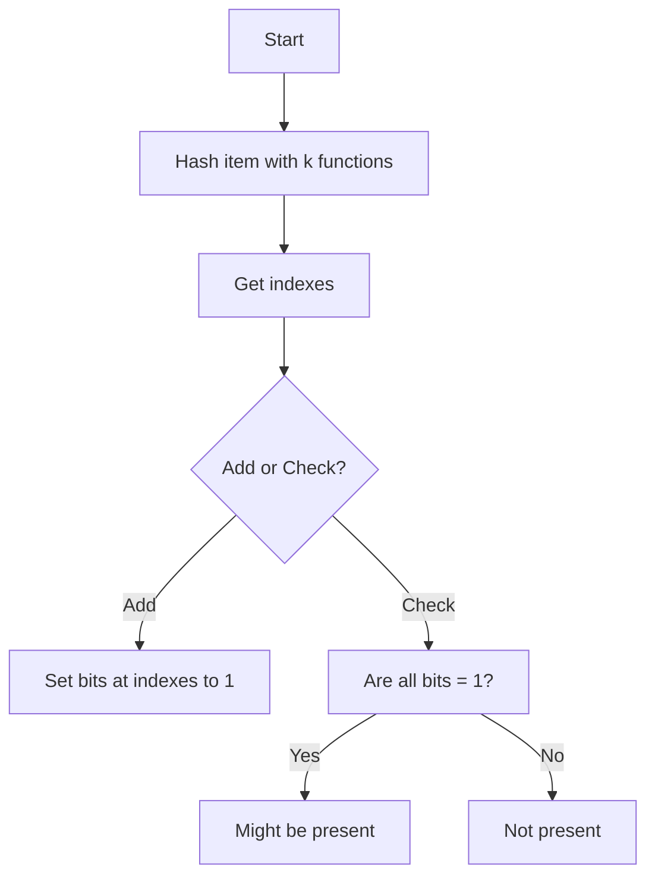

Suppose you want to check whether a piece of data belongs to a larger set. Let's say you're Google and you want to check if certain url has been marked as spam, the dumb approach would be to iterate over every url marked as spam to see if you can find it. Sure, maybe you think, "I'll save the spammy sites in a hashmap", but then, a hashmap of the gazillion sites that exists in the internet? There must be a way that uses less space.

Even if you index those urls you still will have a not so good [Big O]() performance, maybe O(log n) or O.

This is an interesting data structure that's probabilistic, it won't have a 100% chance of returning what you wanna know, but the tradeoffs are interesting enough.

## Ok but what's a Bloom Filter?

A Bloom filter is a data structure that helps you check if an item might be in a set. It gives ~~blazingly~~ fast answers with very little memory. The trade-off is that sometimes it can say an item is present when it is not. 

This data structure can produce *false positives*. But the good news are that there are not *false negatives*.

Because of this, Bloom filters shine when you care more about speed and space than absolute accuracy.



### Where can I use bloom filters? 

Bloom filters show up in those systems where quick lookups matter (No, your Tinder for pets probably doesn't apply):

* **Databases**: To check if a key might be in a table before doing a costly disk read. Of course we're taking about millions of records, not tiny databases. (Cassandra, HBase, and Redis)
* **Web caches**: To test if a page or object might be cached.
* **Distributed systems**: To cut down on network calls when asking if a node has certain data.
* **Security**: To quickly filter known bad URLs or email addresses, like in the first example I gave you.
* **Content recommendation systems**: Where you want to avoid recommending content already consumed.


Bloom filters help reduce time and resource usage at scale, if you're ok with some false positives.

## How Does a Bloom Filter Work Internally?

A Bloom filter uses:

* A bit array (all values start at 0).
* A set of hash functions.

When you add an item, the filter runs it through each hash function. Each function gives you an index in the array. You set the bits at those positions to 1. 



### There are no deletions in classic bloom filters

Since you are not storing real data but the "pattern" produced by the hash functions, you have no way to tell which combination of data and hash function produced it, hence you cannot "delete" the item.

### You cannot retrieve members from the set

Once you construct the bloom filter, you cannot know which items produced that patter from the filter itself, you can only know if something might belong or definitely doesn't belong to the set.

### Bloom filter collisions

However when you start adding more and more elements the chances of getting a collision (false positive) increase.

You can always add more hash functions to diminish the collitions but then the complexity and memory required increase.



### Checking if an item exists

When you check an item, the filter does the same. If all the positions are set to 1, the item *might* be in the set (this is why it's a probabilistic data structure). If any position is 0, the item is *definitely* not in the set.


## Basic Bloom filter Flow

Here’s a simple outline that you can blatanly use to inspire you in the dark arts of bloom filters:



1. Decide the size of the bit array and initialize all elements to 0.
2. Pick a few independent hash functions.
3. To add an item:

   * Run it through each hash function.
   * For each function, mark the bit at the returned index as 1
4. To check an item:

   * Run it through each hash function.
   * If all bits are 1 → item *might* be in the set.
   * If any bit is 0 → item is *not* in the set.

### Bloom filter pseudocode

Using pseudocode (I know, I should have used Javascript instead), it would look like this.

``` python
initialize bit_array of size m with all 0s
choose k hash functions

function add(item):
    for i in 1 to k:
        index = hash_i(item) mod m
        bit_array[index] = 1

function check(item):
    for i in 1 to k:
        index = hash_i(item) mod m
        if bit_array[index] == 0:
            return "not present"
    return "might be present"
```



### Bloom filter flow chart

And if you are a fan of flow charts it would look like this



## Why not use hashmaps instead?

Well you could use some hashmaps approaches like buckets or [Swiss tables]() but consider that you have to deal with collisions, also you can use many less intensive hash functions in a bloom filter whereas in hashmaps you need a strong hash function to avoid collisions which can consume some resources.

Also in a hashmap you store all the information as key-value pairs, whereas in a bloom filter you only store the results of the hash function, which can save a lot of space in memory.

## When you shouldn't use them?

- If you need to delete items, standard bloom filters only support inserting new data.
- If data is small, there is no sense in using a probabilistic approach with false positives, use a hashmap instead.
- As I told you before, the more data you add, the chances of getting false positives increases, so don't use it for data that grows a lot.

And that's all, I wrote this entry because I read about this data structure in the [System Design Interview Book](https://amzn.to/41rodp3#?), found interesting the fact that there is a probabilistic data structure out there, when must of the times you don't deal with probability when you deal with data structures, quite the contrary, you look for determinism.

## Some bloom filter libraries

Chances are there are already community-maintained libraries, so don't worry about reinventing the wheel.

- [bits and blooms (go)](https://github.com/bits-and-blooms/bloom#?)
- [rbloom(python)](https://github.com/KenanHanke/rbloom#?)
- [Bloom filters(javascript)](https://www.npmjs.com/package/bloom-filters#?)