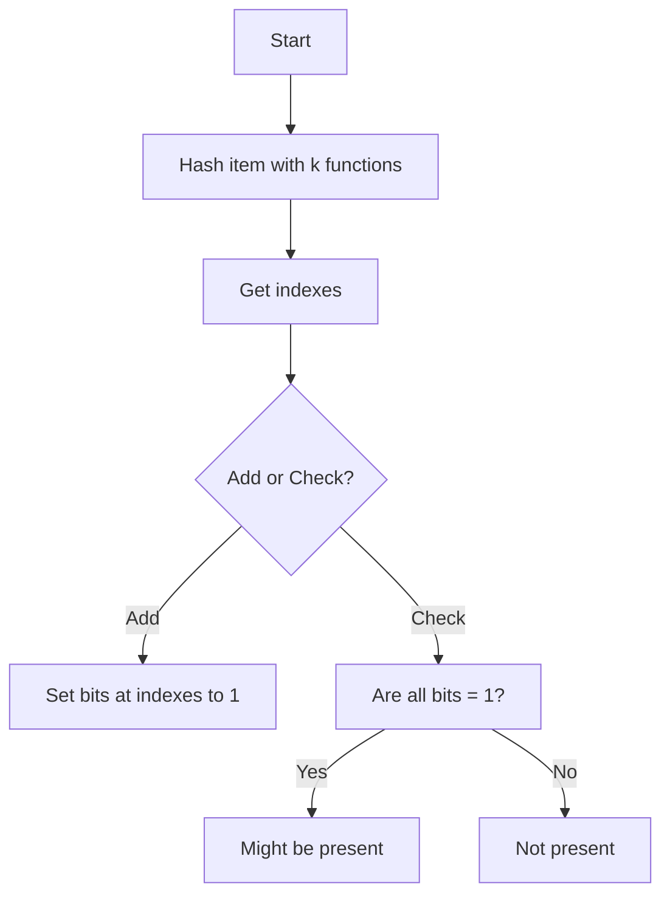

---
aliases:
- /es/i-built-a-bloom-filter-data-structure-simulator/
date: '2025-09-05T09:47:15-06:00'
title: 'Construí Un Simulador Visual De Un Bloom Filter'
categories:
- databases
- software architecture
coverImage: "images/bloom-filter-visual-simulator.jpg"
description: 'Te explico que es un bloom filter sus aplicaciones, además usa el simulador de esta estructura de datos en tiempo real y mira como funciona internamente'
keyword: 'bloom filter'
keywords:
- 'database'
- 'data structures'
- 'redis'
- 'performance'
authors:
- 'Eduardo Zepeda'
slug: /databases/construi-un-simulador-visual-de-un-bloom-filter/
---

Supongamos que quieres comprobar si un dato pertenece a un conjunto más grande. Digamos que eres Google y quieres revisar si cierta url ha sido marcada como spam. El enfoque más tonto sería iterar sobre cada url marcada como spam para ver si la encuentras. Tal vez pienses: “Guardo los sitios spam en un hashmap”, pero entonces, ¿un hashmap con los millones de sitios que existen en internet? Debe existir una forma que use menos espacio.

Incluso si indexas esas urls, seguirás teniendo un rendimiento en [Big O]() no tan bueno, quizá O(log n) u O.

Esta es una estructura de datos interesante porque es probabilística. No te va a dar una certeza del 100%, pero el trade-off que ofrece es bastante atractivo.

## Ok, pero ¿qué es un Bloom filter?

Un Bloom filter es una estructura de datos que te ayuda a comprobar si un elemento **podría** estar en un conjunto. Da respuestas rápidas con muy poca memoria. El costo de esto es que a veces puede decir que un elemento está presente cuando en realidad no lo está.

Esta estructura puede producir *falsos positivos*. Pero la buena noticia es que no existen *falsos negativos*.

Por esta razón, los Bloom filters son útiles cuando valoras más la velocidad y el espacio que una precisión absoluta.



### ¿Dónde se pueden usar los bloom filters?

Los Bloom filters aparecen en sistemas donde las búsquedas rápidas importan (no, tu Tinder para mascotas no aplica):

* **Bases de datos**: Para verificar si una clave podría estar en una tabla antes de hacer una costosa lectura en disco. Aquí hablamos de millones de registros, no bases de datos pequeñas. (Cassandra, HBase y Redis).
* **Cachés web**: Para probar si una página u objeto podría estar en caché.
* **Sistemas distribuidos**: Para reducir llamadas de red cuando preguntas a un nodo si tiene ciertos datos.
* **Seguridad**: Para filtrar rápidamente urls o direcciones de correo conocidas como maliciosas, como en el ejemplo inicial.
* **Sistemas de recomendación de contenido**: Para evitar recomendar contenido ya consumido.



Los Bloom filters ayudan a reducir tiempo y recursos a gran escala, siempre que aceptes algunos falsos positivos.

## ¿Cómo funciona internamente un Bloom filter?

Un Bloom filter utiliza:

* Un arreglo de bits (todos empiezan en 0).
* Un conjunto de funciones hash.

Cuando agregas un elemento, el filtro lo pasa por cada función hash. Cada función devuelve un índice en el arreglo. En esas posiciones, los bits se ponen en 1.

### No se pueden eliminar datos de este filtro

Como no almacenas los datos reales, sino solo el patrón que permance tras las hash functions, no puedes saber qué combinación de dato y función hash específica lo produjo. Por eso no es posible “eliminar” un elemento.



### No puedes recuperar miembros del conjunto

Una vez construido el Bloom filter, no puedes saber qué elementos lo generaron. Solo puedes comprobar si algo podría pertenecer o definitivamente no pertenece al conjunto.

### Colisiones en Bloom filters

Cuando empiezas a añadir más y más elementos, se incrementan las probabilidades de tener una colisión (falso positivo).

Siempre puedes añadir más funciones hash para reducir colisiones, pero eso aumenta la complejidad y el uso de memoria. Así es, nunca se puede ganar, todo es un trade-off.

### Comprobando si un elemento existe

Cuando revisas un elemento, el bloom filter hace lo mismo. Si todas las posiciones están en 1, el elemento *podría* estar en el conjunto (por eso es probabilístico). Si alguna posición está en 0, el elemento *definitivamente* no está en el conjunto.



## Flujo básico de un Bloom filter

Aquí tienes un esquema sencillo que puedes usar sin pena para inspirarte en las artes oscuras de los Bloom filters:

1. Decide el tamaño del arreglo de bits e inicializa todo en 0.

2. Elige algunas funciones hash independientes.



3. Para añadir un elemento:

   * Pásalo por cada función hash.
   * Por cada función, marca en 1 el bit de la posición obtenida.

4. Para comprobar un elemento:

   * Pásalo por cada función hash.
   * Si todos los bits son 1 → el elemento *podría* estar en el conjunto.
   * Si algún bit es 0 → el elemento *definitivamente no* está en el conjunto.

### Pseudocódigo de un Bloom filter

Con pseudocódigo (sí, debería haber usado Javascript), se vería así:



```python
initialize bit_array of size m with all 0s
choose k hash functions

function add(item):
    for i in 1 to k:
        index = hash_i(item) mod m
        bit_array[index] = 1

function check(item):
    for i in 1 to k:
        index = hash_i(item) mod m
        if bit_array[index] == 0:
            return "not present"
    return "might be present"
```

### Diagrama de flujo de un Bloom filter

Y si eres fan de los diagramas de flujo, se vería así:



## ¿Por qué no usar hashmaps en su lugar?

Podrías usar enfoques con hashmaps como buckets o [Swiss tables](), pero piensa que ahí tienes que lidiar con colisiones. En cambio, en un Bloom filter puedes usar funciones hash menos costosas, mientras que en los hashmaps necesitas funciones más fuertes para evitarlas, lo que consume recursos.

Además, en un hashmap guardas toda la información como pares clave-valor, mientras que en un Bloom filter solo guardas los resultados de las funciones hash, lo que ahorra bastante espacio en memoria.

## ¿Cuándo no deberías usarlos?

* Si necesitas eliminar elementos: los Bloom filters estándar solo permiten insertar nuevos datos.
* Si los datos son pocos: no tiene sentido usar un enfoque probabilístico con falsos positivos; mejor usa un hashmap.
* Como te mencioné antes, mientras más datos añadas, más aumentan los falsos positivos. No lo uses en conjuntos que crecen demasiado.

Y eso es todo. Escribí esta entrada porque leí sobre esta estructura de datos en el libro [System Design Interview](https://amzn.to/41rodp3#?) y me pareció curioso que exista una estructura probabilística, cuando casi siempre que trabajas con estructuras de datos buscas lo contrario: determinismo.

## Algunas librerías de bloom filters

Lo más probable es que ya existan librerías mantenidas por la comunidad, por lo que no te preocupes en reinventar la rueda. 

- [bits and blooms (go)](https://github.com/bits-and-blooms/bloom#?)
- [rbloom(python)](https://github.com/KenanHanke/rbloom#?)
- [Bloom filters(javascript)](https://www.npmjs.com/package/bloom-filters#?)