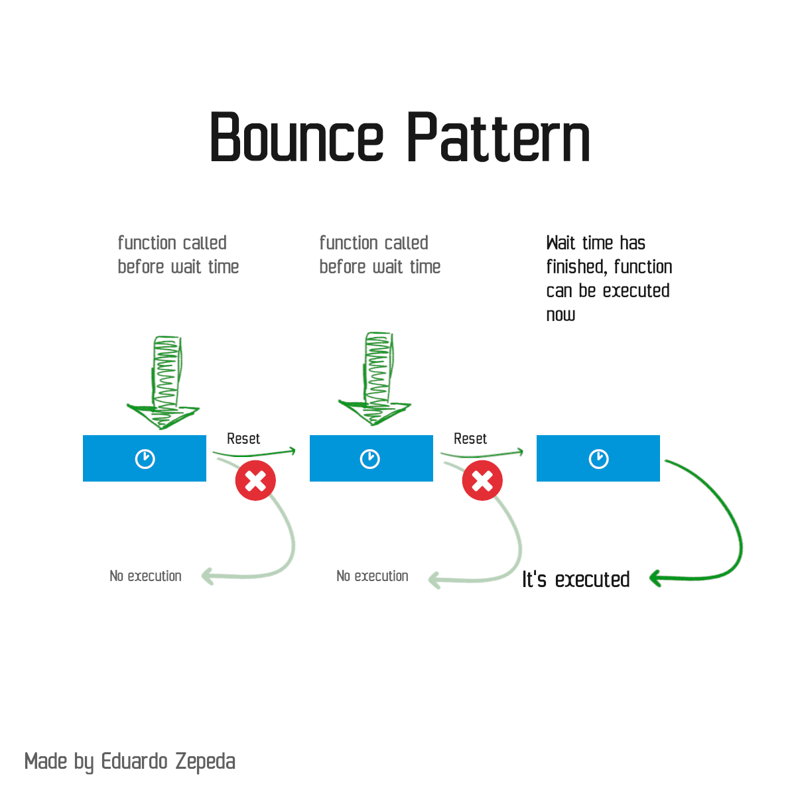
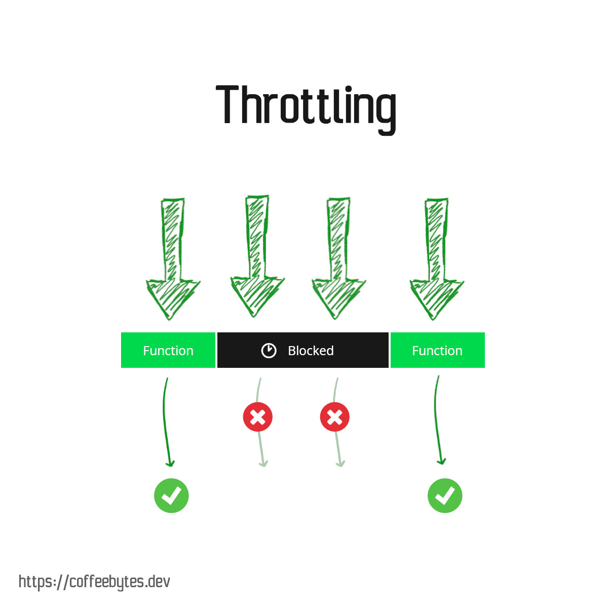

Debounce and throttle are [design patterns](/en/design-patterns-in-software/) used to limit the execution of functions, generally they are used to restrict the amount of times an event is fired: click, scroll, resize or other events. Patterns are not exclusive to Javascript; in a previous post I explained how to use throttle to [limit the number of requests received by the nginx server](/en/throttling-on-nginx/).

Both patterns generate a function that receives a callback and a timeout or delay.

## Debounce Pattern 

The debounce pattern postpones the execution of a function until a certain waiting time has elapsed.

Further attempts to execute the function will cancel the pending execution and restart the timeout.



### Debounce pattern explanation

The code for debounce in javascript looks like this:

```javascript
const debounce = (callback, waitTimeInMs) => {
  let timeout 
  return (...args) => {
    clearTimeout(timeout)
    timeout = setTimeout(()=> callback(...args), waitTimeInMs)
  }
}
```

Our debounce function returns a function, which will receive any number of arguments (...args).

This function uses a closure to access the variable timeout. What is timeout? timeout is a _setTimeout_ function, which schedules the execution of our callback for later execution.

But now pay attention to the clearTimeout. Every time we call the debounce function it will clear any scheduled function, so the only way for our callback to run is to wait for the time we passed as an argument.

## Throttling pattern

The throttling pattern sets a waiting time during which no more functions can be called again. Unlike the bounce pattern, the timeout is not reset if we try to call the function again.



### Explanation of throttling pattern

The code for throttling in javascript looks like this.

```javascript
const throttling = (callback, delay) => {
  let timeout
  return (...args) => {
    if (timeout !== undefined) {
      return
    }

    timeout = setTimeout(() => {
      timeout = undefined
    }, delay)

    return callback(...args)
  }
}
```

The throttling function returns a function that will have two sides depending on the timeout status:

* timeout is defined: this means that a function is already scheduled for execution, in this case the function does nothing, i.e. it blocks the execution of new functions by means of an empty return.
* timeout is not defined: if timeout is not defined, we create a _setTimeout_ and assign it to the _timeout_ variable. This function, once its execution time has elapsed, will remove itself from the _timeout_ variable. Subsequently, and to finish, we execute the callback function.

## Other resources on debounce and throttling

* [Debounce and throttling in Typescript](https://charliesbot.dev/blog/debounce-and-throttle)
* [Debounce y throttling applied to the DOM](https://webdesign.tutsplus.com/es/tutorials/javascript-debounce-and-throttle--cms-36783)