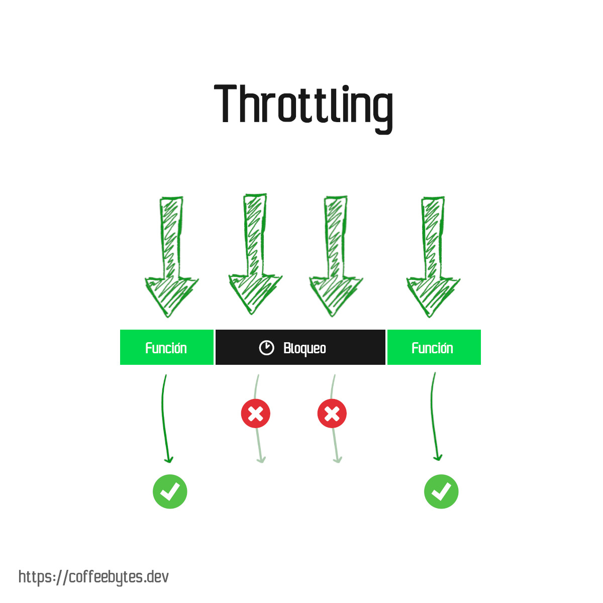

---
aliases:
- /debounce-y-throttle-en-javascript
- /es/debounce-y-throttle-en-javascript/
authors:
- Eduardo Zepeda
categories:
- javascript
coverImage: images/BounceYThrottleJavascript.jpg
coverImageCredits: 'Créditos de la imagen a i7 de Pixiv: https://www.pixiv.net/en/users/54726558'
date: '2022-03-23'
description: Explicación de los patrones debounce y throttle, usados para limitar la ejecución desmedida, especialmente como respuesta a eventos de un usuario, de las funciones en Javascript y otros lenguajes de programación.
keywords:
- javascript
- patrones de diseño
- throttling
- debounce
title: Limita la ejecución de funciones en JS con Debounce y Throttle
---

Debounce y throttle son [patrones de diseño](/es/patrones-de-diseno-o-software-design-patterns/) usados para limitar la ejecución de funciones, generalmente son utilizados para restringir la cantidad de veces que un evento se dispara: eventos click, scroll, resize u otros. Los patrones no son exclusivos de Javascript; en una entrada anterior te explique como usar throttle para [limitar la cantidad de requests que recibe el servidor nginx.](/es/throttling-en-nginx/)

Ambos patrones generan una función que recibe un callback y un tiempo de espera o delay.

## Debounce vs Throttle diferencias principales

Si tienes prisa, estas son las principales diferencias y aplicaciones de ambos patrones. Sin embargo, si quieres entenderlos en profundidad sigue leyendo.

| **Aspect**                 | **Debounce**                                                                                                                   | **Throttle**                                                                                                          |
| -------------------------- | ------------------------------------------------------------------------------------------------------------------------------ | --------------------------------------------------------------------------------------------------------------------- |
| **Definición**             | Ejecuta la función después de un retardo especificado desde la última vez que se disparó el evento.                            | Ejecuta la función a intervalos regulares, asegurando que no sea llamada más de una vez por período.                  |
| **Tiempo de ejecución**    | Se retrasa hasta que el evento deja de dispararse durante un periodo determinado.                                              | Se ejecuta inmediatamente o a intervalos fijos, independientemente de la frecuencia con la que se produzca el evento. |
| **Ejemplo de Caso de Uso** | Inputs donde se introducen datos: actualización de sugerencias sólo después de que el usuario deje de escribir por un momento. | Eventos de scroll: limitar la velocidad a la que se calcula la posición del scroll.                                   |

## Patrón Debounce

El patrón de rebote o debounce pospone la ejecución de una función hasta que transcurra un determinado tiempo de espera.

Nuevos intentos de ejecutar la función cancelarán la ejecución pendiente y reiniciarán el tiempo de espera.


### Explicación del patrón debounce

El código para debounce en javascript se ve así:

```javascript
const debounce = (callback, tiempoDeEspera) => {
  let timeout 
  return (...args) => {
	clearTimeout(timeout)
	timeout = setTimeout(()=> callback(...args), tiempoDeEspera)
  }
}
```

Nuestra función debounce retorna a su vez una función, la cual recibirá cualquier número de argumentos (...args).

Esta función usa un closure para acceder a la variable timeout. ¿Qué es timeout? timeout es una función _setTimeout_, que programa la ejecución de nuestro callback para su posterior ejecución.

Pero ahora presta atención al clearTimeout. Cada vez que llamemos a la función debounce se eliminará cualquier función programada, por lo que la única manera de que se ejecute nuestro callback es esperar el tiempo que le pasamos como argumento.



## Patrón Throttling

El patrón throttling (o aceleración) establece un tiempo de espera durante el cual no se pueden llamar nuevamente más funciones. A diferencia del patrón bounce, el tiempo de espera no se reinicia si intentamos llamar nuevamente a la función.



### Explicación del patrón throttling

El código para el patrón throttling en javascript se ve así.

```javascript
const throttling = (callback, delay) => {
  let timeout
  return (...args) => {
    if (timeout !== undefined) {
      return
    }

    timeout = setTimeout(() => {
      timeout = undefined
    }, delay)

    return callback(...args)
  }
}
```

La función throttling retorna una función que tendrá dos vertientes que dependen del estado de timeout:

- timeout está definido: esto significa que ya hay programada una función para su ejecución, en este caso la función no hace nada, es decir, bloquea la ejecución de nuevas funciones por medio de un return vacio.
- timeout no está definido: si timeout no está definido, creamos un _setTimeout_ y la asignamos a la variable _timeout_. Esta función, una vez transcurrido su tiempo de ejecución, se eliminará a si misma de la variable _timeout_. Posteriormente, y para finalizar, ejecutamos la función callback.

## Otros recursos sobre debounce y throttling

- [Debounce y throttling en Typescript](https://charliesbot.dev/blog/debounce-and-throttle)
- [Debounce y throttling aplicados al DOM](https://webdesign.tutsplus.com/es/tutorials/javascript-debounce-and-throttle--cms-36783)