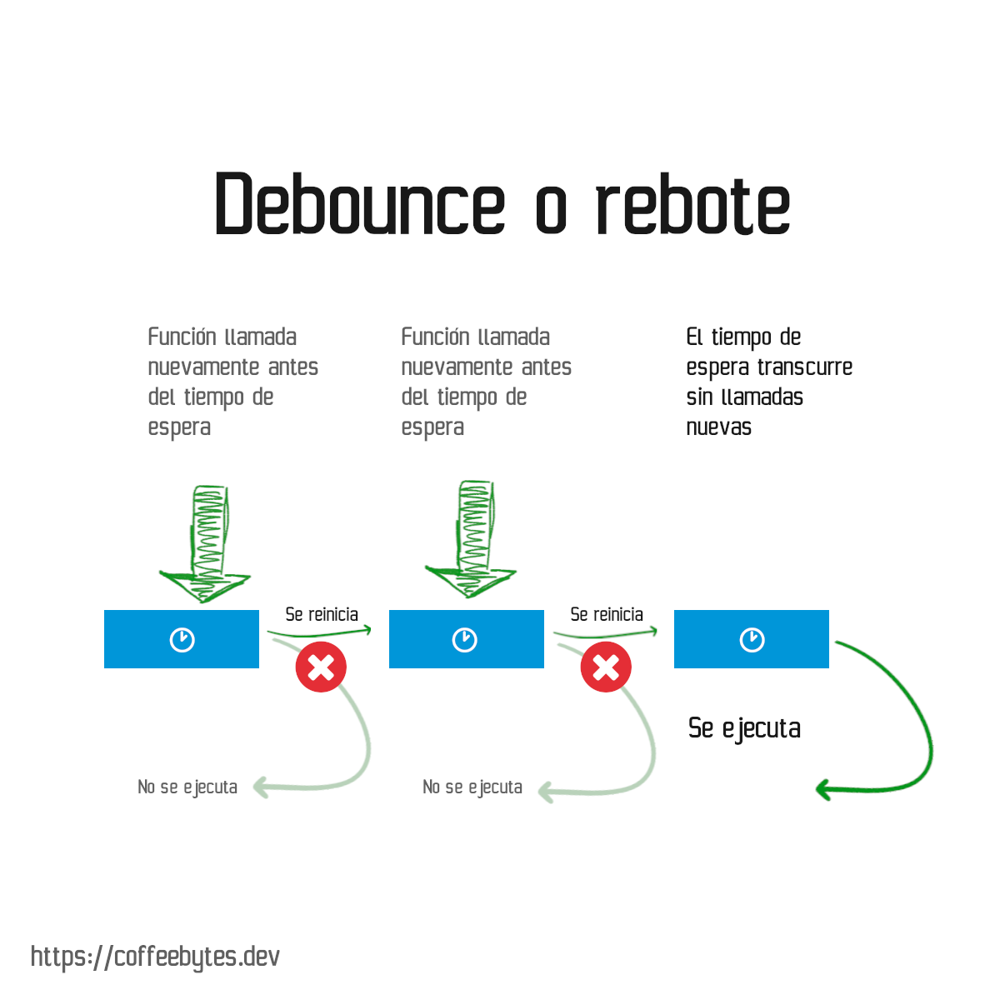

Debounce y throttle son patrones usados para limitar la ejecución de funciones, generalmente son utilizados para restringir la cantidad de veces que un evento se dispara: eventos click, scroll, resize u otros. Los patrones no son exclusivos de Javascript; en una entrada anterior te explique como usar throttle para [limitar la cantidad de requests que recibe el servidor nginx.](https://coffeebytes.dev/throttling-en-nginx/)

Ambos patrones generan una función que recibe un callback y un tiempo de espera o delay.

## Debounce

El patrón de rebote o debounce pospone la ejecución de una función hasta que transcurra un determinado tiempo de espera.

Nuevos intentos de ejecutar la función cancelarán la ejecución pendiente y reiniciarán el tiempo de espera.



### Explicación de debounce

El código para debounce en javascript se ve así:

```javascript
const debounce = (callback, tiempoDeEspera) => {
  let timeout 
  return (...args) => {
	clearTimeout(timeout)
	timeout = setTimeout(()=> callback(...args), tiempoDeEspera)
  }
}
```

Nuestra función debounce retorna a su vez una función, la cual recibirá cualquier número de argumentos (...args).

Esta función usa un closure para acceder a la variable timeout. ¿Qué es timeout? timeout es una función _setTimeout_, que programa la ejecución de nuestro callback para su posterior ejecución.

Pero ahora presta atención al clearTimeout. Cada vez que llamemos a la función debounce se eliminará cualquier función programada, por lo que la única manera de que se ejecute nuestro callback es esperar el tiempo que le pasamos como argumento.

## Throttle

El patrón throttle o aceleración establece un tiempo de espera durante el cual no se pueden llamar nuevamente más funciones. A diferencia del patrón bounce, el tiempo de espera no se reinicia si intentamos llamar nuevamente a la función.


### Explicación de throttle

El código para throttle en javascript se ve así.

```javascript
const throttle = (callback, delay) => {
  let timeout
  return (...args) => {
    if (timeout !== undefined) {
      return
    }

    timeout = setTimeout(() => {
      timeout = undefined
    }, delay)

    return callback(...args)
  }
}
```

La función throttle retorna una función que tendrá dos vertientes que dependen del estado de timeout:

- timeout está definido: esto significa que ya hay programada una función para su ejecución, en este caso la función no hace nada, es decir, bloquea la ejecución de nuevas funciones por medio de un return vacio.
- timeout no está definido: si timeout no está definido, creamos un _setTimeout_ y la asignamos a la variable _timeout_. Esta función, una vez transcurrido su tiempo de ejecución, se eliminará a si misma de la variable _timeout_. Posteriormente, y para finalizar, ejecutamos la función callback.

## Otros recursos sobre debounce y throttling

- [Debounce y throttling en Typescript](https://charliesbot.dev/blog/debounce-and-throttle)
- [Debounce y throttling aplicados al DOM](https://webdesign.tutsplus.com/es/tutorials/javascript-debounce-and-throttle--cms-36783)
