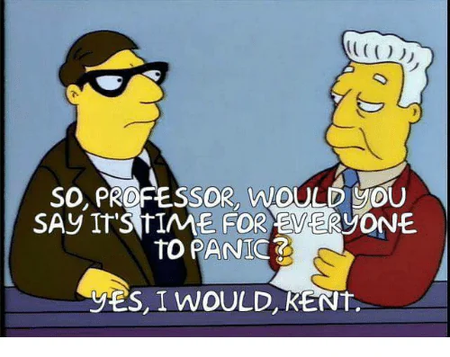
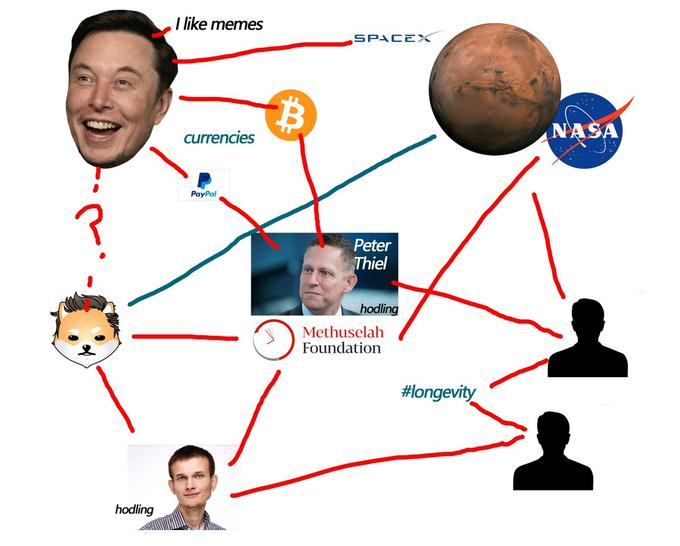
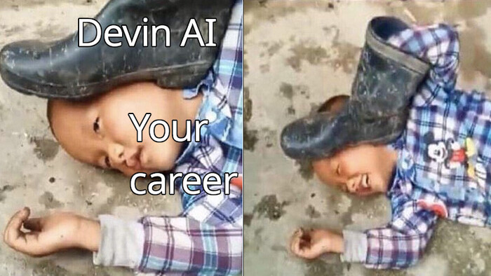
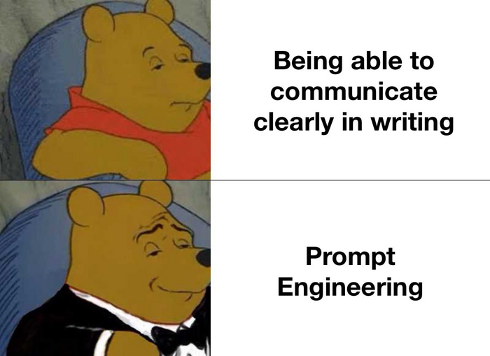
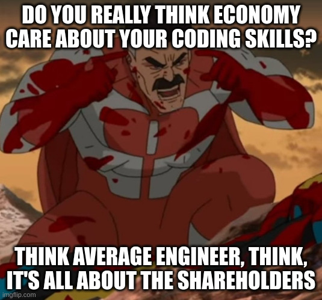
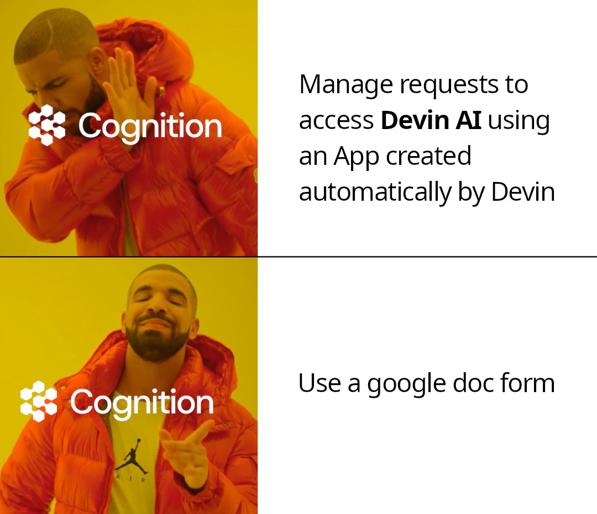

---
aliases:
- /devin-de-cognition-labs-la-inteligencia-artificial-que-reemplaza-a-los-programadores
- /devin-de-cognition-labs-la-inteligencia-artificial-que-quiere-reemplazar-a-los-programadores
authors:
- Eduardo Zepeda
categories:
- Inteligencia Artificial
- Opiniones
coverImage: images/devin-cognitive-artificial-intelligence-and-programmers.jpg
date: '2024-03-13'
description: Devin, el modelo de Inteligencia Artificial que promete ser mejor que
  un ingeniero de Software y cambiar para siempre el mundo del Software, creado por
  Cognition Labs
keywords:
- Inteligencia artifcial
- Opinion
- Futurismo
- Devin
title: Devin AI ¿El Supuesto Reemplazo de los Programadores?
---

Hoy se popularizó la noticia, de que un "Ingeniero de Software AI" con el nombre de Devin, hecho por [Cognition Labs](https://www.cognition-labs.com/), estará disponible en el mercado. Y, por supuesto, provocó una fuerte reacción entre la comunidad de profesionales del software. Reacciones que van desde el cinismo hasta el miedo, pasando por la desilusión, abundan en los comentarios de los videos relacionados.

Aunque aún estamos lejos de tener una [AI consciente de si misma](/es/chat-gpt-la-habitacion-china-de-searle-y-la-conciencia/), lo que sí tenemos es un producto con características prometedoras que amenazan con poner patas arriba a la industria de la tecnología.

¿Cómo cuales características? [Segun sus creadores, Devin puede](https://www.cognition-labs.com/blog):
- Usar tecnologías que no le son familiares
- Crear y desplegar aplicaciones
- Encontrar bugs automáticamente
- Entrenar sus propios modelos de AI
- Contribuir a madurar repositorios
- Resolver proyectos reales en Upwork (bastante más que [resolver problemas de código de entrevistas](/es/pongo-a-prueba-a-chatgpt-con-desafios-de-codigo-de-codewars/))

## ¿Quienes están detrás de Devin?

Detrás de Devin se encuentra Cognition labs, una empresa relativamente nueva que se habia mantenido tras bambalinas hasta ayer. Su [cuenta de Twitter](https://twitter.com/cognition_labs) tiene menos de dos días al momento de escribir este artículo (aunque ya acumula más de 86 k de seguidores).



### ¿Quienes componen Cognition labs?

Hay cerca de 10 miembros, entre los cuales suman más de **10 medallas de oro en la Olimpiada Internacional de Informática** y cuyos miembros parecen haber estado involucrados en proyectos relacionados con AI en empresas como Google, DeepMind y Scale AI. Por lo que se puede hablar de un grupo con cierto nivel de experiencia.

### ¿Quienes financian el proyecto?

Hasta el momento Cognitive Labs afirma haber recaudado cerca de **21 MDD en una ronda liderada por Founders Fund**, entre los que destaca el inversionista Peter Thiel, ex-director de Paypal.

## ¿Qué va a pasar con los programadores? ¿están en riesgo?

Pues, es complicado saberlo con certeza, dada la poca información al respecto. Sin embargo yo propongo un par de escenarios probables:

- Devin reemplazará a los progamadores y revolucionará la industría.
- Devin no estará a las alturas de las circunstancias y caerá en el olvido.

### Devin reemplazará a los programadores y les quitará el trabajo

¿Quién crees que ganaría en una batalla por producir más libros? ¿1000 escribas del antiguo Egipto o una fotocopiadora conectada a una computadora? 

Yo opino que la segunda opción, simplemente las capacidades de la impresora para producir páginas más rápido, con menos errores y en una fracción del tiempo, están más allá de las posibilidades de los escribas. Aunque es cierto que se requiere a una persona que configure y utilice la impresora, eso no implica que los escribas tengan alguna oportunidad. De manera análoga, si bien aún se requerirán programadores y se "crearán más trabajos" como se afirma usualmente, la verdadera cuestión es: **¿cuantos trabajos se perderán por cada nuevo trabajo que se cree?**

Sigamos con este experimento mental, supongamos, por un momento, que Devin hace exactamente lo que dice. Dado que Devin es una herramienta, aún requiere del input de un ser humano para funcionar, por lo que el "output", es decir su desempeño, dependerá de que tan bueno sea su "input", es decir, la persona que le de las instrucciones.

Esto se traduce en que **la profesión de prompt engineer se volverá una realidad**, y con la consecuencia de que aquellas personas con capacidades superiores de abstracción, escritura y léxico se volverán prácticamente dioses de esta nueva utopia (o distopia, según como lo veas).

Además, todas aquellas profesiones encargadas de perfeccionar los modelos de AI se volverán profesiones con una altísima demanda, puesto que cualquier empresa que quiera competir y mantenerse a flote necesitará uno.

#### Nuevas oportunidades tras el fin de la programación

Conseguir un trabajo si eres nuevo en la industría será bastante complicado, pero al mismo tiempo la barrera para crear negocios digitales disminuirá y será más importante el identificar y resolver problemas. Volverte un solopreneur o un freelance será increíblemente sencillo, pues las habilidades técnicas requeridas se reducirá significativamente y quizás sea mejor que apuntes hacia esa dirección.

¿Qué tan probable veo este escenario? La verdad es que **yo lo considero un escenario bastante improbable, casi rayando en lo imposible**.

#### ¿Por qué creo que Devin no reemplazará a los programadores?

Si lo que los creadores de Devin dicen, les sería más fácil crear una agencia de desarrollo de software que operara con un mínimo de empleados y limitarse a vender software, la ventaja competitiva que tienen dependería solo del poder de computo que pudieran conseguir, consiguiendo el monopolio en muy poco tiempo.

Devin aún no ha sido puesto a prueba en condiciones reales, donde las problemas pueden ser extremadamente complejos y consistir en una mezcla entre el conocimiento del negocio, las leyes vigentes del país donde corren las aplicaciones, el caprichoso comportamiento del mercado, lo cual ciertamente requiere algo más parecido a una AGI, que cualquier modelo de lenguaje que ellos hayan podido desarrollar, incluso si este es superior a la versión más actualizada de ChatGPT.

A mi la verdad el título de "Ingeniero de Software de AI" me parece colocar la barra bastante alto y puede que Devin no esté a la altura de las expectativas.

### Devin es solo hype temporal y será olvidado pronto

La segunda posibilidad es que no pase nada. Sí, nada.

Ha sucedido múltiples veces en el pasado; toda gran idea olvidada empieza con la promesa de revolucionar el mundo, tal como sucedió con el no-code o con Dreamweaver (Un editor WYSIWYG para crear sitios web de 2007). Ambas fueron tecnologías que de un momento a otro amenazaron con cambiar para siempre el mundo de la tecnología, y no lo consiguieron.

¿Recuerdas [Agent Swarm AI](https://github.com/daveshap/OpenAI_Agent_Swarm)? También generó muchas expectativas pero al final no cristalizó en nada.

Hasta ahora Copilot, ChatGPT y probablemente Devin no han sido más que "búsquedas de google" con esteroides; pueden darte la información que solicitas directamente, pero no necesariamente es real y a prueba de fallos. El proceso iterativo que ofrece este sistema mejora bastante la dinámica usual de pregunta-respuesta, pero no deja de ser inmune a caer en bucles producto de problemas que no pueda resolver o a producir algo totalmente distinto a lo que se le pide, por ahora necesitamos ponerlo a prueba mucho más.

La comunidad de desarrolladores no se han quedado de brazos cruzados y han creado un [Devin de código abierto, llamedo Open Devin](https://github.com/OpenDevin/OpenDevin).

Además de los puntos anteriores, hay otro aspecto que estamos obviando.

#### El aspecto financiero de la Inteligencia Artificial

Déjame describirte una situación: 
1. Un grupo de emprendedores presentan un producto novedoso.
2. Se viraliza y todos hablan de como cambiará por siempre nuestro día a día
3. Los creadores reciben capital semilla de muchísimos inversionistas
4. Se termina convirtiendo en una herramienta más y todo sigue igual

¿Te suena a algo parecido? Quizás Devin solo sean un grupo de personas buscando volverse millonarias de la noche a la mañana.

Considera que, en el mundo del dinero, las apariencias juegan un rol primordial. Ahora mismo son pocas las personas que han tenido acceso a Devin, las cuales hablan maravillas de la herramienta. Suena demasiado bien ¿no? Todo esto podría ser una campaña de marketing muy bien pensada para inflar las expectativas, atraer inversores y conseguir financiamiento "fácil". Ya sabes, la clásica [burbuja de AI](/es/el-auge-y-la-caida-de-la-burbuja-de-ai/).

Pero, ¿No acaba Peter Thiel de invertir dinero? Sí, pero eso no significa nada, no estás pensando como inversionista, sino como ingeniero. 

Si eres un iversionista, no te interesa si el proyecto existe por un mes, dos meses, una década o dos, o siquiera el impacto social que tenga o su viabilidad técnica, lo único importante es que te sea lo suficientemente rentable de acuerdo a tus propios criterios de inversión. En otras palabras: ¿Qué más da si el proyecto muere si puedo convertir 21 MDD en 40 MDD en menos de un año? 

Llama bastante mi atención que la manera de solicitar acceso a Devin sea a través de un google form en lugar de usar una App desarrollada con el mismo modelo, lo cual sería la perfecta carta de presentación de esta tecnología. Después de todo, no es como si estuviera fuera de las capacidades de su modelo, no es una aplicación con 1000 microservicios, balanceo de carga, streaming y un engine de recomendaciones, es un banal formulario de registro.

De los dos escenarios que te propuse, yo considero más probable aquel en el que Devin cae en el olvido como la promesa que nunca dejó de ser, pero esperemos un año o dos y veamos juntos si Devin está a la altura de lo que promete. Mi apuesta es que Devin no sustituirá a los programadores.