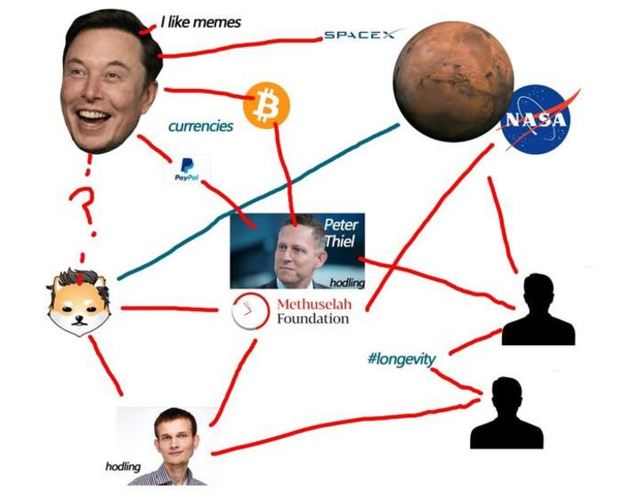
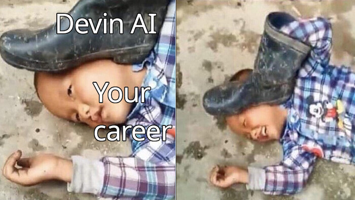
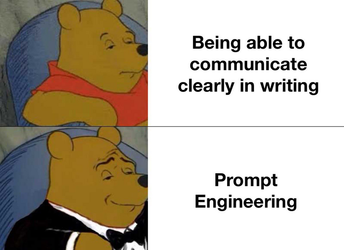

Hoy se popularizó la noticia, de que un "Ingeniero de Software AI" con el nombre de Devin, hecha por [Cognition Labs](https://www.cognition-labs.com/), estará disponible para su uso próximamente. Y, por supuesto, provocó una fuerte reacción entre la comunidad de profesionales del software. Reacciones que van desde el cinismo, hasta el miedo, pasando por la desilusión se leen en los comentarios de los videos relacionados.

Aunque aún estamos lejos de tener una [AI consciente de si misma](/chat-gpt-la-habitacion-china-de-searle-y-la-conciencia/), lo que sí tenemos son características que ponen a temblar al mercado del software.

¿Cómo cuales? Estás son algunas de sus [características, segun sus creadores](https://www.cognition-labs.com/blog):
- Puede usar tecnologías que no le son familiares
- Crea y despliega aplicaciones
- Encuentra bugs automáticamente
- Entrena sus propios modelos de AI
- Contribuye a madurar repositorios
- Resolver proyectos reales en Upwork (bastante más que [resolver problemas de código de entrevistas](/pongo-a-prueba-a-chatgpt-con-desafios-de-codigo-de-codewars/))

## ¿Quienes están detrás de Devin?

Detrás de Devin se encuentra Cognition labs, una empresa relativamente nueva y que se habia mantenido tras bambalinas. Incluso su [cuenta de Twitter](https://twitter.com/cognition_labs) tiene menos de dos días al momento de escribir este artículo, a pesar de eso ya lleva acumulados cerca de 86k de seguidores en Twitter.



### ¿Quienes componen Cognition labs?

Hay cerca de 10 miembros, entre los cuales suman más de **10 medallas de oro en la Olimpiada Internacional de Informática** y cuyos miembros parecen haber estado involucrados en proyectos relacionados con AI en empresas como Google, DeepMind y Scale AI.

### ¿Quines financian el proyecto?

Hasta el momento afirman haber recaudado cerca de **21 MDD en una ronda liderada por Founders Fund**, entre los que destaca Peter Thiel, el ex-director de Paypal.

## ¿Qué va a pasar con los programadores? ¿están en riesgo?

Pues, es complicado saberlo con certeza, dado la poca información al respecto. Sin embargo propongo un par de escenarios probables:

- Devin reemplazará a los progamadores y revolucionará la industría.
- Devin no estará a las alturas de las circunstancias y caerá en el olvido.

### Devin reemplazará a los programadores y les quitará el trabajo

¿Quién crees que ganaría en una batalla por producir más libros? ¿1000 escribas del antiguo Egipto o una fotocopiadora conectada a una computadora? 

Yo opino que la segunda opción, no importa que tanto se esfuercen, simplemente las capacidades de la impresora producirá páginas más rápido, con menos errores y en una fracción del tiempo. Aunque aún se requiera a una persona que configure y utilice la impresora, eso deja fuera del juego a los escribas. Y si bien se "crearán más trabajos" como se afirma usualmente, la verdadera cuestión es: **¿cuantos trabajos se perderán por cada nuevo trabajo que se cree?**

Supongamos que por un momento que Devin hace exactamente lo que dice, dado que Devin es una herramienta, aún requiere del input de un ser humano para funcionar, por lo que el "output", es decir su desempeño, dependerá de que tan bueno sea su "input", es decir, la persona que le de las instrucciones.

Esto se traduce en que **la profesión de prompt engineer se volverá una realidad**, y con la consecuencia de que aquellas personas con capacidades superiores de abstracción, escritura y léxico se volverán prácticamente dioses de esta nueva utopia (o distopia, según como lo veas).

Además, todas aquellas profesiones encargadas de perfeccionar los modelos de AI se volverán profesiones con una altísima demanda, puesto que cualquier empresa que quiera competir y mantenerse a flote necesitará uno.

Conseguir un trabajo si eres nuevo en la industría será bastante complicado, pero al mismo tiempo la barrera para crear negocios digitales disminuirá y será más importante el identificar y resolver problemas. Volverte un solopreneur o un freelance será increíblemente sencillo, pues las habilidades técnicas requeridas se reducirá significativamente.

### Devin es solo hype y una estrategia para volverse rico rápido

La otra posibilidad es que no pase nada. Sí, nada.

Ha sucedido múltiples veces en el pasado; toda gran idea olvidada empieza con la promesa de revolucionar el mundo, tal como sucedió con el no-code o con Dreamweaver (Un editor WYSIWYG para crear sitios web de 2007). Ambas fueron tecnologías que de un momento a otro amenazaron con cambiar para siempre el mundo de la tecnología, y no lo consiguieron.

Considera que, en el mundo del dinero, las apariencias juegan un rol primordial. Ahora mismo son pocas las personas que han tenido acceso a Devin, las cuales hablan maravillas de la herramienta. Suena demasiado bien ¿no? Todo esto podría ser una campaña de marketing para inflar las expectativas, atraer inversores y conseguir dinero "fácil".

Pero, ¿No acaba Peter Thiel de invertir dinero? Sí, pero eso no significa nada. Si eres un iversionista, no te interesa si el proyecto existe por un mes, dos meses, una década o dos, lo único importante es que te sea lo suficientemente rentable de acuerdo a tus propios criterios de inversión. En otras palabras: ¿Qué más da si el proyecto muere si puedo convertir 21 MDD en 40 MDD en menos de un año?

Llama bastante mi atención que la manera de solicitar acceso a Devin sea a través de un google form en lugar de usar una App desarrollada con el mismo modelo. 

Esperemos un año o dos y veamos juntos si Devin está a la altura de lo que promete.