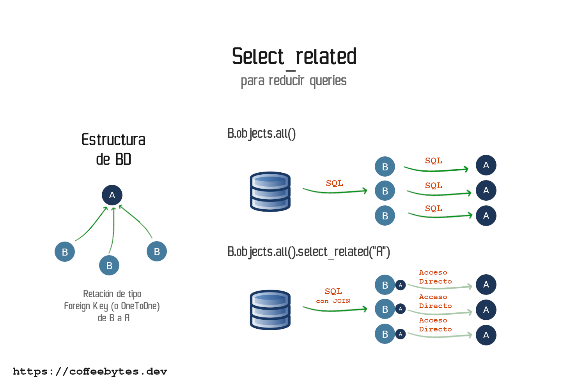
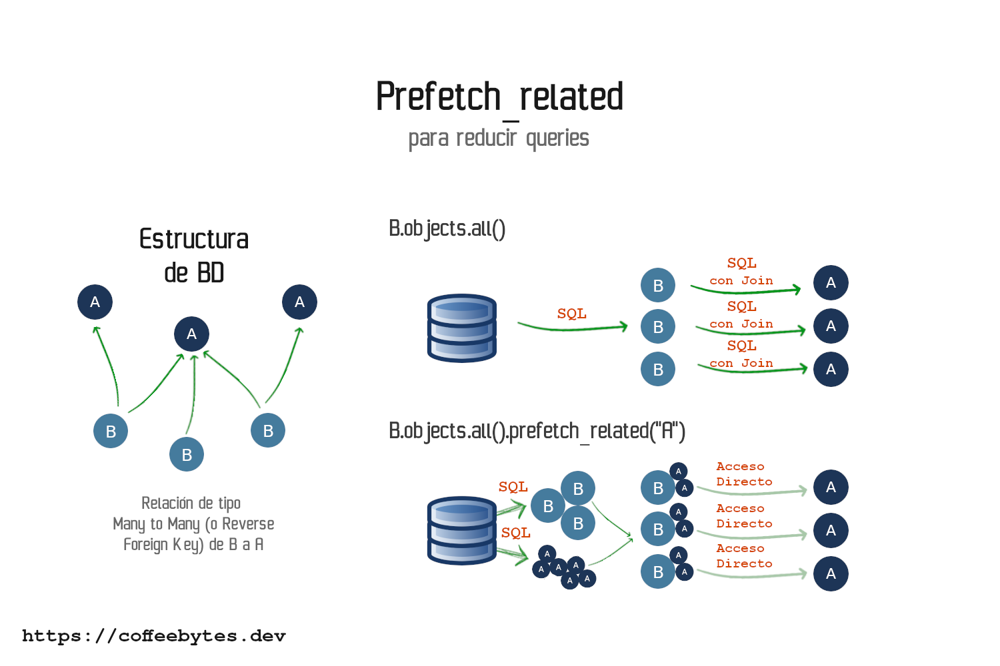

The _select_related_ and _prefetch_relate_d methods **are used to reduce the number of queries made to the database**. This translates into response time for each view. In addition, using these methods is one of the [actions to implement to improve the performance of a Django application](/en/is-your-django-application-slow-maximize-its-performance-with-these-tips/)

## select_related

The _select_related_ method is **used to follow a relationship of type ForeignKey or OneToOneField to the respective objects it points to and obtain them.**.

When using _select_related_ we will have a longer query, however, the advantage is that it will no longer be necessary to access the database again to obtain the objects of the related model.



Simplified diagram of how select_related works

Consider this example:

```python
from django.db import models

class Principal(models.Model):
    name = models.CharField(max_length=256)

class Derivado(models.Model):
    name = models.CharField(max_length=256)
    principal = models.ForeignKey(
        "Principal", related_name="derivados", on_delete=models.CASCADE
    )
```

If we try to access the object pointed to by the Foreign Key relationship, a new database query will be generated. _select_related_ avoids that extra query for each object.

```html

    <p>{{object.name}}</p>
    <small>{{object.principal.name}}</small>

```

For example, if we have three Derived objects related to a single main object:

* A main query that retrieves all objects Derivative
* Three queries, exactly the same, one for each time we access the main object from the Derived object.

### Use in a query

To use _select_related_ we call it from our query, passing it the name of the field that corresponds to our relationship with the other model.

```python
Derivado.objects.select_related("principal")
```

### Internal operation of select_related

How _select_related_ works internally, _select_related_ replaces multiple queries being performed by a single INNER JOIN at the database level:

```bash
SELECT "my_app_derivado"."id",
       "my_app_derivado"."name",
       "my_app_derivado"."principal_id"
  FROM "my_app_derivado"

SELECT "my_app_principal"."id",
       "my_app_principal"."name"
  FROM "my_app_principal"
 WHERE "my_app_principal"."id" = '1'

SELECT "my_app_principal"."id",
       "my_app_principal"."name"
  FROM "my_app_principal"
 WHERE "my_app_principal"."id" = '1'

SELECT "my_app_principal"."id",
       "my_app_principal"."name"
  FROM "my_app_principal"
 WHERE "my_app_principal"."id" = '1'
```

This reduces multiple SQL queries to a single, longer query.

```bash
SELECT "my_app_derivado"."id",
       "my_app_derivado"."name",
       "my_app_derivado"."principal_id",
       "my_app_principal"."id",
       "my_app_principal"."name"
  FROM "my_app_derivado"
 INNER JOIN "my_app_principal"
    ON ("my_app_derivado"."principal_id" = "my_app_principal"."id")
```

## prefetch_related

If the _select_related_ method retrieves a single object from a single relationship field, **the _prefetch_related_ method is used when we have a multiple relationship with another model**, i.e. a relationship of type **_ManyToMany_ or a reverse _ForeignKey_.



Simplified diagram of how prefetch_related works

Consider this example, note the _ManyToManyField_ field towards the _Principal_ model.

```python
from django.db import models

class Principal(models.Model):
    name = models.CharField(max_length=256)

class MultiplesPrincipales(models.Model):
    name = models.CharField(max_length=256)
    principales = models.ManyToManyField("Principal", related_name="multiples")
```

If we access the field that represents the multiple relation of our object, without using _prefetch_related_, we will be impacting the database with a new query.

```html

    <p>{{object.name}}</p>
    
      <!-- Una nueva consulta cada vez -->
      <p><small>{{principal.name}}</small></p>
    

```

### Use in a query

To use the _prefetch_related_ method call it at the end of our query, choosing the field that represents the many-to-many relationship in our object.

```python
queryset = MultiplesPrincipales.objects.prefetch_related("principales")
```

### Inner workings of prefetch_related

How does _prefecth_related_ work internally? The **_prefetch_related_ method replaces the multiple SQL queries by only 2 SQL queries: one for the main query and the other for the related objects, then it will join the data using Python**.

```bash
SELECT "my_app_principal"."id",
       "my_app_principal"."name"
  FROM "my_app_principal"
 INNER JOIN "my_app_multiplesprincipales_principales"
    ON ("my_app_principal"."id" = "my_app_multiplesprincipales_principales"."principal_id")
 WHERE "my_app_multiplesprincipales_principales"."multiplesprincipales_id" = '1'

SELECT "my_app_principal"."id",
       "my_app_principal"."name"
  FROM "my_app_principal"
 INNER JOIN "my_app_multiplesprincipales_principales"
    ON ("my_app_principal"."id" = "my_app_multiplesprincipales_principales"."principal_id")
 WHERE "my_app_multiplesprincipales_principales"."multiplesprincipales_id" = '2'

SELECT "my_app_principal"."id",
       "my_app_principal"."name"
  FROM "my_app_principal"
 INNER JOIN "my_app_multiplesprincipales_principales"
    ON ("my_app_principal"."id" = "my_app_multiplesprincipales_principales"."principal_id")
 WHERE "my_app_multiplesprincipales_principales"."multiplesprincipales_id" = '3'

SELECT "my_app_principal"."id",
       "my_app_principal"."name"
  FROM "my_app_principal"
 INNER JOIN "my_app_multiplesprincipales_principales"
    ON ("my_app_principal"."id" = "my_app_multiplesprincipales_principales"."principal_id")
 WHERE "my_app_multiplesprincipales_principales"."multiplesprincipales_id" = '4'
```

The multiple queries above are reduced to only 2 SQL queries.

```bash
SELECT "my_app_multiplesprincipales"."id",
       "my_app_multiplesprincipales"."name"
  FROM "my_app_multiplesprincipales"

SELECT ("my_app_multiplesprincipales_principales"."multiplesprincipales_id") AS "_prefetch_related_val_multiplesprincipales_id",
       "my_app_principal"."id",
       "my_app_principal"."name"
  FROM "my_app_principal"
 INNER JOIN "my_app_multiplesprincipales_principales"
    ON ("my_app_principal"."id" = "my_app_multiplesprincipales_principales"."principal_id")
 WHERE "my_app_multiplesprincipales_principales"."multiplesprincipales_id" IN ('1', '2', '3', '4')
```

## Other related resources

* [¿What's the difference between select_related and prefetch_related in django IRM?](https://stackoverflow.com/questions/31237042/whats-the-difference-between-select-related-and-prefetch-related-in-django-orm)
* [Select related vs Prefecth related](https://buildatscale.tech/select_related-vs-prefetch_related/)
* [API Queryset reference](https://docs.djangoproject.com/en/dev/ref/models/querysets/)