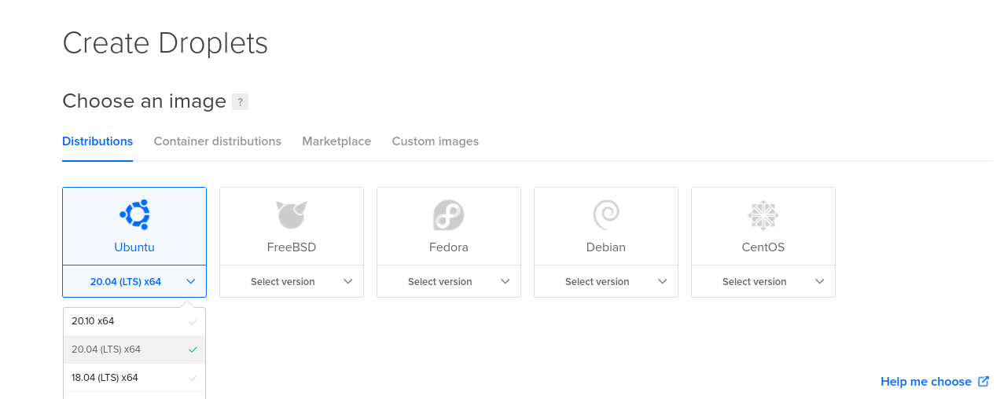
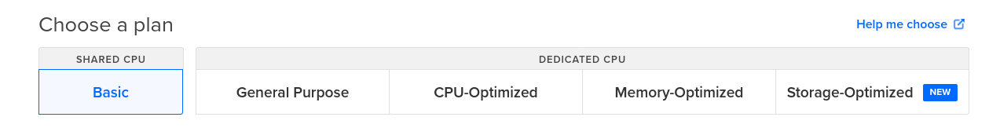
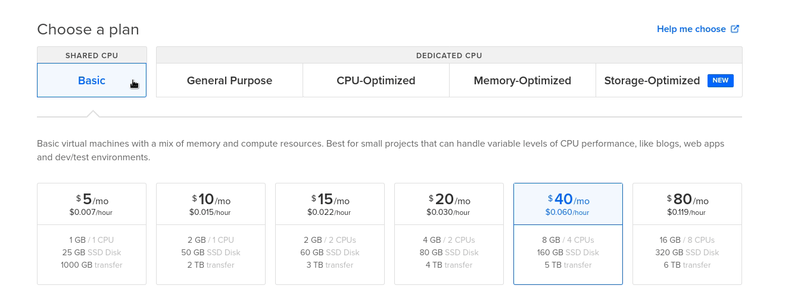
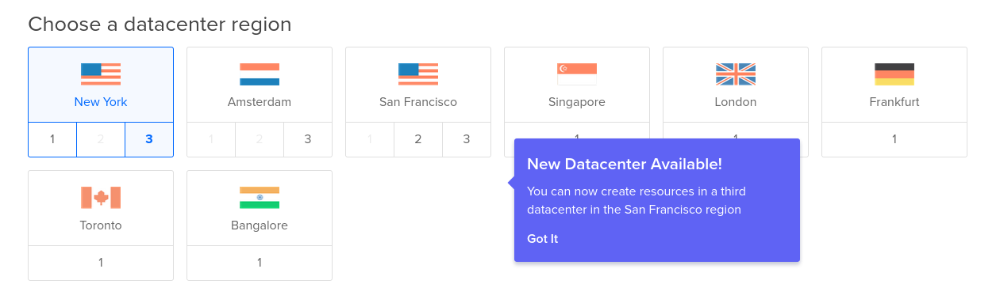
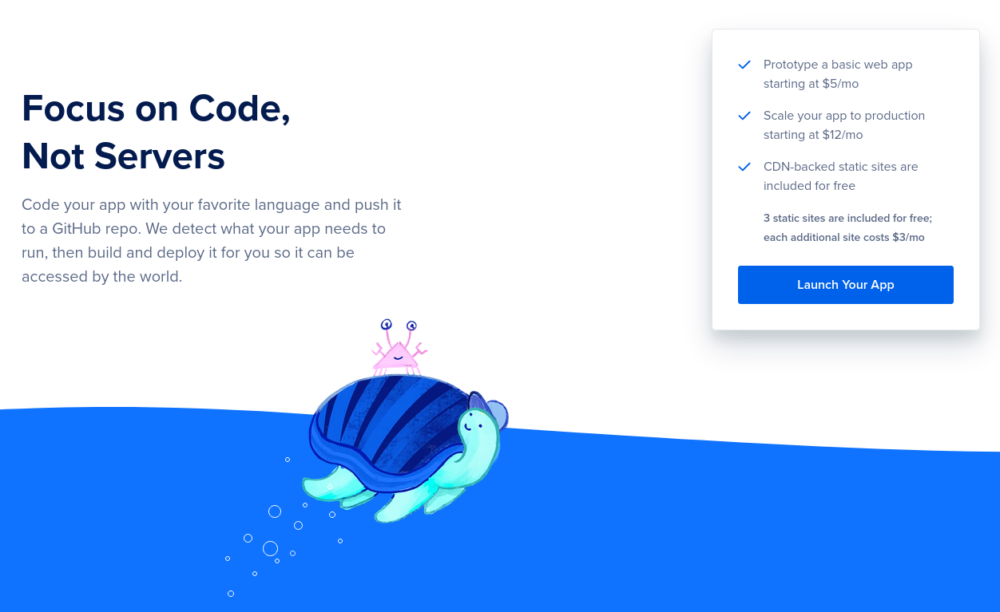
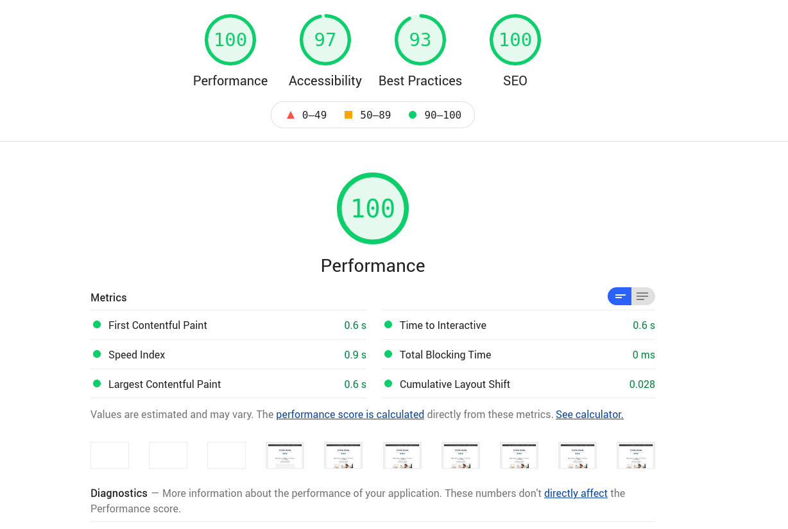

---
aliases:
- /digital-ocean-analysis-and-my-experience-as-a-user/
title: "Digital Ocean, analysis and my experience as a user"
date: "2021-01-14"
categories:
- "software architecture"
- "opinions"

coverImage: "images/Mi-experiencia-digital-ocean.jpg"
coverImageCredits: "credits https://www.pexels.com/es-es/@elaine-bernadine-castro-1263177/"
description: "In this post I talk about my experience using the Digital Ocean platform, as well as the options it has to offer you as a developer."
keywords:
- digital ocean
- opinion
- kubernetes
- deploy
- cloud
- iaas
- paas
- vps

authors:
- Eduardo Zepeda
---

Are you choosing a hosting service but don't know which one to choose? Surely you have already had contact with Digital Ocean's advertising but you want to hear a real opinion of what they have to offer. I've been using Digital Ocean for my personal projects for several years and I'll tell you about my experience and what you can find if you decide to hire their services.

Sign up using [my affiliate link](https://m.do.co/c/a22240ebb8e7) and receive $200 USD to spend on Digital Ocean.

## differences between IAAS and PAAS

I'm pretty sure you've considered using Vercel, Netifly, Heroku or another modern hosting service for your application (probably made in Javascript). But, is it the same? Well, here's a little clarification, just in case you don't know; there are different types of companies for online services; IAAS, Infrastructure as a service; and PAAS, platform as a service. 

If you already know this, skip to the Droplet's section.

### IAAS

Translated into English as "infrastructure as a service". Put in simpler words: they rent you the infrastructure, storage space and network access to it. In other words, a server with an operating system on which you are responsible for the details of the configuration.

This gives you total control over the server, you decide absolutely everything. This can be a good or bad thing. If you know exactly what you are doing, you can customize it according to your needs for maximum performance and efficiency. On the other hand, it means that you have to decide every detail yourself, with all the burden that implies, because everything will come with its default values and these may not be the right ones for your application.

If you want to customize something, you will have to get into the terminal via ssh, use cpanel or any other means that allows you to modify the system values.

The companies that stand out here are AWS EC2, Digital Ocean and Linode, to name a few.

### PAAS

There are also PAAS which, translated, means "Platform as a Service". That is, they will take care of all the server configuration, so that you only focus on developing your application. Here you forget to deal with a server configuration such as Nginx, Apache; your hosting provider takes care of everything, they decide all the details to serve your application.

Imagine the level of specialization that Vercel has, being the creators of NextJS, to serve each of its applications made with this technology.

Generally, in a PAAS, the configuration of server aspects such as environment variables and the like is done through a web page interface, in a more user-friendly way.

Heroku, Netifly, Vercel and others stand out in this category.

Now let's move on to Digital Ocean.

## Droplets in Digital Ocean

Digital Ocean works with Droplets, which are virtual servers that are rented to you. When you create a Droplet you can choose different operating systems and versions. You can access the terminal of any Droplet through its web page or through the [ssh command](/en/basic-linux-commands-you-should-know/).

Once you create a Droplet this is available in less than a minute.

### Customized images in DO

If you don't want to start from a "blank" operating system you can opt for some more specific images that include pre-installed software for the most popular software requirements: web development, data science, blogging, frameworks, media, storage, elearning, ecommerce, etc.

There you will find Django, Nodejs, Magento, Wordpress, Ghost, MongoDB and other applications.

### Droplets according to your needs

Digital Ocean also has specialized Droplets, either in CPU, memory or storage and a general purpose version.

The most basic, and cheapest, version is a shared CPU, in exchange for offering you the best prices.

### The cheap Droplets of DO

And now I'm sure you're wondering how much it costs me. Well, the answer is obvious: it depends.

Just to give you an idea, the cheapest Droplet costs ~~$5 usd per month~~ $4 usd per month. That's practically nothing and for a small website it's usually more than enough. By way of comparison, Vercel hosts your application for free with certain limitations, their next plan, at the time of writing this article, costs $20 usd per month.

Notice how all plans handle storage with an SSD.

### Cloud provider with servers around the world

Digital Ocean has servers in different locations around the world. So you always have an option close to your customers.

I have tried the servers in the United States, due to the proximity to Mexico, and I have not had any problem.

## Other services available on Digital Ocean

Remember I told you that there were IAAS and PAAS companies? Well, the truth is a little bit more complicated, many IAAS companies have grown a lot and have started to provide PAAS type services. And, as you might expect, Digital Ocean has not been left behind.

It has little time offering the integration and deployment of your applications using your Github or Gitlab repositories. You put in the code and they compile and run your project.

Digital Ocean also offers CDN services, called spaces, compatible with S3 from $5 usd per month.

### Kubernetes

Digital Ocean provides Kubernetes clusters with storage and load balancers with a few clicks.

### Apps

The apps are similar to a serverless solution, you connect your github, gitlab or bitbucket account with digital Ocean and you can upload Node apps or static files for them to serve, you can even specify them to run the compilation or any command you want. This is, so far, **the cheapest solution offered by Digital Ocean** and it is excellent for handling Frontend applications.

### Volumes

They are extra space that you add to the droplets to increase their capacity, as if you were connecting an extra hard disk to them.

### Databases

Self-managed databases with automatic backups and optional encryption. Handles Postgres, MongoDB, MySQL and Redis.

## Digital Ocean vs AWS vs Azure

Digital Ocean is a service focused more on small and medium projects, it does not have as many solutions as AWS or Azure. For example, it does not have solutions in artificial intelligence for IT security analysis, big data analysis or other SaaS options. But, in exchange for these shortcomings that leave it up to developers, it offers much more competitive prices than the big players.

## My experience using Digital Ocean

I have used Digital Ocean to host personal projects and also to manage my domains. I haven't had any problems with down servers so far, or at least not that I've noticed or any user has brought it to my attention. In fact, right now you are reading this from a Droplet using ~~a headless Wordpress and for the frontend frontity (A React framework) served with Nginx~~ Hugo and hosted at Digital Ocean. This blog uses the cheapest service, the $5 usd one, and the truth is that for the amount of traffic I have it doesn't feel slow and has decent Lighthouse metrics, without any cache plugin.

It should be clarified that I did modify some things from the default settings to have a better performance. For example, enabling HTTP2, instead of the default HTTP, as well as installing the HTTP certificate using cerbot in the terminal, as the default installation did not include it. Extra tasks that other hosting services would have solved for me, such as [easywp](/en/my-experience-using-easywp-and-namecheap/).

## Summarizing my experience using DO

My experience has been quite good, with no complaints in terms of the performance they promise.

If you don't want to mess with Apache, Nginx or any other server configurations, maybe a Droplet from Digital Ocean is not your best option.

On the other hand, Digital Ocean offers one of the best costs to start a project; $3 usd for the most basic package (Apps) is an **incredibly low price** for static or Frontend based pages only.



