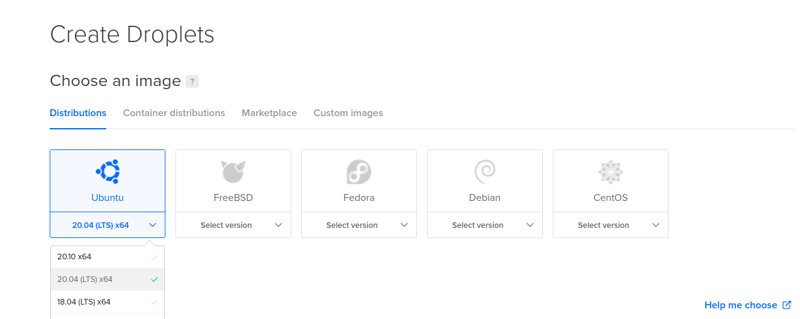
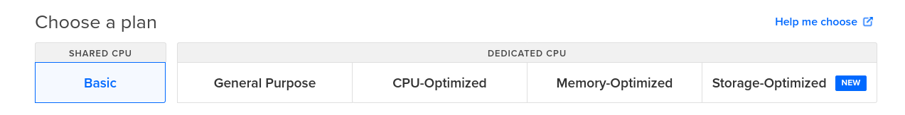
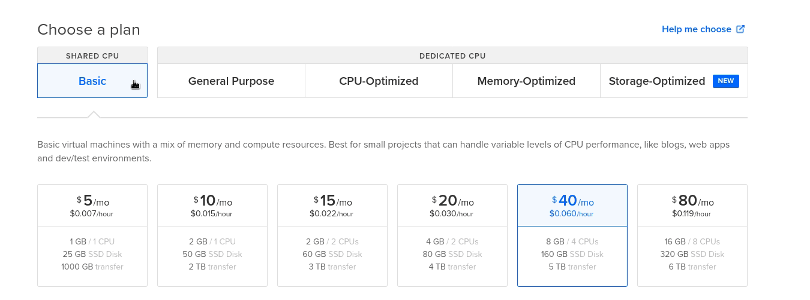
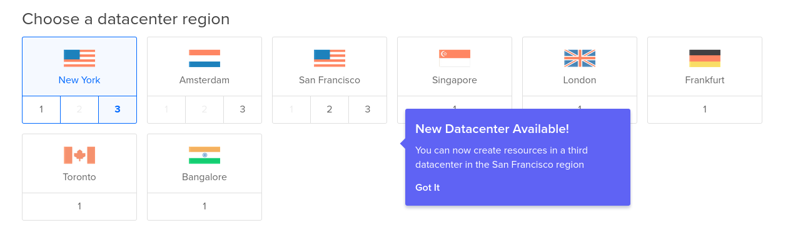
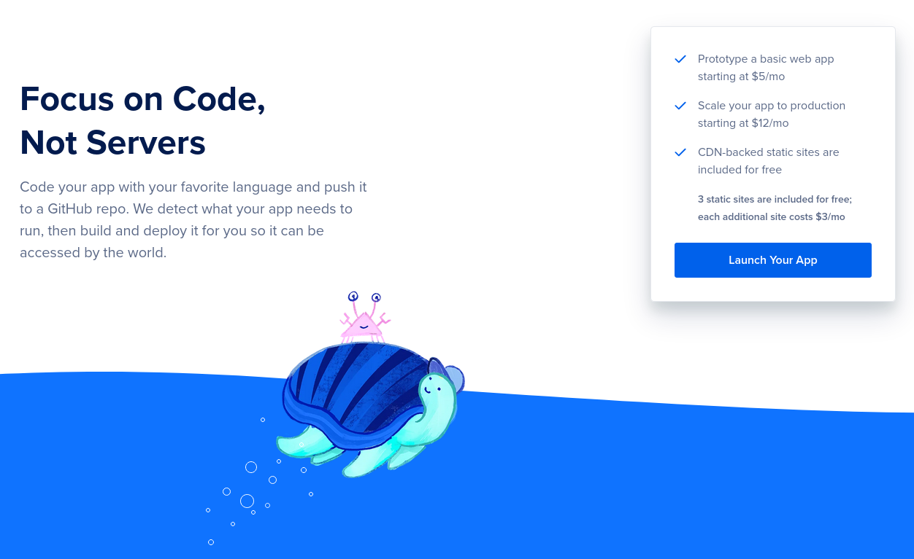
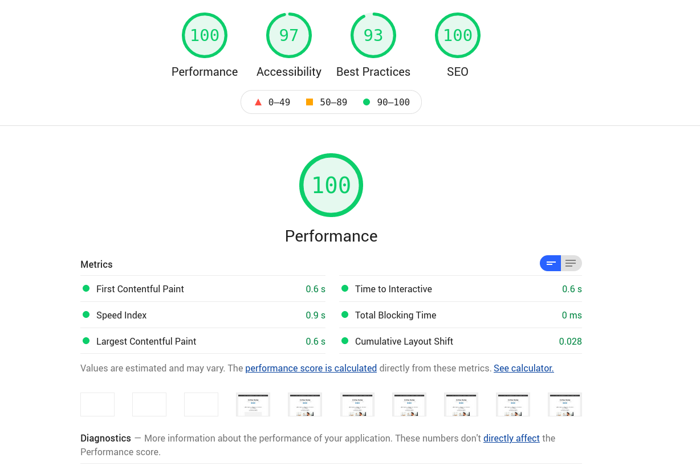

---
aliases:
- /digital-ocean-analisis-y-mi-experiencia
- /digital-ocean-analisis-y-mi-experiencia-como-usuario
- /mi-experiencia-con-digital-ocean-como-hosting/
authors:
- Eduardo Zepeda
categories:
- arquitectura de software
- opiniones
coverImage: images/Mi-experiencia-digital-ocean.jpg
coverImageCredits: Créditos https://www.pexels.com/es-es/@elaine-bernadine-castro-1263177/
date: '2021-01-14'
description: En esta entrada de platico mi experiencia usando la plataforma Digital
  Ocean, así como las opciones que tiene para ofrecerte como developer
keywords:
- digital ocean
- opinion
- kubernetes
- deploy
- cloud
- iaas
- paas
- vps
title: Digital Ocean, análisis y mi experiencia como usuario
---

¿Estás eligiendo un servicio de hosting pero no sabes cual elegir? De seguro ya tuviste contacto con la publicidad de Digital Ocean pero quieres escuchar una opinión real de lo que tienen para ofrecer. Llevo usando Digital Ocean como hosting de mis proyectos personales por varios años y te platico como ha sido mi experiencia y lo que puedes encontrar si decides contratar sus servicios.

## Diferencias entre IAAS y PAAS

Estoy casi seguro de que has considerado usar Vercel, Netifly, Heroku u otro servicio de hosting moderno para tu aplicación (probablemente hecha en Javascript). Pero, ¿es lo mismo? Bien pues aquí hay que hacer una pequeña aclaración, solo en caso de que no lo sepas; existen diferentes tipos de empresas para servicios en línea; IAAS, Infrastructure as a service; y PAAS, platform as a service.

### IAAS

Traducido al español como "infraestructura como servicio". Puesto en palabras más simples: te rentan la infraestructura, el espacio de almacenamiento y el acceso a este por red. Es decir, un servidor con un sistema operativo en el que tú te tienes que responsabilizar de los detalles de la configuración.

Lo anterior te da un control total sobre el servidor, tú decides absolutamente todo. Esto puede ser algo bueno o malo. Si sabes exactamente lo que estás haciendo, puedes personalizarlo acorde a tus necesidades para obtener el máximo rendimiento y eficiencia. Por otro lado, eso significa que debes decidir cada detalle por ti mismo, con toda la carga que eso implica, pues todo vendrá con sus valores por defecto y estos pueden no ser los adecuados para tu aplicación.

Si quieres personalizar algo, habrá que meterse a la terminal por ssh, usar cpanel o cualquier otro medio que te permita modificar los valores del sistema.

Las compañias que destacan aquí son AWS EC2, Digital Ocean y Linode, por decir algunos.

### PAAS

También existen los PAAS que, traducido, significa "Plataforma como servicio". Es decir, ellos se encargaran de toda la configuración del servidor, para que tú solo te centres en desarrollar tu aplicación. Aquí te olvidas de lidiar con una configuración de servidores como Nginx, Apache; tu proveedor de hosting se encarga de todo, ellos deciden todos los detalles para servir tu aplicación.

Imagínate el nivel de especialización que tiene Vercel, siendo los creadores de NextJS, para servir cada una de sus aplicaciones hechas con esta tecnología.

Generalmente, en un PAAS, la configuración de aspectos del servidor como variables de entorno y similares se hace a través de la interfaz de una página web, de manera más amigable para el usuario.

En esta categoría resaltan Heroku, Netifly, Vercel y otros.

Ahora sí, pasemos a Digital Ocean.

## Droplets en Digital Ocean

Digital Ocean trabaja con Droplets, que son los servidores virtuales que te alquilan. Cuando creas un Droplet puedes elegir diferentes sistemas operativos y versiones. Puedes acceder a la terminal de cualquier Droplet por medio de su página web o a través del [comando ssh.](/es/comandos-de-linux-basicos-que-deberias-conocer/)

Una vez que creas un Droplet este se encuentra disponible en menos de un minuto.

### Imágenes personalizadas en DO

Si no quieres partir desde un sistema operativo "en blanco" puedes optar por algunas imágenes más específicas que incluyen software previamente instalado, para los requerimientos más populares en cuanto a software: desarrollo web, data science, blog, frameworks, media, storage, elearning, ecommerce, etc.

Estas imágenes ya vienen configuradas con todo lo que necesitas para correr tu aplicación, ya sea de Django, Nodejs, Magento, Wordpress, Ghost, MongoDB y otras.

### Droplets o VPS baratos en Digital Ocean

Digital Ocean también cuenta con Droplets especializados, ya sea en CPU, memoria o almacenamiento y una versión para propósito general.

La versión más básica, y barata, es un CPU compartido, a cambio de ofrecerte los mejores precios.

### Droplets de todos los precios

Y ahora de seguro te preguntarás cuanto me cuesta. Pues bien, la respuesta es obvia: depende.

Solo para que te des una idea, el Droplet más barato tiene un costo de ~~$5 usd por mes~~ $4 usd por mes. Es prácticamente nada y para un sitio web pequeño suele ser más que suficiente. A manera de comparación, Vercel aloja tu aplicación gratis con ciertas limitaciones, su siguiente plan, al momento de escribir este artículo, cuesta $20 usd por mes.

Observa como todos los planes manejan el almacenamiento con un SSD.

### El proveedor de cloud con servidores alrededor del mundo

Digital Ocean te posee servidores en diferentes ubicaciones alrededor del mundo. Para que siempre tengas una opción cercana a tus clientes.

Yo he probado los servidores de Estados Unidos, por la cercanía con México, y no he tenido problema alguno.

## Otros servicios que ofrece de Digital Ocean

¿Te acuerdas que te dije que había empresas IAAS y PAAS? Pues la verdad es un poquito más complicado, muchas empresas IAAS han crecido muchísimo y han comenzado a brindar servicios del tipo PAAS. Y, como podrás esperar, Digital Ocean no se ha quedado atrás.

Tiene poco tiempo ofreciendo la integración y despliegue de tus aplicaciones usando tus repositorios de Github o Gitlab. Tú pones el código y ellos compilan y corren tu proyecto.

Digital Ocean también ofrece servicios de CDN, llamados spaces, compatibles con S3 desde $5 usd al mes.

### Kubernetes

Digital Ocean provee clusters de Kubernetes con almacenamiento y balanceadores de carga con unos cuantos clicks.

### Apps

Las apps son similares a una solución serverless, conectas tu cuenta de github, gitlab o bitbucket con digital Ocean y puedes subir aplicaciones de Node o archivos estáticos para que ellos lo sirvan, incluso puedes especificarles que sean ellos quienes ejecuten la compilación o cualquier comando que quieras. Esta es, hasta el momento, **la solución más barata que ofrece Digital Ocean** y es excelente para manejar aplicaciones de Frontend.

### Volúmenes

Son espacio extra que le agregas a los droplets para aumentar su capacidad, como si les conectaras un disco duro extra.

### Databases

Bases de datos autoadministradas con backups automáticos y cifrado opcional. Manejan Postgres, MongoDB, MySQL y Redis.

## Digital Ocean vs AWS vs Azure

Digital Ocean es un servicio enfocado más en proyectos pequeños y medianos, no tiene tantas soluciones como AWS o Azure. 

Por ejemplo, no cuenta con soluciones en inteligencia artifical para análisis de seguridad informática, análisis de datos a gran escala u otras opciones de SaaS. Pero, a cambio de esas carencias que dejan a opción de los desarrolladores, ofrece precios mucho más competitivos que los grandes jugadores.

## Mi experiencia usando Digital Ocean

Yo he usado Digital Ocean para hostear proyectos personales y también para manejar mis dominios. No he tenido problemas de servidores caídos hasta el momento, o al menos no que me haya dado cuenta o algún usuario me lo haya hecho notar. De hecho, ahora mismo estás leyendo esto ~~desde un Droplet que usa un headless Wordpress y para el frontend frontity (Un framework de React) servido con Nginx~~ Hugo y hosteado en Digital Ocean. Este blog utiliza ~~el servicio más económico, el de $5 usd~~ el servicio de App, que cuesta alrededor de $3 usd, y la verdad es que para la cantidad de tráfico que tengo no se siente lento y cuenta con indicadores decentes en Lighthouse, sin caché de ningún tipo ni ninguna sofisticación.

~~Cabe aclarar que sí he modificado algunas cosas de la configuración predeterminada para tener un mejor rendimiento. Por ejemplo, habilitar HTTP2, en lugar del HTTP a secas que viene por defecto, así como instalar el certificado HTTP usando cerbot en la terminal, pues la instalación predeterminada no lo incluía. Tareas extras que otros servicios de hosting hubieran solucionado por mi, como por ejemplo [easywp](/es/mi-experiencia-usando-easywp-y-namecheap/)~~. 

Como migre mi blog a Hugo ya no tengo que preocuparme de configurar nginx, ni apache ni nada.

## Resumen de mi experiencia usando DO

Mi experiencia ha sido bastante buena, sin ninguna queja en cuanto a las prestaciones que prometen.

Digital Ocean ofrece uno de los mejores costos para empezar un proyecto; $3 usd para el paquete más básico (Apps) es un **precio increíblemente bajo** para páginas estáticas o basadas en Frontend únicamente.



