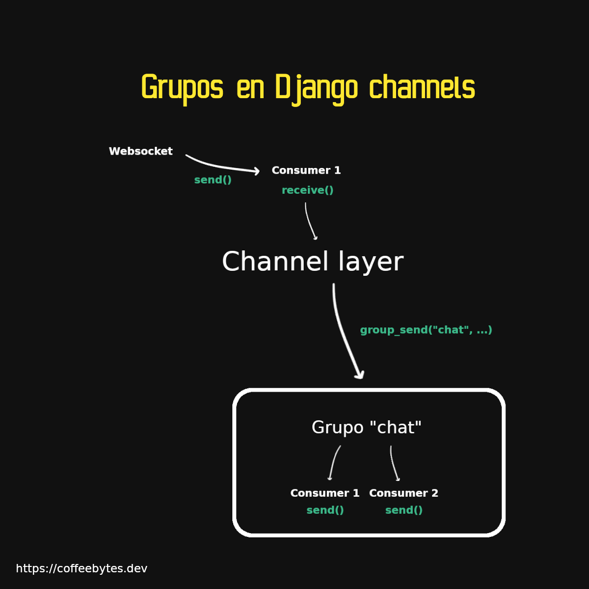
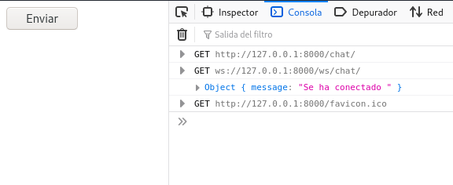

Channel layers allow you to interact and share information with different consumers in django channels. This allows each consumer to communicate with the rest. For example, when in a chat a user sends a message, everyone can read the message, when a user leaves a room, everyone can know that he left it. With this capability it is possible to create a distributed application in which information is shared among the different users.

If you don't know what Django channels is, I recommend you to read my previous post, where I explain the basic parts of [django channels: consumers, scope and events](/en/django-channels-consumers-environments-and-events/)

## Configure a channel layer

It is not enough for one instance to be able to access information from all other instances.

What if we want only some instances to have access to the information and not others?

Just as in a chat, you do not want all existing chats to receive your messages, nor do you expect to receive messages from all chats, only those in which you participate.

To handle this information in common we need a channel layer (an optional feature of django channels), and groups of channels or consumers. In this way we will ensure that each instance of a channel, that is, a consumer, can communicate with other channels, but not with all of them, only with those of the group we specify.

### Channel layers under development

To use a channel layer in development we need to add an extra configuration to our configuration file and modify our consumer object. This configuration below tells Django to handle the channel layer in memory and is perfect for testing in development.

```python
# mychannels/settings.py
CHANNEL_LAYERS = {
    "default": {
        "BACKEND": "channels.layers.InMemoryChannelLayer"
    }
}
```

### Channel layers in production

The above configuration is not for production. For production we need to install redis and the _[channels-redis](https://pypi.org/project/channels-redis/)_ package. I told you a bit about redis when I explained how to create a [history of products visited with django and redis](/en/how-to-create-a-history-of-visited-products-with-django-and-redis/).

```python
sudo apt install redis
pip install channel-redis
```

If installed correctly we will have redis running on port 6379.

We will now directly access the redis application through its default port.

```python
# mychannels/settings.py
CHANNEL_LAYERS = {
    "default": {
        "BACKEND": "channels_redis.core.RedisChannelLayer",
        "CONFIG": {
            "hosts": [("127.0.0.1", 6379)],
        },
    },
}
```

## Broadcasting with a channel or consumer

After adding the above configuration, it is time to modify our _consumer_ to send messages to the rest of the connections. In the previous post I explained that **each consumer has the properties _channel_layer_ and _channel_name_**, which refer to the channel layer it belongs to and its own name, respectively. We will use those properties to get the channel layer it belongs to and its name.

Our consumer will continue to maintain its three main functions: connect, disconnect and receive, but with added functionality.


The process by which a channel or consumer joins a group.

```python
# chat/consumers.py
import json
from channels.generic.websocket import WebsocketConsumer
from asgiref.sync import async_to_sync

class ChatConsumer(WebsocketConsumer):

    def connect(self):
        async_to_sync(self.channel_layer.group_add)("chat", self.channel_name)
        self.accept()

    def disconnect(self, close_code):
        async_to_sync(self.channel_layer.group_discard)("chat", self.channel_name)

    def receive(self, text_data):
            async_to_sync(self.channel_layer.group_send)(
                "chat",
                {
                    "type": "chat.message",
                    "text": text_data,
                },
            )

    def chat_message(self, event):
        self.send(text_data=event["text"])
```

The changes we made were as follows:

* We import the _async_to_sync_ function, which allows us to execute asynchronous code synchronously.
* We use the _group_add_ method to add a channel (remember that a consumer is a representation of a channel) to a given group. That is, add the current channel/consumer to the group called "chat". In the image above it is better explained.
* In case a user disconnects, we remove it from the "chat" group with _group_discard_.
* Now, every time we receive a message in a _consumer_, it will call the method **_group_send_** of the channel layer to which it belongs, which will be in charge of **sending the data, in dictionary form, automatically to all the active members of the group "chat "**.
* The type key will tell the _consumer_ which method to use. The syntax is **replace the dot with an underscore**. That is to say that the type _chat.message_ will execute the _chat_message_ method of each _consumer_ that receives it.



Channel layer sending information to the group "chat" with its method group_send

## Handling websockets in HTML

To simplify the connection to websocket in the browser, I'm going to take the Javascript code needed to send a message and place it in a super simple HTML template that will reside in _templates/index.html_. Create it if you don't have it.

```html
<!DOCTYPE html>
<html lang="en">
<head>
    <meta charset="UTF-8">
    <meta http-equiv="X-UA-Compatible" content="IE=edge">
    <meta name="viewport" content="width=device-width, initial-scale=1.0">
    <title>Document</title>
</head>
<script>
    // Se crea la conexión por websocket
    const chatSocket = new WebSocket(
            'ws://'
            + window.location.host
            + '/ws/chat/'
        );
    // Cada que se recibe un mensaje se lee y se imprime en pantalla
    chatSocket.onmessage = function(e) {
            const data = JSON.parse(e.data);
            console.log(data)
        }
    // Envia el texto "nuestro mensaje"
    function sendMessage() {
        let message = "nuestro mensaje"
        chatSocket.send(JSON.stringify({
            'message': message
        }));
    }
</script>
<body>
    <button onclick=sendMessage()>Enviar</button>
</body>
</html>
```

The code is practically the same of the previous entry, I have only added the sending of the message to a function that will be executed when we press the button.

In our _views.py_ file of the chat app we create the view that is in charge of rendering the template

```python
# chat/views.py
from django.shortcuts import render

def useless_chat(request):
    return render(request, "index.html")
```

And let's not forget to add this view to the urls of our project.

```python
# mychannels/settings.py
from django.urls import path
from chat.views import useless_chat

urlpatterns = [
    path('admin/', admin.site.urls),
    path('chat/', useless_chat)
]
```

Ready! Now comes the interesting part... if you open two windows, two _consumers_ will be created and every time a _consumer_ sends a message, it will be received in the Django app and _self.channel_layer.group_send_ will send it to the rest of the consumers, when they receive it, each consumer will execute its _chat_message_ method, which will send the text that was sent.

Observe how both tabs receive the sent messages

## Users in django channels

What about the users? So far we have been handling anonymous users. Note that authentication is quite simple in django channels. To incorporate it we wrap our application in the _AuthMiddlewareStack_ middleware, django will handle the _session_ object, as usual.

```python
# mychannels/asgi.py
import os

from channels.auth import AuthMiddlewareStack
from channels.routing import ProtocolTypeRouter, URLRouter
from django.core.asgi import get_asgi_application
import chat.routing

os.environ.setdefault("DJANGO_SETTINGS_MODULE", "mychannels.settings")

application = ProtocolTypeRouter({
  "http": get_asgi_application(),
  "websocket": AuthMiddlewareStack(
        URLRouter(
            chat.routing.websocket_urlpatterns
        )
    ),
})
```

With this middleware we will have access to the _user_ object through the scope in:

```python
#chat/consumers.py
class ChatConsumer(WebsocketConsumer):

    def connect(self):
        async_to_sync(self.channel_layer.group_add)("chat", self.channel_name)
        self.accept()
        self.user = self.scope["user"]
        self.send(text_data=json.dumps({"message": "Se ha conectado %s" % (self.user.username)}))
```

If you have a logged in user you will see something like this when logging in:


And if you are not logged in you will see an empty string, which corresponds to an anonymous user.



## Login and logout in django channels

Django channels also provides us with functions to login and logout our users, just remember that **the login function does not authenticate a user, it only logs them in**, so the checks are up to you.

```python
#chat/consumers.py
from asgiref.sync import async_to_sync
from channels.auth import login, logout, get_user

class ChatConsumer(WebsocketConsumer):

    ...

    def receive(self, text_data):
        ...
        async_to_sync(login)(self.scope, user)
        # La sesión se modifica con el login
        # Pero es necesario guardar la sesión 
        self.scope["session"].save()

    def disconnect(self, close_code):
        async_to_sync(logout)(self.scope)(
```

Now you can complicate the sending of information so that it behaves the way you want it to, such as creating different rooms, or condition the sending of messages to a restricted group of users, or only to one of them.

## Tips for django-channel production

Before deploying an application that involves channels I will tell you about the many things that can go wrong and how to prevent them.

### django.core.exceptions.AppRegistryNotReady: Apps not loaded

If you are using uvicorn and an asgi application, this is because django tries to use applications that have not yet been loaded. To prevent the error manually load the application yourself before importing any other app.

In this particular case, the order of imports DOES matter.

``` python
from django.conf import settings
from django.core.asgi import get_asgi_application

current_settings = (
    "app.settings" if settings.DEBUG else "app.dev_settings"
)
os.environ.setdefault("DJANGO_SETTINGS_MODULE", current_settings)
django_asgi_app = get_asgi_application()

# el resto de tus imports van acá
# import app...

#...
application = ProtocolTypeRouter(
    {
        "http": django_asgi_app,
        # ...
}
```

### Make sure you have the websocket libraries installed.

If you are going to work with websockets, make sure you have all the required libraries installed, uvicorn provides us with these libraries if we install its standard version.

``` bash
pip install uvicorn[standard]
```

Otherwise we will get the error _[WARNING] No supported WebSocket library detected.

### Make sure you are using the correct websocket protocol

The error can manifest itself in several ways, one of which is this _deploys failing due to "unhealthy allocations"_.

If you try to communicate with an insecure protocol to an insecure protocol you will get an error.

``` javascript
// Te toca definir la variable/funcion de manera dynamica
if(serving_using_https){
    ws_url = 'wss://...'
}
else{
    ws_url = 'ws://...'
}
```