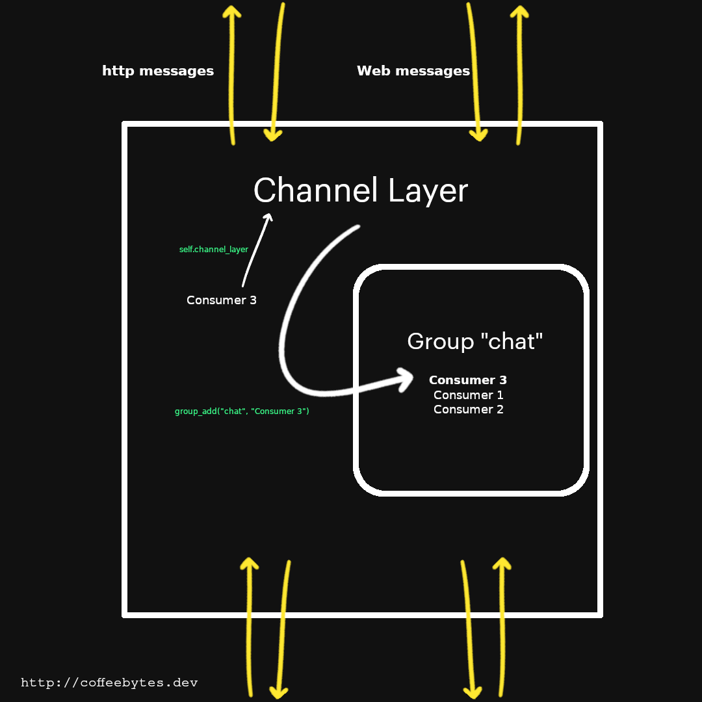
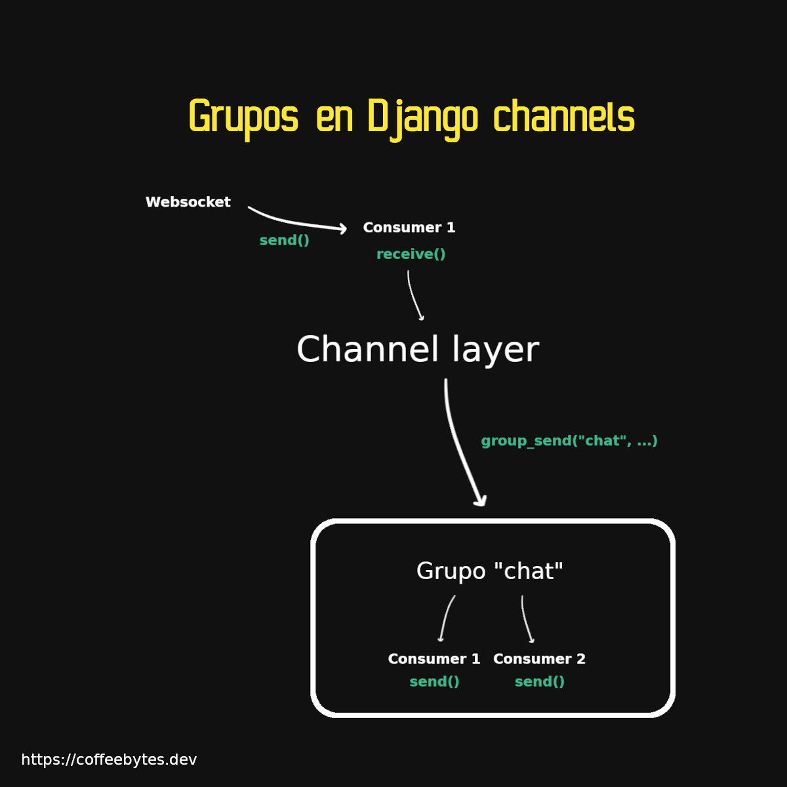
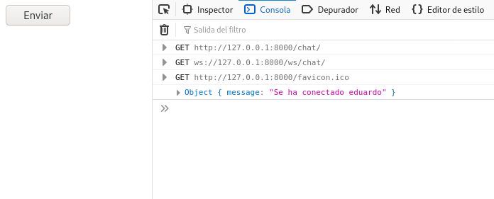
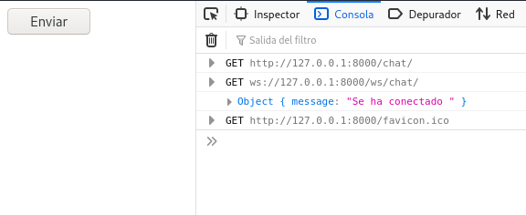

Los channel layers te permiten interactuar y compartir información con diferentes consumers en django channels. Lo que permite a cada consumer comunicarse con el resto. Por ejemplo, cuando en un chat un usuario envía un mensaje, todos pueden leer el mensaje, cuando un usuario abandona una sala, todos pueden saber que la abandonó. Con esta capacidad es posible crear una aplicación distribuida en la que se comparta información entre los diferentes usuarios.

Si no sabes que es Django channels, te recomiendo que le des una leída a mi entrada anterior, donde te explico las partes básicas de [django channels: consumers, scope y eventos.](/django-channels-consumers-scope-y-eventos/)

## Configurar un channel layer

No basta con que una instancia puedan acceder a la información de todas las otras instancias.

¿Qué pasa si queremos que solo algunas instancias accedan a la información y otras no?

Justo como sucede en un chat, no deseas que todos los chats existentes reciban tus mensajes, ni tampoco esperas recibir los mensajes de todos los chats, solo aquellos en los que participas.

Para manejar esta información en común necesitamos un channel layer (una característica opcional de django channels), y grupos de channels o consumers. De esta manera nos encargaremos de que cada instancia de un channel, o sea un consumer, pueda comunicarse con otros channels, pero no con todos, solo con los del grupo que especifiquemos.

### Channel layers en desarrollo

Para usar un channel layer en desarrollo necesitamos añadir una configuración extra a nuestro archivo de configuración y modificar nuestro objeto consumer. Está configuración de abajo le dice a Django que maneje el channel layer en memoria y es perfecto para hacer pruebas en desarrollo.

```python
# mychannels/settings.py
CHANNEL_LAYERS = {
    "default": {
        "BACKEND": "channels.layers.InMemoryChannelLayer"
    }
}
```

### Channel layers en producción

La configuración anterior no es para producción. Para producción necesitamos instalar redis y el paquete _[channels-redis](https://pypi.org/project/channels-redis/)_. Te hablé un poco de redis cuando expliqué como crear un [historial de productos visitados con django y redis](/como-crear-un-historial-de-productos-visitados-con-django-y-redis/)

```python
sudo apt install redis
pip install channel-redis
```

Si se instaló bien tendremos a redis corriendo en el puerto 6379.

Ahora accederemos directamente a la aplicación de redis por medio de su puerto predeterminado.

```python
# mychannels/settings.py
CHANNEL_LAYERS = {
    "default": {
        "BACKEND": "channels_redis.core.RedisChannelLayer",
        "CONFIG": {
            "hosts": [("127.0.0.1", 6379)],
        },
    },
}
```

## Broadcasting con un channel o consumer

Tras agregar la configuración anterior, toca modificar nuestro _consumer_ para que envíe mensajes al resto de conexiones. En la entrada anterior te expliqué que **cada consumer tiene las propiedades _channel\_layer_ y _channel\_name_**, que se refieren al channel layer al que pertenecen y su propio nombre, respectivamente. Usaremos esas propiedades para obtener el channel layer al que pertenece y su nombre.

Nuestro consumer seguirá manteniendo sus tres funciones principales: connect, disconnect y receive, pero con funcionalidad añadida.



Proceso mediante el cual un channel o consumer se une a un group.

```python
# chat/consumers.py
import json
from channels.generic.websocket import WebsocketConsumer
from asgiref.sync import async_to_sync


class ChatConsumer(WebsocketConsumer):

    def connect(self):
        async_to_sync(self.channel_layer.group_add)("chat", self.channel_name)
        self.accept()

    def disconnect(self, close_code):
        async_to_sync(self.channel_layer.group_discard)("chat", self.channel_name)

    def receive(self, text_data):
            async_to_sync(self.channel_layer.group_send)(
                "chat",
                {
                    "type": "chat.message",
                    "text": text_data,
                },
            )

    def chat_message(self, event):
        self.send(text_data=event["text"])
```

Los cambios que hicimos fueron los siguientes:

- Importamos la función _async\_to\_sync_, que nos permite ejecutar código asíncrono de manera sincrona.
- Usamos el método _group\_add_ para añadir un canal (recuerda que un consumer es una representación de un channel o canal) a un determinado grupo. O sea, añadir el canal/consumer actual al grupo llamado "chat". En la imagen de arriba viene mejor explicado.
- En el caso de que un usuario se desconecte, lo removemos del grupo "chat" con _group\_discard_
- Ahora, cada que ves que recibamos un mensaje en un _consumer_, este llamará al método **_group\_send_** del channel layer al que pertenece, el cual se encargará de **enviar los datos, en forma de diccionario, de manera automática a todos los integrantes activos del grupo "chat"**.
- La llave type, le dirá al _consumer_ que método utilizar. La sintaxis es **reemplazar el punto por un guión bajo**. Es decir que el type _chat.message_ ejecutará el método _chat\_message_ de cada _consumer_ que lo reciba.



Channel layer mandando información al grupo "chat" con su método group\_send

## Manejando websockets en HTML

Para simplificar la conexión con el websocket en el navegador, voy a tomar el código Javascript necesario para enviar un mensaje y lo voy a colocar en una plantilla HTML súper simple que residirá en _templates/index.html_. Créala si no la tienes.

```html
<!DOCTYPE html>
<html lang="en">
<head>
    <meta charset="UTF-8">
    <meta http-equiv="X-UA-Compatible" content="IE=edge">
    <meta name="viewport" content="width=device-width, initial-scale=1.0">
    <title>Document</title>
</head>
<script>
    // Se crea la conexión por websocket
    const chatSocket = new WebSocket(
            'ws://'
            + window.location.host
            + '/ws/chat/'
        );
    // Cada que se recibe un mensaje se lee y se imprime en pantalla
    chatSocket.onmessage = function(e) {
            const data = JSON.parse(e.data);
            console.log(data)
        }
    // Envia el texto "nuestro mensaje"
    function sendMessage() {
        let message = "nuestro mensaje"
        chatSocket.send(JSON.stringify({
            'message': message
        }));
    }
</script>
<body>
    <button onclick=sendMessage()>Enviar</button>
</body>
</html>
```

El código es prácticamente el mismo de la entrada anterior, solo he añadido el envío del mensaje a una función que se ejecutará cuando presionemos el botón.

En nuestro archivo de _views.py_ de la app chat creamos la vista que se encarga de renderizar la plantilla

```python
# chat/views.py
from django.shortcuts import render

def useless_chat(request):
    return render(request, "index.html")
```

Y no olvidemos añadir esta vista a las urls de nuestro proyecto.

```python
# mychannels/settings.py
from django.urls import path
from chat.views import useless_chat

urlpatterns = [
    path('admin/', admin.site.urls),
    path('chat/', useless_chat)
]
```

¡Listo! Ahora viene lo interesante... si abres dos ventanas se crearán dos _consumers_ y cada que un _consumer_ envíe un mensaje, este se recibirá en la app de Django y _self.channel\_layer.group\_send_ lo enviará al resto de los consumers, cuando lo reciban, cada consumer ejecutará su método _chat\_message_, el cual le enviará el texto que fue mandado.

Observa como ambas pestañas reciben los mensajes enviados

## Usuarios en django channels

¿Y los usuarios? Hasta ahora hemos manejado usuarios anónimos. Entérate de que la autenticación es bastante simple en django channels. Para incorporarla envolvemos nuestra aplicación en el middleware _AuthMiddlewareStack_, django se encargará de manejar el objeto _session_, como siempre.

```python
# mychannels/asgi.py
import os

from channels.auth import AuthMiddlewareStack
from channels.routing import ProtocolTypeRouter, URLRouter
from django.core.asgi import get_asgi_application
import chat.routing

os.environ.setdefault("DJANGO_SETTINGS_MODULE", "mychannels.settings")

application = ProtocolTypeRouter({
  "http": get_asgi_application(),
  "websocket": AuthMiddlewareStack(
        URLRouter(
            chat.routing.websocket_urlpatterns
        )
    ),
})
```

Con este middleware tendremos acceso al objeto _user_ a través del scope en:

```python
 #chat/consumers.py
class ChatConsumer(WebsocketConsumer):

    def connect(self):
        async_to_sync(self.channel_layer.group_add)("chat", self.channel_name)
        self.accept()
        self.user = self.scope["user"]
        self.send(text_data=json.dumps({"message": "Se ha conectado %s" % (self.user.username)}))
```

Si tienes un usuario loggeado verás algo como esto al iniciar una conexión:



Y si no te encuentras loggeado verás un string vacío, que corresponde a un usuario anónimo.



## Login y logout en django channels

Django channels también nos provee de funciones para hacer login y logout a nuestros usuarios, solo recuerda que **la función login no autentica un usuario, solo lo loggea**, por lo que las comprobaciones corren por tu cuenta.

```python
#chat/consumers.py
from asgiref.sync import async_to_sync
from channels.auth import login, logout, get_user

class ChatConsumer(WebsocketConsumer):

    ...

    def receive(self, text_data):
        ...
        async_to_sync(login)(self.scope, user)
        # La sesión se modifica con el login
        # Pero es necesario guardar la sesión 
        self.scope["session"].save()

    def disconnect(self, close_code):
        async_to_sync(logout)(self.scope)(
```

Ahora puedes complicar el envío de información para que se comporte de la manera en la que tu quieres, como crear diferentes salas o condicionar el envío de mensajes a un grupo restringido de usuarios, o solo a uno de ellos.


## Tips para producción de django-channels

Antes de hacer deploy de una aplicación que involucre channels te voy a platicar de las múltiples cosas que pueden salir mal y como prevenirlas.

### django.core.exceptions.AppRegistryNotReady: Apps aren't loaded yet

Si estás usando uvicorn y una aplicación asgi, esto se debe a que django intenta usar aplicaciones que aún no han sido cargadas. Para prevenir el error carga manualmente la aplicación por ti mismo antes de importar cualquier otra app.

En este caso particular, el orden de las importaciones SÍ importa.

``` python
from django.conf import settings
from django.core.asgi import get_asgi_application

current_settings = (
    "app.settings" if settings.DEBUG else "app.dev_settings"
)
os.environ.setdefault("DJANGO_SETTINGS_MODULE", current_settings)
django_asgi_app = get_asgi_application()

# el resto de tus imports van acá
# import app...

#...
application = ProtocolTypeRouter(
    {
        "http": django_asgi_app,
        # ...
}
```

### Asegúrate de tener las librerías de websocket instaladas

Si vas a trabajar con websockets, asegúrate de tener todas las librerías requeridas instaladas, uvicorn nos provee de estas librerías si instalamos su versión estándar.

``` bash
pip install uvicorn[standard]
```

De otra manera tendremos el error *[WARNING] No supported WebSocket library detected.*

### Asegúrate de usar el protocolo de websocket correcto

El error puede manifestarse de varias formas, una de ellas es esta *deploys failing due to “unhealthy allocations”*

Si intentas comunicarte con un protocolo inseguro a uno inseguro obtendrás un error.

``` javascript
// Te toca definir la variable/funcion de manera dynamica
if(serving_using_https){
    ws_url = 'wss://...'
}
else{
    ws_url = 'ws://...'
}
```