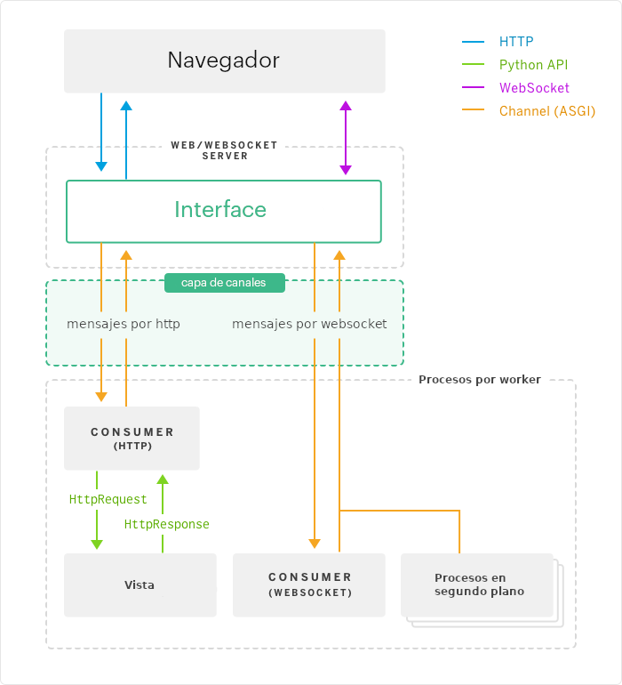
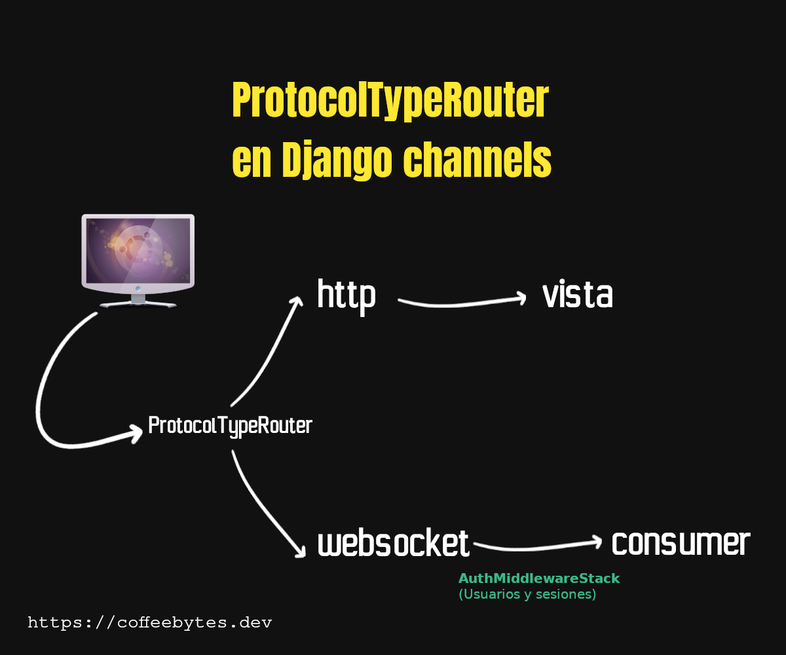
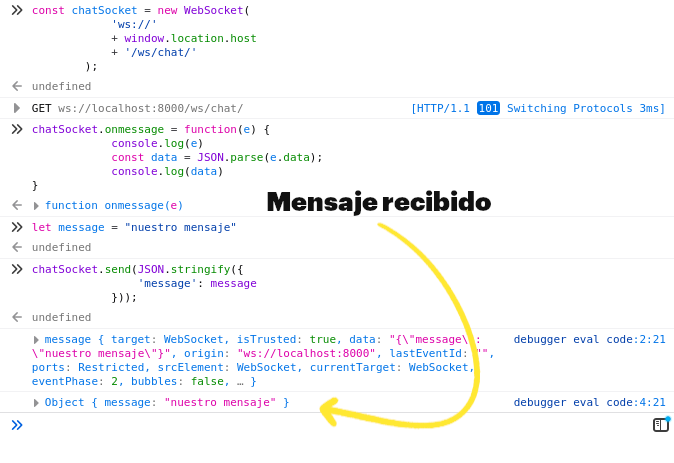

---

title: "Django channels: consumers, environments and events"
date: "2021-11-09"
categories:
- "django"

coverImage: "images/Django-channels-tutorial.jpg"
coverImageCredits: "credits to https://www.pexels.com/@yaroslav-shuraev"
description: "Learn the basics of django channels: consumers, scope and events, to handle websockets (ws) requests and return responses."
keywords:
- django
- python
- websockets

authors:
- Eduardo Zepeda
---

Why Django channels? Because Django does not allow us to create applications with real-time communication natively. Django channels gives Django the ability to handle protocols that require a persistent connection, such as WebSockets, MQTT, chatbots, while keeping intact its integration with the session system, authentication and the rest of the framework.

Django channels places an intermediate layer that is in charge of processing http requests to django views and websocket connections to an http consumer or a websocket consumer.



## What is a channel and a websocket?

I recommend that if you have no idea about websockets and channels you give a read to these two concepts because I will use them throughout this post and the next one.

If you are in a hurry, you can be satisfied with these definitions, which are simplistic and incomplete:

A websocket is a persistent connection that exists between a user's browser and a web server.

A channel is a model that allows several processes to communicate with each other by transmitting messages. django-channels owes its name to this concept and the concept is quite similar to what you would find in programming languages such as [Go](/en/go-use-of-channels-to-communicate-goroutines/).



## Django channels requires ASGI

Django channels requires us to switch from a WSGI server to an ASGI server, to handle its asynchronous nature.

If you don't know what ASGI means, just know that it is an interface for Python to interact with web servers asynchronously.

Each time a new user initiates a request an ASGI "application" will be created and handled, this connection, unlike a normal HTTP request, is persistent.

## Installation of django channels

First we install channels directly from our favorite package manager, I will use pipenv and the most current version at the date of this article.

```python
pip install channels["daphne"]
```

We add it to our installed applications.

Daphne must be on top of all applications, because it takes control of the runserver command to initialize the application.

```python
INSTALLED_APPS = (
    'daphne',
    'django.contrib.auth',
    'django.contrib.contenttypes',
    'django.contrib.sessions',
    'django.contrib.sites',
    ...
    'channels',
)
```

In our project folder an _asgi.py_ file is created when we run _django-admin startproject_. This file is **the "gateway" through which a server interacts with our Python code**. We need to modify it to tell django how to handle each protocol.

My application is called "_mychannels_" but replace the name with yours.

```python
# mychannels/asgi.py
import os

from channels.routing import ProtocolTypeRouter
from django.core.asgi import get_asgi_application

os.environ.setdefault('DJANGO_SETTINGS_MODULE', 'mychannels.settings')

application = ProtocolTypeRouter({
    "http": get_asgi_application(),
    # Ahora mismo solo tiene el protocolo http, el que usamos normalmente
})
```

Now we need to tell django that we will use an ASGI application. This step will get our application to wrap the _runserver_ command provided by django.

```python
# mychannels/settings.py
ASGI_APPLICATION = "mychannels.asgi.application"
```

Now, we will create an application called chat.

```bash
django-admin startapp chat
```

And we will add it to our installed apps.

```python
INSTALLED_APPS = (
    ...
    'chat',
    'channels',
)
```

This app will be in charge of managing the websocket connections that we will create.

## Handling ws connections with a consumer

What is a consumer? A _consumer_ is **an abstraction of a channel in the form of a class, this class implements methods that will handle the events** of our users. There are also synchronous and asynchronous consumers that handle the low-level Python code for you.

### What events can a consumer handle?

Events are the actions that our users will perform, such as connecting, disconnecting or sending information to the websocket and the consumer will respond to them. In addition to these events we can create custom events (don't worry about that now) and assign them to functions.


The web socket sends information with the send method, the consumer receives it with its receive method, and then sends a response with send, which the websocket will process with onmessage.

There are consumers for queuing, websockets, synchronous, etc.

* AsyncWebsocketConsumer[](https://channels.readthedocs.io/en/stable/topics/consumers.html#asyncwebsocketconsumer)
* JsonWebsocketConsumer[](https://channels.readthedocs.io/en/stable/topics/consumers.html#jsonwebsocketconsumer)
* AsyncJsonWebsocketConsumer[](https://channels.readthedocs.io/en/stable/topics/consumers.html#asyncjsonwebsocketconsumer)
* AsyncHttpConsumer[](https://channels.readthedocs.io/en/stable/topics/consumers.html#asynchttpconsumer)

The type of consumer will depend on the class it inherits.

We will create a _consumer_ for websocket in our chat application.

### Structure of a consumer

Observe the structure of a _consumer_, **each method will be in charge of handling a different event.**.

This one here **inherits from _WebsocketConsumer_ which has _connect_, _receive_ and _disconnect_** events, which will be executed when starting a connection, receiving a message or closing a disconnection, respectively.

In addition **each consumer has _channel_layer_ and _channel_name_** properties, which refer to the channel_layer to which it belongs and its own name, respectively.

```python
# chat/consumers.py
import json
from channels.generic.websocket import WebsocketConsumer

class ChatConsumer(WebsocketConsumer):
    def connect(self):
        print("el usuario se ha conectado")
        # aceptamos la conexión
        self.accept()

    def disconnect(self, close_code):
        # Desonectamos al usuario
        print("el usuario se ha desconectado")

    # Receive message from WebSocket
    def receive(self, text_data):
        text_data_json = json.loads(text_data)
        message = text_data_json['message']

        self.send(text_data=json.dumps({
            'message': message
        }))
```

Here is a summary of what the consumer we have just created does:

* _connect_, is executed when a user connects, _accept_ will accept the connection.
* _disconnect_, executes when a user disconnects, it will only print on screen
* _receive_, executed when a websocket sends information, for this example it will only return, to the sender, the text sent as a JSON object through the _send_ method.

## Scope and events

Django channels divides each request to a consumer into two components: a _scope_ and a series of events.

**The _scope_ stores information that contains the web request (very similar to the request object) this information allows you to identify each connection ** During the lifetime of the connection, the user interacts with it, triggering events.

The _scope_ **is available in each _consumer_ object in its _scope_ property.**.

```python
# chat/consumers.py
import json
from channels.generic.websocket import WebsocketConsumer

class ChatConsumer(WebsocketConsumer):
    def connect(self):
        print(self.scope)
        self.accept()
```

If we print the _scope_ we will get a dictionary similar to this one

```python
{
    'type': 'websocket',
    'path': '/ws/chat/',
    'raw_path': b '/ws/chat/',
    'headers': [(b 'host', b 'localhost:8000'), (b 'user-agent', b 'Mozilla/5.0 (X11; Linux x86_64; rv:78.0) Gecko/20100101 Firefox/78.0'), (
        b 'accept', b '*/*'), (b 'accept-language', b 'es-MX,es;q=0.8,en-US;q=0.5,en;q=0.3'), (
        b 'accept-encoding', b 'gzip, deflate'), (b 'sec-websocket-version',
        b '13'), (b 'origin', b 'http://localhost:8000'), (b 'sec-websocket-extensions',
        b 'permessage-deflate'), (b 'sec-websocket-key', b 'D/aAHncl+Hh2FQrAOEI1dA=='), (
        b 'connection', b 'keep-alive, Upgrade'), (b 'cookie',
        b '_ga=GA1.1.2040703272.1635544065; mailChimpNewsletterShown=true'
    ), (b 'pragma', b 'no-cache'), (b 'cache-control', b 'no-cache'), (
        b 'upgrade', b 'websocket')],
    'query_string': b '',
    'client': ['127.0.0.1', 52024],
    'server': ['127.0.0.1', 8000],
    'subprotocols': [],
    'asgi': {
        'version': '3.0'
    },
    'cookies': {
    },
    'session': < django.utils.functional.LazyObject object at 0x7f4fad60c430 > ,
    'user': < channels.auth.UserLazyObject object at 0x7f4fad60cb50 > ,
    'path_remaining': '',
    'url_route': {
        'args': (),
        'kwargs': {}
    }
}
```

Please note how **our dictionary has a _session_ property, a _user_ property, a _cookies_ (to identify the user) and another one with the args and kwargs of the url**, which we can use to customize the behavior of our app; get information from a database, limit access to certain consumers or whatever we want.

## Linking a consumer with a url

We are going to create the url that will link our consumers to the websockets in a new file called _routing.py_.

```python
# chat/routing.py
from django.urls import re_path

from . import consumers

websocket_urlpatterns = [
    re_path(r'ws/chat/$', consumers.ChatConsumer.as_asgi()),
]
```

All connections to the url _ws://localhost:8000/ws/chat/_ will create an instance of our _ChatConsumer_.

Next, let's modify the _asgi.py_ file inside our project so that every request made to a websocket is redirected to our consumer.



```python
# mychannels/asgi.py
import os

from channels.auth import AuthMiddlewareStack
from channels.routing import ProtocolTypeRouter, URLRouter
from django.core.asgi import get_asgi_application
import chat.routing

os.environ.setdefault("DJANGO_SETTINGS_MODULE", "mychannels.settings")

application = ProtocolTypeRouter({
  "http": get_asgi_application(),
  "websocket": AuthMiddlewareStack(
        URLRouter(
            chat.routing.websocket_urlpatterns
        )
    ),
})
```

* _ProtocolTypeRouter_ is in charge of reading the scope and assigning the type of request to the respective type of response: http to a view and websocket to a consumer.
* _URLRouter_ is in charge of deciding which url corresponds to each consumer, just like Django's _urlpatterns_ object.
* _AuthMiddlewareStack_ is in charge of storing user data in Django's _session_ object.

## Sending information through a web socket with JS

Now, to test it, we are going to open the console of our web browser at _http://localhost:8000_ and we are going to write the Javascript code to connect to our application using websockets.

Javascript provides us with a _WebSocket_ object to handle connections, we will pass it the url _ws://localhost:8000/ws/chat/_ as a parameter so that it knows where it has to connect to.

```javascript
const chatSocket = new WebSocket(
            'ws://'
            + window.location.host
            + '/ws/chat/'
        );
```

Now we are going to tell the socket what to do each time it receives a new message. In this case we will ask it to read the information in JSON format and to show us the information received in the console.

I have added a _console.log_ to the event so you can see all the properties you have available to use in the frontend.

```javascript
chatSocket.onmessage = function(e) {
            console.log(e)
            const data = JSON.parse(e.data);
            console.log(data)
}
```

Let's try sending a message using its _send_ method.

```javascript
let message = "nuestro mensaje"
chatSocket.send(JSON.stringify({
                'message': message
            }));
```

If everything went well we should get a response with the message we sent.



Handling websockets in the Javascript Console

Ready, we can now send websocket messages to django and receive a response. But so far what we have done is a fairly simple interactive application that sends and returns text using the ws protocol, what if we want to take full advantage of channels to create applications where many users interact? In the next post I will talk about the channel layer and the channel groups.