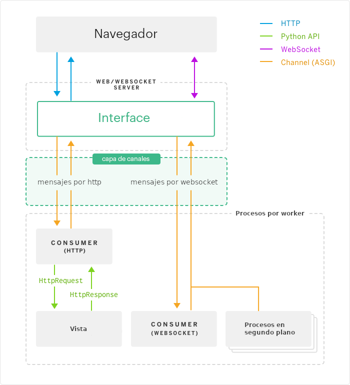
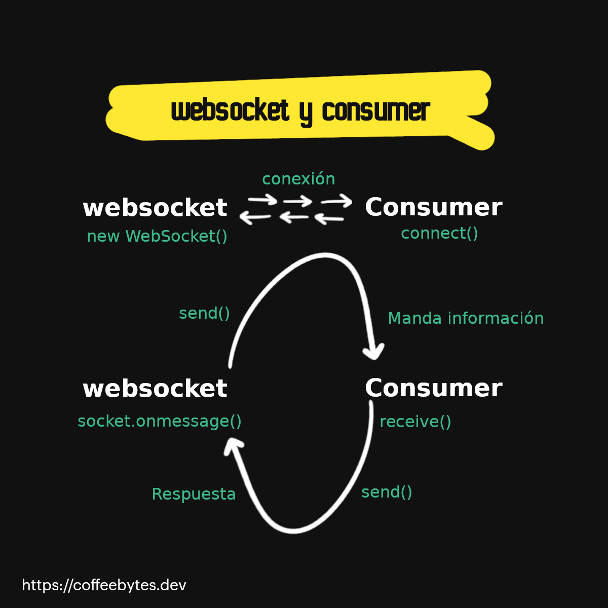
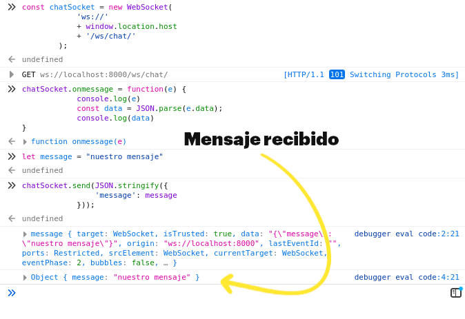

¿Por qué Django channels? Porque Django no nos permite crear aplicaciones con comunicación en tiempo real de manera nativa. Django channels le otorga a Django la capacidad manejar protocolos que requieren una conexión persistente, como WebSockets, MQTT, chatbots, mientras mantiene intacta su integración con el sistema de sesiones, autenticación y el resto del framework.

Django channels coloca una capa intermedia que se encarga de procesar las peticiones http a las vistas de django y las conexiones websocket a un consumer http o un consumer websocket.



## ¿Qué es un channel y un websocket?

Te recomiendo que si no tienes idea de websockets y canales le des una leída a estos dos conceptos pues los usaré a lo largo de esta entrada y la siguiente.

Si tienes prisa puedes conformarte con estas definiciones que pecan de simplistas e incompletas:

Un websocket es una conexión persistente que existe entre el navegador de un usuario y un servidor web.

Un canal o channel es un modelo que permite que varios procesos se comuniquen entre sí por medio de la transmisión de mensajes. django-channels debe su nombre a este concepto y el concepto es bastante similar al que te encontrarías en lenguajes de programación como [Go](/es/go-uso-de-channels-o-canales-para-comunicar-goroutinas/).

## Django channels requiere ASGI

Django channels requiere que pasemos de un servidor WSGI a un ASGI, para manejar su naturaleza asíncrona.

Si no sabes que significa ASGI, quédate con la idea de que es una interfaz para que Python interactúe con servidores web de manera asíncrona.

Cada vez que un usuario nuevo inicie una petición se creará una "aplicación" de ASGI que manejaremos , esta conexión, a diferencia de una petición HTTP normal, esta es persistente.

## Instalación de django channels

Primero instalamos channels directo desde nuestro gestor de paquetes favorito, yo usaré pipenv y la versión más actual a la fecha de este artículo.

```python
pip install channels["daphne"]
```

Lo agregamos a nuestras aplicaciones instaladas. 

Daphne debe estar hasta arriba de todas las aplicaciones, debido a que toma control del comando runserver para inicializar la aplicación.

```python
INSTALLED_APPS = (
    'daphne',
    'django.contrib.auth',
    'django.contrib.contenttypes',
    'django.contrib.sessions',
    'django.contrib.sites',
    ...
    'channels',
)
```

En nuestra carpeta de proyecto se crea un archivo _asgi.py_ cuando corremos _django-admin startproject_. Este archivo es **la "puerta" por la que interactúa un servidor con nuestro código Python**. Es necesario que lo modifiquemos para indicarle a django como debe manejar cada protocolo.

Mi aplicación se llama "_mychannels_" pero reemplaza el nombre por el de la tuya.

```python
 # mychannels/asgi.py
import os

from channels.routing import ProtocolTypeRouter
from django.core.asgi import get_asgi_application

os.environ.setdefault('DJANGO_SETTINGS_MODULE', 'mychannels.settings')

application = ProtocolTypeRouter({
    "http": get_asgi_application(),
    # Ahora mismo solo tiene el protocolo http, el que usamos normalmente
})
```

Ahora necesitamos indicarle a django que usaremos una aplicación ASGI. Este paso conseguirá que nuestra aplicación envuelva al comando _runserver_ que provee django.

```python
# mychannels/settings.py
ASGI_APPLICATION = "mychannels.asgi.application"
```

Ahora, crearemos una aplicación llamada chat.

```bash
django-admin startapp chat
```

Y la añadiremos a nuestras apps instaladas.

```python
INSTALLED_APPS = (
    ...
    'chat',
    'channels',
)
```

En esta app radicarán los encargados de manejar las conexiones websocket que crearemos.

## Manejando conexiones ws con un consumer

¿Qué es un consumer? Un _consumer_ es **una abstracción de un canal o channel en forma de clase, esta clase implementa métodos que se encargarán de manejar los eventos** de nuestros usuarios. Además existen consumers síncronos y asíncronos que manejan el código de bajo nivel en Python por ti.

### ¿Qué eventos puede manejar un consumer?

Los eventos son las acciones que realizarán nuestros usuarios, como conectarse, desconectarse o mandar información al websocket y el consumer responderá a estos. Además de estos eventos podemos crear eventos personalizados (no te preocupes por eso ahora) y asignarlos a funciones.



El web socket manda información con el método send, el consumer la recibe con su método receive, y posteriormente manda una respuesta con send, que el websocket procesará con onmessage

Hay consumers para colas, websockets, síncronos, etc.

- AsyncWebsocketConsumer[](https://channels.readthedocs.io/en/stable/topics/consumers.html#asyncwebsocketconsumer)
- JsonWebsocketConsumer[](https://channels.readthedocs.io/en/stable/topics/consumers.html#jsonwebsocketconsumer)
- AsyncJsonWebsocketConsumer[](https://channels.readthedocs.io/en/stable/topics/consumers.html#asyncjsonwebsocketconsumer)
- AsyncHttpConsumer[](https://channels.readthedocs.io/en/stable/topics/consumers.html#asynchttpconsumer)

El tipo de consumer dependerá de la clase que herede.

Nosotros crearemos un _consumer_ para websocket en nuestra aplicación chat.

### Estructura de un consumer

Observa la estructura de un _consumer_, **cada método se encargará de manejar un evento diferente.**

Este de aquí **hereda de _WebsocketConsumer_ la cual posee los eventos _connect_, _receive_ y _disconnect_**, que se ejecutarán al iniciar de una conexión, recibir un mensaje o cerrar una desconexión, respectivamente.

Además **cada consumer tiene las propiedades _channel\_layer_ y _channel\_name_**, que se refieren al channel\_layer al que pertenecen y su propio nombre, respectivamente.

```python
# chat/consumers.py
import json
from channels.generic.websocket import WebsocketConsumer

class ChatConsumer(WebsocketConsumer):
    def connect(self):
        print("el usuario se ha conectado")
        # aceptamos la conexión
        self.accept()

    def disconnect(self, close_code):
        # Desonectamos al usuario
        print("el usuario se ha desconectado")

    # Receive message from WebSocket
    def receive(self, text_data):
        text_data_json = json.loads(text_data)
        message = text_data_json['message']

        self.send(text_data=json.dumps({
            'message': message
        }))
```

Te resumo lo que hace el consumer que acabamos de crear:

- _connect_, se ejecuta cuando un usuario se conecte, _accept_ aceptará la conexión
- _disconnect_, se ejecuta cuando un usuario se desconecta, solo imprimirá en pantalla
- _receive_, se ejecuta cuando un websocket envía información, para este ejemplo solo devolverá, al emisor, el texto enviado como un objeto JSON por medio del método _send_.

## Scope y eventos

Django channels divide cada petición a un consumer en dos componentes: un _scope_ y una serie de eventos.

**El _scope_ guarda información que contiene la petición web (muy parecido al objeto request) esta información le permite identificar cada conexión.** Durante el tiempo de vida de la conexión, el usuario interactúa con esta, desencadenando eventos.

El _scope_ **está disponible en cada objeto _consumer_ en su propiedad _scope_.**

```python
# chat/consumers.py
import json
from channels.generic.websocket import WebsocketConsumer

class ChatConsumer(WebsocketConsumer):
    def connect(self):
        print(self.scope)
        self.accept()
```

Si imprimimos el _scope_ obtendremos un diccionario parecido a este

```python
{
    'type': 'websocket',
    'path': '/ws/chat/',
    'raw_path': b '/ws/chat/',
    'headers': [(b 'host', b 'localhost:8000'), (b 'user-agent', b 'Mozilla/5.0 (X11; Linux x86_64; rv:78.0) Gecko/20100101 Firefox/78.0'), (
        b 'accept', b '*/*'), (b 'accept-language', b 'es-MX,es;q=0.8,en-US;q=0.5,en;q=0.3'), (
        b 'accept-encoding', b 'gzip, deflate'), (b 'sec-websocket-version',
        b '13'), (b 'origin', b 'http://localhost:8000'), (b 'sec-websocket-extensions',
        b 'permessage-deflate'), (b 'sec-websocket-key', b 'D/aAHncl+Hh2FQrAOEI1dA=='), (
        b 'connection', b 'keep-alive, Upgrade'), (b 'cookie',
        b '_ga=GA1.1.2040703272.1635544065; mailChimpNewsletterShown=true'
    ), (b 'pragma', b 'no-cache'), (b 'cache-control', b 'no-cache'), (
        b 'upgrade', b 'websocket')],
    'query_string': b '',
    'client': ['127.0.0.1', 52024],
    'server': ['127.0.0.1', 8000],
    'subprotocols': [],
    'asgi': {
        'version': '3.0'
    },
    'cookies': {
    },
    'session': < django.utils.functional.LazyObject object at 0x7f4fad60c430 > ,
    'user': < channels.auth.UserLazyObject object at 0x7f4fad60cb50 > ,
    'path_remaining': '',
    'url_route': {
        'args': (),
        'kwargs': {}
    }
}
```

Por favor nota como **nuestro diccionario cuenta con una propiedad _session_, una propiedad _user_, una _cookies_ (para identificar al usuario) y otra con los args y kwargs de la url**, la cual podremos usar para personalizar el comportamiento de nuestra app; obtener información de una base de datos, limitar el acceso a ciertos consumers o lo que querramos.

## Enlazar un consumer con una url

Vamos a crear la url que enlazará a nuestros consumers con los websockets en un nuevo archivo llamado _routing.py_

```python
# chat/routing.py
from django.urls import re_path

from . import consumers

websocket_urlpatterns = [
    re_path(r'ws/chat/$', consumers.ChatConsumer.as_asgi()),
]
```

Todas las conexiones a la url _ws://localhost:8000/ws/chat/_ crearán una instancia de nuestro _ChatConsumer_.

Posteriormente, modifiquemos el archivo _asgi.py_ dentro de nuestro proyecto de manera que cada petición que se haga a un websocket sea redirigida a nuestro consumer.


```python
# mychannels/asgi.py
import os

from channels.auth import AuthMiddlewareStack
from channels.routing import ProtocolTypeRouter, URLRouter
from django.core.asgi import get_asgi_application
import chat.routing

os.environ.setdefault("DJANGO_SETTINGS_MODULE", "mychannels.settings")

application = ProtocolTypeRouter({
  "http": get_asgi_application(),
  "websocket": AuthMiddlewareStack(
        URLRouter(
            chat.routing.websocket_urlpatterns
        )
    ),
})
```

- _ProtocolTypeRouter_ se encarga de leer el scope y asignar el tipo de petición al tipo respectivo de respuesta: http a una vista y websocket a un consumer.
- _URLRouter_ se encarga de decidir que url corresponde a cada consumer, justo como el objeto _urlpatterns_ de Django
- _AuthMiddlewareStack_ se encarga de guardar los datos del usuario en el objeto _session_ de Django.

## Mandando información a través de un web socket con JS

Ahora, para probarlo, vamos a abrir la consola de nuestro navegador web en _http://localhost:8000_ y vamos a escribir el código Javascript para conectarnos a nuestra aplicación usando websockets.

Javascript nos provee de un objeto _WebSocket_ para manejar las conexiones, le pasaremos la url _ws://localhost:8000/ws/chat/_ como parámetro para que sepa a donde tiene que conectarse.

```javascript
const chatSocket = new WebSocket(
            'ws://'
            + window.location.host
            + '/ws/chat/'
        );
```

Ahora vamos a decirle al socket que tiene que hacer cada que reciba un nuevo mensaje. en este caso le pediremos que lea la información en formato JSON y que nos muestre la información recibida en la consola.

He agregado un _console.log_ al evento para que veas todas las propiedades que tienes disponibles para usar en el frontend.

```javascript
chatSocket.onmessage = function(e) {
            console.log(e)
            const data = JSON.parse(e.data);
            console.log(data)
}
```

Intentemos enviar un mensaje usando su método _send_.

```javascript

let message = "nuestro mensaje"
chatSocket.send(JSON.stringify({
                'message': message
            }));
```

Si todo salió bien deberíamos obtener una respuesta con el mensaje que mandamos.



Manejando websockets en la consola de Javascript

Listo, ya podemos enviar mensajes por websocket a django y recibir una respuesta. Pero hasta ahora lo que hemos hecho es una aplicación interactiva bastante sencilla que manda y retorna texto usando el protocolo ws, ¿qué pasa si queremos aprovechar los channels al máximo para crear aplicaciones donde interactúen muchos usuarios? En la siguiente entrada hablaré del channel layer y los channel groups.
